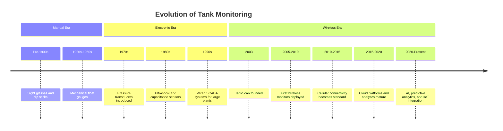
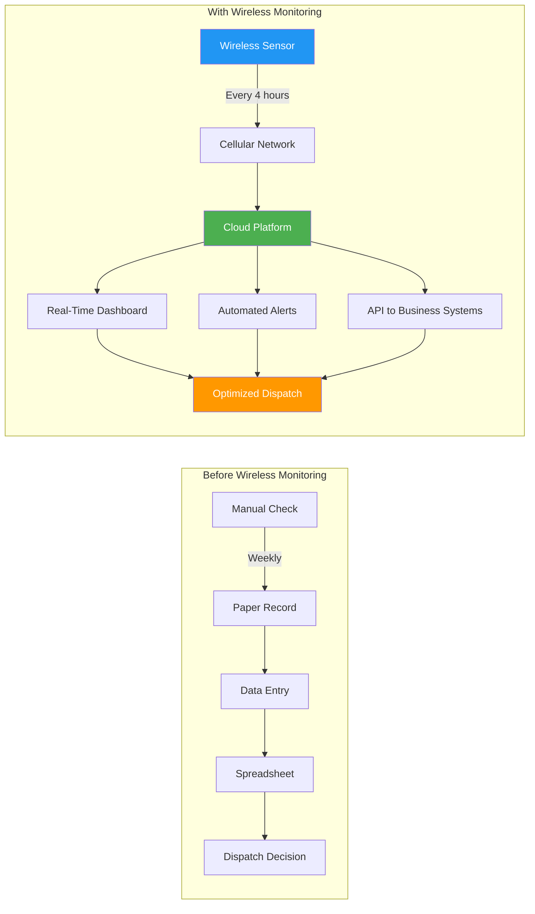
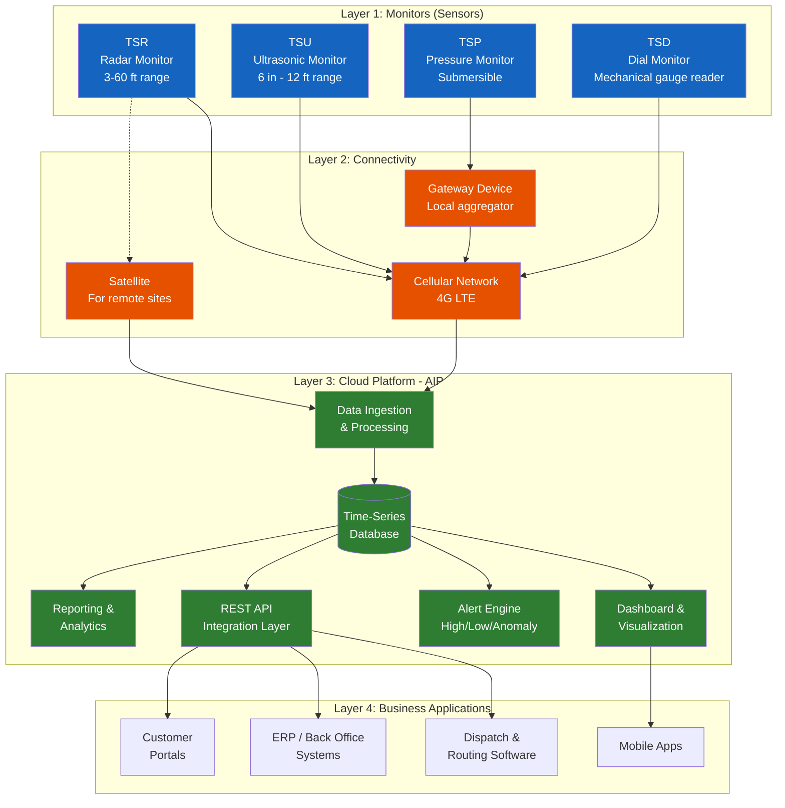
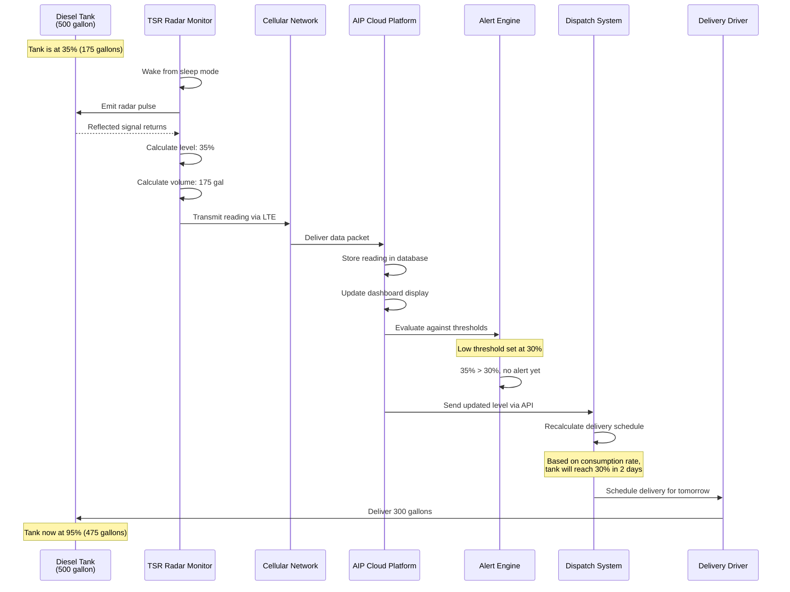
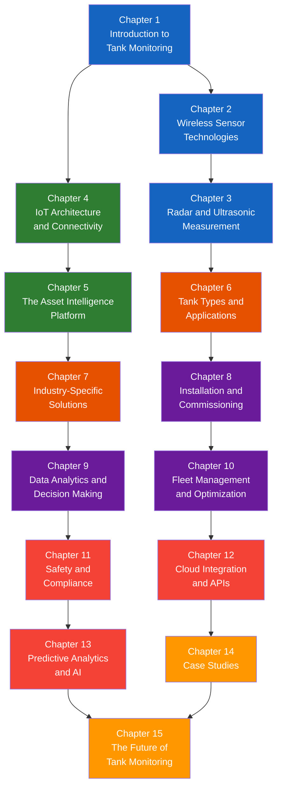

# Chapter 1: Introduction to Tank Monitoring

## Learning Objectives

By the end of this chapter, you will be able to:

- Describe the historical evolution of tank monitoring from manual methods to modern wireless IoT systems
- Explain why tank monitoring is critical for safety, operational efficiency, and cost management
- Identify the key industries that rely on tank monitoring solutions
- Outline the core components of the TankScan wireless monitoring system
- Articulate the challenges that wireless monitoring solves compared to legacy approaches

---

## 1.1 Why Tank Monitoring Matters

Across the globe, millions of bulk storage tanks hold critical materials: diesel fuel at trucking depots, lubricant oil at manufacturing plants, chemicals at processing facilities, propane at rural distribution centers, and waste oil at recycling operations. Each of these tanks represents a business asset that must be managed carefully. Running out of product can halt operations, overfilling can cause environmental spills, and theft or undetected leaks can drain revenue.

Tank monitoring is the practice of measuring and tracking the level, volume, and condition of material stored in tanks. At its core, monitoring answers a deceptively simple question: **How much is in the tank right now?**

Yet that simple question carries enormous consequences:

| Consequence Area | What Happens Without Monitoring | What Monitoring Enables |
|---|---|---|
| **Safety** | Overfills cause spills, environmental hazards, and regulatory violations | Automated alerts prevent overfill events before they occur |
| **Operational Efficiency** | Drivers make unnecessary delivery runs to tanks that are still full | Deliveries are optimized based on actual need, reducing truck rolls |
| **Cost Management** | Product loss from theft or leaks goes undetected for weeks | Real-time visibility flags anomalous consumption patterns immediately |
| **Regulatory Compliance** | Manual records are error-prone and difficult to audit | Digital records provide accurate, timestamped audit trails |
| **Customer Satisfaction** | Run-outs cause service interruptions and emergency deliveries | Proactive replenishment keeps customers supplied without disruption |

!!! warning "The Cost of a Run-Out"
    A single run-out event at a commercial fueling site can cost thousands of dollars in lost revenue, emergency delivery charges, and customer dissatisfaction. For critical operations like hospital backup generators or emergency vehicle fueling stations, a run-out can have life-safety implications.

### 1.1.1 The Scale of the Problem

Consider the numbers. A mid-size fuel distributor may manage 500 to 2,000 customer tank locations spread across a multi-state territory. Each location might have one to ten tanks. That means the distributor is responsible for monitoring anywhere from 1,000 to 20,000 individual tanks.

Before wireless monitoring, each of those tanks required a physical visit -- a driver or technician climbing up on the tank, reading a gauge or dipping a stick, and recording the reading on a clipboard. This process was:

- **Time-consuming**: A single tank check might take 10-15 minutes including travel, climbing, reading, and recording
- **Inaccurate**: Manual readings are subject to human error, parallax error, and rounding
- **Infrequent**: Most tanks were checked weekly or monthly at best, leaving large gaps in data
- **Dangerous**: Climbing on tanks and exposure to chemical vapors created safety risks for workers
- **Expensive**: The labor and vehicle costs of routine tank checks added up quickly

---

## 1.2 A Brief History of Tank Monitoring

The evolution of tank monitoring mirrors the broader history of industrial measurement and automation. Understanding this history helps explain why the industry adopted wireless monitoring so enthusiastically and why TankScan's approach was well-timed.

### 1.2.1 The Manual Era (Pre-1970s)

The earliest and simplest form of tank monitoring was the **sight glass** -- a vertical glass tube mounted on the outside of a tank, connected at the top and bottom. Liquid in the tube matched the level inside the tank, providing a direct visual reading. Sight glasses were cheap and required no power, but they were fragile, could leak, and required someone to physically walk to the tank to read them.

**Dip sticks** and **measuring tapes** were another staple of the manual era. An operator would lower a calibrated stick or weighted tape into the tank through a hatch, withdraw it, and read the wetted length to determine the level. This method is still used today as a calibration reference, but it is slow, interrupts normal operations, and exposes workers to potentially hazardous vapors.

**Float gauges** emerged as a semi-automated improvement. A buoyant float sitting on the liquid surface was connected by a cable or mechanical linkage to an external dial. As the level rose or fell, the float moved, and the dial displayed the reading. Float gauges provided continuous local indication without opening the tank, but they had moving parts that wore out and could not transmit data remotely.

### 1.2.2 The Electronic Era (1970s-1990s)

The introduction of electronic sensors transformed tank monitoring. **Pressure transducers** mounted at the bottom of tanks could measure the hydrostatic pressure of the liquid column and calculate the level. **Ultrasonic sensors** mounted at the top of the tank could send sound pulses down to the liquid surface and measure the echo return time. **Capacitance probes** immersed in the liquid could detect level changes based on the dielectric properties of the material.

These electronic sensors offered better accuracy, continuous measurement, and the ability to generate electrical signals that could be transmitted over wires to a central control room. However, they came with significant limitations:

- **Wiring costs**: Running cables from remote tanks to a control room was expensive, especially over long distances or in areas with existing infrastructure
- **Installation complexity**: Each sensor required physical wiring, junction boxes, signal conditioners, and a connection to a data acquisition system
- **Maintenance burden**: Wired systems were vulnerable to cable damage from weather, rodents, construction, and corrosion
- **Scalability challenges**: Adding new tanks to a wired system required additional cable runs and control room capacity

!!! note "The 10x Rule of Wiring"
    In industrial installations, the cost of wiring and conduit often exceeds the cost of the sensor itself by a factor of 5 to 10. For a $500 sensor, the total installed cost with wiring might reach $3,000 to $5,000 -- making wireless alternatives enormously attractive.

### 1.2.3 Early Wireless Attempts (1990s-2000s)

The 1990s saw the first attempts at wireless tank monitoring, but the technology was not yet mature. Early systems used proprietary radio protocols, had limited range, consumed too much power for battery operation, and lacked the cloud infrastructure needed to deliver data to end users conveniently.

Some systems used **SCADA (Supervisory Control and Data Acquisition)** networks with radio telemetry, but these were expensive, complex, and typically justified only for large industrial installations like oil refineries or water treatment plants -- not for the thousands of smaller distributed tanks that fuel distributors managed.

### 1.2.4 The Wireless IoT Revolution (2003-Present)

The early 2000s brought a convergence of enabling technologies that made wireless tank monitoring practical and affordable:

1. **Low-power sensor electronics** enabled battery-operated devices that could last years without replacement
2. **Cellular networks** (2G, 3G, and later 4G LTE) provided ubiquitous wide-area connectivity
3. **Cloud computing** platforms offered scalable data storage and web-based dashboards
4. **Improved radar and ultrasonic sensors** delivered high accuracy in compact, sealed packages

It was in this environment that **TankScan was founded in 2003**, recognizing the opportunity to bring wireless monitoring to the distributed bulk storage market. The company's vision was straightforward: put a wireless sensor on every tank and deliver the data to the people who need it, wherever they are.

---

## 1.3 The Industry Landscape

Wireless tank monitoring serves a remarkably diverse range of industries. While the core technology is similar across applications, each industry has unique requirements, regulations, and operating conditions.

### 1.3.1 Petroleum and Fuel Distribution

This is the largest market segment for wireless tank monitoring. Fuel distributors deliver gasoline, diesel, heating oil, and propane to thousands of customer locations including:

- **Retail fuel stations** (gas stations, truck stops)
- **Commercial fleets** (trucking companies, bus depots, construction sites)
- **Agricultural operations** (farms, grain elevators)
- **Residential heating oil** customers
- **Emergency generators** (hospitals, data centers, cell towers)

For fuel distributors, the primary value proposition is **delivery optimization**. By knowing exactly how much fuel is in every tank in their territory, dispatchers can plan efficient delivery routes, consolidate partial loads, and eliminate unnecessary truck rolls.

!!! example "Delivery Optimization in Practice"
    A propane distributor managing 5,000 residential tanks in New England traditionally sent drivers on fixed routes, checking each tank and filling it if needed. With wireless monitoring, the distributor switched to demand-based delivery, only dispatching trucks when tanks actually needed fuel. The result: a 30% reduction in delivery miles driven and a 15% improvement in gallons delivered per truck per day.

### 1.3.2 Lubricants and Chemicals

Manufacturing plants, automotive service centers, and industrial facilities consume lubricants, coolants, solvents, and specialty chemicals stored in bulk tanks. These tanks are often scattered across large facilities or distributed among multiple locations.

Key monitoring needs in this segment include:

- Preventing production downtime from lubricant run-outs
- Managing inventory costs by avoiding over-ordering
- Tracking consumption rates to detect waste or misuse
- Ensuring proper handling and storage compliance for hazardous chemicals

### 1.3.3 Waste Oil and Environmental Services

Used motor oil, industrial wastewater, and other waste streams are collected in tanks that must be pumped out before they overflow. Waste oil collection is essentially the inverse of fuel delivery -- instead of filling tanks, service providers empty them.

Wireless monitoring is particularly valuable here because:

- **Overflow prevention** is critical -- waste oil spills trigger environmental violations and costly cleanups
- **Collection routes** can be optimized by only visiting sites with full tanks
- **Theft detection** is important because used oil has resale value and is sometimes stolen

### 1.3.4 DEF (Diesel Exhaust Fluid)

DEF is a urea-based solution required by modern diesel engines to reduce nitrogen oxide emissions. As emissions regulations have tightened, DEF consumption has grown dramatically. DEF tanks at truck stops, fleet facilities, and equipment yards need consistent monitoring because:

- DEF freezes at 12 degrees F (-11 degrees C), requiring temperature monitoring
- Run-outs prevent diesel equipment from operating (engines derate or shut down)
- DEF has a limited shelf life and must be managed on a first-in, first-out basis

### 1.3.5 Water and Wastewater

Municipal water systems, agricultural irrigation, and industrial water treatment facilities all use tanks that benefit from wireless monitoring. While this segment often uses different sensor technologies (such as submersible pressure transducers), the connectivity and data management principles are the same.

| Industry | Primary Product | Key Monitoring Driver | Typical Tank Count per Customer |
|---|---|---|---|
| Fuel Distribution | Gasoline, diesel, propane, heating oil | Delivery optimization | 50 - 5,000+ |
| Lubricants | Motor oil, hydraulic fluid, coolants | Run-out prevention | 5 - 50 |
| Chemicals | Solvents, acids, bases, specialty chemicals | Safety and compliance | 10 - 100 |
| Waste Oil | Used motor oil, waste fluids | Overflow prevention | 20 - 500 |
| DEF | Diesel exhaust fluid | Run-out prevention | 10 - 200 |
| Water/Wastewater | Potable water, process water | Level management | 5 - 50 |

---

## 1.4 Key Challenges Solved by Wireless Monitoring

Wireless tank monitoring did not just automate manual readings -- it fundamentally changed how businesses manage their tank assets. This section examines the specific challenges that wireless monitoring addresses.

### 1.4.1 The Visibility Gap

Before wireless monitoring, most tank operators suffered from a **visibility gap** -- a period between manual readings during which the tank level was unknown. If a tank was checked once a week, there were six days when no one knew what was happening.

During the visibility gap:

- A leak could drain a tank unnoticed
- Consumption could spike due to unexpected demand
- Theft could occur without detection
- Weather events (extreme cold causing higher heating fuel consumption, for example) could accelerate depletion

Wireless monitoring closes the visibility gap by providing readings every few hours (or more frequently if configured), creating a near-continuous picture of tank status.

### 1.4.2 The Last-Mile Problem

Many tanks are located in places that are difficult and expensive to reach: rural farms, remote cell tower sites, offshore platforms, mountain-top transmission facilities, or simply spread across a wide geographic area. The **last-mile problem** refers to the challenge of getting data from these remote locations back to the people who need it.

Cellular-connected wireless monitors solve the last-mile problem by using the same cellular networks that serve mobile phones. As long as there is cellular coverage, the monitor can transmit data directly to the cloud without any local infrastructure, wiring, or IT support.

!!! tip "Satellite Connectivity for Truly Remote Sites"
    For locations without cellular coverage -- such as remote mining operations, wilderness generator sites, or offshore platforms -- satellite-connected monitors provide an alternative path. While more expensive per transmission than cellular, satellite connectivity ensures that even the most remote tanks can be monitored.

### 1.4.3 The Data Integration Challenge

Knowing the tank level is only the first step. The real value comes from integrating tank data with business systems: dispatch and routing software, ERP (Enterprise Resource Planning) systems, inventory management, billing, and customer portals.

Before wireless monitoring, integrating tank data with business systems was impractical because the data was recorded on paper or in disconnected spreadsheets. Wireless monitoring platforms like TankScan's AIP (Asset Intelligence Platform) provide **APIs (Application Programming Interfaces)** that allow tank data to flow automatically into other systems.

### 1.4.4 The Scalability Barrier

A wired monitoring system might work well for ten tanks at a single facility, but scaling to thousands of tanks across hundreds of locations is prohibitively expensive and complex with wires. Each new tank requires a site visit to install wiring, which may involve trenching, conduit installation, and electrical permits.

Wireless monitors, by contrast, can be installed by a single technician in under an hour with no wiring, no permits, and no infrastructure changes. This makes it economically feasible to monitor tanks that were never cost-justified with wired systems.

---

## 1.5 TankScan: Company Overview

### 1.5.1 Founding and Mission

TankScan was founded in 2003 with a clear mission: to make wireless tank monitoring simple, reliable, and affordable for the distributed bulk storage market. The company recognized that while large industrial facilities had access to sophisticated (and expensive) monitoring systems, the vast majority of bulk storage tanks -- at fuel depots, service stations, farms, and commercial facilities -- were still monitored manually or not at all.

The founding team brought together expertise in wireless communications, sensor technology, and the fuel distribution industry. This combination of technical capability and domain knowledge allowed TankScan to design solutions that addressed the real-world needs of tank operators rather than simply applying technology for its own sake.

### 1.5.2 Product Evolution

TankScan's product portfolio has evolved over the years, tracking advances in sensor technology, wireless connectivity, and cloud computing:

| Generation | Time Period | Key Characteristics |
|---|---|---|
| **Gen 1** | 2003-2008 | First wireless monitors, proprietary radio to local gateway, basic web portal |
| **Gen 2** | 2008-2013 | Improved sensors, cellular gateways, enhanced web dashboard |
| **Gen 3** | 2013-2018 | Direct cellular monitors, cloud-native platform, API integration |
| **Gen 4** | 2018-Present | Advanced radar and ultrasonic sensors, 4G LTE connectivity, AIP platform, predictive analytics |

### 1.5.3 Market Position

TankScan operates within the broader Industrial Internet of Things (IIoT) market, specifically in the **remote asset monitoring** segment. The company differentiates itself through:

- **Specialization**: Focused exclusively on tank monitoring rather than general-purpose IoT
- **Vertical integration**: Controls the full stack from sensor hardware to cloud software
- **Industry expertise**: Deep understanding of fuel distribution, lubricants, and chemical industries
- **Ease of deployment**: Self-install capable monitors that work out of the box
- **Reliability**: Ruggedized hardware designed for harsh outdoor environments

---

## 1.6 The TankScan System: How It Works

The TankScan system consists of three primary layers: **monitors** (sensors), **connectivity** (gateways and cellular), and the **cloud platform** (AIP). Together, these layers form an end-to-end solution that converts a physical liquid level into actionable business intelligence.

### 1.6.1 System Architecture Overview

### 1.6.2 Layer 1: Monitors

TankScan offers a family of wireless monitors, each designed for specific tank types and measurement challenges:

**TSR (TankScan Radar)**

The TSR is a non-contact radar level monitor that mounts on top of the tank. It emits radar pulses downward toward the liquid surface and measures the time-of-flight of the reflected signal to calculate the distance to the surface. Key specifications include:

- Measurement range: 3 to 60 feet
- Accuracy: +/- 0.1 inch typical
- Suitable for: large above-ground storage tanks, underground tanks, tanks with vapor or foam
- Advantage: unaffected by temperature, vapor, or liquid composition changes

**TSU (TankScan Ultrasonic)**

The TSU is a non-contact ultrasonic monitor that also mounts on top of the tank. It uses sound waves instead of radar to measure distance to the liquid surface. Key specifications include:

- Measurement range: 6 inches to 12 feet
- Accuracy: +/- 0.25 inch typical
- Suitable for: smaller tanks, totes, and containers
- Advantage: lower cost than radar, excellent for clean liquids in controlled environments

**TSP (TankScan Pressure)**

The TSP is a submersible pressure transducer placed at the bottom of the tank. It measures the hydrostatic pressure of the liquid column above it and calculates the level. Key specifications include:

- Measurement range: varies by tank depth
- Accuracy: +/- 0.5% of span typical
- Suitable for: tanks where top-mount installation is not possible, water and wastewater tanks
- Advantage: works in any tank regardless of headspace conditions

**TSD (TankScan Dial)**

The TSD is a unique solution that attaches to an existing mechanical dial gauge on the tank. It reads the gauge position using a sensor and transmits the reading wirelessly. Key specifications include:

- Compatible with: standard mechanical float gauges
- Accuracy: dependent on the underlying mechanical gauge
- Suitable for: legacy tanks with existing gauges that cannot be replaced
- Advantage: adds wireless capability without replacing the existing gauge

!!! note "Choosing the Right Monitor"
    Selecting the appropriate monitor type depends on several factors: tank size, the material being stored, installation constraints, required accuracy, and budget. Chapter 3 provides detailed guidance on monitor selection for different applications.

### 1.6.3 Layer 2: Connectivity

Once a monitor takes a reading, the data must travel from the tank to the cloud. TankScan provides several connectivity options:

**Direct Cellular**

Most TankScan monitors include an integrated cellular modem that connects directly to 4G LTE networks. This is the simplest and most common configuration -- the monitor is a self-contained device that reads the tank level and transmits the data to the cloud with no additional equipment needed.

**Gateway**

In some configurations, multiple monitors at a single site communicate via short-range wireless (such as Bluetooth or proprietary radio) to a gateway device. The gateway aggregates readings from multiple monitors and transmits them to the cloud via a single cellular connection. This approach can be more cost-effective when many tanks are co-located.

**Satellite**

For sites without cellular coverage, satellite connectivity provides an alternative data path. Satellite transmission is more expensive per message than cellular, so it is typically used only where cellular is unavailable.

### 1.6.4 Layer 3: The Asset Intelligence Platform (AIP)

The AIP is TankScan's cloud-based software platform that receives, stores, processes, and presents tank data. It is the interface through which users interact with the system on a daily basis. Key capabilities include:

- **Real-time dashboard**: Displays current tank levels, recent readings, and system health
- **Alert management**: Configurable high-level, low-level, and anomaly alerts delivered via email or SMS
- **Historical trends**: Charts showing tank level over time, enabling consumption analysis
- **Location mapping**: Geographic view of all monitored tanks across a territory
- **Reporting**: Scheduled and ad-hoc reports for inventory management, delivery planning, and compliance
- **API access**: RESTful APIs enabling integration with third-party business systems
- **User management**: Role-based access controls allowing different permissions for different users

!!! tip "The AIP as a Business Intelligence Tool"
    While the AIP's primary function is displaying tank levels, its real power lies in the business intelligence it enables. By analyzing historical consumption patterns, the AIP can predict when a tank will need replenishment, allowing dispatchers to plan deliveries days in advance rather than reacting to urgent low-level alerts.

### 1.6.5 Layer 4: Business Applications

The final layer of the TankScan system encompasses the business applications that consume tank data through the AIP's APIs:

- **Dispatch and routing software**: Uses tank levels and predicted run-out dates to optimize delivery routes
- **ERP systems**: Incorporates tank inventory data into supply chain planning and financial reporting
- **Customer portals**: Allows end customers to view their own tank levels and request deliveries
- **Mobile applications**: Provides field technicians and drivers with tank status on their mobile devices

---

## 1.7 How a Tank Reading Becomes a Business Decision

To illustrate how the entire system works end-to-end, let us trace a single tank reading from sensor to business decision.

This sequence happens automatically, without any human intervention until the driver receives the delivery assignment. The system has transformed a physical measurement into a business decision, optimizing the delivery timing to arrive before the customer runs out but not so early that the tank is only partially empty.

---

## 1.8 From Fixed Routes to Demand-Based Delivery

One of the most transformative impacts of wireless tank monitoring is the shift from **fixed-route delivery** to **demand-based delivery**. This operational change is worth exploring in detail because it illustrates how data fundamentally changes a business.

### 1.8.1 The Fixed-Route Model

In the traditional fixed-route model, delivery trucks follow predetermined routes on a set schedule. A driver might visit the same 25 customer locations every Tuesday, regardless of whether those tanks actually need filling.

Problems with the fixed-route model:

- **Wasted trips**: A tank that was filled last week and has consumed only 10% of its capacity does not need a visit, but the driver stops anyway
- **Partial fills**: Because the truck arrives on a schedule rather than on demand, tanks are often only partially empty, resulting in smaller, less efficient deliveries
- **Missed needs**: A tank between scheduled visits that has unexpectedly high consumption will run out before the next scheduled stop
- **Inefficient routing**: Routes are optimized based on geography, not based on which tanks actually need product

### 1.8.2 The Demand-Based Model

With wireless monitoring data, the delivery model inverts. Instead of asking "which route do we drive today?", dispatchers ask "which tanks need product today?"

The demand-based workflow:

1. **AIP identifies need**: The platform calculates which tanks will reach their low threshold within the delivery planning window (typically 3-5 days)
2. **Dispatcher plans routes**: Routes are built dynamically based on actual tank needs, grouping nearby tanks that all need delivery
3. **Driver delivers**: The driver visits only tanks that need filling, delivering optimal quantities
4. **AIP confirms delivery**: Level readings confirm the delivery was made and the volume matches the bill of lading

### 1.8.3 Quantifying the Improvement

The shift from fixed-route to demand-based delivery typically yields:

| Metric | Fixed-Route | Demand-Based | Improvement |
|---|---|---|---|
| Stops per day with actual need | 12 of 25 (48%) | 20 of 22 (91%) | +43 percentage points |
| Average gallons per delivery stop | 180 gal | 310 gal | +72% |
| Gallons delivered per truck per day | 2,160 gal | 6,200 gal | +187% |
| Miles driven per gallon delivered | 0.18 mi/gal | 0.06 mi/gal | -67% |
| Customer run-out events per month | 8 | 0.5 | -94% |
| Emergency deliveries per month | 12 | 1 | -92% |

!!! example "The Math of Demand-Based Delivery"
    Consider a propane distributor with 3,000 customer tanks and a fleet of 15 delivery trucks.

    **Fixed-route model**: Each truck makes 25 stops per day, 5 days per week = 1,875 stops per week across the fleet. With 48% of stops resulting in a meaningful delivery, that is 900 productive stops per week.

    **Demand-based model**: The AIP identifies that approximately 600 tanks per week actually need delivery. With optimized routing, each truck makes 20 stops per day (all productive), requiring only 6 trucks working 5 days per week (600 stops / 20 stops per truck per day = 30 truck-days, or 6 trucks x 5 days).

    The distributor can serve the same 3,000 tanks with **6 trucks instead of 15** -- a 60% reduction in fleet size, or alternatively, grow from 3,000 to 7,500 tanks without adding trucks.

---

## 1.9 The Business Case for Wireless Monitoring

Organizations considering wireless tank monitoring typically evaluate the return on investment (ROI) across several dimensions.

### 1.8.1 Direct Cost Savings

| Savings Category | Typical Impact | How It Is Achieved |
|---|---|---|
| Reduced truck rolls | 20-40% fewer delivery trips | Demand-based delivery replaces fixed routes |
| Fuel and vehicle costs | 15-30% reduction in delivery fleet fuel | Shorter, more efficient routes |
| Labor costs | 10-20% improvement in driver productivity | More deliveries per shift, less windshield time |
| Inventory carrying costs | 5-15% reduction | Better demand forecasting reduces safety stock |
| Emergency delivery elimination | 90%+ reduction in emergency runs | Proactive replenishment prevents run-outs |

### 1.8.2 Revenue Protection

- **Theft detection**: Sudden unexplained drops in level trigger immediate alerts
- **Leak detection**: Gradual unexplained losses are flagged for investigation
- **Billing accuracy**: Measured deliveries can be reconciled against tank level changes

### 1.8.3 Risk Reduction

- **Environmental compliance**: Overfill prevention reduces the risk of spills and associated fines
- **Safety improvement**: Eliminates the need for manual tank climbing and vapor exposure
- **Business continuity**: Prevents run-outs that could shut down customer operations

!!! example "ROI Calculation Example"
    A heating oil distributor with 2,000 monitored tanks calculates the following annual savings:

    - Eliminated 3,000 unnecessary truck rolls at $75 each = **$225,000**
    - Reduced overtime from emergency deliveries = **$45,000**
    - Prevented 2 environmental incidents (average cleanup cost $50,000 each) = **$100,000**
    - Improved driver productivity (equivalent of 1.5 fewer trucks needed) = **$120,000**
    - **Total annual savings: $490,000**

    With a monitoring system cost of approximately $200,000 per year (hardware amortization + service fees), the ROI is approximately **145%**.

---

## 1.9 The Wireless Monitoring Ecosystem

TankScan does not operate in isolation. The wireless tank monitoring ecosystem includes several categories of participants:

### 1.9.1 Hardware Manufacturers

Companies that design and manufacture the physical sensors, gateways, and communication modules. TankScan is vertically integrated, designing its own hardware, but the broader market includes other manufacturers as well.

### 1.9.2 Connectivity Providers

Cellular network operators (such as AT&T, Verizon, and T-Mobile in the United States) provide the wireless data transport layer. Satellite providers (such as Iridium and Inmarsat) serve remote locations. TankScan manages cellular connectivity on behalf of its customers, embedding SIM cards in its monitors.

### 1.9.3 Cloud Infrastructure

The AIP platform runs on cloud infrastructure provided by major cloud computing vendors. This provides scalability, reliability, and geographic redundancy without requiring TankScan or its customers to manage physical servers.

### 1.9.4 Integration Partners

Software companies that build dispatch, routing, ERP, and CRM (Customer Relationship Management) systems often integrate with TankScan's APIs to incorporate tank data into their workflows.

### 1.9.5 Installation and Service Partners

While TankScan monitors are designed for self-installation, some customers prefer to use professional installers. A network of certified installation partners provides deployment services across the country.

---

## 1.10 Looking Ahead: The Future of Tank Monitoring

The tank monitoring industry continues to evolve. Several trends are shaping the next generation of solutions:

### 1.10.1 Artificial Intelligence and Predictive Analytics

Machine learning algorithms can analyze historical consumption patterns, weather data, economic indicators, and other signals to predict future demand with greater accuracy than simple linear extrapolation. This enables even more precise delivery scheduling and inventory management.

### 1.10.2 Edge Computing

As processors become more powerful and energy-efficient, more data processing can happen at the sensor itself (the "edge") rather than in the cloud. Edge computing can reduce cellular data costs, enable faster local decisions, and provide some functionality even when connectivity is temporarily unavailable.

### 1.10.3 5G and Low-Power Wide-Area Networks (LPWAN)

New wireless technologies like 5G, NB-IoT (Narrowband IoT), and LoRaWAN promise lower power consumption, lower cost, and better coverage for IoT devices. These technologies could enable even longer battery life and lower-cost monitoring for smaller or lower-value tanks.

### 1.10.4 Digital Twins

A **digital twin** is a virtual replica of a physical asset that is continuously updated with real sensor data. Digital twins of monitored tanks could enable advanced simulation, scenario planning, and predictive maintenance.

### 1.10.5 Sustainability and Environmental Monitoring

As environmental regulations tighten and organizations focus on sustainability, tank monitoring will increasingly incorporate environmental sensors for leak detection, emissions monitoring, and spill prevention.

!!! warning "Technology Alone Is Not Enough"
    While the technology trends are exciting, the greatest value from wireless monitoring comes from **process change**. Organizations that simply add monitors to their existing workflows will see modest benefits. Organizations that redesign their operations around the data -- shifting from fixed routes to demand-based delivery, from reactive maintenance to predictive maintenance, from manual reporting to automated compliance -- will capture the full value of the technology.

---

## 1.11 Key Terminology

Before proceeding to subsequent chapters, familiarize yourself with the essential terminology used throughout this textbook:

| Term | Definition |
|---|---|
| **AST** | Above-Ground Storage Tank -- a tank installed on the surface, visible and accessible |
| **UST** | Underground Storage Tank -- a tank buried below ground, typically at fuel retail sites |
| **IBC** | Intermediate Bulk Container -- a portable, reusable container (typically 275-330 gallons) used for liquid transport and storage |
| **IoT** | Internet of Things -- the network of physical devices with embedded sensors and connectivity |
| **IIoT** | Industrial Internet of Things -- IoT applied to industrial settings with stricter requirements for reliability and safety |
| **AIP** | Asset Intelligence Platform -- TankScan's cloud-based software platform for data management and visualization |
| **FMCW** | Frequency Modulated Continuous Wave -- a radar technique used in the TSR monitor |
| **Time-of-Flight** | The time it takes for a signal (radar or ultrasonic) to travel from the sensor to the surface and back |
| **SIM** | Subscriber Identity Module -- a chip that identifies a cellular device to the network |
| **LTE** | Long Term Evolution -- the current standard for 4G cellular networks |
| **Cat-M1** | LTE Category M1 -- a low-power variant of LTE optimized for IoT devices |
| **MQTT** | Message Queuing Telemetry Transport -- a lightweight IoT messaging protocol |
| **REST API** | Representational State Transfer Application Programming Interface -- a standard web API architecture |
| **SCADA** | Supervisory Control and Data Acquisition -- a traditional industrial monitoring and control system |
| **Strapping Table** | A lookup table that maps tank level measurements to corresponding volumes, accounting for tank geometry |
| **Dead Band** | The minimum distance from a sensor within which measurements cannot be taken |
| **Hysteresis** | A technique that uses offset thresholds for alert triggering and clearing to prevent oscillation |
| **Overfill** | A condition where a tank is filled beyond its safe capacity, potentially causing a spill |
| **Run-Out** | A condition where a tank is completely emptied, interrupting supply to the consumer |

---

## 1.12 Common Misconceptions About Tank Monitoring

Before moving on, it is worth addressing several misconceptions that newcomers to tank monitoring often hold:

!!! warning "Misconception 1: 'We only need to monitor our biggest tanks.'"
    In practice, small tanks often pose the greatest operational risk. A 500-gallon diesel day tank feeding a backup generator is far more critical than a 20,000-gallon bulk storage tank -- because the day tank can run out in hours, while the bulk tank provides days of buffer. Monitor based on criticality, not just size.

!!! warning "Misconception 2: 'Real-time means continuous measurement.'"
    In tank monitoring, "real-time" typically means readings every 1-6 hours, not every second. Because tank levels change slowly (typically inches per day, not per second), readings every few hours capture all meaningful changes while enabling 5-10 year battery life. True continuous measurement is rarely necessary and would drain batteries in weeks.

!!! warning "Misconception 3: 'Wireless monitoring replaces all manual checks.'"
    Wireless monitoring dramatically reduces the need for manual checks but does not entirely replace them. Periodic physical inspections remain important for verifying sensor accuracy, checking for tank damage, inspecting fittings and valves, and maintaining regulatory compliance. Wireless monitoring handles the routine "how much is in the tank?" question, freeing personnel to focus on these higher-value inspection activities.

!!! warning "Misconception 4: 'All tanks use the same type of monitor.'"
    Different tank types, sizes, stored products, and environmental conditions require different monitoring technologies. A radar monitor (TSR) is ideal for large outdoor fuel tanks but may be overkill for a small indoor DEF tote. A pressure transducer (TSP) works well for water tanks but requires knowing the liquid density. The key is matching the monitor to the application, which is covered in detail in Chapters 2 and 3.

!!! warning "Misconception 5: 'Installing a monitor means you are done.'"
    Installation is just the beginning. The real value comes from configuring the system properly (correct tank profiles, appropriate alert thresholds), integrating with business workflows (dispatch, ERP, customer portals), training users to act on the data, and continuously optimizing operations based on the insights the data provides.

---

## 1.13 Navigating This Textbook

This textbook is organized in a progressive sequence. Each chapter builds on concepts introduced in earlier chapters:

The chapters are grouped into five thematic sections:

1. **Foundations (Chapters 1-3)**: Core concepts of tank monitoring, sensor technologies, and measurement principles
2. **Infrastructure (Chapters 4-5)**: IoT architecture, connectivity, and the AIP cloud platform
3. **Applications (Chapters 6-10)**: Tank types, industry solutions, installation, analytics, and fleet management
4. **Advanced Topics (Chapters 11-13)**: Safety compliance, cloud integration, and predictive analytics
5. **Synthesis (Chapters 14-15)**: Real-world case studies and future outlook

!!! tip "How to Use This Textbook"
    - **New to tank monitoring**: Read chapters sequentially from 1 through 15
    - **Technical focus**: Concentrate on Chapters 2, 3, 4, and 8 for sensor and connectivity depth
    - **Business focus**: Concentrate on Chapters 1, 5, 7, 9, 10, and 14 for operational and business value
    - **Quick reference**: Each chapter's summary and review questions provide a condensed review of key concepts

---

## 1.13 Chapter Summary

This chapter has provided a comprehensive introduction to the field of tank monitoring and TankScan's role within it. The key takeaways are:

1. **Tank monitoring is essential** for safety, efficiency, compliance, and cost management across multiple industries
2. **The industry has evolved** from manual methods through electronic sensors to modern wireless IoT systems
3. **TankScan was founded in 2003** to bring affordable wireless monitoring to the distributed bulk storage market
4. **The TankScan system** consists of wireless monitors (TSR, TSU, TSP, TSD), cellular/satellite connectivity, and the AIP cloud platform
5. **Wireless monitoring solves** the visibility gap, last-mile problem, data integration challenge, and scalability barrier
6. **The business case** for wireless monitoring is compelling, with typical ROI exceeding 100% through delivery optimization, risk reduction, and operational efficiency
7. **The industry continues to evolve** with AI, edge computing, new wireless technologies, and digital twins

---

## Review Questions

!!! question "Question 1 -- Knowledge Recall"
    List three industries that use wireless tank monitoring and describe the primary monitoring need for each industry.

    ??? success "Suggested Answer"
        1. **Fuel Distribution**: Primary need is delivery optimization -- knowing when tanks need refilling to plan efficient delivery routes and avoid unnecessary truck rolls.
        2. **Waste Oil Collection**: Primary need is overflow prevention -- knowing when waste oil tanks are full so they can be pumped out before spilling.
        3. **Lubricants/Chemicals**: Primary need is run-out prevention -- ensuring manufacturing operations do not halt due to an empty lubricant or chemical tank.

        Other valid answers include DEF (run-out prevention) and Water/Wastewater (level management).

!!! question "Question 2 -- Comprehension"
    Explain what the "visibility gap" is in tank monitoring and describe how wireless monitoring addresses it.

    ??? success "Suggested Answer"
        The visibility gap is the period between manual tank readings during which the tank level is unknown. If a tank is checked once per week, there are six days when leaks, theft, or unexpected consumption could go undetected. Wireless monitoring addresses this by providing automated readings every few hours (or at configurable intervals), creating a near-continuous record of tank status. This dramatically reduces the time during which problems can go unnoticed, enabling faster detection of anomalies and better operational planning.

!!! question "Question 3 -- Application"
    A fuel distributor manages 1,500 tanks across a rural territory. Some locations have cellular coverage and some do not. Describe how you would design a TankScan deployment to cover all locations.

    ??? success "Suggested Answer"
        For locations with cellular coverage (likely the majority), deploy TankScan monitors with direct cellular connectivity (4G LTE). These monitors transmit readings directly to the AIP cloud platform with no additional infrastructure needed.

        For locations without cellular coverage, deploy monitors with satellite connectivity. While more expensive per transmission, satellite ensures coverage in remote areas. Alternatively, if a cluster of tanks is near a location with marginal cellular coverage, a gateway device with an external high-gain antenna might be able to reach the cellular network where individual monitors cannot.

        All locations, regardless of connectivity method, would feed data into the same AIP platform, providing a unified view for dispatchers and managers.

!!! question "Question 4 -- Analysis"
    Compare and contrast the pre-wireless and post-wireless approaches to tank monitoring across the following dimensions: data freshness, scalability, labor requirements, and accuracy. Which dimension do you think provides the greatest business value and why?

    ??? success "Suggested Answer"
        | Dimension | Pre-Wireless | Post-Wireless |
        |---|---|---|
        | Data Freshness | Weekly or monthly readings, large visibility gaps | Readings every few hours, near-continuous visibility |
        | Scalability | Each new tank requires wiring and infrastructure; adding tanks is expensive | Adding a tank requires only installing a battery-powered monitor; scales easily |
        | Labor | Requires technicians to physically visit each tank for readings | Automated readings eliminate routine site visits |
        | Accuracy | Manual readings subject to human error, parallax, and rounding | Sensor readings are consistent, precise, and digitally recorded |

        Arguments can be made for any dimension, but **data freshness** often provides the greatest business value because it enables the shift from reactive to proactive operations. With frequent, automated readings, businesses can detect problems early, optimize delivery schedules, and prevent costly incidents -- benefits that depend fundamentally on having current data.

!!! question "Question 5 -- Evaluation"
    A potential customer argues that their manual tank checking process works fine and they do not need wireless monitoring. Construct a business case that addresses their objection, using specific benefits and potential ROI figures from this chapter.

    ??? success "Suggested Answer"
        A strong response would address multiple value dimensions:

        **Hidden costs of manual monitoring**: Even if the manual process seems to "work," it carries hidden costs. Each manual tank check costs $15-25 in labor and travel time. For 200 tanks checked weekly, that is $156,000-260,000 per year in checking costs alone -- and those checks still leave six-day visibility gaps.

        **Risk exposure**: Manual monitoring cannot detect overnight theft, weekend leaks, or sudden consumption spikes. A single undetected leak or overfill event can cost $50,000 or more in cleanup, fines, and remediation -- potentially exceeding the annual cost of wireless monitoring.

        **Delivery optimization**: With manual checking, the customer likely operates on fixed delivery routes, making trips to tanks that do not need filling. Wireless monitoring enables demand-based delivery, typically reducing delivery costs by 20-40%.

        **Competitive advantage**: Customers increasingly expect real-time visibility into their tank status. Offering a customer portal with live tank data differentiates the business and improves customer retention.

        **Calculated ROI**: Using the figures from this chapter, a deployment covering 200 tanks could easily generate $50,000-100,000 in annual savings against a system cost of $30,000-50,000 per year, yielding an ROI of 100% or more within the first year.
