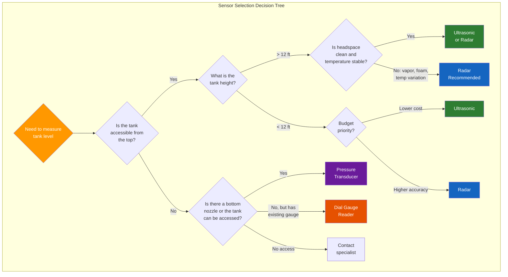

# Chapter 2: Wireless Sensor Technologies

## Learning Objectives

By the end of this chapter, you will be able to:

- Define what a sensor is and explain the role of transducers in measurement systems
- Compare and contrast six major tank level sensing technologies
- Evaluate sensor performance using key metrics such as accuracy, repeatability, and resolution
- Explain how signal processing techniques improve measurement quality
- Describe power management strategies that enable multi-year battery life in wireless sensors
- Identify environmental factors that affect sensor performance and describe mitigation strategies

---

## 2.1 Fundamentals of Sensing

### 2.1.1 What Is a Sensor?

A **sensor** is a device that detects a physical quantity -- such as temperature, pressure, distance, or chemical concentration -- and converts it into a signal that can be read by an observer or by an electronic instrument. In the context of tank monitoring, sensors detect the level of liquid (or sometimes solid material) inside a tank and produce an electrical signal proportional to that level.

The process of sensing involves three fundamental steps:

1. **Detection**: The sensor interacts with the physical phenomenon (e.g., a sound wave reflects off a liquid surface)
2. **Transduction**: The detected phenomenon is converted into an electrical signal (e.g., the echo travel time is converted into a voltage)
3. **Signal conditioning**: The raw electrical signal is processed, filtered, amplified, and digitized for transmission or display

!!! note "Sensors vs. Transducers"
    The terms "sensor" and "transducer" are often used interchangeably in casual conversation, but they have distinct technical meanings. A **transducer** converts one form of energy into another (e.g., sound pressure into electrical voltage). A **sensor** is a complete measurement system that includes a transducer plus the associated electronics for signal conditioning, calibration, and output. In this textbook, we use "sensor" to refer to the complete measurement device and "transducer" when discussing the energy conversion element specifically.

### 2.1.2 The Measurement Chain

Every sensor-based measurement system follows a chain from the physical world to actionable data:

In a wireless tank monitor, this chain looks like:

| Chain Step | Tank Monitoring Example |
|---|---|
| Physical Quantity | Liquid level in a tank (distance from sensor to surface) |
| Sensing Element | Radar antenna, ultrasonic transducer, or pressure diaphragm |
| Signal Conditioning | Amplification, filtering, temperature compensation |
| A/D Conversion | Converting analog voltage to a digital number (e.g., 12-bit ADC) |
| Digital Processing | Calculating distance, converting to volume, applying calibration |
| Data Transmission | Encoding and sending via cellular modem |
| Display / Decision | Dashboard display, alert trigger, delivery scheduling |

### 2.1.3 Active vs. Passive Sensors

Sensors can be classified as **active** or **passive** based on whether they emit energy to make a measurement:

- **Active sensors** emit a signal (such as a radar wave, ultrasonic pulse, or light beam) and detect the response. Radar and ultrasonic level sensors are active sensors -- they generate a signal and measure its reflection.
- **Passive sensors** detect naturally occurring energy or physical properties. A pressure transducer at the bottom of a tank is arguably passive -- it measures the pressure exerted by the liquid column without emitting any signal. A temperature sensor is passive -- it detects the ambient thermal energy.

Active sensors typically provide more controlled and precise measurements because they generate a known signal and analyze its interaction with the target. However, they consume more power than passive sensors because they must generate the measurement signal.

---

## 2.2 Types of Tank Level Sensors

Tank level measurement is one of the most common industrial measurement applications, and numerous sensing technologies have been developed over the decades. Each technology has strengths and limitations that make it suitable for specific applications. This section provides a detailed examination of six major technologies.

### 2.2.1 Radar Level Sensors

**Operating Principle**: Radar (Radio Detection and Ranging) level sensors emit electromagnetic (EM) waves in the microwave frequency range (typically 6 GHz to 80 GHz) toward the liquid surface. When the EM wave reaches the surface, a portion of the energy is reflected back toward the sensor. The sensor measures the time between emission and reception (the **time of flight**) and calculates the distance to the surface.

The fundamental equation is:

$$d = \frac{c \cdot t}{2}$$

Where:

- $d$ = distance from sensor to liquid surface (meters)
- $c$ = speed of light ($3 \times 10^8$ m/s)
- $t$ = round-trip time of flight (seconds)
- The factor of 2 accounts for the round trip (down and back)

**Key Characteristics**:

- Non-contact measurement (sensor does not touch the liquid)
- Unaffected by temperature, pressure, or vapor in the headspace
- Works with virtually any liquid, including corrosive and high-temperature materials
- Range capability from less than 1 meter to over 30 meters
- Two main subtypes: **pulse radar** and **FMCW (Frequency Modulated Continuous Wave)** radar

!!! tip "Why Radar Works Through Vapor"
    Electromagnetic waves travel at the speed of light regardless of the gas composition in the headspace above the liquid. Whether the headspace contains air, nitrogen blanket gas, hydrocarbon vapor, or steam, the radar measurement remains accurate. This is a significant advantage over ultrasonic sensors, which are affected by gas composition and temperature.

**Advantages**:

- Highest accuracy among non-contact technologies (typical +/- 1-3 mm)
- Unaffected by headspace conditions (temperature, pressure, vapor, foam in most cases)
- Long range capability (suitable for very tall tanks)
- Low maintenance (no moving parts, no contact with process material)

**Limitations**:

- Higher cost compared to ultrasonic sensors
- Can be affected by turbulent surfaces or heavy foam
- Requires a clear path between the sensor and the liquid surface (obstructions cause false echoes)
- Higher power consumption than some alternatives

### 2.2.2 Ultrasonic Level Sensors

**Operating Principle**: Ultrasonic sensors emit high-frequency sound waves (typically 20 kHz to 200 kHz) toward the liquid surface. The sound wave reflects off the surface and returns to the sensor. The sensor measures the time of flight and calculates the distance using the speed of sound.

$$d = \frac{v_s \cdot t}{2}$$

Where:

- $d$ = distance from sensor to liquid surface (meters)
- $v_s$ = speed of sound in the medium (approximately 343 m/s in air at 20 degrees C)
- $t$ = round-trip time of flight (seconds)

**Key Characteristics**:

- Non-contact measurement
- Lower cost than radar
- Affected by temperature (speed of sound varies with temperature)
- Affected by headspace gas composition
- Suitable for shorter ranges (typically up to 10-15 meters)

!!! warning "Temperature Compensation Is Essential"
    The speed of sound in air varies significantly with temperature: approximately 331 m/s at 0 degrees C and 349 m/s at 30 degrees C. This 5.4% variation translates directly into measurement error if not compensated. Most ultrasonic sensors include a temperature sensor and apply compensation algorithms, but extreme temperature variations or gradients within the tank headspace can still introduce errors.

**Speed of Sound Variation with Temperature**:

| Temperature (degrees C) | Speed of Sound (m/s) | Error vs. 20 degrees C Reference |
|---|---|---|
| -20 | 319 | -7.0% |
| 0 | 331 | -3.5% |
| 10 | 337 | -1.7% |
| 20 (reference) | 343 | 0.0% |
| 30 | 349 | +1.7% |
| 40 | 355 | +3.5% |
| 50 | 361 | +5.2% |

**Advantages**:

- Lower cost than radar
- Good accuracy for many applications (+/- 0.25% of range typical)
- No moving parts, non-contact
- Easy to install and configure

**Limitations**:

- Affected by temperature variations (requires compensation)
- Affected by headspace vapor, dust, and foam
- Shorter range than radar
- Sound waves attenuate in low-pressure environments
- Not suitable for vacuum service

### 2.2.3 Pressure (Hydrostatic) Level Sensors

**Operating Principle**: A pressure sensor mounted at the bottom of a tank measures the hydrostatic pressure exerted by the liquid column above it. Since pressure is proportional to the height of the liquid column and the density of the liquid, the level can be calculated:

$$P = \rho \cdot g \cdot h$$

Where:

- $P$ = hydrostatic pressure (Pascals)
- $\rho$ = liquid density (kg/m cubed)
- $g$ = gravitational acceleration (9.81 m/s squared)
- $h$ = liquid height above the sensor (meters)

Rearranging:

$$h = \frac{P}{\rho \cdot g}$$

**Key Characteristics**:

- Contact measurement (sensor is immersed in or exposed to the liquid)
- Requires known liquid density for accurate level calculation
- Density changes with temperature affect accuracy
- Very reliable and well-understood technology
- Can be used in pressurized tanks (with differential pressure measurement)

**Types of Pressure Level Sensors**:

1. **Submersible transducers**: Lowered to the bottom of the tank on a cable, with a vent tube to atmosphere
2. **Flush-mount transducers**: Mounted in a nozzle at the bottom of the tank
3. **Differential pressure (DP) transmitters**: Measure the difference between bottom pressure and headspace pressure, suitable for pressurized tanks

!!! example "Density Matters"
    Consider a tank containing diesel fuel (density approximately 850 kg/m cubed) vs. water (density approximately 1000 kg/m cubed). A 3-meter column of diesel exerts:

    $$P_{diesel} = 850 \times 9.81 \times 3 = 25{,}015 \text{ Pa}$$

    The same 3-meter column of water exerts:

    $$P_{water} = 1000 \times 9.81 \times 3 = 29{,}430 \text{ Pa}$$

    If a pressure sensor calibrated for water were used with diesel, the indicated level would be 15% too low. Correct density must always be configured.

**Advantages**:

- Simple, robust, and well-proven technology
- Relatively low cost
- Not affected by headspace conditions (vapor, foam, dust)
- Works in tanks of any shape (round, square, irregular)

**Limitations**:

- Contact with the process fluid (compatibility and fouling concerns)
- Requires known and stable liquid density
- Submersible versions require cable routing into the tank
- Accuracy affected by density changes due to temperature or composition variation

### 2.2.4 Float Level Sensors

**Operating Principle**: A buoyant float sits on the liquid surface and rises and falls with the level. The float's position is detected by a mechanical linkage (cable and pulley to a dial gauge), a magnetostrictive sensor (measuring the position of a float-mounted magnet along a rigid probe), or a magnetic reed switch array (triggering switches at discrete points along a stem).

**Key Characteristics**:

- Contact measurement (float is in the liquid)
- Mechanical systems have moving parts that can wear or jam
- Magnetostrictive versions offer high accuracy and no moving parts (other than the float itself)
- Direct, intuitive measurement principle

**Types**:

| Float Sensor Type | How It Works | Typical Accuracy | Pros | Cons |
|---|---|---|---|---|
| Cable and pulley | Float on cable drives external dial | +/- 1 inch | Simple, visual | Cables can jam or break |
| Magnetostrictive | Magnet in float detected along waveguide | +/- 0.04 inch | Very accurate, no mechanical linkage | Higher cost, probe must span tank height |
| Reed switch | Float triggers magnetic switches | +/- 0.5 inch per switch | Discrete level points | Low resolution, many switches needed |

**Advantages**:

- Direct, physical measurement that is easy to understand
- Magnetostrictive versions are very accurate
- Not affected by headspace conditions
- Works with most liquids

**Limitations**:

- Contact with process fluid (material compatibility required)
- Mechanical versions have wear-prone moving parts
- Floats can stick in viscous liquids or get coated with buildup
- Probe-based versions must be sized to the tank height

### 2.2.5 Capacitance Level Sensors

**Operating Principle**: A capacitance sensor consists of a probe (electrode) inserted into the tank and the tank wall (or a reference electrode) as the second plate of a capacitor. As the liquid level rises, the dielectric constant between the electrodes changes (because liquid has a different dielectric constant than air), which changes the capacitance. The electronics measure this capacitance change and correlate it to level.

$$C = \varepsilon_0 \cdot \varepsilon_r \cdot \frac{A}{d}$$

Where:

- $C$ = capacitance (Farads)
- $\varepsilon_0$ = permittivity of free space ($8.854 \times 10^{-12}$ F/m)
- $\varepsilon_r$ = relative permittivity (dielectric constant) of the material between plates
- $A$ = plate area (m squared)
- $d$ = distance between plates (meters)

As liquid rises around the probe, the effective $\varepsilon_r$ increases (most liquids have a higher dielectric constant than air), increasing the capacitance.

**Dielectric Constants of Common Materials**:

| Material | Dielectric Constant ($\varepsilon_r$) |
|---|---|
| Air | 1.0 |
| Diesel fuel | 2.0 - 2.4 |
| Gasoline | 2.0 - 2.2 |
| Lubricating oil | 2.1 - 2.4 |
| Ethanol | 24.3 |
| Water | 80.1 |
| DEF (urea solution) | ~78 |

**Advantages**:

- No moving parts
- Simple, robust construction
- Suitable for a wide range of liquids
- Can work with conductive and non-conductive liquids (with appropriate probe design)

**Limitations**:

- Contact with process fluid
- Affected by coating or buildup on the probe
- Requires known and stable dielectric constant
- Less accurate for liquids with low dielectric contrast vs. air (like hydrocarbons)
- Probe length must span the measurement range

### 2.2.6 Dial Gauge Readers (Retrofit Sensors)

**Operating Principle**: Rather than measuring the liquid level directly, a dial gauge reader attaches to an existing mechanical gauge on the tank and reads the gauge position using an optical, magnetic, or potentiometric sensor. The gauge reading is then digitized and transmitted wirelessly.

This approach is unique because it does not replace the existing measurement technology -- it simply adds wireless connectivity to whatever gauge is already installed.

**Key Characteristics**:

- Non-invasive installation (no tank penetration or modification required)
- Accuracy is limited by the underlying mechanical gauge
- Ideal for retrofit applications where replacing the existing gauge is impractical or undesirable
- The TankScan TSD (Dial) monitor uses this approach

**Advantages**:

- Fastest, simplest installation (no tank modification)
- Works with existing infrastructure
- No contact with process fluid by the wireless component
- Lowest installation risk

**Limitations**:

- Accuracy depends on the mechanical gauge (which may be poorly calibrated or worn)
- Mechanical gauges can stick, especially in cold weather or with viscous liquids
- Limited to tanks that already have a compatible mechanical gauge
- Does not provide independent measurement -- inherits all limitations of the existing gauge

---

## 2.3 Comprehensive Sensor Comparison

The following table provides a side-by-side comparison of the six sensor technologies discussed above:

| Feature | Radar | Ultrasonic | Pressure | Float | Capacitance | Dial Reader |
|---|---|---|---|---|---|---|
| **Contact Type** | Non-contact | Non-contact | Contact | Contact | Contact | Non-contact (reads gauge) |
| **Typical Accuracy** | +/- 1-3 mm | +/- 3-6 mm | +/- 0.5% span | +/- 1-25 mm | +/- 1% span | Depends on gauge |
| **Range** | 0.3 - 30+ m | 0.15 - 15 m | 0 - 100+ m | 0 - 30 m | 0 - 6 m typical | N/A (reads gauge) |
| **Temperature Sensitive** | No | Yes (significant) | Yes (density) | No | Yes (dielectric) | No |
| **Vapor/Foam Tolerance** | Good | Poor | Excellent | Good | Excellent | N/A |
| **Moving Parts** | None | None | None | Yes (float) | None | None (on sensor) |
| **Power Consumption** | Medium-High | Medium | Low | Very Low | Low | Low |
| **Relative Cost** | High | Medium | Low-Medium | Low-Medium | Low-Medium | Low |
| **Best For** | Large tanks, harsh conditions, high accuracy | Small-medium clean tanks, controlled environments | Any tank shape, pressurized tanks | Simple applications, point level | Conductive liquids, moderate accuracy | Retrofitting existing gauges |

---

## 2.4 Key Performance Metrics

When evaluating and comparing sensors, several standardized performance metrics are used. Understanding these metrics is essential for selecting the right sensor for a given application and for interpreting sensor specifications correctly.

### 2.4.1 Accuracy

**Accuracy** is the degree to which a measured value agrees with the true value of the quantity being measured. It is typically expressed as:

- An absolute value (e.g., +/- 2 mm)
- A percentage of the reading (e.g., +/- 0.1% of reading)
- A percentage of the full scale or span (e.g., +/- 0.5% of span)

!!! warning "Percent of Span vs. Percent of Reading"
    These two specifications can lead to very different real-world accuracy. Consider a sensor with a 10-meter span:

    - **+/- 0.5% of span** = +/- 50 mm at ALL levels (same absolute error whether the tank is full or nearly empty)
    - **+/- 0.5% of reading** = +/- 50 mm at 10 m, but only +/- 5 mm at 1 m (better at lower readings)

    For applications where accuracy at low levels matters (e.g., detecting the last few inches of product), percent-of-reading specifications are preferable.

### 2.4.2 Repeatability (Precision)

**Repeatability** is the ability of a sensor to produce the same output when measuring the same quantity under the same conditions multiple times. A sensor can be highly repeatable (consistent) without being accurate (correct).

$$\text{Repeatability} = \frac{\text{Maximum deviation between repeated measurements}}{\text{Full scale}} \times 100\%$$

In tank monitoring, repeatability is often more important than absolute accuracy for detecting changes. If a sensor consistently reads 2 mm high, that offset is irrelevant for detecting a 50 mm drop overnight that might indicate a leak. What matters is that the sensor reliably detects the change.

### 2.4.3 Resolution

**Resolution** is the smallest change in the measured quantity that the sensor can detect and report. It defines the "granularity" of the measurement. A sensor with 1 mm resolution can distinguish between 1000 mm and 1001 mm, but not between 1000 mm and 1000.5 mm.

Resolution is determined by:

- The analog-to-digital converter (ADC) bit depth
- The time base resolution for time-of-flight sensors
- The minimum detectable signal change

For a time-of-flight radar sensor:

$$\Delta d = \frac{c \cdot \Delta t}{2}$$

Where $\Delta d$ is the distance resolution and $\Delta t$ is the time measurement resolution. With a time resolution of 1 picosecond ($10^{-12}$ s), the theoretical distance resolution is:

$$\Delta d = \frac{3 \times 10^8 \times 10^{-12}}{2} = 0.15 \text{ mm}$$

!!! note "Resolution Is Not Accuracy"
    A sensor can have very fine resolution (e.g., 0.1 mm) but poor accuracy (e.g., +/- 10 mm). Resolution tells you the granularity of the reading; accuracy tells you how close it is to the truth. For most tank monitoring applications, a resolution of 1 mm is more than sufficient.

### 2.4.4 Dead Band (Blanking Distance)

The **dead band** or **blanking distance** is the region near the sensor where measurements cannot be made. For non-contact sensors (radar and ultrasonic), the dead band is the minimum distance from the sensor to the liquid surface required for the sensor to function correctly.

The dead band exists because the sensor needs time to switch from transmitting to receiving. If the liquid surface is too close, the reflected signal returns before the sensor is ready to detect it.

Typical dead band values:

| Sensor Type | Typical Dead Band |
|---|---|
| Radar (pulse) | 100 - 500 mm |
| Radar (FMCW) | 50 - 200 mm |
| Ultrasonic | 150 - 600 mm |

!!! tip "Accounting for Dead Band"
    When selecting a sensor, ensure that the dead band does not prevent measurement at the maximum tank level. If a tank can be filled to within 200 mm of the top-mounted sensor and the sensor's dead band is 300 mm, the sensor will not be able to measure the highest 100 mm of the tank.

### 2.4.5 Response Time

**Response time** is how quickly the sensor output changes in response to a change in the measured quantity. For tank level monitoring, where levels typically change slowly (over hours or days), response time is rarely a critical specification. Most radar and ultrasonic sensors can take a complete measurement in 1-5 seconds.

### 2.4.6 Long-Term Stability (Drift)

**Drift** refers to the gradual change in a sensor's output over time, even when the measured quantity remains constant. Drift can be caused by:

- Component aging
- Environmental stress (temperature cycling, humidity)
- Contamination of the sensing element

For tank monitoring applications where sensors may operate for 5-10 years without recalibration, long-term stability is an important specification. Radar sensors generally exhibit excellent long-term stability because the speed of light (their measurement reference) does not change.

---

## 2.5 Signal Processing and Noise Reduction

Raw sensor signals are rarely clean enough to use directly. Various forms of noise and interference can corrupt the measurement. Signal processing techniques are essential for extracting accurate level information from noisy signals.

### 2.5.1 Sources of Noise

| Noise Source | Description | Affected Sensor Types |
|---|---|---|
| Electrical noise | Random fluctuations in electronic circuits | All |
| Acoustic noise | Pumps, mixers, and other equipment generating sound waves | Ultrasonic |
| False echoes | Reflections from tank structures (ladders, baffles, inlet pipes) | Radar, Ultrasonic |
| Surface turbulence | Waves on the liquid surface causing signal scattering | Radar, Ultrasonic |
| Electromagnetic interference (EMI) | External RF sources interfering with electronics | All, especially radar |
| Temperature effects | Temperature-induced changes in sensor properties | Ultrasonic, Pressure, Capacitance |

### 2.5.2 Filtering Techniques

**Averaging**: The simplest noise reduction technique. Multiple readings are taken in rapid succession and averaged:

$$\bar{x} = \frac{1}{N} \sum_{i=1}^{N} x_i$$

By the Central Limit Theorem, averaging $N$ readings reduces random noise by a factor of $\sqrt{N}$. Averaging 16 readings reduces noise by a factor of 4.

**Moving average**: A rolling window of recent readings is averaged, providing a smoothed output that responds to gradual changes while filtering out short-term noise.

**Median filtering**: Instead of averaging, the median of a set of readings is selected. Median filtering is particularly effective at rejecting occasional outlier readings (spikes) that can corrupt an average.

**Digital low-pass filtering**: A digital filter that passes low-frequency signals (gradual level changes) while attenuating high-frequency signals (noise and turbulence). Common implementations include first-order IIR (Infinite Impulse Response) filters:

$$y_n = \alpha \cdot x_n + (1 - \alpha) \cdot y_{n-1}$$

Where:

- $y_n$ = filtered output at time step $n$
- $x_n$ = raw input at time step $n$
- $\alpha$ = filter coefficient (0 < $\alpha$ < 1; smaller values give heavier filtering)

### 2.5.3 Echo Processing for Radar and Ultrasonic

For time-of-flight sensors, distinguishing the true echo from the liquid surface versus false echoes from tank internals is a critical challenge. Several techniques are used:

**Echo profiling**: The sensor builds a map of all received echoes as a function of distance. The tank's internal structures (nozzles, ladders, etc.) produce echoes at fixed distances, while the liquid surface echo moves. By comparing the current echo profile to a reference profile (captured when the tank is empty), the sensor can identify and ignore structural echoes.

**Time-Variable Gain (TVG)**: The sensor amplifies distant echoes more than nearby echoes to compensate for signal attenuation with distance. This ensures that the liquid surface echo is detectable at all levels.

**Threshold detection**: The sensor applies an amplitude threshold to the received signal. Only echoes above the threshold are considered as potential surface reflections.

---

## 2.6 Power Management and Battery Life

One of the defining features of wireless tank monitors is their ability to operate for years on battery power alone. This is possible because of careful power management design.

### 2.6.1 Why Battery Life Matters

For distributed tank monitoring, AC power is frequently unavailable at the tank location. Running power cables to each tank would negate much of the cost advantage of wireless monitoring. Therefore, battery operation is essential.

Target battery life for commercial wireless tank monitors is typically **5 to 10 years**. Achieving this requires that the sensor consume an average of only a few milliwatts of power.

### 2.6.2 Power Budget Analysis

A wireless tank monitor's power consumption consists of several components:

| Component | Active Power | Duty Cycle | Average Power |
|---|---|---|---|
| Microprocessor (sleep) | 5 microA | 99.9% of time | 5 microA |
| Microprocessor (active) | 15 mA | 0.05% of time | 7.5 microA |
| Sensor measurement | 50 mA | 0.01% of time | 5 microA |
| Cellular modem (transmit) | 500 mA | 0.005% of time | 25 microA |
| Cellular modem (sleep) | 10 microA | 99.99% of time | 10 microA |
| **Total average** | | | **~52.5 microA** |

With a lithium battery pack rated at 19 Ah (19,000 mAh):

$$\text{Battery life} = \frac{19{,}000 \text{ mAh}}{0.0525 \text{ mA}} = 361{,}905 \text{ hours} \approx 41 \text{ years (theoretical)}$$

In practice, battery life is shorter due to:

- Self-discharge of the battery (typically 1-2% per year for lithium)
- Temperature effects on battery capacity (cold reduces available capacity)
- Occasional elevated power events (cellular network search, retransmissions)
- Safety margin for end-of-life battery voltage

A realistic battery life estimate for this example would be **7 to 10 years**.

### 2.6.3 Sleep/Wake Architecture

The key to achieving long battery life is the **sleep/wake** architecture:

1. **Sleep mode**: The monitor spends the vast majority of its time in a deep sleep state, consuming only a few microamperes. A real-time clock (RTC) continues running to track time.
2. **Wake on schedule**: At programmed intervals (e.g., every 4 hours), the RTC triggers a wake-up. The microprocessor boots, initializes the sensor, takes a measurement, and goes back to sleep.
3. **Transmit on schedule**: Not every measurement needs to be transmitted immediately. The monitor may take measurements every hour but only transmit every 4 hours, batching multiple readings into a single cellular transmission to reduce modem on-time.

```mermaid
gantt
    title Monitor Power State Over 24 Hours
    dateFormat HH:mm
    axisFormat %H:%M

    section Sleep
    Deep Sleep : sleep1, 00:00, 3h57m
    Deep Sleep : sleep2, 04:03, 3h57m
    Deep Sleep : sleep3, 08:03, 3h57m
    Deep Sleep : sleep4, 12:03, 3h57m
    Deep Sleep : sleep5, 16:03, 3h57m
    Deep Sleep : sleep6, 20:03, 3h57m

    section Active
    Measure + Transmit : active1, 04:00, 3m
    Measure + Transmit : active2, 08:00, 3m
    Measure + Transmit : active3, 12:00, 3m
    Measure + Transmit : active4, 16:00, 3m
    Measure + Transmit : active5, 20:00, 3m
    Measure + Transmit : active6, 00:00, 3m
```

### 2.6.4 Battery Technologies

| Battery Type | Nominal Voltage | Energy Density | Temperature Range | Self-Discharge | Common in Tank Monitors? |
|---|---|---|---|---|---|
| Lithium thionyl chloride (Li-SOCl2) | 3.6V | Very high | -60 to +85 degrees C | < 1%/year | Yes (primary choice) |
| Lithium manganese dioxide (Li-MnO2) | 3.0V | High | -20 to +60 degrees C | < 2%/year | Sometimes |
| Lithium iron disulfide (Li-FeS2) | 1.5V | Medium | -40 to +60 degrees C | < 1%/year | Rarely |
| Alkaline (AA, D cell) | 1.5V | Low-Medium | -20 to +55 degrees C | ~5%/year | No (too high self-discharge) |

!!! warning "Lithium Battery Safety"
    Lithium thionyl chloride batteries offer excellent performance for wireless sensors but require careful handling. They can release toxic gases if shorted, punctured, or exposed to high temperatures. Always follow manufacturer guidelines for storage, handling, and disposal. Some shipping regulations classify these batteries as dangerous goods.

---

## 2.7 Wireless vs. Wired Sensors

While this textbook focuses on wireless tank monitoring, it is valuable to understand when wired sensors might still be preferred and the trade-offs between the two approaches.

### 2.7.1 Comparison

| Factor | Wireless Sensors | Wired Sensors |
|---|---|---|
| **Installation cost** | Low (no wiring, no conduit) | High (cable, conduit, junction boxes, labor) |
| **Installation time** | 30-60 minutes per sensor | Hours to days per sensor (depending on cable run) |
| **Power source** | Battery (finite life) | AC or DC power (continuous) |
| **Data transmission** | Cellular, satellite, or local radio | Wired (4-20 mA, HART, Modbus, Ethernet) |
| **Measurement frequency** | Limited by battery (typically every 1-6 hours) | Continuous (every second if needed) |
| **Reliability** | Depends on cellular coverage and battery | Depends on cable integrity |
| **Scalability** | Excellent (each sensor is independent) | Poor (each sensor needs a home run cable) |
| **Maintenance** | Battery replacement every 5-10 years | Cable inspection, corrosion monitoring |
| **Best suited for** | Distributed, remote, or mobile tank installations | Centralized facilities with existing infrastructure |

### 2.7.2 When Wired Still Wins

Wired sensors remain the better choice when:

- **Continuous real-time data** is required (e.g., process control in a refinery where level must be measured every second)
- **Safety-critical applications** require guaranteed data delivery with no latency (e.g., SIL-rated systems)
- **Existing infrastructure** already provides power and data cabling to the tank
- **Indoor installations** in facilities with good wiring infrastructure
- **Control loop integration** requires direct connection to a PLC or DCS

### 2.7.3 When Wireless Wins

Wireless sensors are superior when:

- Tanks are **geographically distributed** across a wide area
- **No AC power** is available at the tank
- **Installation disruption** must be minimized (e.g., active fueling sites)
- **Scalability** is important (hundreds or thousands of tanks)
- **Temporary installations** (e.g., construction sites, event fueling)
- **Retrofitting** existing tanks where running cables is impractical

---

## 2.8 Environmental Factors Affecting Sensor Performance

Tank monitors must operate reliably in harsh outdoor environments. Understanding environmental factors is critical for proper sensor selection and installation.

### 2.8.1 Temperature

Temperature affects sensors in multiple ways:

- **Ultrasonic speed of sound**: As discussed, the speed of sound varies approximately 0.17% per degree C
- **Liquid density**: Changes with temperature, affecting pressure-based measurements. Diesel density decreases approximately 0.07% per degree C
- **Battery capacity**: Lithium battery capacity decreases in cold temperatures (as much as 30% reduction at -40 degrees C)
- **Electronics**: Semiconductor characteristics shift with temperature, affecting amplifier gain and ADC accuracy
- **Dielectric constant**: Changes with temperature for capacitance sensors

Most commercial tank monitors are rated for operation from -40 degrees C to +85 degrees C, though accuracy specifications may apply to a narrower range.

### 2.8.2 Humidity and Condensation

Moisture can:

- Corrode electrical connections and antenna elements
- Form condensation on ultrasonic transducer faces, attenuating the signal
- Accumulate inside improperly sealed enclosures, causing short circuits

Tank monitors use sealed enclosures rated IP67 or IP68, with desiccant packs or vented seals to manage moisture.

### 2.8.3 Vibration and Shock

Tanks located near pumps, compressors, heavy traffic, or railroad tracks may experience significant vibration. Vibration can:

- Loosen mechanical connections
- Cause fatigue failure of solder joints on circuit boards
- Generate noise in analog sensor circuits
- Cause float sensors to bounce, creating erratic readings

### 2.8.4 Chemical Compatibility

The materials that contact the liquid (wetted parts) must be compatible with the stored product:

| Material | Compatible With | Not Compatible With |
|---|---|---|
| 316 Stainless Steel | Most fuels, water, mild chemicals | Hydrochloric acid, some chlorides |
| PTFE (Teflon) | Nearly all chemicals | None (excellent chemical resistance) |
| PVDF (Kynar) | Most acids, bases, and solvents | Hot amines, concentrated nitric acid |
| PVC | Water, dilute acids, many chemicals | Many solvents, elevated temperatures |
| Aluminum | Fuels, lubricants | Acids, bases, saltwater |

!!! warning "Always Check Chemical Compatibility"
    Using a sensor with materials that are incompatible with the stored liquid can result in sensor failure, contamination of the product, and in extreme cases, catastrophic leaks. Always verify the compatibility of all wetted materials before installation.

### 2.8.5 Intrinsic Safety and Hazardous Locations

Many tank monitoring applications involve flammable liquids (gasoline, diesel, solvents) that create potentially explosive atmospheres inside and around the tank. Sensors installed in these environments must be designed and certified for use in **hazardous (classified) locations**.

In North America, hazardous location classifications follow the NEC (National Electrical Code) system:

| Classification | Definition | Tank Monitoring Relevance |
|---|---|---|
| Class I, Division 1 | Ignitable concentrations of flammable gases or vapors exist under normal conditions | Inside the tank headspace |
| Class I, Division 2 | Ignitable concentrations exist only under abnormal conditions | Near tank vents, fill ports |
| Non-classified | No expectation of hazardous atmosphere | Monitor enclosure (if properly designed) |

Sensors certified for hazardous locations use one or more protection methods:

- **Intrinsic Safety (IS)**: Limits the energy available in the circuit so that it cannot ignite a flammable atmosphere, even under fault conditions
- **Explosion-proof (XP)**: Enclosure contains any internal explosion and prevents it from igniting the surrounding atmosphere
- **Non-incendive**: Circuit is incapable of igniting a flammable atmosphere under normal conditions (but not necessarily under fault conditions)

TankScan monitors are designed with intrinsic safety principles for the sensing elements that enter the tank headspace, while the main electronics enclosure may be rated for Division 2 or non-classified locations.

---

## 2.9 Sensor Calibration and Maintenance

### 2.9.1 Factory Calibration

Most tank level sensors are calibrated at the factory against known reference standards. The calibration establishes the relationship between the physical measurement (e.g., time of flight) and the reported distance or level. Factory calibration data is stored in the sensor's firmware.

### 2.9.2 Field Calibration (Tank Profiling)

While the sensor measures the **distance** to the liquid surface accurately, converting that distance to a **volume** requires knowledge of the tank's geometry. This process, called **tank profiling** or **strapping**, involves entering the tank's dimensions and shape into the monitoring system.

For a simple vertical cylindrical tank:

$$V = \pi r^2 \cdot h$$

For a horizontal cylindrical tank (common in fuel storage), the relationship between level and volume is non-linear:

$$V = L \left[ r^2 \cos^{-1}\left(\frac{r - h}{r}\right) - (r - h)\sqrt{2rh - h^2} \right]$$

Where:

- $V$ = volume
- $L$ = tank length
- $r$ = tank radius
- $h$ = liquid height

!!! example "Non-Linear Volume in Horizontal Tanks"
    A horizontal cylindrical tank with radius 3 feet and length 12 feet shows highly non-linear volume vs. level behavior:

    | Level (% of diameter) | Volume (% of full) |
    |---|---|
    | 10% | 5.2% |
    | 25% | 19.3% |
    | 50% | 50.0% |
    | 75% | 80.7% |
    | 90% | 94.8% |

    A 10% rise in level near the bottom of the tank adds much less volume than a 10% rise near the middle. This non-linearity must be accounted for in the monitoring system's tank profile.

### 2.9.3 Periodic Maintenance

| Maintenance Task | Frequency | Purpose |
|---|---|---|
| Visual inspection | Annually | Check for physical damage, corrosion, nesting animals |
| Battery voltage check | Annually (via remote diagnostics) | Predict remaining battery life |
| Reference measurement | Annually or as needed | Verify sensor accuracy against a manual dip or gauge reading |
| Sensor face cleaning | As needed | Remove buildup that could affect ultrasonic or radar signals |
| Firmware update | As released | Apply bug fixes and feature improvements |
| Battery replacement | Every 5-10 years | Restore power source before depletion |

---

## 2.10 Emerging Sensor Technologies

The field of tank level sensing continues to evolve. Several emerging technologies may play a growing role in the future:

### 2.10.1 80 GHz Radar

Traditional radar sensors operate at 6 GHz or 26 GHz. Newer 80 GHz radar sensors offer:

- Narrower beam width (better focus, fewer false echoes from tank walls)
- Smaller antenna size (more compact sensor)
- Better performance with small nozzles and obstructed tanks

### 2.10.2 Imaging Radar

Instead of a single measurement point, imaging radar creates a 2D or 3D map of the surface. This can provide:

- Detection of sludge layers or stratification
- Measurement of non-flat surfaces (e.g., floating roof tanks)
- Improved false echo rejection

### 2.10.3 Optical (Laser/LiDAR) Level Sensors

Laser-based sensors offer extremely high accuracy and resolution but have historically been too expensive and power-hungry for battery-operated wireless monitors. As laser and photodetector technology improves, optical sensors may become viable for tank monitoring.

### 2.10.4 MEMS (Micro-Electro-Mechanical Systems) Sensors

Miniaturized MEMS pressure sensors are becoming extremely small, low-power, and inexpensive. Advanced MEMS designs may enable new form factors for tank monitoring, such as sensors small enough to be dropped into a tank through a small port.

---

## 2.11 Chapter Summary

This chapter has provided a comprehensive foundation in wireless sensor technologies for tank monitoring:

1. **Sensors and transducers** convert physical quantities into electrical signals through a measurement chain from physical world to actionable data
2. **Six major sensor technologies** serve the tank monitoring market: radar, ultrasonic, pressure, float, capacitance, and dial gauge readers -- each with distinct strengths and limitations
3. **Key performance metrics** including accuracy, repeatability, resolution, dead band, response time, and drift are essential for evaluating and comparing sensors
4. **Signal processing** techniques such as averaging, filtering, and echo profiling are critical for extracting accurate readings from noisy environments
5. **Power management** through sleep/wake architectures and lithium battery technology enables 5-10 year battery life
6. **Environmental factors** including temperature, humidity, vibration, chemical compatibility, and hazardous locations must be considered in sensor selection and installation
7. **Calibration and maintenance** ensure continued accuracy throughout the sensor's operational life

---

## Review Questions

!!! question "Question 1 -- Knowledge Recall"
    Name four types of tank level sensing technologies and state whether each is a contact or non-contact measurement method.

    ??? success "Suggested Answer"
        1. **Radar** -- Non-contact (sensor mounted above liquid, emits electromagnetic waves)
        2. **Ultrasonic** -- Non-contact (sensor mounted above liquid, emits sound waves)
        3. **Pressure (hydrostatic)** -- Contact (sensor immersed in or exposed to the liquid)
        4. **Float** -- Contact (float sits on the liquid surface)

        Also acceptable: Capacitance (contact) and Dial gauge reader (non-contact to the liquid, reads existing gauge).

!!! question "Question 2 -- Comprehension"
    Explain why ultrasonic level sensors require temperature compensation but radar sensors do not. What fundamental physical difference accounts for this?

    ??? success "Suggested Answer"
        Ultrasonic sensors measure distance using sound waves, and the speed of sound varies significantly with temperature (approximately 0.17% per degree C in air). At 0 degrees C, sound travels at 331 m/s; at 40 degrees C, it travels at 355 m/s -- a 7.3% difference. Without compensation, this variation translates directly into measurement error.

        Radar sensors measure distance using electromagnetic (radio) waves, which travel at the speed of light. The speed of light is a fundamental physical constant ($3 \times 10^8$ m/s) that does not vary with temperature, pressure, or gas composition in the headspace. Therefore, radar measurements are inherently immune to temperature effects in the headspace, and no compensation is needed.

!!! question "Question 3 -- Application"
    A horizontal cylindrical diesel tank has a radius of 4 feet and a length of 20 feet. A submersible pressure transducer at the bottom reads 7,500 Pa. The density of diesel fuel is 840 kg/m cubed. Calculate the liquid level in meters.

    ??? success "Suggested Answer"
        Using the hydrostatic pressure formula:

        $$h = \frac{P}{\rho \cdot g} = \frac{7{,}500}{840 \times 9.81} = \frac{7{,}500}{8{,}240.4} = 0.910 \text{ meters}$$

        The liquid level is approximately 0.91 meters (about 3.0 feet) above the sensor at the bottom of the tank.

!!! question "Question 4 -- Analysis"
    A wireless tank monitor takes a measurement every 4 hours and transmits via cellular. The measurement takes 2 seconds (sensor active at 50 mA) and the cellular transmission takes 10 seconds (modem active at 500 mA). The standby current is 15 microamps. Calculate the average current draw and estimate the battery life with an 18 Ah lithium battery, ignoring self-discharge.

    ??? success "Suggested Answer"
        First, calculate the energy consumed per cycle (4 hours = 14,400 seconds):

        **Measurement energy**: $50 \text{ mA} \times 2 \text{ s} = 100 \text{ mAs}$

        **Transmission energy**: $500 \text{ mA} \times 10 \text{ s} = 5{,}000 \text{ mAs}$

        **Standby energy**: $0.015 \text{ mA} \times (14{,}400 - 12) \text{ s} = 0.015 \times 14{,}388 = 215.8 \text{ mAs}$

        **Total energy per cycle**: $100 + 5{,}000 + 215.8 = 5{,}315.8 \text{ mAs}$

        **Average current**: $\frac{5{,}315.8 \text{ mAs}}{14{,}400 \text{ s}} = 0.369 \text{ mA}$

        **Battery life**: $\frac{18{,}000 \text{ mAh}}{0.369 \text{ mA}} = 48{,}780 \text{ hours} = 5.57 \text{ years}$

        Note: This is a theoretical maximum. Real-world factors (self-discharge, temperature effects, cellular retransmissions, safety margin) would reduce this to approximately 3-4 years.

!!! question "Question 5 -- Evaluation"
    You need to select a sensor for monitoring a 15-foot tall above-ground tank storing a chemical that produces heavy vapor in the headspace. The temperature inside the tank varies from 10 degrees C to 60 degrees C. Evaluate the suitability of radar, ultrasonic, and pressure sensors for this application and recommend the best choice with justification.

    ??? success "Suggested Answer"
        **Radar**: SUITABLE. Radar is unaffected by headspace vapor and temperature variations because electromagnetic waves travel at the speed of light regardless of the medium. The 15-foot range is well within radar capability. Radar would provide the most reliable and accurate measurement in this environment.

        **Ultrasonic**: NOT RECOMMENDED. Heavy vapor in the headspace would attenuate the ultrasonic signal and potentially block it entirely. The 50-degree C temperature range would cause significant speed-of-sound variation (approximately 8.5%) that even temperature compensation might not fully correct, especially if there are temperature gradients in the headspace. The vapor composition further complicates speed-of-sound calculations.

        **Pressure**: SUITABLE WITH CAVEATS. A submersible pressure sensor would not be affected by headspace conditions. However, the chemical's density would vary with the 10-60 degrees C temperature range, introducing error unless the system compensates for temperature-dependent density changes. Additionally, the pressure sensor's wetted materials must be compatible with the chemical.

        **Recommendation**: **Radar** is the best choice for this application. It provides accurate, reliable measurement regardless of the challenging headspace conditions (heavy vapor, wide temperature range). While more expensive than alternatives, it eliminates the accuracy concerns of ultrasonic and pressure approaches in this environment. If budget is constrained and a bottom nozzle is available, a pressure sensor with temperature compensation could be a viable alternative.
