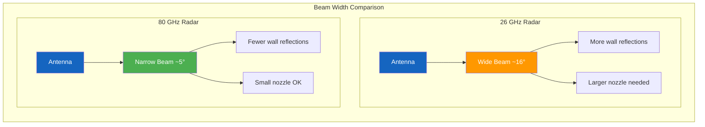
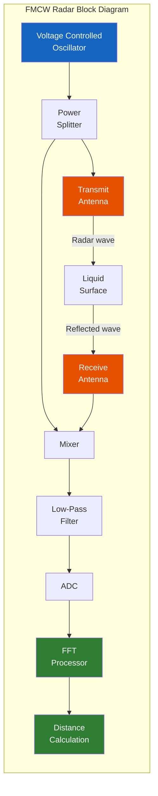
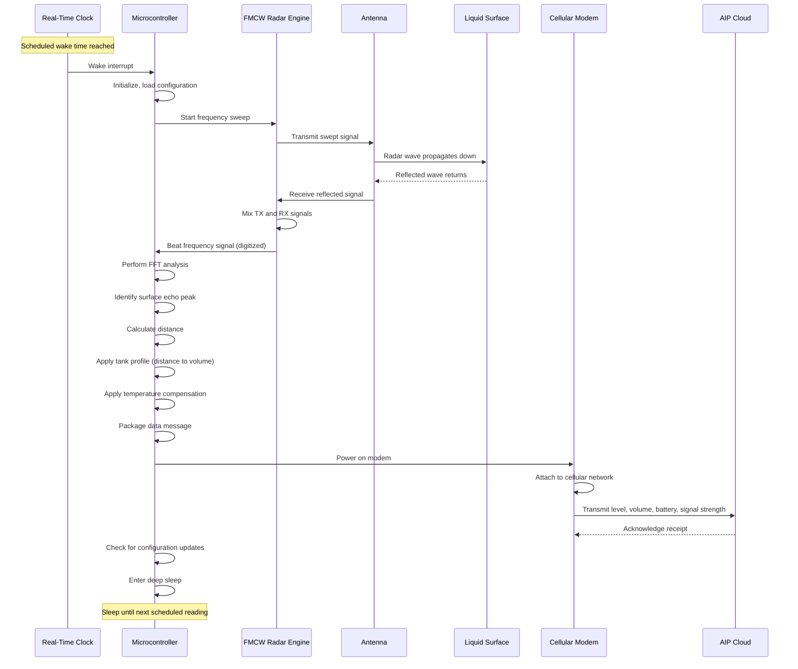
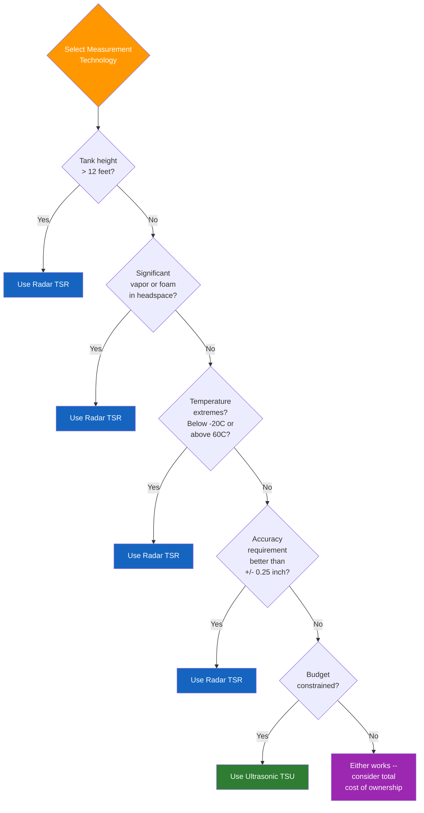

# Chapter 3: Radar and Ultrasonic Measurement

## Learning Objectives

By the end of this chapter, you will be able to:

- Explain the fundamental principles of electromagnetic wave propagation as they relate to radar measurement
- Describe how FMCW radar and pulse radar techniques are used for level measurement
- Perform time-of-flight calculations for both radar and ultrasonic systems
- Explain the operating principles and specifications of TankScan's TSR, TSU, and TSP monitors
- Compare radar and ultrasonic technologies across multiple performance dimensions
- Identify the optimal measurement technology for a given tank monitoring application

---

## 3.1 Electromagnetic Wave Theory Basics

To understand radar level measurement, we must first establish a foundation in electromagnetic (EM) wave theory. This section covers the essential concepts without requiring advanced physics or mathematics.

### 3.1.1 What Are Electromagnetic Waves?

Electromagnetic waves are oscillating electric and magnetic fields that propagate through space at the speed of light. Unlike sound waves, which require a physical medium (air, liquid, or solid) to travel, electromagnetic waves can propagate through a vacuum.

Key properties of EM waves:

- **Frequency ($f$)**: The number of oscillations per second, measured in Hertz (Hz). Radar level sensors operate in the microwave range, typically 6 GHz to 80 GHz.
- **Wavelength ($\lambda$)**: The physical distance between successive peaks of the wave. Related to frequency by:

$$\lambda = \frac{c}{f}$$

Where $c$ is the speed of light ($3 \times 10^8$ m/s).

- **Speed**: In free space (vacuum) and in air, EM waves travel at approximately $3 \times 10^8$ m/s. This speed is effectively constant and does not vary with temperature, pressure, or atmospheric composition -- a critical advantage over sound-based measurement.

**Wavelengths at Common Radar Frequencies**:

| Frequency | Wavelength | Application |
|---|---|---|
| 6 GHz | 50 mm | Low-frequency radar (C-band) |
| 10 GHz | 30 mm | Mid-range radar (X-band) |
| 26 GHz | 11.5 mm | Standard process radar (K-band) |
| 80 GHz | 3.75 mm | High-resolution radar (W-band) |

### 3.1.2 Reflection at Material Boundaries

When an EM wave encounters a boundary between two materials with different electrical properties (specifically, different **dielectric constants**), a portion of the wave energy is reflected and the remainder passes through. This reflection is the fundamental mechanism that enables radar level measurement: the wave travels from air to the liquid surface, and the dielectric boundary causes a reflection.

The **reflection coefficient** depends on the dielectric constant difference:

$$\Gamma = \frac{\sqrt{\varepsilon_{r1}} - \sqrt{\varepsilon_{r2}}}{\sqrt{\varepsilon_{r1}} + \sqrt{\varepsilon_{r2}}}$$

Where $\varepsilon_{r1}$ and $\varepsilon_{r2}$ are the relative dielectric constants of the two materials (e.g., air and the liquid).

The **reflected power** is proportional to $\Gamma^2$:

| Liquid | Dielectric Constant ($\varepsilon_r$) | Reflection Coefficient ($\Gamma$) | Reflected Power ($\Gamma^2$) |
|---|---|---|---|
| Air (reference) | 1.0 | -- | -- |
| Diesel fuel | 2.2 | 0.19 | 3.6% |
| Lubricating oil | 2.3 | 0.20 | 4.0% |
| Gasoline | 2.1 | 0.18 | 3.2% |
| Ethanol | 24.3 | 0.66 | 43.8% |
| Water | 80.1 | 0.80 | 64.0% |
| DEF (urea solution) | ~78 | 0.79 | 62.8% |

!!! note "Low Dielectric Liquids Are Harder to Measure"
    Hydrocarbon liquids (diesel, gasoline, oil) have low dielectric constants, reflecting only 3-4% of the radar energy. This means the returned signal is weak and requires sensitive electronics to detect. Water and water-based solutions reflect much more energy (60%+), making them easier to measure with radar. Modern radar sensors compensate for weak reflections through amplification and signal processing.

### 3.1.3 Beam Width and Antenna Design

A radar sensor's antenna determines the shape and direction of the emitted beam. The **beam width** (the angular spread of the beam) is inversely related to the antenna size relative to the wavelength:

$$\theta \approx \frac{k \cdot \lambda}{D}$$

Where:

- $\theta$ = beam width (radians)
- $k$ = a constant (approximately 1.2 for a circular aperture)
- $\lambda$ = wavelength
- $D$ = antenna diameter

This relationship has an important practical implication: **higher frequency radar sensors have narrower beams for the same antenna size**. A 26 GHz sensor with a 50 mm antenna has a beam width of about 16 degrees, while an 80 GHz sensor with the same antenna has a beam width of only about 5 degrees.

Narrow beams are advantageous because they:

- Reduce false echoes from tank walls, ladders, and other internal structures
- Allow measurement through small tank nozzles
- Provide better focusing on the liquid surface

---

## 3.2 Radar Level Measurement Principles

Radar level sensors use one of two primary techniques to measure distance: **pulse radar** and **FMCW (Frequency Modulated Continuous Wave) radar**. Both techniques ultimately measure the time it takes for an electromagnetic wave to travel from the sensor to the liquid surface and back.

### 3.2.1 Pulse Radar

**How It Works**: The sensor emits a short burst (pulse) of microwave energy toward the liquid surface. The pulse travels at the speed of light, reflects off the surface, and returns to the sensor. A high-speed timer measures the elapsed time between transmission and reception.

**Time-of-Flight Calculation**:

$$d = \frac{c \cdot t}{2}$$

For a tank where the sensor is mounted 10 meters above the liquid surface:

$$t = \frac{2d}{c} = \frac{2 \times 10}{3 \times 10^8} = 66.7 \text{ nanoseconds}$$

!!! warning "The Speed-of-Light Challenge"
    Measuring a distance of 10 meters requires timing resolution of nanoseconds. For 1 mm accuracy, the timer must resolve:

    $$\Delta t = \frac{2 \times 0.001}{3 \times 10^8} = 6.67 \text{ picoseconds}$$

    Direct timing at this resolution is technically challenging and expensive. This is why many radar level sensors use the FMCW technique instead, which converts the timing problem into a frequency measurement problem.

**Pulse Radar Advantages**:

- Conceptually simple
- Good for long-range measurements (up to 30+ meters)
- Less affected by close-range reflections

**Pulse Radar Limitations**:

- Requires extremely fast timing circuits for high accuracy
- Dead band at close range (sensor cannot receive while transmitting)
- Signal processing complexity for echo discrimination

### 3.2.2 FMCW (Frequency Modulated Continuous Wave) Radar

FMCW radar is the most common technique used in modern tank level sensors, including the TankScan TSR. Instead of emitting a short pulse and measuring time directly, FMCW radar continuously transmits a signal whose frequency changes (sweeps) linearly over time.

**How It Works**:

1. The transmitter emits a signal whose frequency increases linearly over a time period called the **sweep time** ($T$):

$$f(t) = f_0 + \frac{B}{T} \cdot t$$

Where $f_0$ is the starting frequency and $B$ is the total bandwidth of the sweep.

2. The reflected signal returns from the liquid surface after a delay $\tau$ (the round-trip time of flight).

3. The transmitted and received signals are mixed (multiplied) together. Because the received signal is a delayed version of the transmitted signal, and the transmit frequency has changed during the delay, the mixer output contains a **beat frequency** ($f_b$) proportional to the distance:

$$f_b = \frac{B}{T} \cdot \tau = \frac{B}{T} \cdot \frac{2d}{c}$$

4. The beat frequency is measured using a Fast Fourier Transform (FFT), which converts the time-domain signal into a frequency spectrum. The peak in the spectrum corresponds to the liquid surface distance.

**Solving for distance**:

$$d = \frac{f_b \cdot c \cdot T}{2B}$$

!!! example "FMCW Calculation Example"
    A TankScan TSR radar sensor operates with the following parameters:

    - Start frequency: $f_0 = 24$ GHz
    - Bandwidth: $B = 2$ GHz
    - Sweep time: $T = 1$ ms

    The sensor measures a beat frequency of $f_b = 133.3$ kHz. What is the distance to the liquid surface?

    $$d = \frac{f_b \cdot c \cdot T}{2B} = \frac{133{,}300 \times 3 \times 10^8 \times 0.001}{2 \times 2 \times 10^9}$$

    $$d = \frac{133{,}300 \times 300{,}000}{4 \times 10^9} = \frac{3.999 \times 10^{10}}{4 \times 10^9} = 10.0 \text{ m}$$

    The liquid surface is 10 meters below the sensor.

**FMCW Advantages**:

- Converts time measurement to frequency measurement (easier and more precise)
- Can achieve sub-millimeter accuracy
- Lower peak transmit power than pulse radar
- Better close-range performance (shorter dead band)
- FFT processing naturally rejects noise and identifies multiple reflections

**FMCW Limitations**:

- More complex electronics than pulse radar
- Requires a linear frequency sweep (non-linearity introduces errors)
- Bandwidth and sweep time must be carefully designed for the application

### 3.2.3 Distance Resolution in FMCW Radar

The distance resolution of an FMCW radar -- its ability to distinguish two closely spaced reflections -- is determined by the sweep bandwidth:

$$\Delta d = \frac{c}{2B}$$

For a 2 GHz bandwidth:

$$\Delta d = \frac{3 \times 10^8}{2 \times 2 \times 10^9} = 0.075 \text{ m} = 75 \text{ mm}$$

This means the sensor can distinguish two reflections that are at least 75 mm apart. By increasing the bandwidth, resolution improves -- an 8 GHz bandwidth gives 18.75 mm resolution.

!!! note "Resolution vs. Measurement Accuracy"
    Distance resolution determines the ability to separate two nearby echoes (e.g., the liquid surface vs. a baffle plate 50 mm above it). Measurement accuracy -- how precisely the sensor can determine the distance to a single echo -- can be much better than the resolution, often 1-3 mm, because accuracy depends on how precisely the FFT peak frequency can be determined.

---

## 3.3 Non-Contact Radar: Advantages and Applications

Non-contact radar refers to sensors that measure from outside the tank (typically mounted on top) without any element touching the liquid. This is the most common configuration for tank monitoring.

### 3.3.1 Key Advantages

1. **No contact with the process material**: Eliminates concerns about chemical compatibility, coating, corrosion, and contamination
2. **No moving parts**: Nothing to wear out, jam, or break
3. **Immune to headspace conditions**: Temperature, pressure, vapor, and gas composition do not affect measurement
4. **Wide measurement range**: A single sensor can measure from near the top of a tall tank to near the bottom
5. **Low maintenance**: No cleaning, no replacement parts, no recalibration in most cases
6. **Safety**: No need to open the tank for installation or maintenance in many configurations

### 3.3.2 Installation Considerations

Non-contact radar sensors require:

- A **mounting nozzle** or **flange** on top of the tank
- A **clear line of sight** from the sensor to the liquid surface (no obstructions in the beam path)
- Proper **alignment** -- the sensor should point straight down, perpendicular to the liquid surface
- Adequate **distance from tank walls** to avoid wall echoes (especially with wide beam sensors)

Common installation challenges:

| Challenge | Cause | Solution |
|---|---|---|
| False echoes from internal structures | Ladder rungs, baffles, inlet pipes in the beam path | Reposition sensor, use narrow-beam (80 GHz) radar, or apply echo mapping |
| Foam on the liquid surface | Chemical reactions, agitation, filling turbulence | Use guided wave radar or pressure sensor; some foams are transparent to radar |
| Condensation on the sensor face | Temperature cycling in humid environments | Use sensors with integrated heating or condensation-resistant lens design |
| Small nozzle diameter | Limited access to the top of the tank | Use 80 GHz radar with narrow beam that fits through small openings |
| Turbulent surface | High-flow filling, mixing, or pump recirculation | Increase measurement averaging time; install stilling well |

### 3.3.3 Stilling Wells

A **stilling well** is a vertical pipe or tube mounted inside the tank, open at the bottom and top. The liquid level inside the stilling well matches the level in the tank, but the surface inside the well is calm and protected from turbulence, foam, and splashing.

Radar sensors aimed down into a stilling well see a clean, flat surface and are protected from false echoes. Stilling wells are commonly used in large tanks with agitators or high fill rates.

---

## 3.4 Guided Wave Radar (GWR)

Guided wave radar is a variation of radar level measurement where the electromagnetic wave travels along a physical probe (waveguide) rather than through free space.

### 3.4.1 Operating Principle

A GWR sensor consists of a probe -- typically a rigid rod or flexible cable -- that extends from the top of the tank to the bottom. The sensor launches an electromagnetic pulse down the probe. When the pulse reaches the liquid surface (a dielectric boundary), a portion of the energy is reflected back up the probe. The sensor measures the time of flight to determine the surface location.

$$d = \frac{v \cdot t}{2}$$

Where $v$ is the propagation velocity along the waveguide (slightly less than the speed of light due to the waveguide structure, typically 95-99% of $c$).

### 3.4.2 Advantages Over Non-Contact Radar

- **Works in small tanks and narrow nozzles**: The measurement is confined to the probe, not affected by tank geometry
- **Better performance with low-dielectric liquids**: The guided wave produces a stronger reflection than free-space radar for the same dielectric change
- **Can detect interface layers**: A GWR probe can detect the boundary between two liquids (e.g., oil floating on water)
- **Shorter dead band**: Guided wave radar can measure closer to the sensor than non-contact radar

### 3.4.3 Limitations

- **Contact with the process fluid**: The probe is immersed in the liquid, requiring material compatibility
- **Probe fouling**: Coating or buildup on the probe can attenuate the signal
- **Mechanical stress**: The probe must withstand the forces of flowing liquid, turbulence, and temperature cycling
- **Length limitation**: Probes are typically limited to about 20 meters (66 feet) for rigid rods, longer for flexible cables

---

## 3.5 TankScan TSR Monitor: Deep Dive

The **TankScan TSR (TankScan Radar)** is the flagship radar level monitor designed for bulk storage tank applications. This section provides a detailed examination of its specifications, operating principles, and use cases.

### 3.5.1 Key Specifications

| Specification | Value |
|---|---|
| **Measurement Technology** | FMCW Radar |
| **Operating Frequency** | 24-26 GHz (K-band) |
| **Measurement Range** | 3 to 60 feet (0.9 to 18.3 meters) |
| **Accuracy** | +/- 0.1 inch (+/- 2.5 mm) typical |
| **Resolution** | 0.04 inch (1 mm) |
| **Dead Band** | 12 inches (305 mm) minimum |
| **Beam Angle** | Approximately 12 degrees (-3 dB) |
| **Power Source** | Internal lithium battery pack |
| **Battery Life** | 5-10 years (depending on reporting interval) |
| **Connectivity** | Integrated 4G LTE cellular modem |
| **Reporting Interval** | Configurable (1 hour to 24 hours, default 4 hours) |
| **Operating Temperature** | -40 to +85 degrees C (-40 to +185 degrees F) |
| **Enclosure Rating** | IP67 (dust-tight, protected against temporary immersion) |
| **Mounting** | 2-inch NPT threaded connection |
| **Hazardous Area Rating** | Class I, Division 2, Groups A, B, C, D |
| **Weight** | Approximately 4 lbs (1.8 kg) |

### 3.5.2 How the TSR Takes a Measurement

### 3.5.3 TSR Application Guide

The TSR is recommended for the following applications:

- **Above-ground storage tanks (ASTs)**: Vertical and horizontal cylindrical tanks from 3 to 60 feet in height
- **Underground storage tanks (USTs)**: Fuel tanks at retail stations (sensor mounted in a manway or monitoring well)
- **Intermediate bulk containers (IBCs)**: Large totes and portable tanks (within the minimum range)
- **Tanks with vapor or fume issues**: Where headspace conditions would interfere with ultrasonic sensors
- **Tanks with temperature extremes**: Where ultrasonic accuracy would be compromised
- **High-accuracy applications**: Where +/- 0.1 inch accuracy is required for inventory management or custody transfer verification

!!! tip "TSR Installation Best Practices"
    1. Mount the sensor as close to the center of the tank as possible to avoid wall echoes
    2. Ensure the mounting nozzle is at least 2 inches in diameter (to match the 2-inch NPT thread)
    3. Point the sensor straight down -- even a few degrees of tilt can shift the echo to a wall reflection
    4. Keep the sensor at least 8 inches from any tank wall or internal structure
    5. For tanks with internal obstructions, consider a stilling well installation
    6. Record the sensor-to-tank-bottom distance during installation for accurate calibration

---

## 3.6 Ultrasonic Measurement Principles

### 3.6.1 Sound Wave Fundamentals

Sound waves are mechanical pressure waves that propagate through a physical medium. Unlike electromagnetic waves, sound requires matter (air, liquid, or solid) to travel and cannot propagate through a vacuum.

Key properties:

- **Frequency**: For level measurement, sensors operate in the ultrasonic range (above human hearing), typically 20 kHz to 200 kHz
- **Speed**: In air at 20 degrees C, approximately 343 m/s -- roughly one million times slower than light
- **Wavelength**: At 40 kHz in air, $\lambda = 343/40{,}000 = 8.6$ mm

The dramatically slower speed of sound compared to light has an important practical consequence: the time-of-flight for ultrasonic measurement is much longer than for radar, making it easier to measure directly with less expensive electronics.

!!! example "Comparing Time-of-Flight: Radar vs. Ultrasonic"
    For a sensor mounted 5 meters above the liquid surface:

    **Radar**: $t = \frac{2 \times 5}{3 \times 10^8} = 33.3$ nanoseconds

    **Ultrasonic**: $t = \frac{2 \times 5}{343} = 29.2$ milliseconds

    The ultrasonic time of flight is nearly one million times longer, which is much easier and cheaper to measure with standard electronics. This is one reason ultrasonic sensors are less expensive than radar sensors.

### 3.6.2 Ultrasonic Transducers

The heart of an ultrasonic level sensor is the **piezoelectric transducer**. Piezoelectric materials (such as lead zirconate titanate, or PZT) generate mechanical vibrations when an electrical voltage is applied, and conversely generate a voltage when mechanically stressed. This dual property allows the same transducer to function as both a transmitter and a receiver.

The transducer is designed to resonate at a specific frequency (the operating frequency of the sensor). When excited by an electrical pulse, it emits a burst of ultrasonic energy. After the burst, the same transducer listens for the returning echo.

**Operating Frequency Selection**:

| Frequency | Beam Width | Attenuation | Range | Best For |
|---|---|---|---|---|
| 20-30 kHz | Wide | Low | Long (up to 15 m) | Large tanks, dusty environments |
| 40-60 kHz | Medium | Medium | Medium (up to 8 m) | General purpose, most tank sizes |
| 100-200 kHz | Narrow | High | Short (up to 2 m) | Small tanks, high resolution needed |

Higher frequencies provide better resolution and narrower beams but are attenuated more quickly in air, limiting range.

### 3.6.3 Speed of Sound: The Critical Variable

The accuracy of an ultrasonic level measurement depends directly on knowing the speed of sound in the headspace gas. The speed of sound in an ideal gas is:

$$v_s = \sqrt{\frac{\gamma \cdot R \cdot T}{M}}$$

Where:

- $v_s$ = speed of sound (m/s)
- $\gamma$ = ratio of specific heats (1.4 for air)
- $R$ = universal gas constant (8.314 J/mol-K)
- $T$ = absolute temperature (Kelvin)
- $M$ = molar mass of the gas (0.029 kg/mol for air)

For air, this simplifies to:

$$v_s \approx 331.3 + 0.606 \cdot T_C$$

Where $T_C$ is the temperature in degrees Celsius. This linear approximation is accurate to within 0.1% for temperatures from -40 to +60 degrees C.

### 3.6.4 Temperature Compensation

Since the speed of sound varies with temperature, ultrasonic sensors must measure the headspace temperature and adjust the distance calculation accordingly. Most sensors include one or more temperature sensors:

- A **single temperature sensor** at the transducer face provides the temperature at the top of the headspace
- **Multiple temperature sensors** along the sensor body or in the headspace provide a temperature profile for better compensation

However, temperature compensation has inherent limitations:

- **Temperature gradients**: If the top of the headspace is at 30 degrees C and the bottom is at 10 degrees C, a single temperature measurement cannot fully characterize the sound speed profile
- **Non-air headspace gases**: If the headspace contains hydrocarbon vapor, the speed of sound differs from that of pure air, and the standard temperature compensation formula will introduce error
- **Transient conditions**: During filling or emptying, the headspace conditions can change rapidly, and the temperature sensor may lag behind

!!! warning "Headspace Composition Matters"
    In a fuel tank with a significant concentration of hydrocarbon vapor, the speed of sound can differ from pure air by several percent. For example, propane vapor has a speed of sound of about 258 m/s (vs. 343 m/s for air). A headspace containing 10% propane vapor by volume would have a blended speed of sound approximately 2.5% lower than pure air, introducing a 2.5% distance error if not compensated.

### 3.6.5 Acoustic Impedance and Reflection

When a sound wave traveling in one medium encounters a boundary with a different medium, a portion of the energy is reflected. The amount of reflection depends on the **acoustic impedance mismatch**:

$$\Gamma_{acoustic} = \frac{Z_2 - Z_1}{Z_2 + Z_1}$$

Where $Z = \rho \cdot v_s$ is the acoustic impedance (density times speed of sound).

For an air-to-liquid boundary:

- Air: $Z_{air} = 1.2 \times 343 = 412$ Pa-s/m
- Water: $Z_{water} = 1000 \times 1480 = 1{,}480{,}000$ Pa-s/m
- Diesel: $Z_{diesel} = 850 \times 1250 = 1{,}062{,}500$ Pa-s/m

The impedance mismatch between air and any liquid is enormous, meaning that virtually all ultrasonic energy is reflected at the liquid surface. This is good for detection (strong echo) but means that ultrasonic sensors operating through air cannot measure into the liquid.

---

## 3.7 TankScan TSU Monitor: Deep Dive

The **TankScan TSU (TankScan Ultrasonic)** is designed for smaller tanks and applications where the cost-effectiveness of ultrasonic technology is advantageous.

### 3.7.1 Key Specifications

| Specification | Value |
|---|---|
| **Measurement Technology** | Ultrasonic time-of-flight |
| **Operating Frequency** | 40 kHz |
| **Measurement Range** | 6 inches to 12 feet (0.15 to 3.66 meters) |
| **Accuracy** | +/- 0.25 inch (+/- 6.35 mm) typical |
| **Resolution** | 0.1 inch (2.5 mm) |
| **Dead Band** | 6 inches (152 mm) |
| **Temperature Compensation** | Integrated temperature sensor with automatic correction |
| **Operating Temperature** | -20 to +60 degrees C (-4 to +140 degrees F) |
| **Power Source** | Internal lithium battery pack |
| **Battery Life** | 7-10 years typical |
| **Connectivity** | Integrated 4G LTE cellular modem |
| **Enclosure Rating** | IP67 |
| **Mounting** | 2-inch NPT threaded connection |

### 3.7.2 TSU vs. TSR: When to Use Each

| Factor | TSU (Ultrasonic) | TSR (Radar) |
|---|---|---|
| **Tank height** | Up to 12 feet | Up to 60 feet |
| **Accuracy** | +/- 0.25 inch | +/- 0.1 inch |
| **Headspace vapor** | Affected | Not affected |
| **Temperature range** | -20 to +60 degrees C | -40 to +85 degrees C |
| **Cost** | Lower | Higher |
| **Best for** | Small to medium clean tanks, DEF, water, totes | Large tanks, fuel, chemicals, extreme environments |

!!! tip "Use the TSU When..."
    The TSU is the cost-effective choice when: the tank height is 12 feet or less, the stored liquid does not produce significant vapor, the ambient temperature stays within moderate bounds, and +/- 0.25 inch accuracy is acceptable. Common TSU applications include DEF totes, small water tanks, lubricant containers, and chemical day tanks.

---

## 3.8 Submersible Pressure Measurement: TankScan TSP

The **TankScan TSP (TankScan Pressure)** takes a fundamentally different approach from the TSR and TSU. Instead of measuring from above the liquid, the TSP measures from below using hydrostatic pressure.

### 3.8.1 Operating Principle

A submersible pressure transducer is lowered to the bottom of the tank. The transducer measures the total pressure at that point, which is the sum of atmospheric pressure and the hydrostatic pressure of the liquid column above it:

$$P_{total} = P_{atm} + \rho \cdot g \cdot h$$

To isolate the hydrostatic component, the transducer has a vent tube that runs up the cable to the surface, exposing the reference side of the pressure sensor to atmospheric pressure. The sensor then measures only the differential (gauge) pressure:

$$P_{gauge} = P_{total} - P_{atm} = \rho \cdot g \cdot h$$

### 3.8.2 Key Specifications

| Specification | Value |
|---|---|
| **Measurement Technology** | Piezoresistive pressure transducer |
| **Pressure Range** | 0 to 5 psi, 0 to 15 psi, 0 to 30 psi (application-dependent) |
| **Accuracy** | +/- 0.25% of full scale |
| **Wetted Materials** | 316L stainless steel, Viton O-ring |
| **Cable Length** | Custom per application (up to 100 ft) |
| **Power Source** | Internal lithium battery pack (in surface electronics) |
| **Connectivity** | Integrated 4G LTE cellular modem |
| **Operating Temperature** | -20 to +80 degrees C (liquid temperature at the sensor) |

### 3.8.3 Density Compensation

Because the TSP measures pressure and must convert to level (height), the liquid density must be known and configured in the system. If the density changes (due to temperature variation or product changes), the level reading will be affected.

**Temperature-Density Relationship for Common Liquids**:

| Liquid | Density at 15 degrees C (kg/m cubed) | Temperature Coefficient (%/degree C) |
|---|---|---|
| Diesel fuel | 850 | -0.07 |
| Gasoline | 740 | -0.10 |
| Water | 999 | -0.02 |
| Lubricating oil | 880 | -0.06 |
| DEF | 1090 | -0.03 |

For high-accuracy applications, a temperature sensor can be co-located with the pressure sensor to enable temperature-compensated density correction.

### 3.8.4 TSP Application Guide

The TSP is recommended when:

- **Top mounting is not possible**: The tank has no suitable nozzle on top, or top access is restricted
- **Headspace is problematic**: Heavy foam, thick vapor, or extreme turbulence prevents reliable non-contact measurement
- **Water and wastewater**: Clean water applications where the submersible approach is simple and reliable
- **Oddly shaped tanks**: Pressure measurement works regardless of tank geometry (cross-section can be irregular)
- **Underground tanks with limited access**: The transducer can be lowered through a small monitoring well

!!! warning "TSP Limitations to Consider"
    - The vent tube must remain open and unblocked; condensation or debris in the vent tube will cause measurement errors
    - Chemical compatibility of the wetted materials (316L stainless, Viton) must be verified for the stored liquid
    - The cable must be routed from the tank bottom to the surface electronics, which may require careful installation
    - Density changes due to temperature or product blending affect accuracy

---

## 3.9 Comparing Radar vs. Ultrasonic: Detailed Analysis

This section provides a comprehensive comparison of the two primary non-contact measurement technologies.

### 3.9.1 Physics Comparison

| Property | Radar (EM Wave) | Ultrasonic (Sound Wave) |
|---|---|---|
| Wave type | Electromagnetic | Mechanical (pressure) |
| Medium required | No (travels in vacuum) | Yes (needs air or other gas) |
| Speed | $3 \times 10^8$ m/s (speed of light) | ~343 m/s in air (varies with temperature) |
| Affected by temperature | No | Yes (significantly) |
| Affected by pressure | No | Yes (gas density affects speed) |
| Affected by gas composition | No | Yes (different gases have different sound speeds) |
| Reflection mechanism | Dielectric constant change | Acoustic impedance change |
| Frequency range | 6-80 GHz | 20-200 kHz |
| Wavelength | 3.75-50 mm | 1.7-17 mm (in air) |

### 3.9.2 Performance Comparison

| Performance Metric | Radar | Ultrasonic |
|---|---|---|
| Maximum range | 30+ meters | 10-15 meters |
| Accuracy (best case) | +/- 1-3 mm | +/- 3-6 mm |
| Dead band | 50-500 mm | 150-600 mm |
| Dust/particle tolerance | Good | Poor (particles scatter sound) |
| Vapor tolerance | Excellent | Poor (vapor changes sound speed) |
| Foam tolerance | Moderate (depends on foam type) | Poor (foam absorbs sound) |
| Surface turbulence tolerance | Good | Moderate |
| Power consumption | Higher | Lower |

### 3.9.3 Cost Comparison

| Cost Factor | Radar | Ultrasonic |
|---|---|---|
| Sensor hardware | Higher (complex RF electronics) | Lower (simpler electronics) |
| Installation | Similar (both top-mount) | Similar |
| Maintenance | Very low | Low |
| Total cost of ownership (10 year) | Higher upfront, lower ongoing | Lower upfront, similar ongoing |

### 3.9.4 Decision Matrix

---

## 3.10 Advanced Topics

### 3.10.1 Multi-Echo Processing

In real-world tanks, the sensor receives not just the echo from the liquid surface but also echoes from:

- Tank walls and bottom
- Internal structures (ladders, baffles, mixing shafts)
- Multiple reflections (signal bouncing between surface and sensor multiple times)
- Interface layers (e.g., oil-water interface)

Advanced signal processing algorithms analyze the full echo profile to identify the correct surface echo. Techniques include:

- **Echo mapping**: Recording the echo profile with an empty tank and subtracting it from subsequent measurements to remove fixed structural echoes
- **Tracking algorithms**: Once the surface echo is identified, tracking its movement over time to maintain lock even in noisy environments
- **Amplitude analysis**: The surface echo has predictable amplitude characteristics based on the liquid's dielectric constant and the measurement geometry

### 3.10.2 Near-Surface Measurement Challenges

As the liquid level approaches the sensor (high level in the tank), several challenges arise:

- The echo returns very quickly, potentially overlapping with the transmitted signal
- Near-field antenna effects can distort the measurement
- The dead band prevents measurement below a minimum distance

These challenges are addressed through:

- Hardware design that minimizes transmit-to-receive switching time
- Near-field correction algorithms in firmware
- Careful specification of the dead band so users install the sensor with adequate clearance

### 3.10.3 Low-Level and Empty Tank Detection

At the other extreme, when the tank is nearly empty:

- The echo must travel the maximum distance, resulting in significant attenuation
- False echoes from the tank bottom or tank bottom structures may appear
- For tanks with sloped or conical bottoms, the effective measurement point changes near the bottom

Sensors address these challenges through:

- Increased transmit power or receiver sensitivity at maximum range
- Bottom echo detection algorithms that identify the tank bottom echo and prevent it from being reported as the liquid surface
- Tank profile configurations that account for the unusable volume below the minimum measurement point

### 3.10.4 Tank Volume Calculation Methods

Converting a level measurement (distance from sensor to surface, or height of liquid) to volume requires knowledge of the tank geometry. Common tank shapes and their volume formulas:

**Vertical Cylinder**:

$$V = \pi r^2 h$$

**Horizontal Cylinder** (partially filled):

$$V = L \left[ r^2 \cos^{-1}\left(\frac{r-h}{r}\right) - (r-h)\sqrt{2rh - h^2} \right]$$

**Rectangular Tank**:

$$V = l \times w \times h$$

**Vertical Cylinder with Cone Bottom** (liquid above cone):

$$V = V_{cone} + \pi r^2 (h - h_{cone})$$

Where $V_{cone}$ is the volume of the conical section and $h_{cone}$ is the height of the cone.

For irregularly shaped tanks, a **strapping table** is used -- a lookup table that maps specific levels to known volumes, determined by physical measurement or engineering drawings.

---

## 3.11 Real-World Performance Factors

### 3.11.1 Signal-to-Noise Ratio

The **signal-to-noise ratio (SNR)** is the ratio of the desired echo signal power to the background noise power:

$$SNR = 10 \log_{10}\left(\frac{P_{signal}}{P_{noise}}\right) \text{ dB}$$

A higher SNR means a clearer, more reliable measurement. Factors that reduce SNR include:

- Long measurement distance (signal attenuates with distance)
- Low-dielectric liquids (weak reflection)
- Turbulent surface (scatters the reflected energy)
- Electrical noise from nearby equipment
- Acoustic noise from pumps or mixers (for ultrasonic sensors)

### 3.11.2 Measurement Repeatability in the Field

While sensor specifications quote accuracy under laboratory conditions, real-world performance is affected by:

- Installation quality (sensor alignment, nozzle diameter, distance from walls)
- Tank condition (internal rust, coating, debris)
- Environmental factors (temperature cycling, vibration, humidity)
- Product characteristics (foam, vapor, viscosity, coating tendency)

Field measurements typically show slightly worse accuracy than laboratory specifications. A sensor rated at +/- 2 mm in the lab might achieve +/- 5 mm in the field. For tank monitoring applications, this is still more than adequate for delivery planning and inventory management.

---

## 3.12 Chapter Summary

This chapter has provided an in-depth exploration of radar and ultrasonic measurement technologies as applied to tank level monitoring:

1. **Electromagnetic waves** propagate at the speed of light, are unaffected by temperature and gas composition, and reflect at dielectric boundaries -- making radar an exceptionally reliable measurement method
2. **FMCW radar** converts the time-of-flight measurement into a frequency measurement, enabling sub-millimeter accuracy with practical electronics
3. **Non-contact radar** (like the TankScan TSR) offers the widest range, highest accuracy, and greatest immunity to environmental conditions among level measurement technologies
4. **Guided wave radar** provides an alternative for challenging installations where non-contact measurement is impractical
5. **Ultrasonic measurement** offers a cost-effective alternative for shorter range applications with controlled headspace conditions
6. **The speed of sound** varies significantly with temperature and gas composition, requiring compensation and limiting ultrasonic accuracy in variable environments
7. **The TankScan TSR** provides 3-60 foot range with +/- 0.1 inch accuracy using FMCW radar at 24-26 GHz
8. **The TankScan TSU** provides 6 inch to 12 foot range with +/- 0.25 inch accuracy using 40 kHz ultrasonic measurement
9. **The TankScan TSP** uses submersible pressure measurement for applications where top-mount sensors are not feasible
10. **Selecting the right technology** requires evaluating tank size, stored material, headspace conditions, accuracy requirements, and budget

---

## Review Questions

!!! question "Question 1 -- Knowledge Recall"
    State the fundamental equation used in FMCW radar to relate beat frequency to distance. Define each variable in the equation.

    ??? success "Suggested Answer"
        The equation is:

        $$d = \frac{f_b \cdot c \cdot T}{2B}$$

        Where:

        - $d$ = distance from the sensor to the liquid surface (meters)
        - $f_b$ = beat frequency, the difference frequency produced by mixing the transmitted and received signals (Hz)
        - $c$ = speed of light ($3 \times 10^8$ m/s)
        - $T$ = sweep time, the duration of one frequency sweep (seconds)
        - $B$ = sweep bandwidth, the total frequency range of the sweep (Hz)
        - The factor of 2 accounts for the round-trip path of the radar wave

!!! question "Question 2 -- Comprehension"
    Explain why an 80 GHz radar sensor has a narrower beam than a 26 GHz sensor with the same antenna diameter. What practical benefits does a narrower beam provide in tank monitoring?

    ??? success "Suggested Answer"
        Beam width is inversely proportional to the ratio of antenna diameter to wavelength: $\theta \approx k\lambda/D$. Since wavelength is inversely proportional to frequency ($\lambda = c/f$), a higher frequency produces a shorter wavelength. For the same antenna diameter $D$, a shorter wavelength results in a narrower beam.

        At 26 GHz, the wavelength is 11.5 mm; at 80 GHz, it is 3.75 mm. The 80 GHz beam is about 3 times narrower than the 26 GHz beam.

        Practical benefits of a narrower beam include: (1) fewer false echoes from tank walls and internal structures because the beam does not illuminate as much of the tank interior, (2) ability to measure through smaller nozzles since the beam fits through a smaller opening, (3) better focus on the liquid surface resulting in a stronger, cleaner return signal, and (4) reduced sensitivity to sensor mounting angle errors.

!!! question "Question 3 -- Application"
    A TankScan TSU ultrasonic sensor is mounted at the top of a vertical tank. The sensor-to-tank-bottom distance is 3.0 meters. The sensor reads a time-of-flight of 11.7 milliseconds. The headspace temperature is 25 degrees C. Calculate the liquid level in the tank.

    ??? success "Suggested Answer"
        First, calculate the speed of sound at 25 degrees C:

        $$v_s = 331.3 + 0.606 \times 25 = 331.3 + 15.15 = 346.45 \text{ m/s}$$

        Next, calculate the distance from the sensor to the liquid surface:

        $$d = \frac{v_s \cdot t}{2} = \frac{346.45 \times 0.0117}{2} = \frac{4.053}{2} = 2.027 \text{ m}$$

        Finally, calculate the liquid level (height above the tank bottom):

        $$h = 3.0 - 2.027 = 0.973 \text{ m}$$

        The liquid level is approximately 0.97 meters (about 3.2 feet) above the tank bottom.

!!! question "Question 4 -- Analysis"
    A customer stores ethanol in outdoor tanks that experience temperature swings from -10 degrees C to 40 degrees C. The tanks are 8 feet tall with significant ethanol vapor in the headspace. Compare the suitability of the TSR and TSU for this application, considering at least three performance factors.

    ??? success "Suggested Answer"
        **Factor 1 -- Temperature Effect**: The 50-degree C temperature range would cause the speed of sound to vary by approximately 8.5%. While the TSU has temperature compensation, this wide range pushes the limits of single-point compensation, especially if temperature gradients exist. The TSR is completely unaffected by temperature. **Advantage: TSR**.

        **Factor 2 -- Headspace Vapor**: Ethanol vapor has a significantly different molecular weight than air, which changes the speed of sound. The TSU's temperature compensation cannot account for this composition change, introducing additional error. The TSR's radar waves are unaffected by vapor composition. **Advantage: TSR**.

        **Factor 3 -- Range**: The 8-foot tank height is within the range of both sensors (TSU: up to 12 ft; TSR: 3 to 60 ft). However, the TSR's minimum range is 3 feet, which means the top portion of the 8-foot tank (within 3 feet of the sensor) would be in the TSR's dead band. The TSU has a dead band of only 6 inches. **Advantage: TSU** (unless the tank is never filled above 5 feet from the bottom).

        **Factor 4 -- Accuracy**: The TSR offers +/- 0.1 inch vs. TSU +/- 0.25 inch. However, the TSU's actual accuracy would be degraded beyond its specification by the vapor and temperature issues. **Advantage: TSR**.

        **Recommendation**: The TSR is the better choice despite its higher cost. The ethanol vapor and wide temperature range create conditions where ultrasonic measurement accuracy is significantly compromised, while radar measurement remains unaffected. The TSR's 3-foot dead band should be verified against the maximum expected fill level.

!!! question "Question 5 -- Evaluation"
    Evaluate the claim: 'Radar sensors are always the best choice for tank monitoring.' Under what circumstances might this claim be incorrect? Provide at least three scenarios where an alternative technology would be a better choice.

    ??? success "Suggested Answer"
        While radar sensors are excellent, the claim that they are "always" best is incorrect. Alternative technologies are better in several scenarios:

        **Scenario 1: Small, low-value tanks on a tight budget.** For a fleet of 100 small DEF totes (4-foot height, stable indoor temperature, no significant vapor), the TSU ultrasonic sensor provides adequate accuracy at a lower cost per unit. The total savings across 100 units could be substantial, and the environmental conditions do not challenge the ultrasonic sensor.

        **Scenario 2: Tanks with no top access.** A buried concrete water cistern with only a small side port and no top access point cannot accommodate a top-mounted radar sensor. A TSP submersible pressure transducer is the appropriate solution here, regardless of how good radar technology is.

        **Scenario 3: Tanks with existing mechanical gauges that cannot be modified.** A propane tank farm with certified float gauges that cannot be replaced (due to regulatory requirements or lease terms) would be best served by TSD dial gauge readers that add wireless capability to the existing gauges.

        **Scenario 4: Very short tanks or containers.** A 2-foot tall lubricant container is below the TSR's 3-foot minimum range. The TSU, with its 6-inch minimum range, or a pressure sensor would be required.

        **Scenario 5: Budget-driven high-volume deployments.** When deploying 5,000 monitors across a territory where most tanks are small and indoors, the cost differential between radar and ultrasonic could amount to hundreds of thousands of dollars. If the application conditions are suitable for ultrasonic, the cost savings justify the choice.
