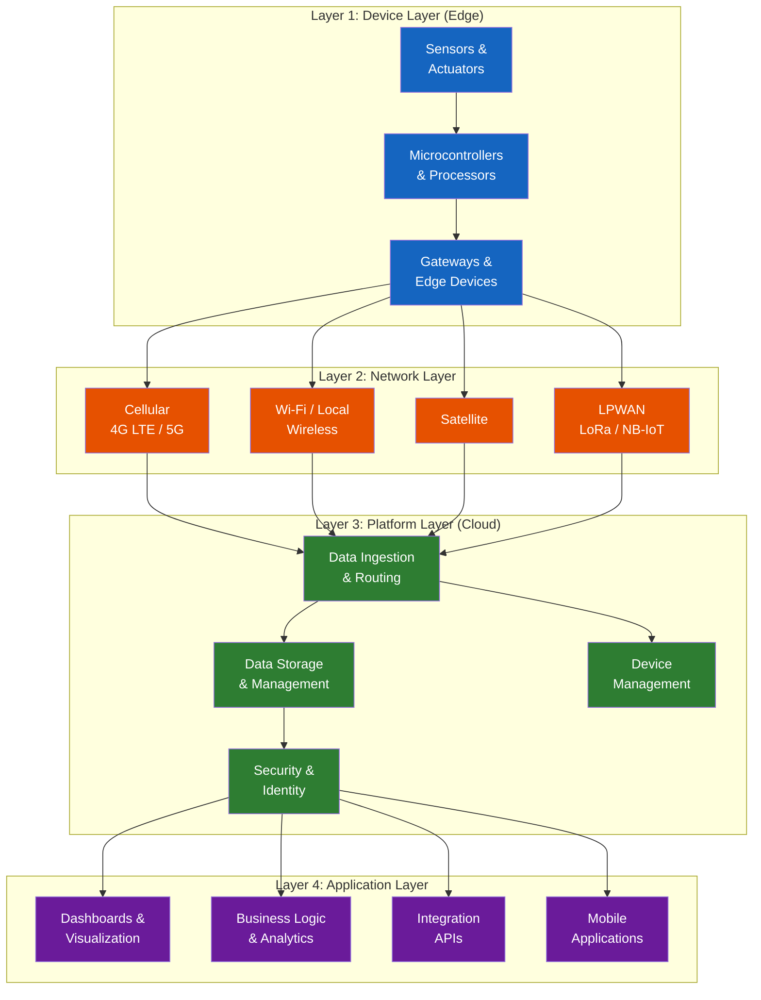
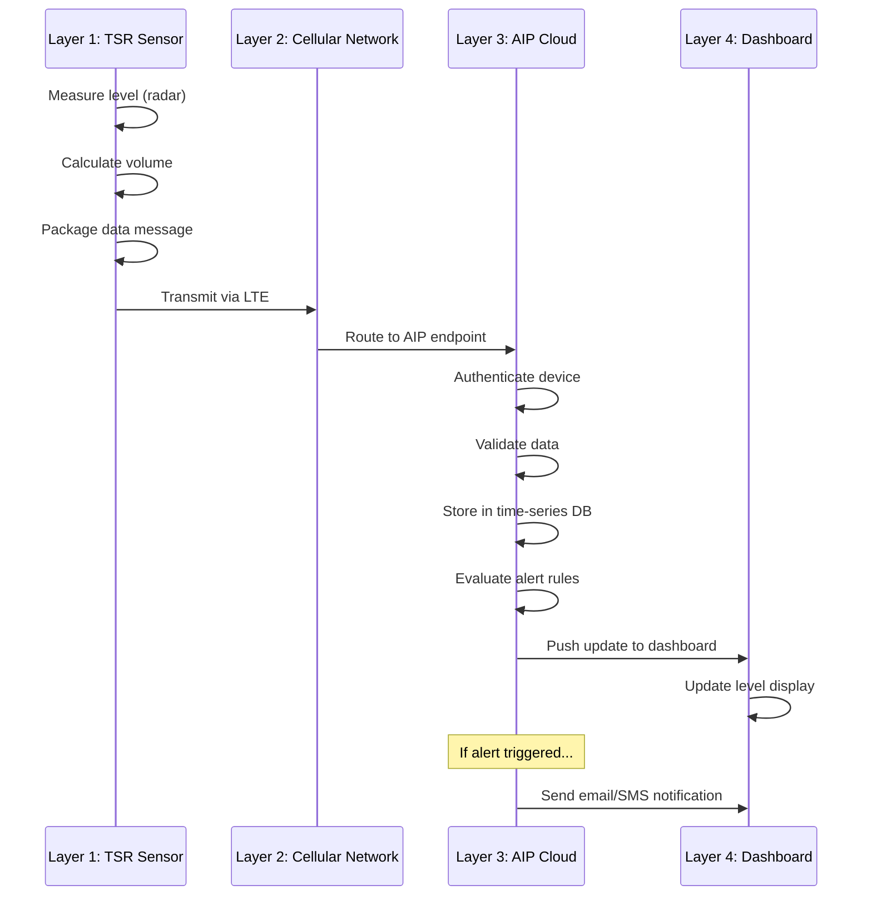
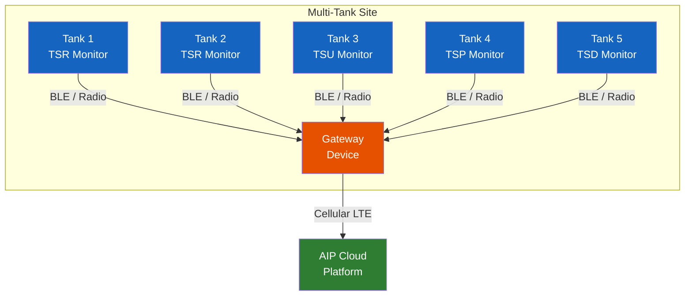
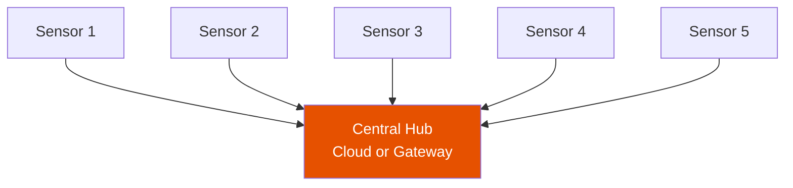
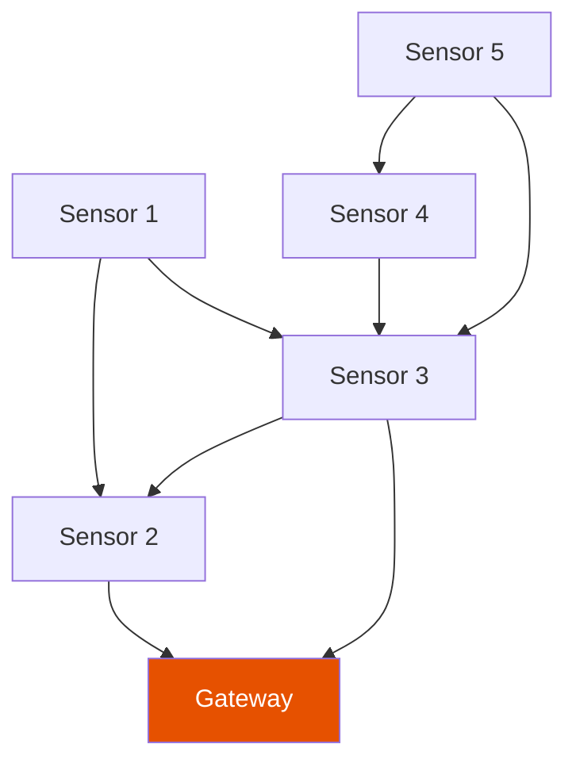
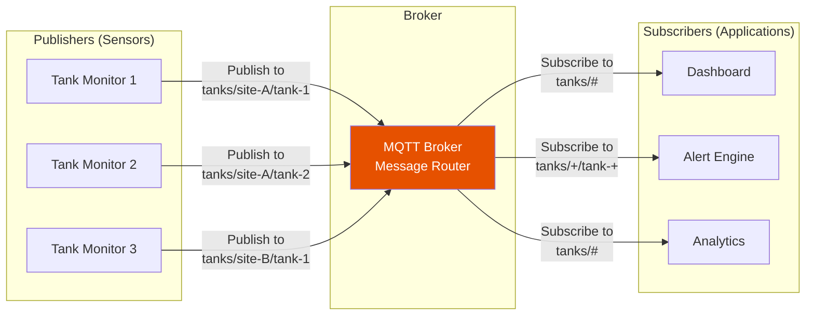
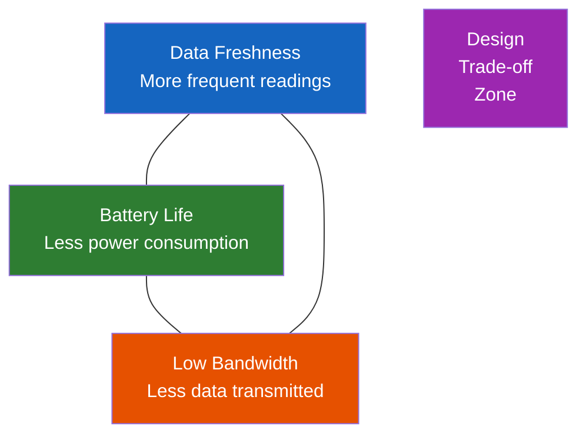
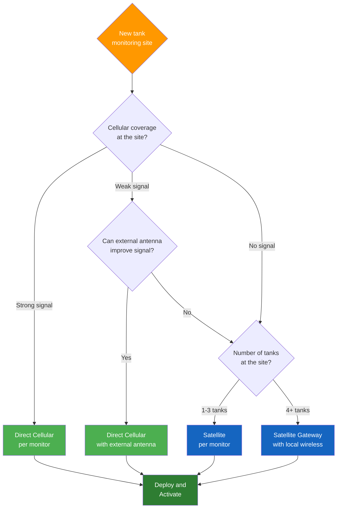

# Chapter 4: IoT Architecture and Connectivity

## Learning Objectives

By the end of this chapter, you will be able to:

- Describe the layered architecture of IoT systems and identify where tank monitoring fits within it
- Differentiate between Industrial IoT (IIoT) and consumer IoT in terms of requirements and constraints
- Explain how cellular, Wi-Fi, and satellite connectivity options work for tank monitoring
- Describe the role of gateway devices in aggregating and relaying sensor data
- Compare edge computing and cloud computing approaches for data processing
- Explain common IoT data protocols (MQTT, HTTP/REST) and their trade-offs
- Design a connectivity solution for a multi-site tank monitoring deployment

---

## 4.1 IoT Reference Architecture

The **Internet of Things (IoT)** refers to the network of physical devices embedded with sensors, software, and connectivity that enables them to collect and exchange data. Tank monitoring is a canonical IoT application: physical sensors on remote tanks transmit data over wireless networks to cloud platforms where it is stored, analyzed, and presented to users.

### 4.1.1 The Four-Layer IoT Architecture

While there are many IoT architecture models in the literature, a practical four-layer model captures the essential structure of most IoT systems, including tank monitoring:



**Layer 1 -- Device Layer (Edge)**: The physical sensors, microcontrollers, and gateway devices at the tank site. This is where the physical measurement happens and where raw data originates. In TankScan's system, this layer includes the TSR, TSU, TSP, and TSD monitors.

**Layer 2 -- Network Layer**: The communication infrastructure that transports data from the edge to the cloud. For tank monitoring, this is primarily cellular networks (4G LTE), with satellite as an alternative for remote sites.

**Layer 3 -- Platform Layer (Cloud)**: The cloud infrastructure that receives, stores, processes, and manages the data and devices. TankScan's AIP (Asset Intelligence Platform) operates at this layer.

**Layer 4 -- Application Layer**: The user-facing applications that present data, generate alerts, produce reports, and integrate with business systems. Dashboards, mobile apps, and API integrations operate at this layer.

### 4.1.2 Data Flow Through the Layers

A single tank level reading flows through all four layers:



---

## 4.2 Industrial IoT vs. Consumer IoT

Tank monitoring falls squarely in the **Industrial IoT (IIoT)** category, which has significantly different requirements from consumer IoT applications like smart home devices, wearable fitness trackers, or connected appliances.

### 4.2.1 Key Differences

| Characteristic | Consumer IoT | Industrial IoT (Tank Monitoring) |
|---|---|---|
| **Environment** | Indoor, climate-controlled | Outdoor, extreme temperatures, rain, dust |
| **Reliability requirement** | Nice-to-have | Mission-critical (financial consequences of failure) |
| **Device lifespan** | 2-5 years | 10-15 years |
| **Power source** | AC power or rechargeable battery | Non-rechargeable battery (5-10 year life) |
| **Connectivity** | Wi-Fi (always available) | Cellular, satellite (may be intermittent) |
| **Data volume** | High (streaming video, audio) | Low (periodic readings, kilobytes per day) |
| **Security requirements** | Moderate (privacy) | High (operational integrity, regulatory compliance) |
| **Deployment scale** | Household (5-50 devices) | Enterprise (1,000-100,000+ devices) |
| **Installation** | Consumer self-install (plug-and-play) | Professional or trained installer |
| **Regulatory** | FCC consumer electronics | FCC, hazardous area certifications, industry standards |
| **Cost sensitivity** | High (consumer price points) | Moderate (ROI-driven, business investment) |

### 4.2.2 IIoT Design Priorities for Tank Monitoring

The IIoT context drives several design priorities that are less important in consumer IoT:

**Reliability over features**: A tank monitor that reliably reports accurate level readings every 4 hours for 10 years is far more valuable than one with many features that fails after 2 years. Every design decision -- from component selection to firmware architecture -- prioritizes reliability.

**Power efficiency over real-time responsiveness**: Unlike a consumer device that responds instantly to a button press, a tank monitor can take a reading every few hours because tank levels change slowly. This allows extreme power optimization through sleep/wake cycling.

**Ruggedization over aesthetics**: A consumer device must look attractive; a tank monitor must survive -40 degrees C winters, 85 degrees C sun-baked summers, rain, snow, ice, dust, and vibration.

**Fleet management over individual management**: With thousands of devices deployed across a territory, the ability to manage, monitor, configure, and update devices remotely and at scale is essential.

!!! note "The IIoT Reliability Imperative"
    In consumer IoT, if a smart light bulb goes offline, the user is mildly annoyed. In tank monitoring, if a sensor goes offline on a critical fuel tank, the customer may run out of fuel, an emergency delivery may be needed, or a safety hazard may go undetected. This difference in consequences drives the engineering and quality standards for IIoT devices.

---

## 4.3 Cellular Connectivity

Cellular networks are the primary connectivity method for wireless tank monitors. The ubiquity, reliability, and managed nature of cellular networks make them ideal for distributed asset monitoring.

### 4.3.1 Why Cellular for Tank Monitoring?

| Factor | Cellular Advantage |
|---|---|
| **Coverage** | Cellular networks cover approximately 98% of the US population; most commercial and residential tank locations have coverage |
| **No local infrastructure** | Unlike Wi-Fi, cellular requires no local access point, router, or network configuration at the tank site |
| **Managed connectivity** | The cellular carrier manages the network infrastructure; the tank monitor vendor manages the SIM and data plan |
| **Security** | Cellular networks provide encryption and authentication as part of the standard protocol |
| **Reliability** | Carrier networks are designed for high availability (99.9%+ uptime) |
| **Scalability** | Adding a new monitor requires only activating a new SIM card, no local network changes |

### 4.3.2 Cellular Technology Generations

| Generation | Peak Data Rate | Typical Latency | Status for IoT |
|---|---|---|---|
| 2G (GSM/GPRS) | 114 kbps | 300-1000 ms | Sunset (being decommissioned by most carriers) |
| 3G (UMTS/HSPA) | 42 Mbps | 100-500 ms | Sunset (AT&T shut down 2022, others following) |
| 4G LTE | 300 Mbps | 30-50 ms | **Current standard for IoT** |
| LTE Cat-M1 | 1 Mbps | 10-15 ms | **Optimized for IoT** (lower power, lower cost) |
| NB-IoT | 250 kbps | 1.6-10 s | Emerging for ultra-low-power IoT |
| 5G | 20 Gbps | 1-10 ms | Future potential for IoT |

!!! warning "Network Sunset Risk"
    When 2G and 3G networks were shut down, IoT devices that relied on those networks stopped working and had to be replaced. This is a critical consideration for tank monitors with 10-year lifespans. TankScan's current monitors use 4G LTE, which is expected to remain operational until at least the early 2030s. Designing for long-term network availability is an essential IIoT consideration.

### 4.3.3 LTE Cat-M1: The IoT-Optimized Standard

**LTE Cat-M1** (also called LTE-M or eMTC) is a variant of 4G LTE specifically designed for IoT applications. It offers several advantages over standard LTE for tank monitoring:

| Feature | Standard LTE | LTE Cat-M1 |
|---|---|---|
| Maximum data rate | 300 Mbps | 1 Mbps |
| Modem complexity | High | Low (fewer RF components) |
| Power consumption | Higher | 50-70% lower |
| Coverage enhancement | Standard | +15 dB (better indoor and underground penetration) |
| Cost per modem | Higher | Lower |
| Battery life impact | Shorter | Longer |

The 1 Mbps data rate of Cat-M1 is vastly more than a tank monitor needs (a typical reading is a few hundred bytes), so the reduced data rate poses no limitation. The significant benefits are lower power consumption (extending battery life) and better coverage penetration (reaching monitors in underground tanks, metal buildings, and rural areas).

### 4.3.4 Cellular Data Usage

A wireless tank monitor uses remarkably little cellular data:

| Message Type | Size | Frequency | Monthly Data |
|---|---|---|---|
| Level reading | ~200 bytes | Every 4 hours (6x/day) | ~36 KB |
| Heartbeat/health check | ~100 bytes | Once per day | ~3 KB |
| Configuration update | ~500 bytes | Occasional | ~1 KB |
| Firmware update | ~100 KB | Once per year | ~8 KB/month amortized |
| **Total** | | | **~48 KB/month** |

For comparison, a single web page typically loads 2-5 MB. A tank monitor's monthly data usage is less than 1% of a single web page load. This means tank monitoring can use the most inexpensive cellular data plans available.

### 4.3.5 SIM Card Management

Each cellular-connected monitor contains a **SIM card** (Subscriber Identity Module) that identifies the device to the cellular network and authorizes its data usage. TankScan manages SIM cards on behalf of its customers, which means:

- Customers do not need to obtain separate cellular plans for each monitor
- SIM activation and deactivation are handled by TankScan
- Multi-carrier SIM cards can automatically switch to the best available carrier at each location
- Bulk data plans reduce per-device costs

!!! tip "eSIM and iSIM: The Future of IoT Connectivity"
    Traditional SIM cards are removable plastic cards that must be physically inserted. **eSIM** (embedded SIM) is a soldered-on chip that can be remotely programmed with carrier profiles. **iSIM** (integrated SIM) is built directly into the cellular modem chip. These technologies eliminate the need for a physical SIM card slot, saving space and cost in the monitor while enabling remote carrier switching.

---

## 4.4 Wi-Fi and Local Wireless Options

While cellular connectivity dominates the tank monitoring market, local wireless technologies play a role in specific scenarios.

### 4.4.1 Wi-Fi

**Wi-Fi** (IEEE 802.11) is the ubiquitous local area wireless standard used in homes, offices, and many commercial facilities.

**When Wi-Fi Might Be Used for Tank Monitoring**:

- Tanks located inside a facility with existing Wi-Fi infrastructure
- Situations where the customer prefers to use their own network rather than cellular
- Backup connectivity when cellular is temporarily unavailable

**Challenges of Wi-Fi for Tank Monitoring**:

| Challenge | Explanation |
|---|---|
| **Range** | Wi-Fi range is typically 30-100 meters, requiring the tank to be near an access point |
| **Infrastructure dependency** | Requires a Wi-Fi network to be present, maintained, and powered at the tank site |
| **IT coordination** | Connecting a monitor to a customer's Wi-Fi network may require IT department involvement for network credentials, firewall rules, and security compliance |
| **Power consumption** | Wi-Fi modules typically consume more power than LTE Cat-M1 modules during transmission |
| **Reliability** | Consumer and commercial Wi-Fi networks are less reliable than carrier cellular networks |

### 4.4.2 Bluetooth Low Energy (BLE)

**Bluetooth Low Energy (BLE)** is a short-range (10-100 meter) wireless protocol designed for low-power devices. In tank monitoring, BLE is primarily used for:

- **Local configuration**: A technician can connect to the monitor via BLE using a smartphone app to configure settings, view diagnostics, and perform calibration without needing to access the cloud
- **Sensor-to-gateway communication**: Multiple sensors at a single site can communicate via BLE to a gateway that aggregates data and transmits via cellular

BLE is not suitable as a primary connectivity method for remote tank monitoring because it requires a local device (gateway or smartphone) to receive the data.

### 4.4.3 Proprietary Short-Range Radio

Some tank monitoring systems use proprietary radio protocols operating in the ISM (Industrial, Scientific, Medical) bands (such as 900 MHz or 2.4 GHz) for sensor-to-gateway communication. These protocols are optimized for:

- Very low power consumption
- Simple, reliable communication
- Longer range than BLE (up to 1 km in some implementations)

The disadvantage is that proprietary protocols require proprietary gateways and lack the ecosystem support of standard protocols.

---

## 4.5 Satellite Connectivity

For tank monitoring locations without cellular coverage, satellite provides a reliable alternative data path.

### 4.5.1 When Satellite Is Needed

Cellular coverage gaps are common in:

- **Remote oil and gas fields**: Wellheads and tank batteries in wilderness areas
- **Agricultural operations**: Farms in rural areas with poor cellular coverage
- **Mining and forestry**: Remote industrial sites
- **Mountain-top sites**: Communication towers and utility stations
- **Offshore platforms**: Marine environments beyond cellular reach

### 4.5.2 Satellite Communication Technologies

| Technology | Orbit | Latency | Coverage | Cost per Message | Suitable for Tank Monitoring? |
|---|---|---|---|---|---|
| **Iridium** | LEO (780 km) | 50-200 ms | Global (including poles) | $0.05-0.50 | Yes -- short burst data service is ideal |
| **Globalstar** | LEO (1,414 km) | 50-200 ms | Near-global (coverage gaps at high latitudes) | Similar to Iridium | Yes |
| **Inmarsat** | GEO (35,786 km) | 500-700 ms | Global (excl. poles) | $0.10-1.00 | Yes (IsatData Pro service) |
| **Starlink** | LEO (550 km) | 20-40 ms | Expanding | N/A (broadband, not designed for IoT) | Overkill for tank monitoring |

!!! note "LEO vs. GEO Satellites"
    **LEO (Low Earth Orbit)** satellites orbit at 200-2,000 km altitude and provide lower latency and better link budget than GEO satellites. However, they move across the sky rapidly and require a constellation of many satellites to provide continuous coverage. **GEO (Geostationary Earth Orbit)** satellites orbit at 35,786 km and remain fixed above one point on the equator, providing continuous coverage of a hemisphere but with higher latency and greater path loss.

### 4.5.3 Satellite Data Usage for Tank Monitoring

Satellite data transmission is more expensive than cellular, so the monitoring system must be designed to minimize the amount of data sent. Strategies include:

- **Lower reporting frequency**: Reporting every 8 or 12 hours instead of every 4 hours
- **Exception-based reporting**: Only transmitting when the level changes by more than a threshold amount
- **Data compression**: Encoding readings in the most compact format possible
- **Batch transmission**: Accumulating multiple readings and sending them in a single burst

A typical satellite-transmitted tank reading is 20-50 bytes (compared to 200 bytes over cellular), using compact binary encoding rather than verbose text formats.

---

## 4.6 Gateway Devices and Their Role

### 4.6.1 What Is a Gateway?

A **gateway** is an intermediate device that bridges two different communication networks. In tank monitoring, a gateway typically sits at a multi-tank site and performs the following functions:

1. **Receives data** from multiple tank monitors via short-range wireless (BLE, proprietary radio)
2. **Aggregates** the data from all monitors into a single stream
3. **Translates** between the local wireless protocol and the wide-area protocol (cellular or satellite)
4. **Transmits** the aggregated data to the cloud platform



### 4.6.2 Gateway vs. Direct Cellular: When to Use Each

| Factor | Direct Cellular (per monitor) | Gateway Architecture |
|---|---|---|
| **Installation simplicity** | Simplest -- each monitor is self-contained | Requires gateway installation and configuration |
| **Cost per site (few tanks)** | Lower (1-2 monitors, each with own cellular) | Higher (gateway adds cost) |
| **Cost per site (many tanks)** | Higher (each monitor needs a cellular plan) | Lower (one cellular plan for the gateway, cheaper local wireless for monitors) |
| **Single point of failure** | Each monitor is independent | Gateway failure affects all monitors at the site |
| **Coverage** | Requires cellular coverage at each tank | Only gateway needs cellular coverage; tanks need only local radio coverage |
| **Battery life** | Moderate (cellular modem on each monitor) | Longer (local radio uses less power than cellular) |
| **Flexibility** | Monitors can be moved independently | Monitors must stay within range of the gateway |

!!! tip "The Crossover Point"
    For sites with 1-3 tanks, direct cellular monitors are typically the most cost-effective approach. For sites with 5 or more tanks, a gateway architecture often becomes more economical because the cost of one cellular connection plus cheap local radios is less than the cost of multiple cellular connections. The exact crossover point depends on cellular plan costs and hardware pricing.

### 4.6.3 Gateway Additional Capabilities

Modern gateways often provide capabilities beyond simple data relay:

- **Local data buffering**: Stores readings when cellular connectivity is temporarily unavailable, transmitting them when connectivity is restored
- **Edge processing**: Performs basic calculations (e.g., rate-of-change detection) locally
- **Protocol translation**: Converts between different sensor protocols and the cloud platform's API format
- **Local diagnostics**: Monitors signal strength, battery levels, and communication health of connected sensors
- **Configuration relay**: Distributes configuration updates from the cloud to individual sensors

---

## 4.7 Network Topology for Tank Monitoring

### 4.7.1 Star Topology

In a **star topology**, each sensor communicates directly with a central hub (either the cloud via cellular or a local gateway).



**Characteristics**:

- Simple to implement and manage
- Each sensor operates independently
- Failure of one sensor does not affect others
- Central hub is a single point of failure
- This is the most common topology for tank monitoring

### 4.7.2 Mesh Topology

In a **mesh topology**, sensors can relay data through other sensors to reach the gateway. This extends range and provides redundant communication paths.



**Characteristics**:

- Extended range (sensors relay through each other)
- Redundant paths (if one path fails, data can route through another)
- More complex to implement and manage
- Higher power consumption (sensors must listen for and relay other sensors' data)
- Less common in tank monitoring (typically not needed because tanks usually have direct connectivity)

### 4.7.3 Hybrid Topology

Most real-world tank monitoring deployments use a **hybrid** approach:

- **Single-tank sites**: Direct cellular (star, where each sensor connects directly to the cloud)
- **Multi-tank sites**: Gateway with local star (sensors connect to a gateway, gateway connects to the cloud)
- **Remote sites**: Satellite connection (either direct or via gateway)

---

## 4.8 Edge vs. Cloud Processing

A fundamental architectural decision in any IoT system is where to process data: at the **edge** (on or near the sensor) or in the **cloud** (on remote servers). Tank monitoring systems use a blend of both approaches.

### 4.8.1 Edge Processing

**Edge processing** means performing computation at or near the sensor, before data is transmitted to the cloud. In a tank monitor, edge processing includes:

- **Level calculation**: Converting raw time-of-flight or pressure data into a distance or level reading
- **Volume conversion**: Applying the tank profile to convert level to volume
- **Temperature compensation**: Adjusting the measurement for temperature effects
- **Noise filtering**: Applying digital filters to smooth noisy readings
- **Change detection**: Comparing the current reading to the previous reading and flagging significant changes
- **Basic alerting**: Triggering a local alarm (e.g., LED indicator) if the level exceeds a threshold

**Advantages of Edge Processing**:

| Advantage | Explanation |
|---|---|
| Reduced data transmission | Only processed results are sent, not raw data, saving bandwidth and power |
| Faster local response | Edge alerts can be generated immediately without waiting for cloud round-trip |
| Reduced cloud cost | Less data to store and process in the cloud |
| Privacy and security | Raw sensor data stays on the device |
| Works offline | Basic functionality continues even if connectivity is lost |

### 4.8.2 Cloud Processing

**Cloud processing** means sending data to remote servers for computation, analysis, storage, and presentation. In the TankScan system, cloud processing includes:

- **Data aggregation**: Combining readings from thousands of monitors into a unified view
- **Historical analysis**: Storing years of readings and computing trends, consumption rates, and patterns
- **Predictive analytics**: Using machine learning to predict future levels and optimal delivery times
- **Alert management**: Evaluating complex alert rules across multiple tanks and conditions
- **Reporting**: Generating scheduled and ad-hoc reports for business intelligence
- **Integration**: Providing APIs for third-party system integration

**Advantages of Cloud Processing**:

| Advantage | Explanation |
|---|---|
| Unlimited compute and storage | Cloud resources scale without hardware changes at the edge |
| Cross-device analytics | Can analyze patterns across thousands of tanks simultaneously |
| Centralized management | Update algorithms and rules for all devices from one place |
| Advanced AI/ML | Complex models require more compute than an edge device can provide |
| Multi-user access | Many users can access the same data simultaneously |

### 4.8.3 The Edge-Cloud Continuum

In practice, modern tank monitoring systems process data at multiple points along the edge-cloud continuum:

```mermaid
graph LR
    subgraph "Edge Processing"
        S[Sensor] --> M[Measurement<br>Calculation]
        M --> F[Filtering &<br>Compensation]
        F --> V[Volume<br>Conversion]
    end

    subgraph "Gateway Processing (optional)"
        V --> AGG[Data<br>Aggregation]
        AGG --> BUFF[Buffering &<br>Retry Logic]
    end

    subgraph "Cloud Processing"
        BUFF --> ING[Ingestion &<br>Validation]
        ING --> STORE[Time-Series<br>Storage]
        STORE --> ANAL[Analytics &<br>Prediction]
        ANAL --> ALERT[Alert<br>Evaluation]
        ALERT --> DASH[Dashboard<br>& Reporting]
    end

    style S fill:#1565C0,color:#fff
    style STORE fill:#2E7D32,color:#fff
    style DASH fill:#6A1B9A,color:#fff
```



!!! example "Edge vs. Cloud Decision Example"
    Consider the question: should a tank monitor detect a rapid leak (sudden level drop) at the edge or in the cloud?

    **Edge approach**: The monitor compares the current reading to the previous reading. If the level dropped by more than 10% in 4 hours, it flags an anomaly and sends an immediate alert transmission. **Advantage**: Fastest possible alert (no cloud processing delay). **Disadvantage**: Limited context (the monitor does not know the delivery schedule, so a delivery withdrawal might look like a leak).

    **Cloud approach**: The AIP receives the reading, compares it to historical patterns, checks the delivery schedule, and determines whether the level drop is expected (delivery) or anomalous (leak). **Advantage**: Smarter, fewer false alerts. **Disadvantage**: Depends on connectivity and cloud availability.

    The best approach is often **both**: the edge performs a simple rapid-drop check for immediate alerting (catching obvious leaks), while the cloud performs sophisticated analysis for nuanced detection (catching slow leaks, distinguishing leaks from deliveries).

---

## 4.9 Data Protocols

Data protocols define how information is formatted, transmitted, and acknowledged between devices, gateways, and cloud platforms. Two protocols dominate the IoT landscape.

### 4.9.1 MQTT (Message Queuing Telemetry Transport)

**MQTT** is a lightweight publish-subscribe messaging protocol designed for constrained devices and unreliable networks. It has become the de facto standard for IoT data transmission.

**How MQTT Works**:



**Key MQTT Concepts**:

- **Topics**: Hierarchical strings that categorize messages (e.g., `tanks/site-123/tank-456/level`)
- **Publish**: A device sends a message to a topic
- **Subscribe**: An application registers interest in one or more topics (using wildcards if desired)
- **Broker**: A server that receives published messages and forwards them to subscribers
- **QoS (Quality of Service)**: Three levels controlling delivery guarantees:

| QoS Level | Name | Guarantee | Use Case |
|---|---|---|---|
| 0 | At most once | Message may be lost (fire and forget) | Non-critical telemetry |
| 1 | At least once | Message delivered at least once (may duplicate) | Standard tank readings |
| 2 | Exactly once | Message delivered exactly once (highest overhead) | Critical commands, billing data |

**Why MQTT Is Good for Tank Monitoring**:

- **Low overhead**: The MQTT header is only 2-5 bytes, minimizing data usage
- **Persistent sessions**: If a monitor disconnects and reconnects, the broker can deliver missed messages
- **Last Will and Testament (LWT)**: If a monitor goes offline unexpectedly, the broker publishes a "last will" message notifying subscribers
- **Retained messages**: The broker stores the last message on each topic, so new subscribers immediately receive the current state

### 4.9.2 HTTP/REST (Representational State Transfer)

**HTTP/REST** uses standard web protocols (HTTP/HTTPS) for device-to-cloud communication. Devices send data using HTTP POST requests, and applications retrieve data using HTTP GET requests.

**Example REST API interaction**:

A tank monitor sends a reading:

```
POST /api/v1/readings HTTP/1.1
Host: aip.tankscan.com
Content-Type: application/json
Authorization: Bearer <device_token>

{
  "device_id": "TSR-2024-00456",
  "timestamp": "2025-03-15T14:30:00Z",
  "level_inches": 42.3,
  "volume_gallons": 1875,
  "volume_percent": 62.5,
  "battery_voltage": 3.52,
  "signal_strength": -85,
  "temperature_f": 68.2
}
```

An application retrieves the latest reading:

```
GET /api/v1/tanks/TANK-789/readings/latest HTTP/1.1
Host: aip.tankscan.com
Authorization: Bearer <api_key>
```

**When REST Is Used in Tank Monitoring**:

- **Cloud-to-application communication**: The AIP exposes REST APIs for dashboards, mobile apps, and third-party integrations
- **Device management**: Configuration commands sent from the cloud to devices
- **Initial data submission**: Some monitor firmware uses HTTPS POST for simplicity

### 4.9.3 Protocol Comparison

| Feature | MQTT | HTTP/REST |
|---|---|---|
| **Transport** | TCP (persistent connection) | TCP (per-request connection) |
| **Message overhead** | Very low (2-5 byte header) | Higher (HTTP headers, JSON encoding) |
| **Communication pattern** | Publish-subscribe (bidirectional) | Request-response (client-initiated) |
| **Real-time capability** | Excellent (push-based) | Moderate (requires polling or webhooks) |
| **Power efficiency** | Good (persistent connection, small messages) | Moderate (connection setup overhead per request) |
| **Security** | TLS encryption, username/password, certificates | HTTPS (TLS), API keys, OAuth |
| **Tooling and familiarity** | Specialized MQTT tools and libraries | Universal (every programming language and framework) |
| **Best for** | Device-to-cloud telemetry | Application-to-cloud integration |

!!! tip "MQTT for Devices, REST for Applications"
    A common and effective pattern in tank monitoring is: sensors publish readings to the cloud via MQTT (efficient, low-overhead, push-based), and applications consume data from the cloud via REST APIs (familiar, well-tooled, easy to integrate). The cloud platform acts as the bridge between the two protocols.

---

## 4.10 Bandwidth and Power Trade-offs

Designing a wireless tank monitoring system requires balancing several competing constraints. Every design decision involves trade-offs among data freshness, battery life, bandwidth cost, and reliability.

### 4.10.1 Reporting Interval Trade-offs

| Reporting Interval | Data Freshness | Battery Life Impact | Monthly Data Usage | Use Case |
|---|---|---|---|---|
| Every 15 minutes | Very high | Significant (2-3 year battery) | ~576 KB | Critical process tanks |
| Every 1 hour | High | Moderate (4-5 year battery) | ~144 KB | Active fueling sites |
| Every 4 hours | Good | Low (7-10 year battery) | ~36 KB | Standard monitoring (most common) |
| Every 8 hours | Moderate | Very low (10+ year battery) | ~18 KB | Low-priority tanks |
| Every 24 hours | Low | Minimal (12+ year battery) | ~6 KB | Rarely used, storage tanks |

The **4-hour reporting interval** has emerged as the industry standard for most tank monitoring applications because it provides a good balance: tank levels change slowly enough that 4-hour data captures all meaningful trends, while the low power consumption enables 7-10 year battery life.

### 4.10.2 Data Compression Strategies

To minimize bandwidth (and by extension, power consumption for transmission), tank monitoring systems employ various data compression strategies:

- **Delta encoding**: Send only the change from the previous reading rather than the absolute value
- **Binary encoding**: Use compact binary formats instead of verbose JSON or XML
- **Batch transmission**: Accumulate multiple readings and send them in a single message
- **Threshold-based reporting**: Skip transmission if the reading has not changed by a significant amount

### 4.10.3 Power-Bandwidth-Freshness Triangle



You can optimize for any two of the three, but not all three simultaneously. TankScan's default configuration (readings every 4 hours, compact binary messages, 7-10 year battery) represents a practical optimum for the majority of tank monitoring applications.

---

## 4.11 Cellular Coverage Considerations

### 4.11.1 Coverage Assessment

Before deploying a wireless tank monitor, cellular coverage at the site must be verified. Methods include:

1. **Carrier coverage maps**: Online maps from AT&T, Verizon, T-Mobile, etc. Useful for initial screening but not always accurate for specific locations
2. **Site survey with test device**: Bringing a cellular test device to the site and measuring signal strength. Most reliable method.
3. **Multi-carrier SIM testing**: Testing with SIMs from multiple carriers to determine the best option at each site

### 4.11.2 Signal Strength and Quality

Cellular signal strength is measured in **dBm** (decibels relative to one milliwatt):

| Signal Strength (dBm) | Quality | Impact on Tank Monitoring |
|---|---|---|
| -50 to -70 | Excellent | Reliable transmission, low power consumption |
| -70 to -85 | Good | Reliable transmission |
| -85 to -100 | Fair | Usually works but may require retransmissions (higher power) |
| -100 to -110 | Poor | Intermittent connectivity, delayed readings |
| Below -110 | Very poor | May not connect; consider external antenna or satellite |

### 4.11.3 Improving Cellular Coverage

For sites with marginal cellular coverage, several techniques can improve connectivity:

- **External antenna**: A high-gain external antenna mounted on a pole or building can dramatically improve signal strength (typically 6-12 dB gain)
- **Antenna cable**: Running a low-loss cable from an external antenna to the monitor
- **Monitor placement**: Mounting the monitor as high as possible to maximize line-of-sight to cell towers
- **Multi-carrier SIM**: SIM cards that can connect to multiple carriers, automatically selecting the strongest signal

!!! warning "Metal Tank Shielding"
    Metal tanks can significantly attenuate cellular signals. A monitor mounted on top of a large metal tank may have its antenna partially shielded by the tank body itself. Consider antenna placement carefully, ensuring the antenna has a clear view toward the nearest cell tower and is not blocked by the tank wall.

---

## 4.12 TankScan Connectivity Architecture

TankScan's connectivity architecture has been designed to support the broadest possible range of deployment scenarios while keeping installation and management simple.

### 4.12.1 Primary: Direct Cellular

The majority of TankScan monitors use integrated 4G LTE Cat-M1 cellular modems with embedded multi-carrier SIM cards. This provides:

- **Plug-and-play deployment**: Install the monitor, power it on, and it connects automatically
- **No local infrastructure**: No gateway, router, or Wi-Fi access point needed
- **Automatic carrier selection**: The SIM connects to the strongest available carrier
- **Encrypted communication**: All data is encrypted in transit using TLS

### 4.12.2 Secondary: Gateway-Based

For multi-tank sites where cost optimization is important or where individual monitors have difficulty reaching the cellular network:

- Monitors communicate to a gateway via low-power local wireless
- The gateway aggregates data and transmits via a single cellular connection
- The gateway can be placed in the location with the best cellular coverage (e.g., on a building roof)

### 4.12.3 Tertiary: Satellite

For remote sites without cellular coverage:

- Monitors equipped with satellite modems transmit via Iridium or similar LEO satellite networks
- Data rates are lower and costs are higher, but global coverage is assured
- Exception-based reporting minimizes satellite transmission costs

### 4.12.4 Connectivity Decision Process



---

## 4.13 Security Considerations

Security is a critical concern for any IoT system, and tank monitoring is no exception. Compromised tank data could lead to product theft, safety hazards, or business disruption.

### 4.13.1 Security Layers

| Layer | Threats | Protections |
|---|---|---|
| **Device** | Physical tampering, firmware manipulation | Tamper-evident enclosures, secure boot, code signing |
| **Communication** | Eavesdropping, data injection, man-in-the-middle | TLS encryption, mutual authentication, certificate pinning |
| **Cloud** | Unauthorized access, data breach, denial of service | Authentication, authorization, encryption at rest, DDoS protection |
| **Application** | Credential theft, API abuse, cross-site scripting | Multi-factor authentication, API rate limiting, input validation |

### 4.13.2 Device Authentication

Each TankScan monitor has a unique identity (device certificate or token) that is verified by the cloud platform before any data is accepted. This prevents unauthorized devices from injecting false readings into the system.

### 4.13.3 Data Encryption

All data transmitted between monitors and the cloud is encrypted using **TLS 1.2 or higher** (Transport Layer Security). This ensures that even if the cellular transmission is intercepted, the data cannot be read or modified.

!!! warning "IoT Security Is Not Optional"
    Historical examples of IoT security breaches -- from hacked baby monitors to compromised industrial control systems -- demonstrate that security must be designed in from the beginning, not added as an afterthought. Tank monitoring systems manage business-critical data and, in some cases, safety-critical operations. A security breach could enable product theft, create false alarms, suppress real alarms, or expose confidential business data.

---

## 4.14 Chapter Summary

This chapter has explored the architecture and connectivity technologies that underpin wireless tank monitoring systems:

1. **The four-layer IoT architecture** (device, network, platform, application) provides a structured framework for understanding how tank monitoring systems are built
2. **Industrial IoT** requirements -- reliability, longevity, ruggedization, and fleet management -- drive design decisions that differ significantly from consumer IoT
3. **Cellular connectivity** (primarily 4G LTE Cat-M1) is the dominant communication method for tank monitoring, offering ubiquitous coverage without local infrastructure
4. **Satellite connectivity** serves remote locations without cellular coverage, with higher cost but global reach
5. **Gateway devices** aggregate data from multiple sensors at a site, reducing connectivity costs for multi-tank locations
6. **Edge processing** handles measurement, filtering, and basic alerting at the sensor, while **cloud processing** provides advanced analytics, cross-device analysis, and user applications
7. **MQTT and HTTP/REST** are the dominant data protocols, with MQTT optimized for device-to-cloud telemetry and REST for application integration
8. **Power, bandwidth, and data freshness** form a trade-off triangle that must be balanced for each application
9. **Security** must be implemented at every layer, from device authentication to encrypted communication to cloud access controls

---

## Review Questions

!!! question "Question 1 -- Knowledge Recall"
    Name the four layers of the IoT reference architecture and give one example of a component at each layer in a tank monitoring system.

    ??? success "Suggested Answer"
        1. **Device Layer (Edge)**: The TankScan TSR radar monitor -- the physical sensor that measures the tank level
        2. **Network Layer**: 4G LTE cellular network -- the communication infrastructure that transports data from the sensor to the cloud
        3. **Platform Layer (Cloud)**: AIP (Asset Intelligence Platform) -- the cloud platform that receives, stores, and processes tank data
        4. **Application Layer**: The real-time dashboard -- the user interface that displays tank levels and alerts to operators

!!! question "Question 2 -- Comprehension"
    Explain why LTE Cat-M1 is preferred over standard LTE for tank monitoring applications. Describe at least three advantages of Cat-M1 for this use case.

    ??? success "Suggested Answer"
        LTE Cat-M1 is preferred for three main reasons:

        1. **Lower power consumption**: Cat-M1 modules consume 50-70% less power than standard LTE modules. Since tank monitors run on batteries for 5-10 years, this power savings directly extends battery life.

        2. **Enhanced coverage penetration**: Cat-M1 provides approximately 15 dB of additional coverage gain compared to standard LTE. This means monitors in underground tanks, metal buildings, and rural areas with weak signals are more likely to maintain connectivity.

        3. **Lower modem cost**: Cat-M1 modems are simpler and less expensive than standard LTE modems because they support fewer features (lower data rates, single antenna). Since the data requirements of a tank monitor (a few hundred bytes per message) are tiny, the reduced data rate of 1 Mbps is more than sufficient.

        The reduced data rate of Cat-M1 (1 Mbps vs. 300 Mbps for standard LTE) is irrelevant for tank monitoring because a typical reading is only a few hundred bytes. The trade-off of lower speed for lower power, better coverage, and lower cost is overwhelmingly favorable.

!!! question "Question 3 -- Application"
    Design a connectivity solution for a fuel distributor with three types of sites: (A) urban gas stations with good cellular coverage and 2 tanks each, (B) a rural farm cooperative with weak cellular coverage and 8 tanks, and (C) an off-grid mountain-top generator with no cellular coverage and 1 tank. Specify the connectivity method for each site type and justify your choices.

    ??? success "Suggested Answer"
        **Site A -- Urban gas stations (good cellular, 2 tanks each)**: Use **direct cellular** monitors (one per tank). With only 2 tanks per site and strong cellular coverage, each monitor connects directly via its integrated LTE Cat-M1 modem. A gateway is unnecessary for just 2 tanks. This is the simplest, most cost-effective approach.

        **Site B -- Rural farm cooperative (weak cellular, 8 tanks)**: Use a **gateway architecture**. Deploy 8 monitors with local wireless (BLE or proprietary radio) communicating to a single gateway. Mount the gateway on the tallest building at the site with an external high-gain antenna aimed toward the nearest cell tower. The gateway's external antenna compensates for the weak cellular coverage, and the gateway approach is cost-effective for 8 tanks (one cellular plan instead of eight). If the external antenna still cannot achieve reliable connectivity, consider satellite for the gateway.

        **Site C -- Mountain-top generator (no cellular, 1 tank)**: Use a **satellite-connected** monitor. With no cellular coverage and only 1 tank, a satellite modem integrated into (or attached to) the monitor is the only option. Configure the monitor for lower-frequency reporting (every 8 or 12 hours) to minimize satellite transmission costs. Ensure the satellite antenna has a clear view of the sky.

!!! question "Question 4 -- Analysis"
    Compare MQTT and HTTP/REST for transmitting tank level readings from a monitor to the cloud. Analyze at least four factors (overhead, power, reliability, complexity) and recommend which protocol is better for the device-to-cloud link. Under what circumstances might you choose differently?

    ??? success "Suggested Answer"
        | Factor | MQTT | HTTP/REST | Better for Device-to-Cloud |
        |---|---|---|---|
        | **Message overhead** | Very low (2-5 byte header) | High (HTTP headers add 200-500+ bytes) | MQTT |
        | **Power consumption** | Lower (persistent connection, smaller messages) | Higher (connection setup per request, larger messages) | MQTT |
        | **Delivery guarantee** | Built-in QoS levels (0, 1, 2) | Requires application-level retry logic | MQTT |
        | **Implementation complexity** | Requires MQTT client library and broker | Simpler (HTTP is universally supported) | HTTP |
        | **Bidirectional communication** | Native (broker can push to device) | Requires polling or webhooks | MQTT |

        **Recommendation**: MQTT is the better choice for the device-to-cloud link in tank monitoring. Its low overhead, low power consumption, and built-in delivery guarantees align perfectly with the constraints of battery-powered sensors transmitting small messages over cellular networks.

        **Exceptions**: HTTP/REST might be chosen when: (1) the development team has extensive HTTP experience but no MQTT expertise and time-to-market is critical, (2) the device firmware platform does not have a mature MQTT library, (3) the cloud infrastructure does not include an MQTT broker and adding one is not feasible, or (4) the communication is purely request-response (e.g., the device pulls configuration from the cloud on a schedule rather than pushing telemetry).

!!! question "Question 5 -- Evaluation"
    A customer proposes using Wi-Fi instead of cellular for their tank monitoring deployment at a manufacturing plant where Wi-Fi is available throughout the facility. Evaluate this proposal. What are the potential benefits and risks? Would you recommend Wi-Fi or cellular, and under what conditions might your recommendation change?

    ??? success "Suggested Answer"
        **Potential benefits of Wi-Fi**:
        - No ongoing cellular data costs (uses existing infrastructure)
        - Potentially lower hardware cost per monitor (Wi-Fi modules may be less expensive)
        - Higher data throughput if ever needed for future capabilities
        - No dependency on cellular carrier coverage or network changes

        **Risks and challenges of Wi-Fi**:
        - **IT dependency**: Connecting monitors to the plant's Wi-Fi requires IT approval, network credentials, firewall configuration, and ongoing IT support. Changes to the network (new passwords, new SSID, network upgrades) could disconnect all monitors.
        - **Coverage gaps**: Wi-Fi coverage may not extend to all tank locations, especially outdoor tanks, underground tanks, or tanks at the far edges of the facility.
        - **Reliability**: Consumer/commercial Wi-Fi networks may experience periodic outages, router reboots, or interference that would not affect cellular connectivity.
        - **Security**: Adding IoT devices to a corporate Wi-Fi network may create security concerns for the IT department.
        - **Scalability**: Adding tanks at new locations (e.g., a satellite facility) would require Wi-Fi at those locations too.
        - **Power consumption**: Many Wi-Fi modules consume more power than LTE Cat-M1 during transmission.

        **Recommendation**: Cellular is generally recommended even when Wi-Fi is available, because it eliminates IT dependency, provides consistent performance, and is managed entirely by TankScan. However, Wi-Fi might be appropriate if: (1) the customer has a strong IT team that commits to maintaining connectivity, (2) all tanks are within reliable Wi-Fi range, (3) the cost savings of eliminating cellular plans is significant (for many monitors), and (4) the customer accepts responsibility for Wi-Fi-related connectivity issues.
