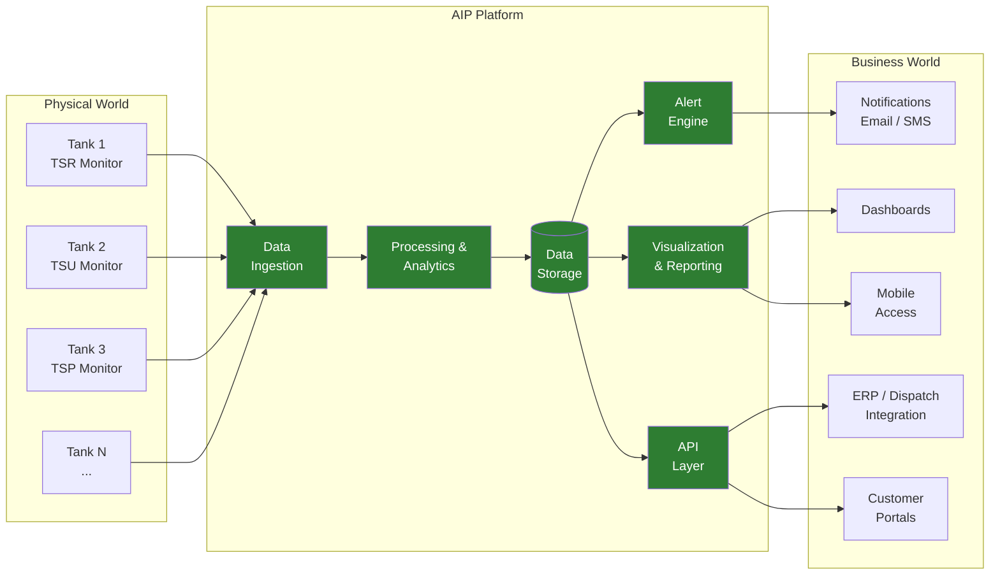
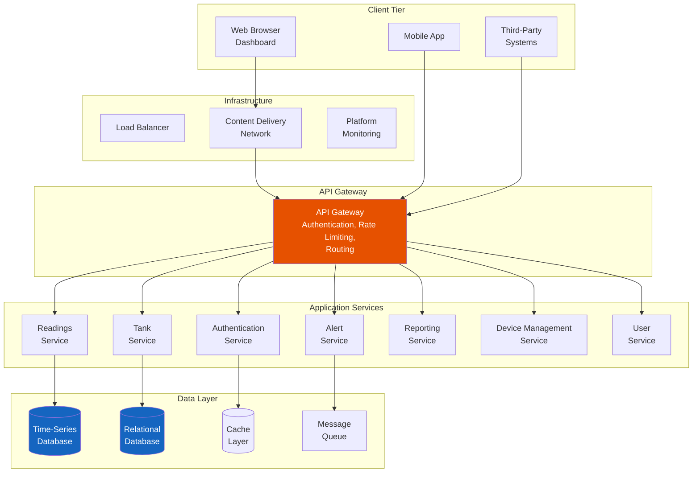
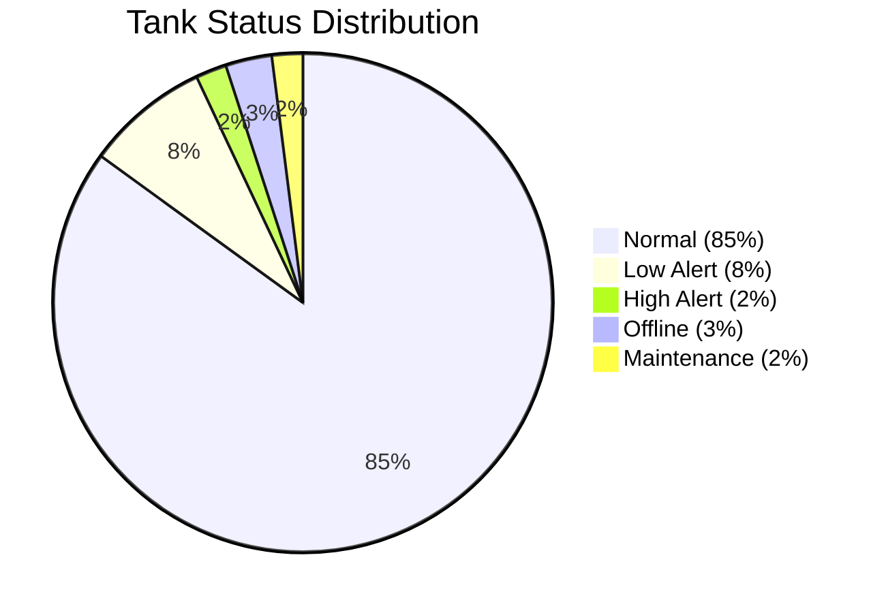
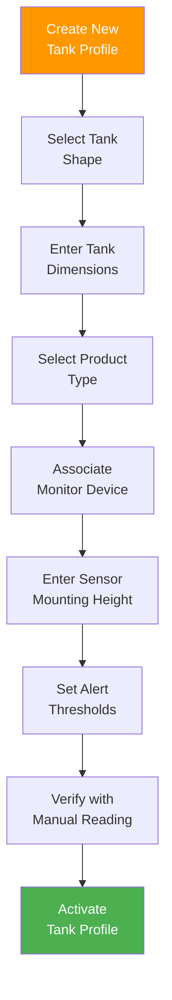
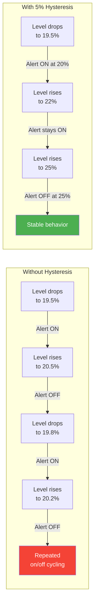
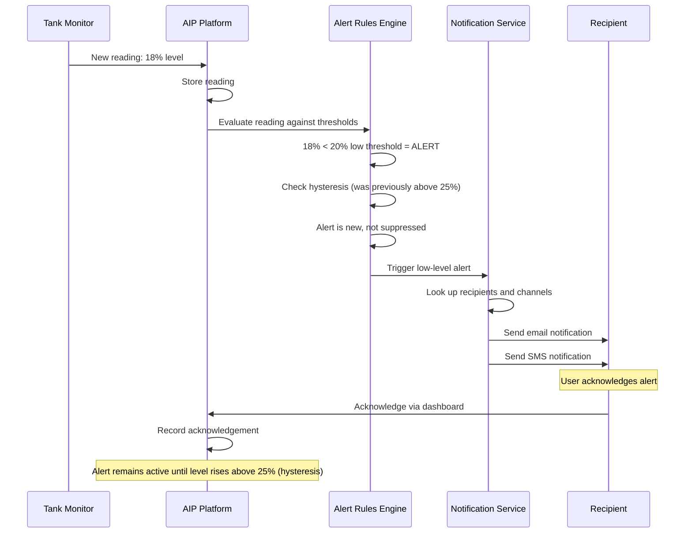
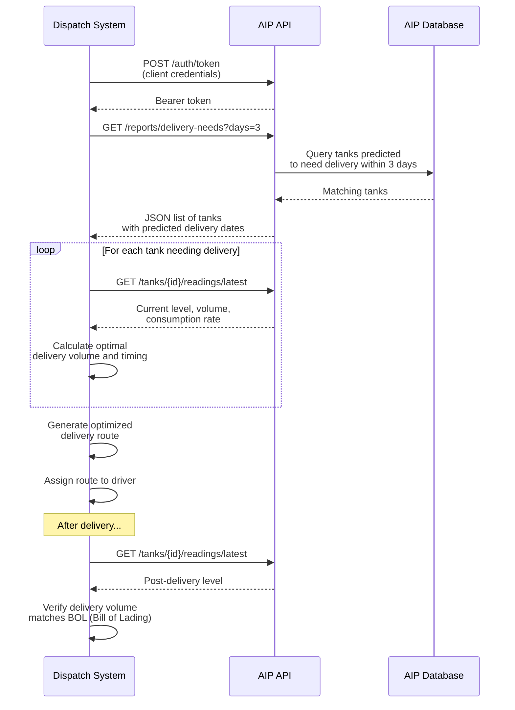
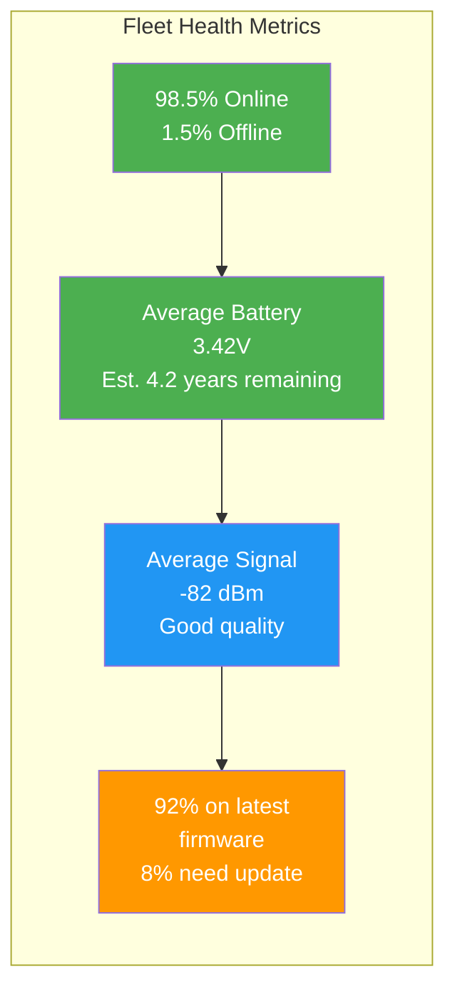
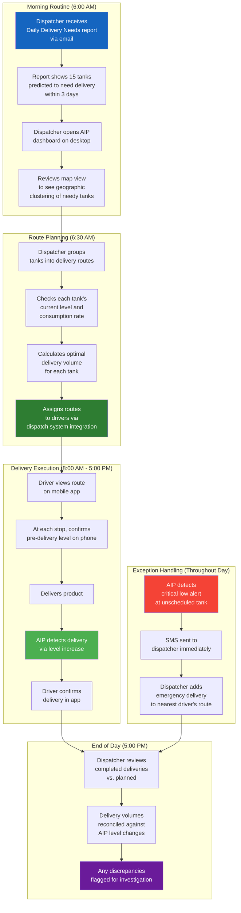

# Chapter 5: The Asset Intelligence Platform

## Learning Objectives

By the end of this chapter, you will be able to:

- Describe the purpose and capabilities of TankScan's AIP cloud platform
- Navigate the AIP dashboard and interpret real-time tank status displays
- Configure tank profiles, alert thresholds, and notification preferences
- Explain how location mapping and geographic views support fleet-level management
- Describe the user management and access control model
- Use historical data, trends, and reports for operational decision-making
- Explain how the AIP API enables integration with third-party business systems

---

## 5.1 Overview of the Asset Intelligence Platform

The **Asset Intelligence Platform (AIP)** is TankScan's cloud-based software platform that transforms raw sensor data into actionable business intelligence. While the wireless monitors (TSR, TSU, TSP, TSD) are the physical components that measure tank levels, the AIP is the digital nerve center where data is received, processed, stored, analyzed, and presented.

### 5.1.1 The Role of the AIP

The AIP serves as the bridge between the physical world of tanks and sensors and the business world of decisions and actions:



### 5.1.2 Core Capabilities

The AIP provides the following core capabilities:

| Capability | Description |
|---|---|
| **Real-time monitoring** | View current tank levels across all monitored tanks |
| **Dashboard visualization** | Interactive charts, gauges, and maps for at-a-glance status |
| **Alert management** | Configurable thresholds with multi-channel notifications |
| **Historical data** | Years of reading history for trend analysis and auditing |
| **Tank profiling** | Configuration of tank geometry for accurate volume calculation |
| **Location management** | Organize tanks by location, region, and customer |
| **User management** | Role-based access controls for different user types |
| **Reporting** | Scheduled and ad-hoc reports for business intelligence |
| **API access** | RESTful APIs for integration with third-party systems |
| **Device management** | Remote monitoring of monitor health, battery, and connectivity |
| **Mobile access** | Responsive web interface and mobile app for on-the-go access |

### 5.1.3 Platform Architecture

The AIP is built on modern cloud infrastructure following microservices architecture principles:



!!! note "Time-Series Database"
    Tank readings are inherently time-series data: each reading has a timestamp, a device identifier, and a set of values (level, volume, temperature, battery voltage). The AIP uses a specialized **time-series database** optimized for ingesting, storing, and querying large volumes of timestamped data. Time-series databases provide efficient compression (readings follow predictable patterns), fast range queries (e.g., "all readings for tank X between January and March"), and built-in downsampling (e.g., aggregate hourly readings into daily averages for long-term storage).

---

## 5.2 Dashboard Design and Real-Time Monitoring

The dashboard is the primary interface through which users interact with the AIP on a daily basis. Effective dashboard design is critical for enabling quick, informed decisions.

### 5.2.1 Dashboard Layout

The AIP dashboard is organized into several key areas:

**Navigation Panel (Left Sidebar)**:

- Home / Overview
- Tank List
- Location Map
- Alerts
- Reports
- Settings
- User Management (admin only)
- API Documentation

**Main Content Area**:

The main area displays content based on the selected navigation item. The default view is the Overview, which shows a summary of all monitored tanks.

**Header Bar**:

- Search functionality (find tanks by name, location, or ID)
- Notification bell (recent alerts)
- User profile and settings

### 5.2.2 Overview Dashboard

The Overview dashboard provides a fleet-level summary at a glance:

**Key Metrics Panel** (top of page):

| Metric | Description | Example |
|---|---|---|
| Total Tanks Monitored | Count of all active monitors | 1,247 |
| Tanks Below Low Threshold | Count in alert state | 23 |
| Tanks Above High Threshold | Count in alert state | 5 |
| Monitors Offline | Devices not reporting | 8 |
| Average Fill Level | Fleet average as percentage | 54% |

**Tank Status Distribution** (visual summary):



**Recent Alerts Panel** (list of most recent alert events with tank name, alert type, time, and current level).

**Quick Actions**:

- View all tanks in alert
- View all offline monitors
- Run standard report
- Navigate to specific tank or location

### 5.2.3 Individual Tank View

Clicking on a specific tank opens the detailed tank view, which includes:

**Current Status Card**:

- Tank name and location
- Current level (inches and percentage)
- Current volume (gallons and percentage)
- Last reading timestamp
- Monitor type and serial number
- Battery voltage and signal strength
- Alert status (normal, low alert, high alert)

**Level History Chart**:

A time-series line chart showing tank level over a configurable period (24 hours, 7 days, 30 days, 90 days, 1 year). The chart typically shows:

- Level readings as data points connected by lines
- High threshold as a red horizontal line
- Low threshold as a yellow/orange horizontal line
- Delivery events as annotations (vertical markers where a significant level increase occurred)
- Consumption trend as a dashed line showing the average rate of decrease

**Tank Information Panel**:

| Field | Description | Example Value |
|---|---|---|
| Tank Name | User-assigned name | "Main Diesel - Bay 3" |
| Location | Physical location name | "Springfield Distribution Center" |
| Product | Material stored in the tank | "Ultra-Low Sulfur Diesel" |
| Tank Shape | Geometry type | "Horizontal Cylinder" |
| Tank Capacity | Total volume | 10,000 gallons |
| Tank Dimensions | Physical dimensions | 8 ft diameter x 24 ft length |
| Monitor Type | Sensor model | TSR (Radar) |
| Serial Number | Unique device ID | TSR-2024-00456 |
| Install Date | When the monitor was installed | 2024-03-15 |
| Low Alert Threshold | Level triggering low alert | 20% (2,000 gallons) |
| High Alert Threshold | Level triggering high alert | 95% (9,500 gallons) |
| Reporting Interval | How often the monitor reports | Every 4 hours |

!!! tip "Interpreting the Level History Chart"
    The level history chart tells a story. A healthy tank pattern shows a **sawtooth** shape: gradual downward slopes (consumption) interrupted by sharp vertical rises (deliveries). Anomalies to watch for:

    - **Sudden drop**: A rapid decrease not associated with known consumption could indicate a leak or theft
    - **Flat line at low level**: The tank has been depleted and not refilled -- potential run-out risk
    - **Level above high threshold**: Possible overfill event
    - **No data points**: Monitor may be offline (check battery and signal strength)
    - **Erratic readings**: Sensor may have an installation issue or interference

---

## 5.3 Configuring Tank Profiles

A **tank profile** is the collection of parameters that tells the AIP how to convert a raw sensor reading (distance from sensor to liquid surface) into meaningful volume information. Accurate tank profiling is essential for correct readings.

### 5.3.1 Tank Geometry Configuration

The AIP supports several standard tank geometries:

| Tank Shape | Required Parameters | Volume Formula |
|---|---|---|
| **Vertical Cylinder** | Diameter, Height | $V = \pi r^2 h$ |
| **Horizontal Cylinder** | Diameter, Length | Non-linear (see Chapter 3) |
| **Horizontal Cylinder with Dished Ends** | Diameter, Straight Length, Dish Type | Non-linear with end cap correction |
| **Rectangular** | Length, Width, Height | $V = l \times w \times h$ |
| **Vertical Cylinder with Cone Bottom** | Diameter, Cylinder Height, Cone Height | Cylinder + cone volume |
| **Custom (Strapping Table)** | Level-to-volume lookup table | Interpolation from table |

### 5.3.2 Configuration Workflow



### 5.3.3 Sensor Offset and Reference Point

The sensor measures the **distance from the sensor face to the liquid surface**. To convert this to a **liquid level** (height of liquid above the tank bottom), the AIP needs the **reference distance** -- the distance from the sensor face to the tank bottom when the tank is empty:

$$\text{Liquid Level} = \text{Reference Distance} - \text{Measured Distance}$$

For example:

- Reference distance (sensor to tank bottom): 96 inches
- Measured distance (sensor to liquid surface): 54 inches
- Liquid level: 96 - 54 = 42 inches

!!! warning "Getting the Reference Distance Right"
    An incorrect reference distance will cause a systematic offset in all readings. If the reference distance is entered as 98 inches instead of the actual 96 inches, every level reading will be 2 inches too high, and every volume calculation will be correspondingly overstated. Always verify the reference distance with a manual measurement during installation.

### 5.3.4 Product Configuration

The tank profile includes the type of product stored, which affects:

- **Specific gravity / density**: Used to calculate weight (tons, pounds) from volume (gallons, liters)
- **Temperature compensation**: Density corrections for temperature variations
- **Dielectric constant**: Affects radar reflection strength (informational, not usually configurable)
- **Viscosity category**: May affect ultrasonic measurement performance

Common product configurations:

| Product | Specific Gravity | Temperature Coefficient | Volume Unit |
|---|---|---|---|
| Diesel fuel (#2) | 0.85 | -0.00045/degree F | Gallons |
| Gasoline | 0.74 | -0.00060/degree F | Gallons |
| Heating oil (#2) | 0.86 | -0.00043/degree F | Gallons |
| Propane (liquid) | 0.50 | -0.00130/degree F | Gallons |
| Lubricating oil | 0.88 | -0.00040/degree F | Gallons |
| DEF | 1.09 | -0.00020/degree F | Gallons |
| Water | 1.00 | -0.00015/degree F | Gallons |

---

## 5.4 Setting Alert Thresholds

Alerts are one of the most valuable features of the AIP. By setting appropriate thresholds, the system can automatically notify the right people when a tank needs attention.

### 5.4.1 Types of Alerts

| Alert Type | Trigger Condition | Typical Use |
|---|---|---|
| **Low Level** | Level drops below a configured threshold | Trigger delivery planning or emergency response |
| **Low-Low Level (Critical)** | Level drops below a second, lower threshold | Emergency: immediate delivery needed |
| **High Level** | Level rises above a configured threshold | Overfill warning during deliveries |
| **High-High Level (Critical)** | Level rises above a second, higher threshold | Emergency: stop delivery immediately |
| **Rapid Drop** | Level decreases faster than expected rate | Possible leak or theft |
| **No Communication** | Monitor has not reported within expected window | Monitor may be offline (battery, signal, damage) |
| **Low Battery** | Battery voltage drops below threshold | Schedule battery replacement |

### 5.4.2 Threshold Configuration

The AIP allows thresholds to be set in multiple units:

- **Percentage of capacity**: e.g., low alert at 20%, high alert at 95%
- **Absolute volume**: e.g., low alert at 500 gallons, high alert at 4,750 gallons
- **Absolute level**: e.g., low alert at 12 inches, high alert at 90 inches

!!! example "Multi-Level Alert Configuration"
    A 5,000-gallon diesel tank at a commercial fleet fueling site is configured with:

    | Alert Level | Threshold | Action |
    |---|---|---|
    | Low | 30% (1,500 gal) | Schedule routine delivery within 3 days |
    | Low-Low (Critical) | 15% (750 gal) | Schedule priority delivery within 24 hours |
    | High | 90% (4,500 gal) | Normal -- acknowledge during filling |
    | High-High (Critical) | 98% (4,900 gal) | Stop delivery immediately -- overfill risk |
    | Rapid Drop | > 5% decrease in 4 hours | Investigate for leak or theft |
    | No Communication | > 24 hours without reading | Check monitor health |

### 5.4.3 Alert Hysteresis

**Hysteresis** prevents alert oscillation (repeatedly triggering and clearing) when the level is hovering near the threshold. With hysteresis, the alert triggers when the level drops below the threshold (e.g., 20%) but does not clear until the level rises above the threshold plus a hysteresis band (e.g., 25%).



---

## 5.5 Automated Notifications

When an alert is triggered, the AIP can automatically notify designated recipients through multiple channels.

### 5.5.1 Notification Channels

| Channel | Description | Best For |
|---|---|---|
| **Email** | Alert details sent to configured email addresses | Non-urgent alerts, record-keeping, wide distribution |
| **SMS (Text Message)** | Short alert message sent to mobile phone numbers | Urgent alerts requiring immediate attention |
| **Push Notification** | Alert via the AIP mobile app | Users who have the mobile app installed |
| **Webhook** | HTTP POST to a configured URL | Integration with third-party systems (dispatch, ticketing) |
| **API Event** | Alert available via the API for programmatic consumption | Automated workflows, custom applications |

### 5.5.2 Notification Configuration

Each alert type can be configured with:

- **Recipients**: Who receives the notification (individual users, groups, or external email addresses)
- **Channels**: Which channels are used (email, SMS, both, etc.)
- **Schedule**: When notifications are active (e.g., SMS only during business hours, email 24/7)
- **Escalation**: If the alert is not acknowledged within a time period, escalate to additional recipients
- **Suppression**: Do not re-notify for the same alert condition within a configurable window (to prevent notification fatigue)

!!! tip "Avoiding Alert Fatigue"
    One of the most common mistakes in alert configuration is setting thresholds too aggressively, resulting in too many alerts. When users receive dozens of alerts per day, they begin ignoring them -- which means they may miss the truly critical ones. Best practices:

    - Start with conservative thresholds (e.g., low alert at 20% rather than 30%)
    - Use two-tier alerting (advisory + critical) so most alerts are informational, not emergencies
    - Regularly review alert frequency and adjust thresholds
    - Use suppression windows to prevent repeated alerts for the same condition
    - Reserve SMS for critical alerts only; use email for advisory alerts

### 5.5.3 Notification Workflow



---

## 5.6 Location Mapping and Geographic Views

### 5.6.1 Geographic Dashboard

The AIP provides a map-based view that displays all monitored tank locations on an interactive map. Each location is represented by a marker whose color and icon indicate the status of the tanks at that location:

| Marker Color | Meaning |
|---|---|
| Green | All tanks at this location are within normal range |
| Yellow/Orange | One or more tanks have a low-level advisory alert |
| Red | One or more tanks have a critical alert (low-low or high-high) |
| Gray | One or more monitors at this location are offline |

### 5.6.2 Location Hierarchy

The AIP organizes tanks in a hierarchical structure:

```mermaid
graph TB
    ORG[Organization<br>"ABC Fuel Distributors"] --> REG1[Region<br>"Northeast"]
    ORG --> REG2[Region<br>"Southeast"]

    REG1 --> LOC1[Location<br>"Springfield Depot"]
    REG1 --> LOC2[Location<br>"Hartford Terminal"]
    REG1 --> LOC3[Location<br>"Boston Fleet Center"]

    REG2 --> LOC4[Location<br>"Atlanta Hub"]
    REG2 --> LOC5[Location<br>"Charlotte Facility"]

    LOC1 --> TANK1[Tank: Main Diesel<br>10,000 gal - 65%]
    LOC1 --> TANK2[Tank: Backup Diesel<br>5,000 gal - 42%]
    LOC1 --> TANK3[Tank: DEF<br>2,500 gal - 78%]

    LOC2 --> TANK4[Tank: Premium Gas<br>15,000 gal - 55%]
    LOC2 --> TANK5[Tank: Regular Gas<br>15,000 gal - 38%]

    style ORG fill:#6A1B9A,color:#fff
    style REG1 fill:#1565C0,color:#fff
    style REG2 fill:#1565C0,color:#fff
    style LOC1 fill:#2E7D32,color:#fff
    style LOC2 fill:#2E7D32,color:#fff
    style LOC3 fill:#2E7D32,color:#fff
    style LOC4 fill:#2E7D32,color:#fff
    style LOC5 fill:#2E7D32,color:#fff
```

This hierarchy enables:

- **Filtering**: View only tanks in a specific region or location
- **Aggregation**: See summary statistics for a region (total volume, average fill, tanks in alert)
- **Access control**: Grant users access to specific regions or locations
- **Reporting**: Generate reports at any level of the hierarchy

### 5.6.3 Geofencing and Proximity Features

Advanced geographic features include:

- **Geofencing**: Define geographic boundaries and receive alerts when tanks within a specific area meet certain criteria
- **Route optimization input**: Export location data and tank status to routing software to plan delivery routes
- **Nearest tank search**: Find the closest tanks of a specific product type to a given location
- **Coverage analysis**: Identify areas with many monitored tanks vs. areas with gaps

---

## 5.7 User Management and Access Controls

The AIP supports multiple users with different roles and permissions, enabling organizations to provide appropriate access to different stakeholders.

### 5.7.1 Role-Based Access Control (RBAC)

| Role | Permissions | Typical User |
|---|---|---|
| **System Administrator** | Full access: user management, system configuration, all data | IT manager, system owner |
| **Account Manager** | Manage tanks, locations, alerts; view all data; run reports | Operations manager |
| **Dispatcher** | View tank levels and alerts; cannot change configuration | Delivery dispatcher |
| **Technician** | View tank details and device diagnostics; limited configuration | Field service technician |
| **Customer Viewer** | View only their own location's tanks; read-only | End customer |
| **API User** | Programmatic access via API; scoped to specific tanks/locations | Integration application |

### 5.7.2 Access Control Matrix

| Feature | Sys Admin | Account Mgr | Dispatcher | Technician | Customer |
|---|---|---|---|---|---|
| View tank levels | Yes | Yes | Yes | Yes | Own only |
| View historical data | Yes | Yes | Yes | Yes | Own only |
| Configure tank profiles | Yes | Yes | No | No | No |
| Set alert thresholds | Yes | Yes | No | No | No |
| Manage users | Yes | No | No | No | No |
| View device diagnostics | Yes | Yes | No | Yes | No |
| Run reports | Yes | Yes | Yes | No | Limited |
| Access API | Yes | Yes | Scoped | No | Scoped |
| Manage integrations | Yes | Yes | No | No | No |

### 5.7.3 Security Features

- **Multi-factor authentication (MFA)**: Optional or required second factor for login
- **Session management**: Automatic session timeout after period of inactivity
- **Password policies**: Configurable minimum complexity, expiration, and history rules
- **Audit logging**: All user actions (login, configuration changes, report generation) are logged with timestamps
- **IP whitelisting**: Restrict access to specific IP address ranges (optional)

!!! warning "Principle of Least Privilege"
    Always assign users the minimum permissions they need to perform their job. A dispatcher who only needs to see tank levels and alerts should not have administrator access that could allow them to change configurations, delete data, or manage other users. This principle limits the impact of compromised credentials and reduces the risk of accidental misconfiguration.

---

## 5.8 Historical Data and Trends

One of the AIP's most powerful capabilities is its ability to store and analyze years of historical tank data. This historical perspective enables pattern recognition, trend analysis, and data-driven decision-making that is impossible with real-time data alone.

### 5.8.1 Data Retention

| Data Type | Retention Period | Storage Strategy |
|---|---|---|
| Raw readings (full resolution) | 2 years | Time-series database, full detail |
| Aggregated readings (hourly averages) | 5 years | Downsampled for efficient storage |
| Aggregated readings (daily averages) | 10+ years | Highly compressed, long-term archive |
| Alert history | 5 years | Relational database with full context |
| Audit logs | 7 years | Compliance-grade, immutable storage |
| Device health history | 3 years | Battery voltage, signal strength trends |

### 5.8.2 Trend Analysis

The AIP provides several trend analysis tools:

**Consumption Rate Calculation**: The AIP calculates the average rate at which product is being consumed from a tank:

$$\text{Consumption Rate} = \frac{\Delta V}{\Delta t} = \frac{V_1 - V_2}{t_2 - t_1}$$

Where $V_1$ and $V_2$ are volume readings at times $t_1$ and $t_2$ (excluding delivery events).

Consumption rates can be calculated over different periods:

| Period | Use Case |
|---|---|
| Daily average | Short-term delivery planning |
| Weekly average | Route scheduling |
| Monthly average | Inventory budgeting |
| Seasonal average | Understanding heating oil demand in winter vs. summer |
| Year-over-year | Long-term demand trends |

**Days to Empty Prediction**: Using the current level and the calculated consumption rate, the AIP predicts when the tank will reach the low threshold or empty:

$$\text{Days to Empty} = \frac{V_{current} - V_{threshold}}{R_{consumption}}$$

Where $R_{consumption}$ is the consumption rate in gallons per day.

!!! example "Days-to-Empty Calculation"
    Tank: 5,000-gallon diesel, currently at 2,800 gallons (56%)

    Consumption rate (based on last 30 days): 120 gallons/day

    Low threshold: 1,000 gallons (20%)

    $$\text{Days to Low Threshold} = \frac{2{,}800 - 1{,}000}{120} = 15.0 \text{ days}$$

    The dispatcher has approximately 15 days to schedule a delivery before the low alert triggers. This proactive information enables optimal delivery scheduling.

**Delivery History Analysis**: The AIP identifies delivery events (significant level increases) and tracks:

- Delivery volume (level change converted to gallons)
- Delivery frequency
- Average time between deliveries
- Delivery timing relative to alert thresholds (was delivery before or after alert?)

### 5.8.3 Anomaly Detection

By establishing baseline consumption patterns, the AIP can detect anomalies:

| Anomaly Type | Detection Method | Possible Cause |
|---|---|---|
| **Sudden large drop** | Level decrease > X% in one reporting interval | Leak, theft, unrecorded withdrawal |
| **Consumption spike** | Daily consumption > 2x the rolling average | Increased usage, leak, meter error |
| **Consumption drop** | Daily consumption < 50% of rolling average | Reduced operations, stuck gauge, sensor issue |
| **Phantom increase** | Level increases without a known delivery | Sensor error, water intrusion, product swap |
| **Chronic low** | Level stays below threshold for > X days | Delivery not arriving, customer issue |

---

## 5.9 Reporting and Data Export

### 5.9.1 Standard Reports

The AIP includes a library of pre-built reports:

| Report Name | Content | Typical Schedule |
|---|---|---|
| **Tank Status Summary** | Current level, volume, and alert status for all tanks | Daily |
| **Low Level Report** | All tanks currently below low threshold | Daily or on-demand |
| **Delivery Needs Report** | Tanks predicted to reach low threshold within X days | Daily |
| **Delivery History Report** | All detected deliveries with volumes and dates | Weekly or monthly |
| **Consumption Analysis** | Average consumption rates by tank, location, or product | Monthly |
| **Device Health Report** | Battery levels, signal strength, offline monitors | Weekly |
| **Alert History Report** | All alerts triggered, acknowledged, and resolved | Monthly |
| **Inventory Report** | Total inventory by product type across all tanks | Daily or weekly |

### 5.9.2 Custom Reports

Users can create custom reports by:

- Selecting data fields (level, volume, temperature, consumption rate, etc.)
- Defining filters (date range, location, product type, alert status)
- Choosing grouping and aggregation (by tank, by location, by region, by product)
- Selecting output format (table, chart, or combined)

### 5.9.3 Data Export

The AIP supports exporting data in multiple formats:

| Format | Use Case |
|---|---|
| **CSV** | Import into spreadsheets, databases, or data analysis tools |
| **PDF** | Formatted reports for distribution, printing, or archiving |
| **Excel (XLSX)** | Spreadsheet analysis with formatting and multiple sheets |
| **JSON** | Programmatic consumption by applications and scripts |

### 5.9.4 Scheduled Report Delivery

Reports can be scheduled for automatic generation and delivery:

- **Frequency**: Daily, weekly, monthly, or custom intervals
- **Recipients**: One or more email addresses
- **Format**: PDF or CSV attachment
- **Filters**: Pre-configured to show relevant data (e.g., "My Region" or "Tanks in Alert")

!!! tip "Report Best Practices"
    - Schedule a daily "Delivery Needs" report for dispatchers so they start each day knowing which tanks need attention
    - Schedule a weekly "Device Health" report for the operations manager to catch battery and connectivity issues early
    - Use the monthly "Consumption Analysis" report to identify trends, seasonal patterns, and potential billing discrepancies
    - Export raw data to CSV periodically for backup and offline analysis

---

## 5.10 Mobile Access

### 5.10.1 Responsive Web Interface

The AIP web interface is built with responsive design, meaning it automatically adapts to different screen sizes. Users can access the full dashboard from a tablet or smartphone browser without a separate app.

### 5.10.2 Mobile App Features

The AIP mobile app provides optimized mobile access with features tailored for on-the-go use:

| Feature | Description |
|---|---|
| **Tank list with status** | Scrollable list of tanks with color-coded status indicators |
| **Quick tank view** | Tap a tank to see current level, recent history, and alerts |
| **Push notifications** | Receive alerts as phone push notifications |
| **Location-based view** | See nearby tanks based on phone GPS |
| **Delivery confirmation** | Drivers can confirm deliveries by scanning a monitor's QR code |
| **Offline caching** | Recent tank data is cached for viewing when cellular is unavailable |
| **Installation assistant** | Step-by-step guide for installing and configuring new monitors |

### 5.10.3 Mobile Use Cases

```mermaid
graph TB
    subgraph "Field Technician"
        FT1[Install new monitor] --> FT2[Scan QR code<br>to register]
        FT2 --> FT3[Configure tank<br>profile on phone]
        FT3 --> FT4[Verify first<br>reading matches<br>manual measurement]
    end

    subgraph "Delivery Driver"
        DD1[View delivery<br>route on phone] --> DD2[Check tank<br>level at each stop]
        DD2 --> DD3[Confirm delivery<br>volume in app]
        DD3 --> DD4[Verify post-delivery<br>level reading]
    end

    subgraph "Manager"
        MG1[Review fleet<br>status on tablet] --> MG2[Drill into<br>alert details]
        MG2 --> MG3[Assign action<br>to team member]
        MG3 --> MG4[Track resolution]
    end

    style FT1 fill:#1565C0,color:#fff
    style DD1 fill:#2E7D32,color:#fff
    style MG1 fill:#6A1B9A,color:#fff
```



---

## 5.11 API Overview for Integration

The AIP provides a comprehensive RESTful API that enables programmatic access to all platform data and functionality. This API is the foundation for integrating tank monitoring data with other business systems.

### 5.11.1 API Architecture

The AIP API follows REST principles:

- **Base URL**: `https://api.tankscan.com/v1/`
- **Authentication**: OAuth 2.0 bearer tokens or API keys
- **Data format**: JSON request and response bodies
- **HTTP methods**: GET (read), POST (create), PUT (update), DELETE (remove)
- **Pagination**: Cursor-based pagination for large result sets
- **Rate limiting**: Configurable per API key to prevent abuse
- **Versioning**: URL-based versioning (`/v1/`, `/v2/`) for backward compatibility

### 5.11.2 Key API Endpoints

| Endpoint | Method | Description |
|---|---|---|
| `/tanks` | GET | List all tanks accessible to the authenticated user |
| `/tanks/{id}` | GET | Get details for a specific tank |
| `/tanks/{id}/readings` | GET | Get historical readings for a tank (with date range filter) |
| `/tanks/{id}/readings/latest` | GET | Get the most recent reading for a tank |
| `/locations` | GET | List all locations |
| `/locations/{id}/tanks` | GET | List all tanks at a specific location |
| `/alerts` | GET | List active and recent alerts |
| `/alerts/{id}/acknowledge` | POST | Acknowledge an alert |
| `/reports/delivery-needs` | GET | Get tanks needing delivery within a specified timeframe |
| `/devices` | GET | List all monitor devices and their health status |
| `/devices/{id}/diagnostics` | GET | Get diagnostic information for a specific device |

### 5.11.3 Example API Workflow

A dispatch system integrating with the AIP might follow this workflow:



### 5.11.4 Webhooks for Real-Time Integration

In addition to polling the API, the AIP supports **webhooks** -- HTTP POST callbacks triggered by events:

| Event | Webhook Payload | Use Case |
|---|---|---|
| New reading received | Tank ID, level, volume, timestamp | Real-time sync to external system |
| Alert triggered | Alert type, tank ID, current level, threshold | Trigger action in dispatch or ticketing system |
| Alert acknowledged | Alert ID, user, timestamp | Update status in external system |
| Device offline | Device ID, last reading time | Trigger maintenance workflow |
| Delivery detected | Tank ID, estimated delivery volume, timestamp | Update delivery records in ERP |

### 5.11.5 Common Integrations

| Integration Target | Data Flow | Value |
|---|---|---|
| **Dispatch / Routing Software** | AIP sends tank levels and delivery predictions to dispatch | Optimized delivery routes based on actual tank needs |
| **ERP / Back Office** | AIP sends inventory data; ERP sends delivery schedules | Automated inventory reconciliation and financial reporting |
| **Customer Portal** | AIP provides tank data via API to customer-facing app | Customers can view their own tank levels and request deliveries |
| **SCADA / Control System** | AIP sends tank data to plant SCADA | Unified view of all monitored assets in existing control system |
| **Business Intelligence (BI)** | AIP exports data to BI platform (Tableau, Power BI, etc.) | Advanced analytics, cross-system reporting, KPI dashboards |

!!! note "API Documentation"
    The AIP provides interactive API documentation using the OpenAPI (Swagger) specification. Developers can explore endpoints, view request/response schemas, and test API calls directly from the documentation interface at `https://api.tankscan.com/docs`. Code examples are provided in Python, JavaScript, C#, and cURL.

---

## 5.12 Device Management

The AIP includes comprehensive device management capabilities for monitoring the health and status of deployed monitors.

### 5.12.1 Device Dashboard

The device management dashboard provides:

| Metric | Description | Alert Condition |
|---|---|---|
| **Last Report Time** | When the monitor last transmitted | More than 2x the reporting interval |
| **Battery Voltage** | Current battery voltage | Below manufacturer threshold |
| **Signal Strength (RSSI)** | Cellular signal strength in dBm | Below -100 dBm |
| **Signal Quality (RSRQ)** | Cellular signal quality | Below -15 dB |
| **Firmware Version** | Current firmware running on the device | Outdated (update available) |
| **Cellular Carrier** | Which carrier the device is connected to | N/A (informational) |
| **Measurement Diagnostics** | Sensor-specific health indicators | Abnormal echo profile, noise level |

### 5.12.2 Remote Configuration

The AIP allows certain monitor settings to be changed remotely without a site visit:

- **Reporting interval**: Increase or decrease the frequency of readings
- **Alert thresholds**: Pushed to the device for edge-based alerting
- **Measurement parameters**: Averaging settings, echo profile configuration
- **Firmware updates**: Over-the-air (OTA) firmware updates

### 5.12.3 Fleet Health Monitoring

For organizations with hundreds or thousands of monitors, the AIP provides fleet-level health analytics:

- **Percentage of fleet online**: Tracks overall fleet connectivity health over time
- **Battery life distribution**: Histogram showing remaining battery life across all devices
- **Signal strength heatmap**: Geographic map overlaid with signal strength data to identify coverage problems
- **Firmware compliance**: Percentage of devices running the latest firmware version
- **Device age distribution**: Helps plan proactive replacement cycles



---

## 5.13 Platform Reliability and Performance

### 5.13.1 Uptime and Availability

The AIP is designed for high availability:

| Metric | Target | How Achieved |
|---|---|---|
| **Platform uptime** | 99.9% (less than 8.8 hours downtime per year) | Redundant infrastructure, auto-scaling, health monitoring |
| **Data ingestion latency** | < 5 seconds from receipt to storage | Optimized ingestion pipeline, message queuing |
| **Dashboard load time** | < 3 seconds for standard views | Content delivery network (CDN), caching, efficient queries |
| **Alert notification latency** | < 60 seconds from reading to notification | Dedicated alert processing pipeline |

### 5.13.2 Data Integrity

- **No data loss guarantee**: All readings are acknowledged; monitors retry if acknowledgment is not received
- **Data validation**: Readings are checked for range validity and consistency before storage
- **Backup and recovery**: Data is backed up continuously with geographic redundancy
- **Audit trail**: All data modifications are logged and traceable

### 5.13.3 Scalability

The AIP platform is designed to scale from tens of tanks to tens of thousands:

| Scale Tier | Tank Count | Infrastructure |
|---|---|---|
| Small | 10-100 | Shared platform |
| Medium | 100-1,000 | Shared platform with dedicated resources |
| Large | 1,000-10,000 | Dedicated cluster |
| Enterprise | 10,000+ | Multi-region deployment with dedicated support |

---

## 5.14 Putting It All Together: AIP Workflow Example

To illustrate how the AIP's various capabilities work together in practice, here is a complete workflow for a fuel distributor managing 500 tanks:



---

## 5.15 Chapter Summary

This chapter has provided a comprehensive tour of TankScan's Asset Intelligence Platform:

1. **The AIP** is the cloud-based platform that transforms raw sensor data into actionable business intelligence, serving as the bridge between physical tanks and business decisions
2. **Dashboard design** provides at-a-glance fleet status through overview displays, individual tank views, and geographic maps
3. **Tank profiles** configure tank geometry, product type, and sensor parameters for accurate volume calculations
4. **Alert thresholds** and **automated notifications** enable proactive management by notifying the right people at the right time through multiple channels
5. **Location mapping** and hierarchical organization support fleet-level management across geographic territories
6. **User management** with role-based access controls ensures appropriate access for different user types
7. **Historical data** and trend analysis enable consumption rate calculation, days-to-empty prediction, and anomaly detection
8. **Reporting** capabilities provide scheduled and ad-hoc business intelligence in multiple formats
9. **Mobile access** enables field technicians, drivers, and managers to interact with the platform from anywhere
10. **API integration** connects the AIP to dispatch systems, ERP platforms, customer portals, and other business applications
11. **Device management** provides remote monitoring and configuration of the deployed monitor fleet

---

## Review Questions

!!! question "Question 1 -- Knowledge Recall"
    List five types of alerts that can be configured in the AIP and describe the trigger condition for each.

    ??? success "Suggested Answer"
        1. **Low Level Alert**: Triggered when the tank level drops below a configured percentage or volume threshold (e.g., below 20% capacity)
        2. **High Level Alert**: Triggered when the tank level rises above a configured threshold (e.g., above 95% capacity), indicating potential overfill during delivery
        3. **Rapid Drop Alert**: Triggered when the level decreases faster than an expected rate (e.g., more than 5% in one reporting interval), possibly indicating a leak or theft
        4. **No Communication Alert**: Triggered when a monitor fails to report within the expected window (e.g., more than 24 hours without a reading), indicating the monitor may be offline
        5. **Low Battery Alert**: Triggered when the monitor's battery voltage drops below a specified threshold, indicating that battery replacement should be scheduled

!!! question "Question 2 -- Comprehension"
    Explain what alert hysteresis is and why it is important in a tank monitoring system. Provide a specific numerical example illustrating the problem that hysteresis solves.

    ??? success "Suggested Answer"
        Alert hysteresis is a mechanism that uses different thresholds for triggering and clearing an alert. An alert triggers when the measured value crosses the alert threshold in one direction but does not clear until the value crosses a second threshold (offset by a hysteresis band) in the opposite direction.

        **Why it is important**: Without hysteresis, if the tank level hovers near the alert threshold, the alert would repeatedly trigger and clear with each minor fluctuation. This creates a flood of notifications ("alert on," "alert off," "alert on," "alert off") that overwhelms users and reduces trust in the alert system.

        **Example**: A low-level alert is set at 20% with 5% hysteresis:

        - At 20.5%: No alert (above threshold)
        - At 19.5%: **Alert triggers** (crossed below 20%)
        - At 20.5%: Alert **remains active** (must reach 25% to clear)
        - At 22%: Alert **remains active**
        - At 25.5%: **Alert clears** (crossed above 25% = 20% + 5% hysteresis)

        Without hysteresis, the alert would have cycled on and off multiple times as the level fluctuated between 19.5% and 20.5%.

!!! question "Question 3 -- Application"
    A fuel distributor has 300 tanks across 150 locations. They want a daily email report showing which tanks need delivery within the next 5 days. Describe how you would configure this report in the AIP, including the data fields, filters, schedule, and recipients.

    ??? success "Suggested Answer"
        **Report configuration**:

        - **Report type**: Delivery Needs Report
        - **Data fields**: Tank name, location name, current level (%), current volume (gallons), consumption rate (gallons/day), predicted days to low threshold, product type, last delivery date
        - **Filter**: Only include tanks where predicted days to low threshold is less than or equal to 5 days
        - **Sort order**: By predicted days to low threshold (ascending -- most urgent first)
        - **Grouping**: Group by region or location for route planning convenience
        - **Schedule**: Daily at 5:00 AM (so dispatchers receive it before starting their shift at 6:00 AM)
        - **Format**: PDF attachment for easy reading, plus CSV attachment for import into routing software
        - **Recipients**: Dispatch team email distribution list (dispatch@company.com), operations manager personal email

        **Additional configuration considerations**:
        - Exclude tanks marked as "inactive" or "seasonal shutdown"
        - Include a summary section at the top showing total tanks needing delivery and total estimated gallons needed
        - Color-code rows: red for tanks predicted to reach low-low (critical) threshold, yellow for tanks predicted to reach low (advisory) threshold

!!! question "Question 4 -- Analysis"
    The AIP API provides both polling (periodic GET requests) and webhooks (event-driven POST callbacks) for integration. Compare these two approaches for a dispatch system that needs to know when a tank reaches its low-level threshold. Analyze latency, resource usage, complexity, and reliability for each approach.

    ??? success "Suggested Answer"
        **Polling Approach**: The dispatch system periodically calls `GET /alerts?type=low_level&status=active`

        | Factor | Polling Analysis |
        |---|---|
        | **Latency** | Depends on polling frequency. If polling every 5 minutes, the alert could be delayed up to 5 minutes from when it was generated. More frequent polling reduces latency but increases load. |
        | **Resource usage** | Wasteful -- most polling requests return no new alerts (no change since last poll). Each request consumes API quota, network bandwidth, and server resources. |
        | **Complexity** | Simple to implement (basic HTTP GET on a timer). Dispatch system controls the timing. |
        | **Reliability** | Very reliable -- if one request fails, the next will succeed. No missed events as long as polling continues. State is always retrievable. |

        **Webhook Approach**: The AIP sends `POST` to `https://dispatch.company.com/webhooks/tankscan` when a low-level alert triggers

        | Factor | Webhook Analysis |
        |---|---|
        | **Latency** | Near real-time -- the webhook fires as soon as the alert is generated (typically within seconds). |
        | **Resource usage** | Efficient -- no unnecessary requests. The AIP only sends a webhook when there is actually an event to report. |
        | **Complexity** | More complex -- the dispatch system must expose an HTTP endpoint, handle authentication (verify the webhook is from TankScan), process the payload, and handle potential failures (webhook delivery failure, duplicate delivery, etc.). |
        | **Reliability** | Less inherently reliable -- if the dispatch system's endpoint is down when the webhook fires, the event could be missed. Mitigation: the AIP should implement retry logic (exponential backoff), and the dispatch system should use polling as a backup to catch any missed webhooks. |

        **Recommendation**: Use webhooks as the primary mechanism for low latency (time-sensitive alerts) and supplement with periodic polling as a safety net to catch any missed events. This "belt and suspenders" approach provides both real-time responsiveness and guaranteed completeness.

!!! question "Question 5 -- Evaluation"
    A customer with 2,000 monitored tanks complains that their dispatchers are overwhelmed with alerts and have started ignoring them. The current configuration sends all alerts (low, high, no-communication, low battery) to all dispatchers via both email and SMS. Evaluate this configuration and propose an improved alert management strategy that reduces alert fatigue while ensuring critical events are not missed.

    ??? success "Suggested Answer"
        **Evaluation of current configuration**:
        The current configuration has several problems:

        1. **No prioritization**: All alert types are treated equally, so routine advisories compete with emergencies for attention
        2. **No audience targeting**: Every dispatcher receives every alert, even for tanks outside their territory
        3. **Dual-channel for everything**: SMS and email for every alert means each event generates two notifications
        4. **No suppression**: If a tank stays below threshold for days (waiting for delivery), it may generate repeated alerts

        **Proposed improved strategy**:

        **Tier 1 -- Critical (SMS + email)**:
        - Low-Low alerts (below 15%): Immediate SMS to the dispatcher responsible for that region, plus email
        - High-High alerts (above 98%): Immediate SMS to the on-site contact and dispatcher
        - Rapid drop alerts (possible leak/theft): Immediate SMS to the operations manager and responsible dispatcher

        **Tier 2 -- Advisory (email only)**:
        - Low alerts (below 30%): Daily summary email to the responsible regional dispatcher only
        - High alerts (above 90%): Email only, grouped in daily summary
        - No-communication: Daily email to the operations manager and field service manager

        **Tier 3 -- Informational (weekly report only)**:
        - Low battery: Included in weekly device health report to the field service manager
        - Firmware outdated: Included in weekly device health report

        **Additional improvements**:
        - Route alerts based on **geographic region** so each dispatcher only sees their territory
        - Set **suppression windows**: Once a low alert is triggered, do not re-notify for the same tank for 48 hours (unless it escalates to low-low)
        - Implement **hysteresis** (5% band) to prevent alert cycling
        - Create a **daily delivery needs report** that proactively identifies upcoming needs, reducing reliance on reactive alerts
        - Review and **tune thresholds** quarterly based on actual alert frequency and response patterns

        This tiered approach ensures that critical events get immediate, targeted attention while routine information is delivered in digested form at appropriate intervals.
