# Chapter 6: Tank Types and Applications

## Learning Objectives

By the end of this chapter, you will be able to:

- Classify tanks by construction type, material, and application
- Calculate tank volumes for common geometries
- Select the appropriate TankScan monitor for each tank type
- Explain the unique monitoring challenges for underground, field, and pressurized tanks
- Design monitoring strategies for tank farm configurations

---

## 6.1 Introduction: Why Tank Type Matters

Not all tanks are created equal. A 30,000-gallon aboveground steel fuel tank at a distribution terminal bears little resemblance to a 275-gallon polyethylene tote holding industrial lubricant in a warehouse, yet both require accurate, reliable level monitoring. The physical characteristics of a tank -- its geometry, material, installation environment, and the product it contains -- directly determine which monitoring technology will work, how it should be installed, and what accuracy can be achieved.

!!! note "The Tank-Monitor Relationship"
    The single most important factor in selecting a wireless tank monitor is understanding the tank itself. A monitor perfectly suited for an open-top aboveground steel tank will fail completely on a pressurized fiberglass underground tank. This chapter provides the foundation for making correct selections.

The TankScan product family addresses this diversity with purpose-built monitors for different tank categories:

| Tank Category | Typical Monitor | Primary Technology |
|---|---|---|
| Aboveground storage tanks (ASTs) | TSR (TankScan Radar) | Radar level measurement |
| Underground storage tanks (USTs) | TSC (TankScan Cellular) | ATG integration / probe-based |
| Totes and IBCs | TSU (TankScan Universal) | Ultrasonic / float gauge |
| Pressurized tanks | TSD (TankScan Dial) | Mechanical gauge reader |
| Field tanks (remote) | TSR with satellite | Radar with extended connectivity |

---

## 6.2 Tank Classification Systems

Tanks can be classified along several independent axes. Understanding these classifications is essential for both regulatory compliance and monitor selection.

### 6.2.1 By Installation Position

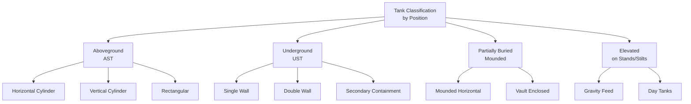

**Aboveground Storage Tanks (ASTs)** are the most common type monitored by TankScan. They are accessible for installation, visible for inspection, and typically have top or side openings suitable for radar-based monitors. ASTs range from 100-gallon day tanks to 100,000+ gallon bulk storage.

**Underground Storage Tanks (USTs)** present unique challenges. Physical access is limited to risers and fill ports. USTs are subject to strict EPA regulations (40 CFR 280) requiring leak detection. Most USTs already have Automatic Tank Gauges (ATGs) installed, so TankScan integrates with existing ATG systems rather than replacing them.

**Partially buried (mounded) tanks** are covered with earth for thermal insulation or blast protection but remain accessible from one end. They combine characteristics of both ASTs and USTs.

**Elevated tanks** use gravity for product dispensing. They require monitors that can withstand vibration from wind loading and provide accurate readings despite the elevation change between the tank and the receiving equipment.

### 6.2.2 By Geometry

Tank geometry determines how liquid level (a linear measurement) translates to volume (a cubic measurement). This relationship is straightforward for vertical cylinders but complex for horizontal cylinders and irregular shapes.

| Geometry | Cross-Section | Level-to-Volume Relationship | Common Use |
|---|---|---|---|
| Vertical cylinder | Circle | Linear (proportional) | Large bulk storage, water tanks |
| Horizontal cylinder | Circle | Non-linear (requires strapping table) | Fuel storage, transport |
| Rectangular | Rectangle | Linear (proportional) | Chemical tanks, IBCs |
| Spherical | Circle (varying) | Non-linear (cubic function) | Pressurized gas storage |
| Vertical cylinder with cone bottom | Circle + cone | Piecewise linear | Chemical processing |
| Horizontal capsule (rounded ends) | Complex | Non-linear (requires calculation) | Propane, LPG |

### 6.2.3 By Material

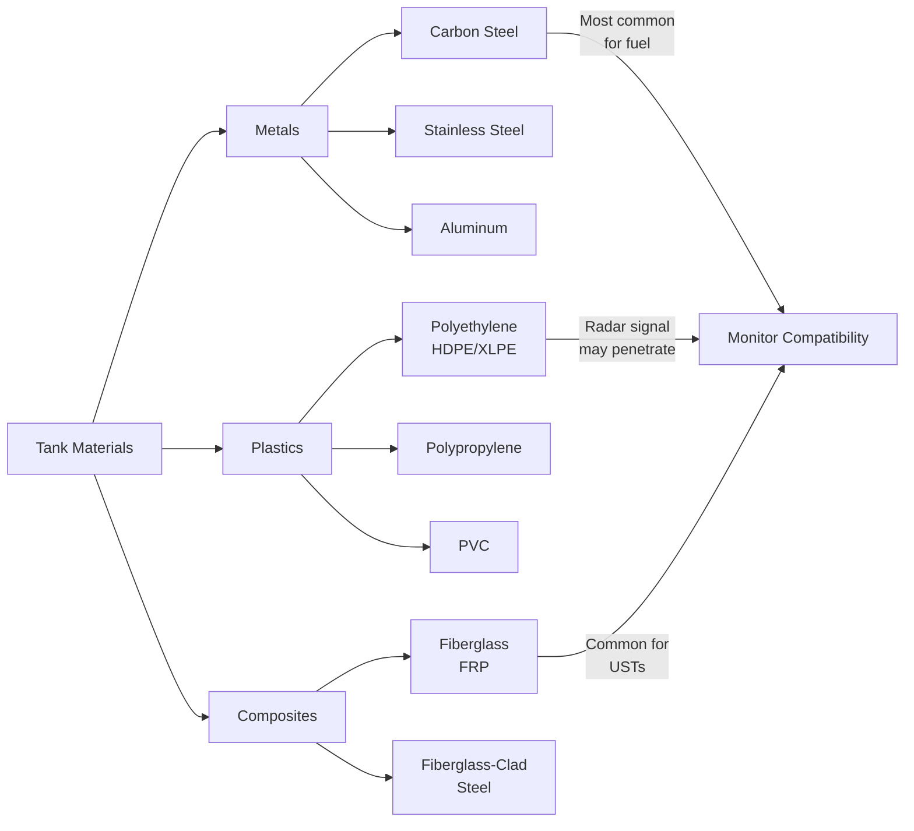

**Carbon steel** is the most common tank material for fuel and petroleum products. Steel tanks are durable, weldable, and provide excellent radar signal reflection from the liquid surface. Steel does not interfere with radar signals -- the metal walls act as a waveguide, containing the signal within the tank.

!!! warning "Radar and Non-Metallic Tanks"
    Radar signals can penetrate non-metallic tank walls (fiberglass, polyethylene). In non-metallic tanks, the radar beam may partially escape through the walls, causing signal loss and false echoes. Special installation techniques -- such as using a metallic still pipe or installing the sensor inside a metallic riser -- may be required.

**Fiberglass Reinforced Plastic (FRP)** is widely used for underground storage tanks and chemical storage where corrosion resistance is critical. FRP tanks are transparent to radar, requiring careful monitor selection and installation planning.

**Polyethylene (HDPE and cross-linked XLPE)** is standard for totes, IBCs, and small chemical tanks. These lightweight tanks are often moved, stacked, and replaced, making wireless monitoring with the TSU an ideal fit.

### 6.2.4 By Pressure Rating

| Classification | Pressure Range | Examples | Monitor Approach |
|---|---|---|---|
| Atmospheric | 0 - 0.5 psig | Open-top and vented tanks | Direct top-mount radar |
| Low pressure | 0.5 - 15 psig | Sealed tanks with vent valves | Sealed sensor housing |
| Medium pressure | 15 - 100 psig | Propane, LPG tanks | TSD dial gauge reader |
| High pressure | 100+ psig | Industrial gas cylinders | TSD or specialized transducers |

---

## 6.3 Tank Geometry and Volume Calculation

### 6.3.1 Vertical Cylinders

Vertical cylinders offer the simplest level-to-volume relationship. Volume is directly proportional to height.

$$V = \pi r^2 h$$

Where:

- $V$ = volume
- $r$ = tank radius
- $h$ = liquid height (measured by the sensor)

The **fill percentage** is simply:

$$\text{Fill \%} = \frac{h}{H} \times 100$$

Where $H$ is the total tank height.

!!! example "Vertical Tank Calculation"
    A vertical cylindrical tank has a diameter of 8 feet and a total height of 12 feet. The TankScan radar reports a liquid level of 7.5 feet.

    - Radius: $r = 4 \text{ ft}$
    - Volume at current level: $V = \pi \times 4^2 \times 7.5 = 376.99 \text{ ft}^3$
    - Converting to gallons: $376.99 \times 7.481 = 2,820 \text{ gallons}$
    - Fill percentage: $\frac{7.5}{12} \times 100 = 62.5\%$

### 6.3.2 Horizontal Cylinders

Horizontal cylinders are the most common tank geometry for petroleum storage, yet they present a significant mathematical challenge. The cross-sectional area of liquid changes non-linearly with height.

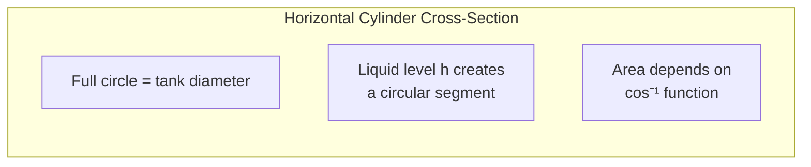

For a horizontal cylinder of length $L$ and radius $r$, the volume at liquid height $h$ is:

$$V(h) = L \left[ r^2 \cos^{-1}\left(\frac{r - h}{r}\right) - (r - h)\sqrt{2rh - h^2} \right]$$

This equation has no simple closed-form inverse, which is why TankScan's AIP platform uses **strapping tables** -- pre-calculated lookup tables that map level readings to volumes for specific tank dimensions.

!!! tip "Strapping Tables in AIP"
    When configuring a horizontal tank in the AIP platform, you enter the tank's diameter and length. The system automatically generates a strapping table with volume calculations at each measurement increment. For unusual tank shapes (such as horizontal tanks with dished or hemispherical heads), custom strapping tables can be uploaded.

### 6.3.3 Horizontal Cylinder with Dished Heads

Most real-world horizontal tanks have dished (elliptical or hemispherical) ends rather than flat ends. These heads add volume that must be accounted for.

For **2:1 elliptical heads** (the most common), each head adds approximately:

$$V_{\text{head}} = \frac{2}{3} \pi r^2 \times \frac{r}{2} = \frac{\pi r^3}{3}$$

The total volume of a horizontal tank with two dished heads is:

$$V_{\text{total}}(h) = V_{\text{cylinder}}(h) + 2 \times V_{\text{head}}(h)$$

Where the head volume at height $h$ must also be calculated using integration of the elliptical cross-section -- another reason strapping tables are essential.

### 6.3.4 Rectangular Tanks and IBCs

Rectangular tanks (including IBCs) have the simplest calculation:

$$V = L \times W \times h$$

Where $L$ is length, $W$ is width, and $h$ is liquid height. Volume is directly proportional to level, making monitoring straightforward.

Standard IBC dimensions:

| IBC Size | Length | Width | Height | Capacity |
|---|---|---|---|---|
| 275 gallon | 45" | 40" | 46" | 275 gal (1,041 L) |
| 330 gallon | 48" | 40" | 46" | 330 gal (1,249 L) |
| 550 gallon | 48" | 40" | 54" | 550 gal (2,082 L) |

### 6.3.5 Spherical Tanks

Spherical tanks are used for pressurized gases (propane, butane, LPG). Volume at height $h$ in a sphere of radius $r$:

$$V(h) = \pi h^2 \left(r - \frac{h}{3}\right)$$

These tanks are typically monitored with the TSD dial gauge reader rather than direct level measurement, since they are pressurized and sealed.

---

## 6.4 Aboveground Storage Tanks (ASTs)

### 6.4.1 Characteristics and Configurations

ASTs are the primary target market for TankScan wireless monitoring. They are found at fuel distribution terminals, convenience stores (day tanks), farms, construction sites, fleet fueling locations, and industrial facilities.

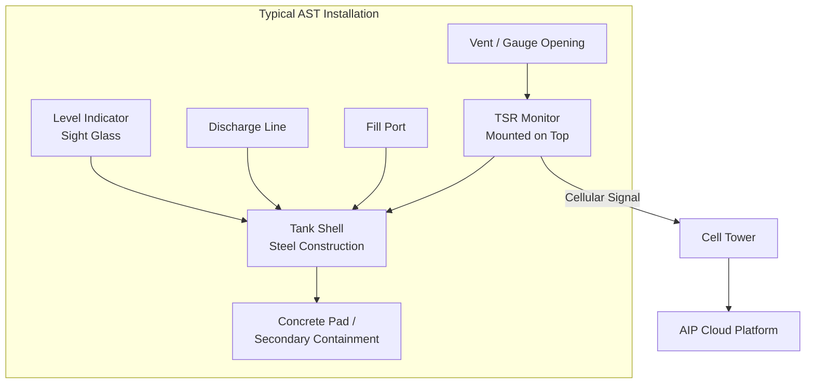

Common AST configurations:

| Configuration | Volume Range | Typical Product | Monitoring Approach |
|---|---|---|---|
| Single horizontal cylinder | 500 - 25,000 gal | Diesel, gasoline, heating oil | TSR top-mount radar |
| Vertical cylinder (welded) | 1,000 - 100,000 gal | Bulk fuel, chemicals | TSR top-mount radar |
| Vertical cylinder (bolted) | 5,000 - 500,000 gal | Water, crude oil | TSR with extended range |
| Farm tank (horizontal) | 250 - 2,000 gal | Diesel, gasoline | TSR compact |
| Day tank (vertical) | 50 - 500 gal | Generator fuel | TSR or TSU |

### 6.4.2 Monitoring with TSR

The **TSR (TankScan Radar)** is the flagship product for aboveground tank monitoring. It combines a radar level sensor with integrated cellular communication in a single, battery-powered unit.

**Key TSR specifications:**

| Parameter | Value |
|---|---|
| Measurement technology | Pulse radar (time-of-flight) |
| Measurement range | 0.3 m to 20 m (1 ft to 65 ft) |
| Accuracy | +/- 3 mm (0.12 in) |
| Resolution | 1 mm (0.04 in) |
| Beam angle | 8 degrees (typical) |
| Operating temperature | -40F to +185F (-40C to +85C) |
| Power source | Lithium battery (5+ year life) |
| Communication | Cellular (LTE Cat-M1 / NB-IoT) |
| Reporting interval | Configurable (1x to 24x per day) |
| Housing | NEMA 4X, UV-resistant |
| Hazardous area rating | Class I, Div 1 (intrinsically safe) |

!!! note "Intrinsic Safety"
    The TSR is rated for Class I, Division 1 hazardous locations, meaning it can be installed directly on tanks containing flammable liquids and vapors. The device's electrical energy is limited to levels below what could ignite the surrounding atmosphere. This is discussed in detail in Chapter 11.

**TSR Installation on ASTs:**

1. Identify a suitable opening on the tank top (typically a 2" NPT bung)
2. Ensure the opening is not directly above fill pipes, mixers, or other obstructions
3. Thread the TSR into the opening using the integrated mounting adapter
4. Activate the cellular connection via the AIP platform
5. Configure tank dimensions and product type in AIP

### 6.4.3 AST-Specific Challenges

| Challenge | Cause | Solution |
|---|---|---|
| Condensation on sensor | Temperature cycling | TSR includes hydrophobic lens coating |
| Foam on liquid surface | Turbulence during filling | Configure foam rejection algorithm in AIP |
| Multiple product layers | Water bottom under fuel | Configure water-cut monitoring if supported |
| Tank deformation | Age, settling, corrosion | Recalibrate strapping table periodically |
| Extreme temperatures | Summer heat / winter cold | TSR rated -40F to +185F covers most environments |
| Vapor interference | Dense hydrocarbon vapors | Radar compensates; velocity correction in AIP |

---

## 6.5 Underground Storage Tanks (USTs)

### 6.5.1 UST Characteristics

Underground storage tanks are buried beneath the surface, typically at gas stations, convenience stores, and commercial fueling facilities. In the United States, there are approximately 553,000 active USTs regulated under EPA 40 CFR Part 280.

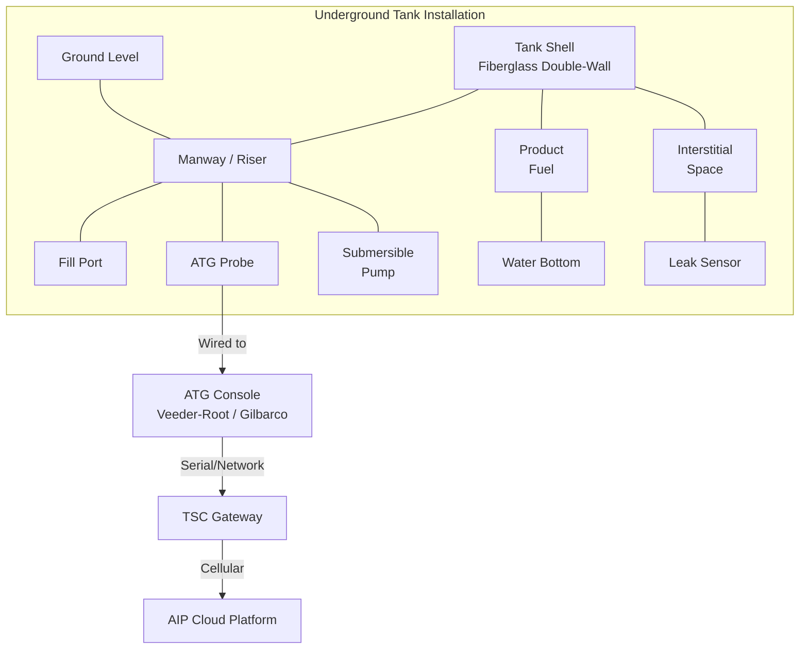

USTs differ from ASTs in several critical ways:

| Factor | AST | UST |
|---|---|---|
| Physical access | Easy (walk up to tank) | Limited (through risers/manholes) |
| Visual inspection | Possible | Not possible |
| Environmental risk | Visible leaks | Hidden leaks (soil/groundwater) |
| Regulatory burden | Moderate (SPCC) | High (EPA 40 CFR 280) |
| Existing instrumentation | Often none | Usually has ATG system |
| Typical material | Steel | Fiberglass (FRP) |
| Thermal stability | Exposed to ambient | Stable (ground temperature) |
| Typical products | Fuel, chemicals | Retail fuels (gasoline, diesel) |

### 6.5.2 ATG Integration with TSC

Because most USTs already have Automatic Tank Gauges (ATGs), TankScan's approach to underground monitoring is integration rather than replacement. The **TSC (TankScan Cellular)** gateway connects to existing ATG systems and transmits their data to the AIP cloud.

**Supported ATG Systems:**

| Manufacturer | Model | Protocol | Connection |
|---|---|---|---|
| Veeder-Root | TLS-350 / TLS-450 | Veeder-Root serial | RS-232 |
| Veeder-Root | TLS-4 | TCP/IP, serial | Ethernet, RS-232 |
| Gilbarco | EMC / EMC+ | Gilbarco serial | RS-232 |
| Franklin Fueling | EVO 200 / 550 | Modbus RTU | RS-485 |
| OPW | SiteSentinel | Modbus TCP | Ethernet |
| Petro Vend | Various | Proprietary | RS-232 |

The TSC periodically polls the ATG console for inventory data, translates it into the standard TankScan data format, and transmits it to AIP. This provides:

- **Unified dashboard**: UST data appears alongside AST data in the same AIP interface
- **Alert consistency**: The same alert rules (low level, high level, consumption anomaly) apply to all tanks
- **Historical trending**: UST data is stored with the same granularity as AST data
- **Multi-site visibility**: Operators managing both ASTs and USTs see everything in one platform

!!! tip "TSC Installation Advantage"
    The TSC does not require any modification to the UST itself. It connects to the existing ATG console's communication port. Installation typically takes less than 30 minutes and requires no tank entry, no hot work, and no disruption to fueling operations.

### 6.5.3 UST Data Points

Through ATG integration, the TSC can report:

- **Product level** (inches or centimeters)
- **Product volume** (gallons or liters, calculated by the ATG's strapping table)
- **Water level** (detected by the ATG probe's water float)
- **Temperature** (from the ATG probe's thermistor array)
- **Volume-corrected inventory** (temperature-compensated, net standard volume)
- **Delivery detection** (automatic identification of fuel deliveries)
- **Leak test results** (if the ATG performs statistical leak detection)

### 6.5.4 UST-Specific Challenges

| Challenge | Description | Mitigation |
|---|---|---|
| Communication path | Cellular signal must reach below-grade enclosure | TSC can use external antenna above grade |
| Power availability | Some sites lack power at the ATG console area | TSC available with solar power option |
| ATG protocol diversity | Many different ATG manufacturers and models | TSC firmware supports all major protocols |
| Data freshness | ATG may only update inventory every few minutes | TSC polls at configurable intervals |
| Water intrusion | Manhole areas prone to flooding | TSC housing rated NEMA 4X / IP66 |
| Multi-product tanks | Single tank with compartments for different fuels | Each compartment configured separately in AIP |

---

## 6.6 Field Tanks and Remote Locations

### 6.6.1 The Remote Monitoring Challenge

Field tanks are found in oil and gas production, agriculture, mining, and remote industrial sites. They operate in locations where:

- Cellular coverage may be limited or non-existent
- Power grid access is unavailable
- Ambient temperatures range from -40F to +130F
- Wind, rain, dust, and UV exposure are extreme
- Site visits are infrequent (weekly, monthly, or less)
- Access roads may be unpaved or seasonal

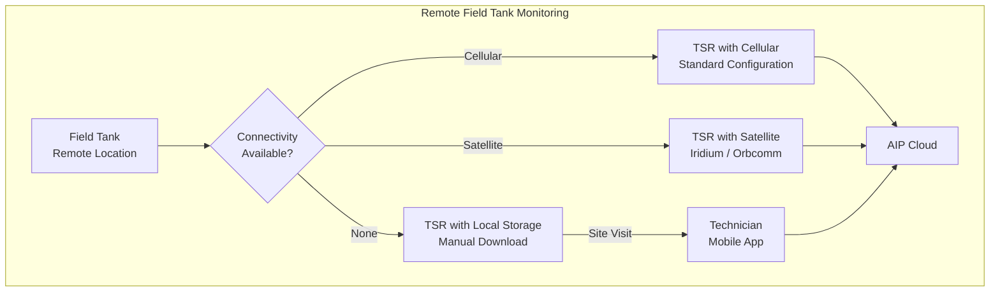

### 6.6.2 Oil and Gas Field Tanks

In oil and gas production, field tanks serve several purposes:

| Tank Type | Purpose | Typical Size | Monitoring Priority |
|---|---|---|---|
| Production tank | Collects crude oil from wells | 200 - 1,000 bbl | High (revenue, theft prevention) |
| Water tank | Collects produced water | 200 - 500 bbl | Medium (disposal scheduling) |
| Condensate tank | Collects natural gas liquids | 100 - 500 bbl | High (volatile product, value) |
| Chemical tank | Stores treatment chemicals | 50 - 200 gal | Medium (run-out prevention) |
| Fuel tank | Powers on-site generators | 100 - 500 gal | High (prevents production shutdown) |

!!! warning "Hazardous Environments in Oil Fields"
    Oil field tanks often contain volatile hydrocarbons with low flash points. The area around tank openings is typically classified as Class I, Division 1 or Division 2. Only intrinsically safe monitors (like the TSR with IS certification) may be installed in these zones. Using non-certified equipment risks explosion.

### 6.6.3 Agricultural Field Tanks

Farms and ranches use field tanks for:

- **Diesel fuel** for tractors, combines, and other equipment
- **Gasoline** for smaller equipment and vehicles
- **Fertilizer solutions** (liquid nitrogen, UAN) in large poly tanks
- **Herbicide/pesticide concentrates** in smaller chemical tanks
- **Water** for irrigation and livestock

Agricultural tanks are often spread across large properties. A single farming operation may have tanks at multiple locations miles apart. TankScan monitoring enables centralized visibility and timely reordering.

### 6.6.4 Satellite Connectivity for Remote Sites

When cellular coverage is unavailable, TankScan offers satellite communication options:

| Satellite Network | Coverage | Latency | Data Cost | Best For |
|---|---|---|---|---|
| Iridium (LEO) | Global | 1-5 seconds | High | Remote oil fields, international |
| Orbcomm (LEO) | Near-global | Minutes | Moderate | Asset tracking, brief messages |
| Cellular backup | Varies | Milliseconds | Low | Areas with intermittent coverage |

!!! note "Satellite Data Economy"
    Satellite communication is significantly more expensive than cellular. To manage costs, satellite-connected TSR units typically report less frequently (1-4 times per day versus up to 24 times for cellular) and transmit minimal data payloads. The AIP platform interpolates between readings to provide continuous-looking trend data.

### 6.6.5 Extreme Environment Considerations

| Environmental Factor | Impact | Design Feature |
|---|---|---|
| Extreme cold (-40F) | Battery capacity reduction | Lithium chemistry maintains capacity; extended battery option |
| Extreme heat (+140F) | Electronics thermal stress | Passive cooling design; thermal management in housing |
| High winds (100+ mph) | Physical stress on mounting | Low-profile design; reinforced mounting brackets |
| Lightning | Surge damage | Transient voltage suppression; grounding provisions |
| Sand/dust storms | Abrasion, ingress | IP66/IP67 sealed housing; no external moving parts |
| UV exposure | Plastic degradation | UV-stabilized housing material; 10+ year outdoor rating |
| Corrosive atmosphere (H2S) | Metal and gasket corrosion | Stainless steel hardware; fluorocarbon seals |
| Vibration (wellhead sites) | Measurement noise | Signal averaging algorithm; vibration filtering |

---

## 6.7 Totes and IBCs

### 6.7.1 Tote and IBC Overview

Intermediate Bulk Containers (IBCs) and totes are portable tanks typically ranging from 110 to 550 gallons. They are ubiquitous in manufacturing, chemical distribution, food processing, and lubricant handling.

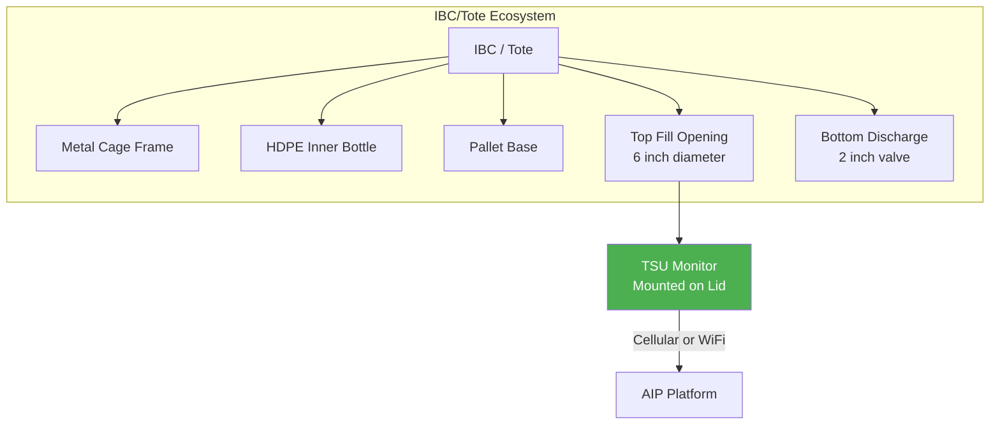

**Key characteristics of IBCs:**

- **Portable**: Moved by forklift, designed for shipping and stacking
- **Standardized**: ISO-standard dimensions allow universal handling
- **Disposable or reusable**: Some are single-use; others are cleaned and refilled
- **Numerous**: A single facility may have dozens or hundreds of IBCs
- **Mixed products**: Different IBCs at the same location may hold different products

### 6.7.2 Monitoring with TSU

The **TSU (TankScan Universal)** is designed specifically for totes and IBCs. It addresses the unique challenges of monitoring portable, numerous, small containers.

| Feature | TSU Specification |
|---|---|
| Measurement technology | Ultrasonic (non-contact) |
| Mounting | Snap-on or magnetic mount to IBC lid |
| Power | Replaceable lithium battery (3+ year life) |
| Communication | Cellular (LTE-M) or Wi-Fi |
| Size | Compact (fits standard IBC opening) |
| Weight | < 1 lb (does not affect IBC handling) |
| Water/dust rating | IP65 |
| Container identification | QR code / NFC tag integration |

**TSU Workflow:**

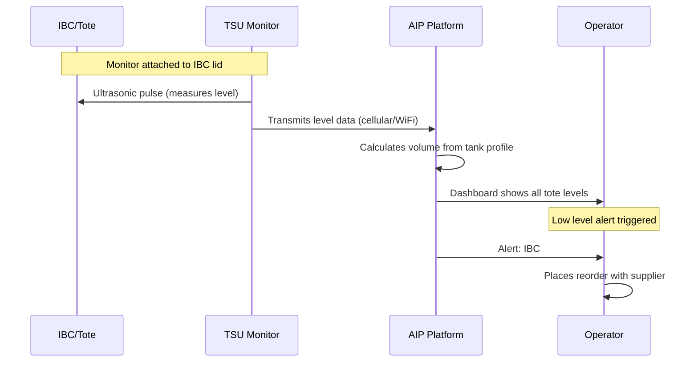

### 6.7.3 Challenges Specific to Totes and IBCs

| Challenge | Description | TSU Solution |
|---|---|---|
| Portability | IBCs are moved frequently | Monitor stays attached; reports location changes |
| Large quantities | Hundreds of IBCs to track | Batch configuration in AIP; QR code scanning |
| Product variety | Different products in different IBCs | Each TSU linked to product profile in AIP |
| Stacking | IBCs stacked 2-3 high | Low-profile design; no protruding antenna |
| Refilling | IBCs emptied and refilled on-site | Auto-detects delivery events; resets tracking |
| Cleaning | IBCs may be washed between uses | TSU easily removed and reattached |
| Cost sensitivity | Per-unit monitoring cost must be low | TSU designed as lower-cost monitor option |

### 6.7.4 Lubricant Distribution Use Case

Lubricant distributors are among the heaviest users of tote monitoring. A typical distributor manages:

- 50-200 customer locations
- 2-10 totes per location (different viscosities, products)
- Monthly or bi-monthly delivery cycles
- Products ranging from motor oil to hydraulic fluid to cutting oil

Without monitoring, distributors rely on customers calling when they need product -- often too late, causing equipment downtime, or too early, resulting in partial deliveries and inefficient routing. TSU monitoring enables just-in-time delivery based on actual consumption.

---

## 6.8 Pressurized Tanks

### 6.8.1 Pressurized Tank Challenges

Pressurized tanks (propane, LPG, ammonia, compressed gases) present unique monitoring challenges:

- **Sealed vessels**: No opening available for top-mount sensors
- **Internal pressure**: Standard sensors cannot withstand the pressure environment
- **Pressure-temperature relationship**: Liquid volume changes with temperature due to expansion
- **Regulatory restrictions**: Pressure vessel codes (ASME) limit modifications
- **Safety concerns**: Any penetration of a pressure vessel creates a potential failure point

!!! warning "Never Modify a Pressure Vessel"
    Drilling, welding, or otherwise modifying a pressurized tank to install a monitor violates ASME pressure vessel codes and creates a serious safety hazard. TankScan's approach for pressurized tanks uses non-invasive external monitoring.

### 6.8.2 The TSD Dial Gauge Reader

The **TSD (TankScan Dial)** takes a fundamentally different approach to monitoring. Instead of measuring liquid level directly, it reads the existing mechanical gauge on the pressurized tank.

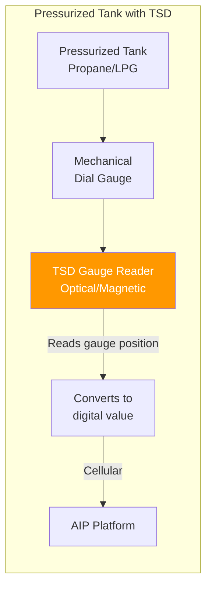

**How the TSD works:**

1. The existing mechanical gauge on the tank (typically a Rochester, Marshall Excelsior, or similar float gauge) displays fill percentage on a dial
2. The TSD attaches over the gauge face using a clamp or magnetic mount
3. An internal sensor reads the position of the gauge needle
4. The TSD converts the needle position to a digital fill percentage
5. This data is transmitted to AIP via cellular communication

| TSD Parameter | Specification |
|---|---|
| Gauge compatibility | Most standard float gauges (Rochester, ME) |
| Reading accuracy | +/- 2% of gauge reading |
| Mounting method | Clamp-on or magnetic (no tank modification) |
| Power | Lithium battery (3+ year life) |
| Communication | Cellular (LTE-M) |
| Operating temperature | -40F to +140F |
| Hazardous area rating | Class I, Div 1 (for LPG/propane installations) |
| Weatherproofing | NEMA 4X, UV-resistant |

### 6.8.3 Propane Monitoring Applications

Propane is one of the most common pressurized tank applications:

| Application | Tank Size | Delivery Method | Monitoring Value |
|---|---|---|---|
| Residential heating | 120 - 1,000 gal | Bobtail truck | Prevents run-out in winter |
| Commercial HVAC | 500 - 2,000 gal | Bobtail or transport | Ensures business continuity |
| Agricultural drying | 1,000 - 30,000 gal | Transport truck | Critical during harvest season |
| Forklift fuel | 33 - 100 lb cylinders | Cylinder exchange | Tracks consumption rates |
| Industrial process | 1,000 - 30,000 gal | Transport truck | Prevents production shutdown |
| Autogas stations | 1,000 - 10,000 gal | Transport truck | Retail availability |

!!! example "Propane Delivery Optimization"
    A propane distributor serving 3,000 residential customers previously used degree-day calculations and fixed delivery schedules. After deploying TSD monitors on all customer tanks:

    - **Run-outs decreased** from 45 per winter season to 3
    - **Delivery efficiency** improved by 28% (fewer partial loads)
    - **Customer satisfaction** scores increased by 35 points
    - **Emergency deliveries** dropped by 90% (saving $150-200 per emergency call)

### 6.8.4 Temperature Compensation for Pressurized Liquids

Liquefied gases like propane expand significantly with temperature. A tank that reads 80% full at 60F may read 85% at 80F, even though no product was added.

The volume correction formula:

$$V_{\text{corrected}} = V_{\text{observed}} \times \left[1 + \beta (T_{\text{ref}} - T_{\text{actual}})\right]$$

Where:

- $\beta$ = coefficient of thermal expansion (for propane: approximately 0.00099 per degree F)
- $T_{\text{ref}}$ = reference temperature (typically 60F)
- $T_{\text{actual}}$ = actual product temperature

The AIP platform applies temperature compensation when temperature data is available, providing normalized volume readings that reflect actual product quantity rather than temperature-influenced gauge readings.

---

## 6.9 Specialty Tanks and Configurations

### 6.9.1 Double-Wall Tanks

Double-wall tanks have an outer shell surrounding the inner (primary) tank, with an interstitial space between them for leak detection. Monitoring considerations:

- **Primary tank level**: Monitored normally with TSR or appropriate sensor
- **Interstitial space**: May require a separate leak detection sensor
- **Access limitations**: The outer wall may limit access to sensor mounting points

### 6.9.2 Cone-Bottom Tanks

Cone-bottom vertical tanks are common in chemical processing. The cone section requires a modified volume calculation:

$$V_{\text{cone}}(h) = \frac{1}{3}\pi r_h^2 h_{\text{cone}}$$

Where $r_h$ is the radius at height $h$ within the cone section. The AIP platform supports cone-bottom tank profiles with configurable cone height and angle.

### 6.9.3 Bunded/Diked Tanks

Tanks within secondary containment (bunds or dikes) may have the containment area monitored in addition to the primary tank:

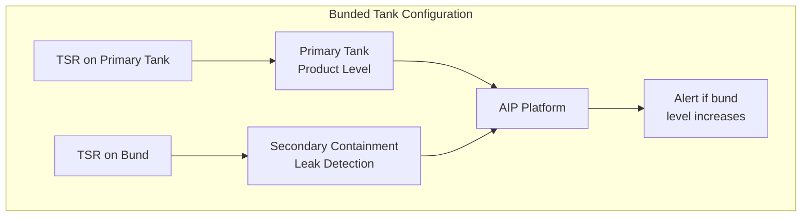

### 6.9.4 Multi-Compartment Tanks

Some tanks, particularly transport tanks and large storage vessels, contain multiple compartments for different products. Each compartment requires its own sensor and is configured as a separate asset in AIP.

| Compartment Configuration | Sensor Requirement | AIP Configuration |
|---|---|---|
| 2-compartment (50/50) | 2 x TSR | 2 separate tank assets, linked |
| 3-compartment (33/33/33) | 3 x TSR | 3 separate tank assets, linked |
| 4-compartment (25/25/25/25) | 4 x TSR | 4 separate tank assets, linked |
| Irregular split | 1 TSR per compartment | Custom strapping per compartment |

---

## 6.10 Tank Farm Configurations

### 6.10.1 What Is a Tank Farm?

A tank farm is a collection of tanks at a single location, typically at fuel terminals, refineries, chemical plants, or distribution hubs. Tank farms present unique monitoring challenges due to the number of tanks, the variety of products, and the complexity of operations.

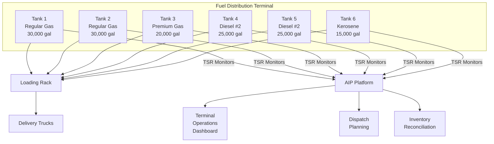

### 6.10.2 Tank Farm Monitoring Strategy

| Factor | Consideration |
|---|---|
| Number of tanks | May range from 5 to 500+; batch configuration in AIP essential |
| Product diversity | Each product needs its own profile (density, dielectric constant) |
| Manifold connections | Tanks may be interconnected; product can be transferred between them |
| Custody transfer | Accurate measurement needed for financial transactions |
| Throughput volume | High-turnover tanks may need more frequent readings |
| Regulatory compliance | Tank farms often fall under EPA SPCC rules |
| Safety zones | Multiple hazardous areas; all equipment must be rated accordingly |

### 6.10.3 Connectivity in Tank Farms

Large tank farms may have dozens or hundreds of monitors in close proximity. Connectivity options:

**Cellular (each monitor independent):**

- Each TSR has its own cellular connection
- Simple deployment, no infrastructure required
- Higher per-unit communication cost
- Best for: Small to medium tank farms (< 50 tanks)

**Wi-Fi gateway model:**

- A central Wi-Fi gateway provides backhaul
- Individual monitors communicate via Wi-Fi to the gateway
- Lower per-unit communication cost
- Requires gateway installation and power
- Best for: Large tank farms with available power and IT infrastructure

**Hybrid approach:**

- Critical tanks use cellular for reliability
- Non-critical tanks use Wi-Fi for cost efficiency
- Gateway provides local aggregation and buffering

### 6.10.4 Tank Farm Dashboard Design

For tank farms, the AIP platform provides specialized views:

| View | Purpose | Key Information |
|---|---|---|
| Site map | Physical layout visualization | Tank locations, fill levels (color-coded) |
| Product summary | Inventory by product type | Total volume per product, percentage available |
| Alert board | Active alerts and warnings | Low levels, anomalies, sensor health |
| Delivery schedule | Incoming and outgoing product | Expected deliveries, scheduled dispatches |
| Reconciliation | Inventory accuracy tracking | Book vs. physical inventory variances |

---

## 6.11 Monitor Selection Guide

Choosing the right monitor requires evaluating the tank type, product, environment, and operational requirements. The following decision tree provides a systematic approach.

### 6.11.1 Selection Decision Tree

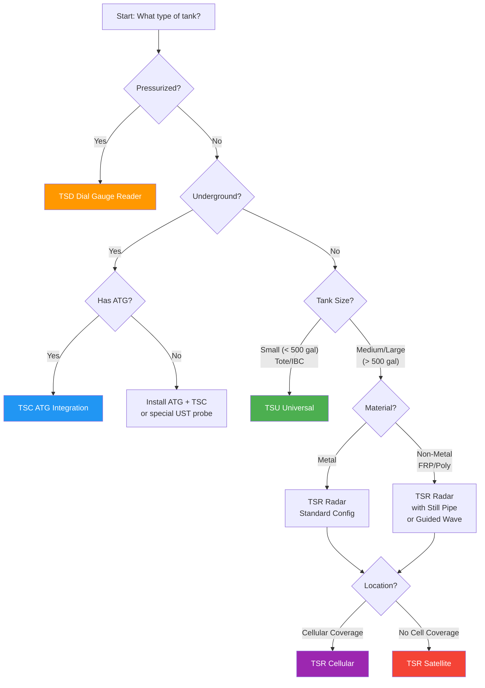

### 6.11.2 Quick Reference Selection Table

| Scenario | Tank Type | Product | Environment | Recommended Monitor |
|---|---|---|---|---|
| Gas station day tank | AST horizontal | Diesel | Urban/suburban | TSR Cellular |
| Convenience store UST | UST (Veeder-Root ATG) | Gasoline | Urban | TSC Gateway |
| Farm fuel tank | AST horizontal | Diesel | Rural | TSR Cellular or Satellite |
| Propane customer | Pressurized | Propane | Residential | TSD Dial Reader |
| Lubricant tote | IBC 330 gal | Motor oil | Warehouse | TSU Universal (Wi-Fi) |
| Oil well production | AST vertical | Crude oil | Remote oilfield | TSR Satellite |
| Chemical plant | AST vertical (FRP) | Acid/caustic | Industrial | TSR with PVDF housing |
| Terminal tank farm | AST horizontal | Multi-product | Commercial | TSR Cellular (batch) |
| Mining site | AST horizontal | Diesel | Remote, extreme | TSR Satellite, hardened |
| Construction site | Portable tank | Diesel | Temporary | TSU (portable mounting) |

### 6.11.3 Product Compatibility Matrix

Different products have different physical properties that affect sensor selection:

| Product Category | Dielectric Constant | Vapor Pressure | Viscosity | Radar Suitability |
|---|---|---|---|---|
| Gasoline | 2.0 - 2.1 | High | Low | Good (strong reflection) |
| Diesel | 2.1 - 2.4 | Low | Low-medium | Excellent |
| Heating oil | 2.0 - 2.2 | Low | Medium | Excellent |
| Propane (liquid) | 1.6 - 1.8 | Very high | Very low | Use TSD (pressurized) |
| Motor oil | 2.1 - 2.4 | Very low | High | Excellent |
| Hydraulic fluid | 2.1 - 2.3 | Very low | High | Excellent |
| Ethanol (E100) | 24.3 | Moderate | Low | Excellent (very high reflection) |
| DEF (urea solution) | ~80 | Very low | Low | Excellent |
| Water | 80 | Low | Low | Excellent (reference standard) |
| Sulfuric acid | 84 | Very low | Medium | Excellent (use PVDF housing) |

!!! tip "Dielectric Constant and Radar Performance"
    Radar reflection strength depends on the dielectric constant difference between the vapor above the liquid and the liquid itself. Higher dielectric constants produce stronger reflections. Water-based products (DEF, acids) give very strong returns. Low-dielectric products (propane, LPG) give weaker returns but are typically in pressurized tanks where TSD is used instead of radar.

---

## 6.12 Volume Calibration and Strapping Tables

### 6.12.1 What Is a Strapping Table?

A strapping table (also called a tank capacity table or gauge table) converts a linear level measurement to a volumetric quantity. For simple geometries (vertical cylinders, rectangular tanks), the conversion is a straightforward formula. For complex geometries (horizontal cylinders with dished heads), the strapping table provides pre-calculated volume at each level increment.

### 6.12.2 Standard Strapping Table Formats

AIP supports several strapping table approaches:

| Method | Description | Accuracy | Effort |
|---|---|---|---|
| Calculated from dimensions | Enter tank geometry; AIP calculates the table | Good (+/- 1-2%) | Low |
| Manufacturer's table | Upload the table provided by the tank maker | High (+/- 0.5%) | Low |
| Wet calibration | Fill tank incrementally, record actual volumes | Highest (+/- 0.25%) | High |
| API MPMS Chapter 2.2A/B | Industry-standard tables for horizontal cylinders | High (+/- 0.5%) | Medium |

### 6.12.3 Creating a Strapping Table from Dimensions

For a horizontal cylindrical tank, the inputs required are:

1. **Total length** (shell length, end-to-end)
2. **Diameter** (internal diameter)
3. **Head type** (flat, 2:1 elliptical, hemispherical, ASME flanged & dished)
4. **Head depth** (for non-flat heads)
5. **Deadband** (minimum measurable level, below sensor range)
6. **Maximum usable level** (may be less than diameter due to overflow protection)

AIP generates the table and displays a graph of the level-to-volume relationship:

```
Volume (gal)
|                    ___________
|                 __/
|              __/
|           __/
|        __/
|      _/
|    _/
|  _/
| /
|/___________________________
0        Level (inches)      D

Note: Horizontal cylinder has S-curve relationship.
      Steep in middle, flat at top and bottom.
```

!!! note "The S-Curve Effect"
    In a horizontal cylinder, the volume change per inch of level is smallest at the very bottom and very top (where the tank narrows), and greatest in the middle (where the tank is widest). This means that a 1-inch level change at 50% fill represents more volume than a 1-inch change at 10% or 90% fill. AIP's strapping table accounts for this automatically.

---

## 6.13 Chapter Summary

This chapter covered the major categories of tanks that TankScan monitors and the specific approaches for each:

| Tank Type | Monitor | Key Advantage |
|---|---|---|
| Aboveground (AST) | TSR Radar | Direct, high-accuracy radar measurement |
| Underground (UST) | TSC Gateway | Integrates with existing ATG systems |
| Totes and IBCs | TSU Universal | Portable, low-cost, snap-on mounting |
| Pressurized | TSD Dial Reader | Non-invasive, reads existing gauges |
| Field/Remote | TSR + Satellite | Works beyond cellular coverage |

Key principles:

1. **Match the monitor to the tank**: No single device works for all tank types
2. **Understand the geometry**: Level-to-volume conversion depends on tank shape
3. **Consider the environment**: Temperature, pressure, and atmospheric conditions affect sensor selection
4. **Plan for connectivity**: Cellular, Wi-Fi, or satellite based on location
5. **Use strapping tables**: Accurate volume calculation requires proper calibration

---

## Review Questions

!!! question "Question 1 -- Knowledge (Remember)"
    List the four main TankScan monitor types (TSR, TSC, TSU, TSD) and state which tank category each is designed to serve.

!!! question "Question 2 -- Comprehension (Understand)"
    Explain why a horizontal cylindrical tank requires a strapping table for accurate volume measurement, while a vertical cylindrical tank does not. Describe the mathematical relationship that causes this difference.

!!! question "Question 3 -- Application (Apply)"
    A fuel distributor asks you to recommend a monitoring solution for the following tanks at a single customer site:

    - One 10,000-gallon aboveground horizontal steel diesel tank
    - Two 275-gallon IBC totes containing motor oil
    - One 1,000-gallon underground fiberglass tank with a Veeder-Root TLS-350 ATG
    - One 500-gallon propane tank

    Specify the TankScan monitor for each tank and explain your reasoning.

!!! question "Question 4 -- Analysis (Analyze)"
    A TSR monitor on a horizontal 12,000-gallon steel tank reports a level of 48 inches. The tank has a 72-inch internal diameter and is 15 feet long with flat heads. Using the horizontal cylinder volume formula, calculate the approximate volume in gallons. Then explain why this calculated volume would differ slightly from the actual volume in a real-world tank with 2:1 elliptical heads.

!!! question "Question 5 -- Evaluation (Evaluate)"
    A chemical plant has 30 fiberglass (FRP) vertical tanks containing various acids and caustics. A colleague suggests installing standard TSR monitors on all tanks using the same configuration. Evaluate this approach and identify at least three potential problems. Propose a more appropriate monitoring strategy, considering material compatibility, chemical resistance, and radar performance in non-metallic tanks.
