# Chapter 7: Industry Solutions

## Learning Objectives

By the end of this chapter, you will be able to:

- Identify the key industries served by wireless tank monitoring and their unique requirements
- Describe how TankScan technology addresses fuel distribution challenges
- Explain ATG integration for convenience store operations
- Evaluate monitoring solutions for hazardous materials and specialty chemicals
- Design monitoring workflows for used oil collection and reverse logistics
- Compare deployment strategies across different industry verticals

---

## 7.1 Introduction: One Platform, Many Industries

Wireless tank monitoring is not a single-industry technology. While the core capability -- measuring liquid levels remotely and transmitting data to the cloud -- remains the same, the way that capability is applied varies dramatically across industries. A propane distributor's primary concern is preventing residential customer run-outs during a winter cold snap. A lubricant distributor wants to optimize truck routes across hundreds of customer locations. A chemical plant needs to ensure regulatory compliance while managing hazardous inventory.

The TankScan platform, built on the Asset Intelligence Platform (AIP), serves all of these needs through configurable workflows, industry-specific alert logic, and integration with the specialized software systems that each industry relies upon.

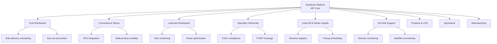

This chapter examines each major industry vertical, exploring the specific challenges, workflows, and TankScan solutions that apply.

---

## 7.2 Fuel Distribution

### 7.2.1 The Fuel Distribution Challenge

Fuel distribution is the largest market segment for wireless tank monitoring. The industry encompasses wholesale fuel distributors, jobbers, and marketers who deliver gasoline, diesel, heating oil, kerosene, and other petroleum products to commercial and residential customers.

The fundamental challenge is deceptively simple: **deliver the right product, to the right tank, at the right time, in the right quantity.** In practice, this is extraordinarily difficult without real-time tank level data.

!!! note "Scale of the Problem"
    A mid-size fuel distributor may serve 500 to 3,000 customer locations, each with 1 to 10 tanks. That is potentially 5,000 to 30,000 individual tanks that need timely delivery. Without wireless monitoring, the distributor has no real-time visibility into any of them.

### 7.2.2 Traditional Fuel Distribution (Before Wireless Monitoring)

Before wireless monitoring, fuel distributors relied on a combination of methods to manage deliveries:

| Method | How It Works | Limitations |
|---|---|---|
| Will-call | Customer calls when they need fuel | Late notice, emergency deliveries, run-outs |
| Degree-day forecasting | Estimated consumption based on weather | Inaccurate for non-heating uses, individual variation |
| Fixed schedule | Deliver every N days regardless of level | Over-delivery (partial loads) or under-delivery (run-outs) |
| Driver observation | Driver checks tank during nearby delivery | Inconsistent, dependent on route proximity |
| Manual stick reading | Physical measurement with a dip stick | Labor-intensive, requires site access |

Each of these methods has significant drawbacks. Will-call results in emergency deliveries (expensive) and customer run-outs (lost business). Degree-day forecasting averages out individual variation, missing the customer who hosts a large event and burns through fuel quickly, or the one who goes on vacation and uses almost nothing. Fixed schedules waste fuel on trucks making unnecessary trips.

### 7.2.3 The Wireless Monitoring Transformation

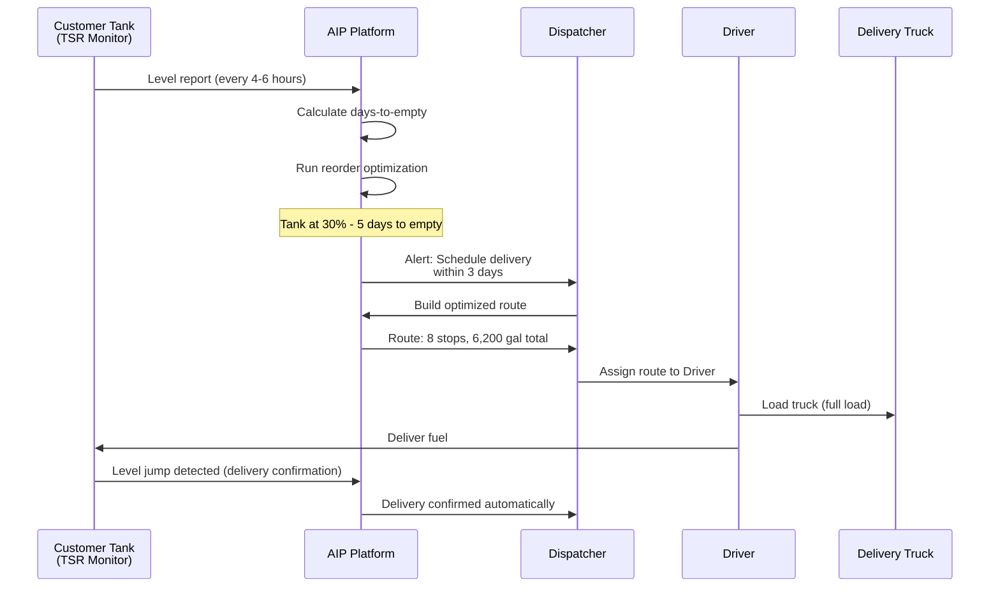

With wireless monitoring, the distributor gains:

- **Real-time visibility** into every customer tank level
- **Predictive scheduling** based on actual consumption, not estimates
- **Optimized routing** to minimize miles driven and maximize gallons delivered per stop
- **Automatic delivery confirmation** when the monitor detects a level increase
- **Anomaly alerts** for unusual consumption patterns (potential leaks, theft)

### 7.2.4 Bulk Delivery Operations

Bulk fuel delivery operations involve transport trucks (typically 5,000 to 9,000 gallon capacity) or bobtail trucks (2,500 to 3,500 gallons) making scheduled deliveries to customer tanks.

**Key metrics improved by wireless monitoring:**

| Metric | Without Monitoring | With Monitoring | Improvement |
|---|---|---|---|
| Gallons per delivery stop | 500 - 1,200 | 1,000 - 2,500 | 80-100% increase |
| Stops per route | 5 - 8 | 8 - 14 | 60-75% increase |
| Truck utilization | 55 - 65% | 85 - 95% | 30-40% increase |
| Run-out incidents | 2 - 5% of customers/year | < 0.1% | 95%+ reduction |
| Emergency deliveries | 15 - 25 per month | 1 - 3 per month | 85-90% reduction |
| Delivery cost per gallon | $0.08 - 0.15 | $0.04 - 0.08 | 40-50% reduction |

!!! example "Fuel Distribution ROI"
    A regional fuel distributor with 1,200 customer tanks (a mix of diesel and heating oil) deployed TankScan monitors across their entire customer base.

    **Investment**: $600,000 (monitors, installation, first-year platform fees)

    **Annual savings**:

    - Reduced truck miles: $180,000 (fuel and maintenance)
    - Eliminated 85% of emergency deliveries: $95,000
    - Increased gallons per stop (fewer partial loads): $120,000
    - Reduced driver overtime: $60,000
    - Prevented 12 run-outs (customer retention): $45,000

    **Total annual savings**: $500,000 | **Payback period**: 14 months

### 7.2.5 Inventory Management

Beyond delivery scheduling, wireless monitoring transforms inventory management at the terminal:

**Terminal-side benefits:**

- Track product levels across all terminal tanks in real-time
- Forecast when terminal tanks need resupply from pipeline or barge
- Balance inventory across multiple terminal locations
- Detect terminal-level inventory variances (reconciliation)
- Plan maintenance windows when tank levels are low

**Customer-side benefits:**

- Customers can view their own tank levels via a customer portal
- Automated low-level notifications to customer and distributor simultaneously
- Historical consumption data helps customers budget for fuel expenses
- Variance reports flag potential issues (leaks, meter inaccuracies)

---

## 7.3 Convenience Store Operations

### 7.3.1 The C-Store Fuel Environment

Convenience stores (c-stores) are the retail endpoint of the fuel distribution chain. In the United States, there are approximately 150,000 convenience stores, and about 80% of them sell fuel. Each c-store typically has 3 to 6 underground storage tanks (USTs) holding different fuel grades.

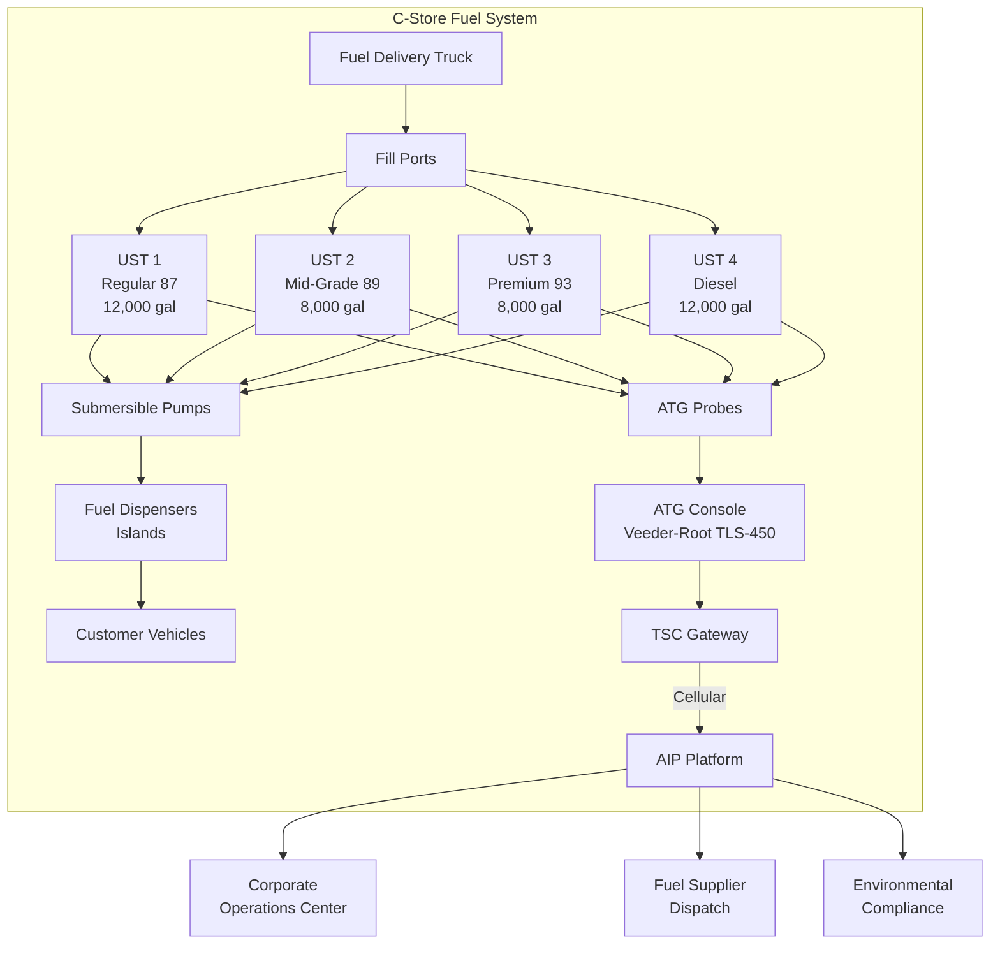

### 7.3.2 ATG Integration Details

Every regulated UST in the US must have an ATG system for leak detection. The most common ATG system is the Veeder-Root TLS series (TLS-350, TLS-450, TLS-4), which is installed at over 300,000 locations in the US alone.

The **TSC gateway** connects to the ATG console and bridges its data to the AIP cloud:

**Connection process:**

1. Identify the ATG console model and available communication port (RS-232, RS-485, or Ethernet)
2. Connect the TSC gateway to the communication port using the appropriate cable
3. Configure the TSC with the ATG protocol (Veeder-Root, Gilbarco, Franklin, etc.)
4. The TSC begins polling the ATG at configured intervals (typically every 5-15 minutes)
5. Data is transmitted to AIP, where each tank compartment appears as a separate monitored asset

**Data points captured from ATG:**

| Data Point | Description | Update Frequency |
|---|---|---|
| Product level (inches) | Liquid height in each tank | Every poll cycle |
| Product volume (gallons) | Calculated from ATG strapping table | Every poll cycle |
| Water level (inches) | Water bottom height | Every poll cycle |
| Temperature (degrees F) | Multi-point average from probe thermistors | Every poll cycle |
| Net volume (gallons) | Temperature-corrected volume at 60F | Every poll cycle |
| Ullage (gallons) | Available space for delivery | Every poll cycle |
| Delivery status | Whether a delivery is in progress | Real-time |
| Alarm status | ATG alarm conditions (leak, high water, etc.) | Real-time |

### 7.3.3 Multi-Product Monitoring

C-stores sell multiple fuel grades, often managed through a **blending** strategy:

!!! note "Fuel Blending at C-Stores"
    Many c-stores stock only two base products -- Regular (87 octane) and Premium (93 octane) -- and create Mid-Grade (89 octane) by blending at the dispenser. This means the physical tanks hold only Regular and Premium, but the POS system sells three grades. The AIP platform can be configured to track both physical tank levels and calculated blended product availability.

**Multi-product challenges addressed by monitoring:**

| Challenge | Without Monitoring | With TankScan |
|---|---|---|
| Product run-out at pump | Discovered by customers (lost sales, bad reviews) | Predicted days in advance; automated reorder |
| Contamination detection | Found during delivery or compliance testing | Water level alerts from ATG probe |
| Delivery overfill | Relies on driver reading gauge correctly | Ullage data sent to dispatch prevents overfill |
| Inventory reconciliation | Manual tank stick + POS comparison, often weekly | Automated daily reconciliation |
| Blending accuracy | Assumed based on dispenser calibration | Tracked via consumption ratios in AIP |

### 7.3.4 Enterprise C-Store Chains

Large c-store chains (100 to 10,000+ locations) gain particular value from enterprise-wide visibility:

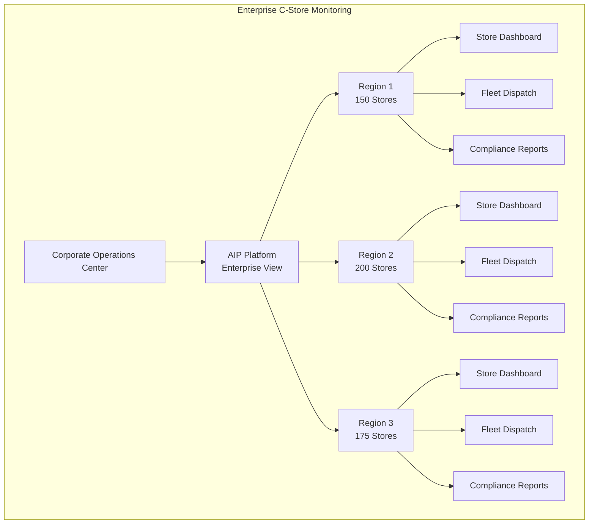

**Enterprise benefits:**

- **Benchmarking**: Compare fuel throughput, consumption patterns, and efficiency across all stores
- **Contract optimization**: Aggregated demand data strengthens purchasing negotiations with suppliers
- **Compliance management**: Centralized view of all ATG alarm statuses and leak detection results
- **Loss prevention**: Identify stores with unusual inventory variances that may indicate theft or equipment issues

---

## 7.4 Lubricant Distribution

### 7.4.1 The Lubricant Distribution Model

Lubricant distribution is fundamentally different from fuel distribution. Instead of delivering one or two products to large tanks, lubricant distributors deliver many different products (motor oils, hydraulic fluids, gear oils, coolants, greases) to numerous small containers (totes, IBCs, drums) across diverse customer locations.

| Characteristic | Fuel Distribution | Lubricant Distribution |
|---|---|---|
| Products per customer | 1 - 3 | 3 - 15 |
| Container type | Large tanks (500 - 30,000 gal) | Totes and IBCs (100 - 550 gal) |
| Container quantity per site | 1 - 5 tanks | 3 - 20 totes |
| Delivery frequency | Weekly to monthly | Monthly to quarterly |
| Delivery quantity | 500 - 5,000 gallons | 50 - 300 gallons per tote |
| Product cost | $2 - 5 per gallon | $5 - 30 per gallon |
| Customer type | Commercial/industrial | Manufacturing, auto shops, fleets |

### 7.4.2 The Tote Monitoring Revolution

Before wireless monitoring, lubricant distributors faced a classic information gap:

!!! warning "The Lubricant Distributor's Dilemma"
    A lubricant distributor's sales representative visits a manufacturing plant with 12 totes of various lubricants. Without monitoring, they must physically check each tote -- often involving climbing ladders, removing caps, and visually estimating fill levels. This takes 30-45 minutes per site. With 30 sites to visit per week, the sales rep spends 15-22 hours just checking tote levels, leaving little time for actual selling and relationship building.

The **TSU (TankScan Universal)** transforms lubricant distribution by providing continuous level visibility for every tote:

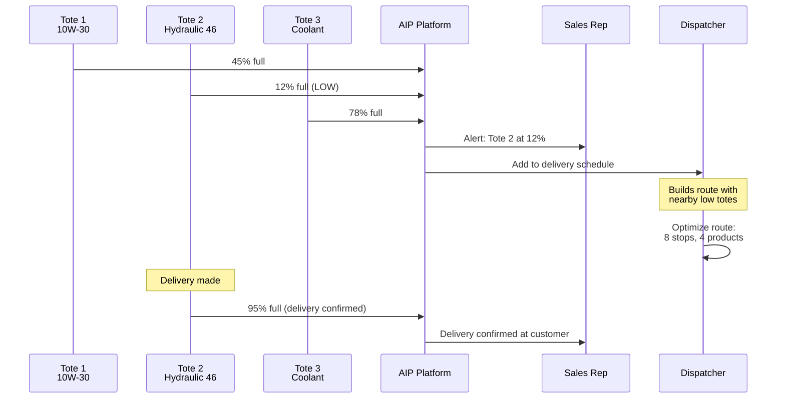

### 7.4.3 Multi-Viscosity Management

Lubricant customers typically use multiple products:

| Customer Type | Typical Products | Totes per Site |
|---|---|---|
| Manufacturing plant | Hydraulic oil, way oil, cutting fluid, coolant, gear oil | 5 - 15 |
| Auto dealership | Motor oil (2-3 weights), ATF, coolant, DEF | 4 - 8 |
| Fleet maintenance | Motor oil, hydraulic oil, gear oil, ATF, coolant, DEF | 6 - 12 |
| Construction company | Hydraulic oil, diesel exhaust fluid, engine oil | 3 - 6 |
| Mining operation | Hydraulic oil, gear oil, engine oil, grease | 4 - 10 |

Each product has different consumption rates, reorder thresholds, and delivery economics. The AIP platform manages all of these as separate monitored assets with product-specific profiles.

### 7.4.4 Lubricant Distribution Workflow

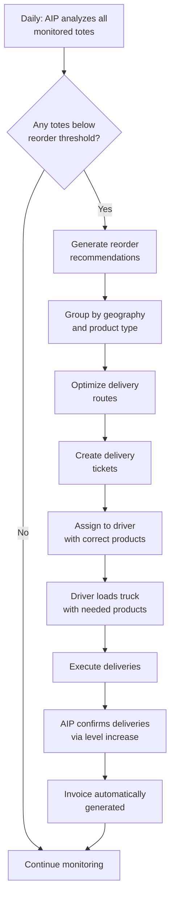

!!! example "Lubricant Distributor Case Study"
    A regional lubricant distributor serving 180 customer locations deployed TSU monitors on 1,400 totes.

    **Before TankScan:**

    - 4 delivery trucks running 5 days/week
    - Average 4 stops per truck per day
    - Sales reps spending 60% of time checking tote levels
    - 8-12 customer run-outs per month (production impact)

    **After TankScan:**

    - 3 delivery trucks running 4.5 days/week (eliminated one truck)
    - Average 7 stops per truck per day
    - Sales reps spending 15% of time on tote management, 85% selling
    - 0-1 customer run-outs per month

    **Annual savings**: $340,000 (one fewer truck, driver, fuel, insurance + increased sales from freed-up rep time)

---

## 7.5 Specialty Chemicals

### 7.5.1 Chemical Industry Requirements

Specialty chemical monitoring introduces complexities not found in fuel or lubricant applications:

- **Chemical compatibility**: Sensor materials must resist the chemicals being monitored
- **Hazardous area classification**: Many chemicals require Class I, Division 1 rated equipment
- **Regulatory compliance**: EPA, OSHA, DOT, and state regulations govern chemical storage
- **Product diversity**: Chemicals range from benign (water treatment) to highly aggressive (acids, oxidizers)
- **Accuracy requirements**: Some processes require +/- 0.1% accuracy for inventory management

### 7.5.2 Hazardous Materials Monitoring

When monitoring tanks containing hazardous materials, the primary concerns are safety and containment:

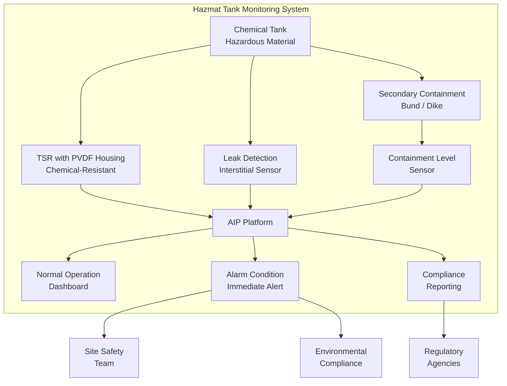

### 7.5.3 PVDF Housings for Chemical Resistance

Standard TSR housings use polypropylene or ABS plastic, which is adequate for petroleum products but can be attacked by aggressive chemicals. For chemical applications, TankScan offers **PVDF (Polyvinylidene Fluoride)** housings.

| Material | Chemical Resistance | Temperature Range | Applications |
|---|---|---|---|
| Standard (PP/ABS) | Petroleum products, water, mild chemicals | -40F to +185F | Fuel, lubricants, DEF |
| PVDF | Strong acids, bases, oxidizers, solvents | -40F to +275F | Sulfuric acid, caustic soda, bleach |
| Stainless steel 316L | Broad chemical resistance | -40F to +400F | Pharmaceutical, food-grade |
| PTFE-lined | Extreme chemical resistance | -40F to +400F | Concentrated acids, fluorine compounds |

!!! warning "Chemical Compatibility Is Critical"
    Installing a standard housing on a tank containing aggressive chemicals can lead to housing failure within weeks or months. Always verify chemical compatibility before specifying monitor materials. TankScan provides a chemical compatibility guide, and material compatibility charts are available from housing manufacturers.

### 7.5.4 Class I, Division 1 (C1D1) Requirements

Many chemical storage areas are classified as Class I, Division 1 hazardous locations under the National Electrical Code (NEC Article 500). This means:

- Ignitable concentrations of flammable gases or vapors may exist **under normal operating conditions**
- All electrical equipment in the area must be approved for C1D1 use
- Equipment must be **intrinsically safe** (energy limited) or **explosion-proof** (contained)

The TSR is available with C1D1 intrinsic safety certification, meeting these requirements:

| Requirement | TSR Compliance |
|---|---|
| NEC Article 500 Class I, Div 1 | Certified per UL/CSA standards |
| Energy limitation | Battery energy below ignition threshold |
| Surface temperature | T4 rating (maximum 275F / 135C) |
| Enclosure integrity | Sealed, non-sparking design |
| Installation standard | Per NEC 504 (intrinsically safe wiring) |
| Third-party certification | UL, CSA, ATEX, IECEx (varies by model) |

### 7.5.5 Chemical Inventory Management

Chemical distributors and users face unique inventory management challenges:

| Challenge | Description | TankScan Solution |
|---|---|---|
| Shelf life tracking | Some chemicals degrade over time | AIP tracks time since last delivery per tank |
| Lot traceability | Regulatory requirement for many chemicals | Delivery events linked to lot/batch numbers |
| Minimum/maximum inventory | Safety stock vs. storage limits | Configurable high and low alerts per tank |
| Consumption permits | Usage limited by environmental permits | AIP tracks cumulative consumption vs. permit limits |
| Incompatible storage | Some chemicals cannot be stored near each other | Site maps in AIP show tank proximity and contents |
| Spill reporting | Reportable quantities under CERCLA/EPCRA | Sudden level drops trigger immediate alerts |

---

## 7.6 Used Oil and Waste Liquid Collection

### 7.6.1 Reverse Logistics: The Pickup Problem

Used oil and waste liquid collection is the mirror image of fuel delivery. Instead of delivering product to customer tanks, collection companies pick up waste liquids from customer tanks. The logistics challenge is equally complex but operates in reverse:

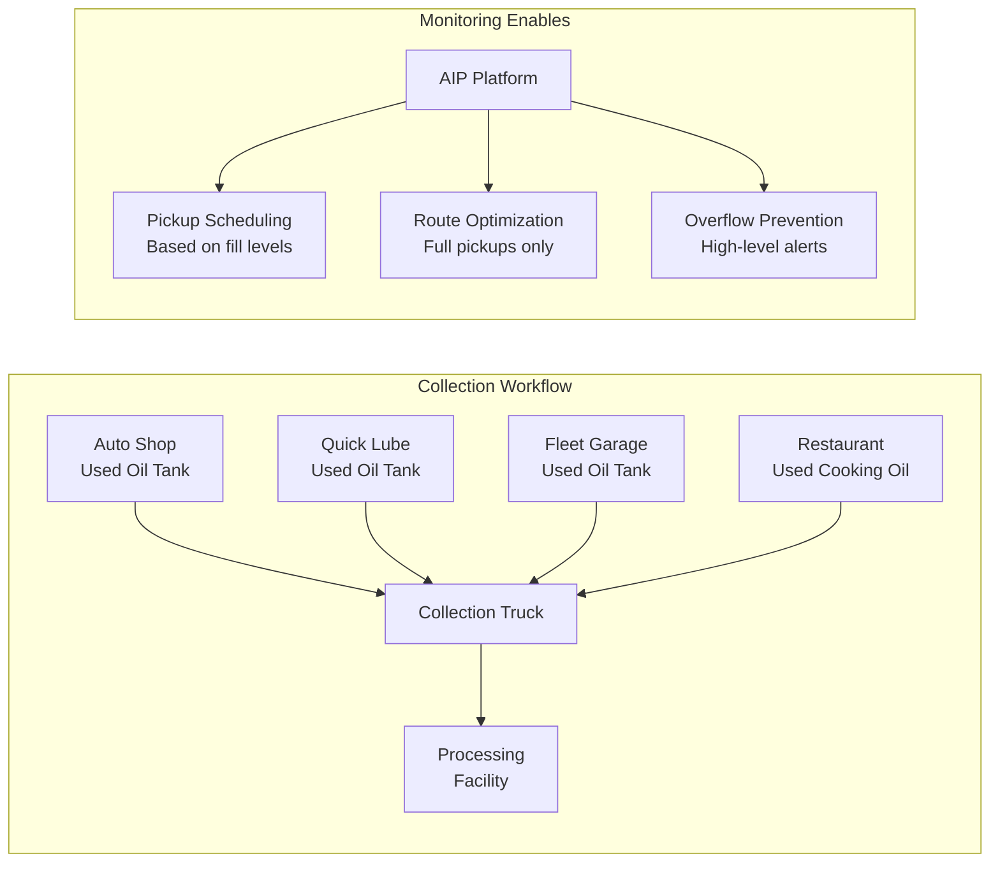

Without monitoring, waste collection companies face the same problems as fuel distributors but in reverse:

| Problem | Impact | Frequency |
|---|---|---|
| Customer calls "tank full" | Emergency dispatch, inefficient route | Daily |
| Partial pickups | Truck space wasted on half-full tanks | 40-60% of pickups |
| Tank overflow | Environmental violation, cleanup costs ($5,000-50,000+) | Monthly |
| Missed pickups | Customer dissatisfaction, potential regulatory issues | Weekly |
| Scheduling conflicts | Multiple customers need pickup simultaneously | Daily |

### 7.6.2 Used Oil Collection Monitoring

The typical used oil collection customer:

| Customer Type | Tank Size | Fill Rate | Pickup Frequency |
|---|---|---|---|
| Quick lube shop | 250 - 500 gal | 100 - 200 gal/week | Every 2-3 weeks |
| Auto dealership | 500 - 1,500 gal | 200 - 500 gal/week | Every 2-4 weeks |
| Fleet maintenance | 500 - 2,000 gal | 100 - 500 gal/week | Every 2-6 weeks |
| Industrial plant | 1,000 - 5,000 gal | Variable | Monthly to quarterly |
| Restaurant (cooking oil) | 100 - 300 gal | 50 - 100 gal/week | Every 2-4 weeks |

### 7.6.3 Collection-Specific Monitoring Features

Waste collection monitoring requires some features that differ from delivery monitoring:

| Feature | Delivery Monitoring | Collection Monitoring |
|---|---|---|
| Alert direction | Low level (needs delivery) | High level (needs pickup) |
| Trend tracking | Downward (consumption) | Upward (accumulation) |
| Urgency trigger | Tank approaching empty | Tank approaching full |
| Optimization goal | Maximize gallons delivered | Maximize gallons collected |
| Overflow risk | Overfill during delivery | Overflow between pickups |
| Revenue model | Sell product | Collect fee or buy waste product |

!!! tip "Configuring AIP for Collection"
    The AIP platform supports both delivery (fill-from-top) and collection (fill-from-bottom) monitoring modes. When configuring a waste collection tank, set the alert threshold as a HIGH-level alert rather than a low-level alert. The "days to action" calculation estimates when the tank will reach the pickup threshold based on the fill rate, rather than when it will reach empty.

### 7.6.4 Waste Collection Workflow

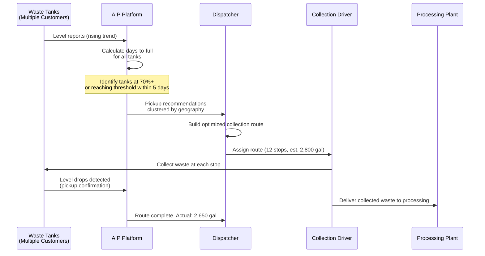

---

## 7.7 Oil Field Support

### 7.7.1 Upstream Oil and Gas Monitoring

Oil field support represents one of the most demanding applications for wireless tank monitoring. The combination of remote locations, harsh environments, hazardous products, and high-value inventory creates unique challenges.

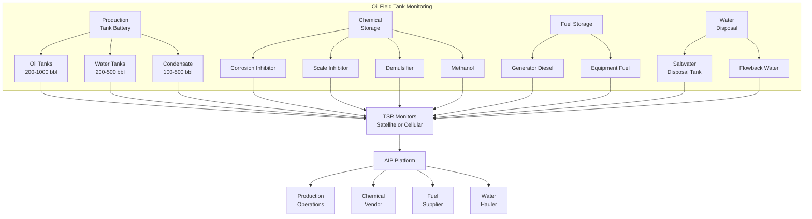

### 7.7.2 Production Tank Monitoring

Production tanks collect crude oil and associated liquids from wells. Monitoring is critical for several reasons:

**Revenue protection**: Crude oil in production tanks represents direct revenue. Accurate level monitoring enables:

- Knowing exactly when tanks need to be hauled (sold and transported to pipeline or refinery)
- Detecting oil theft (a significant problem in remote oil fields)
- Accurate production accounting for royalty calculations

**Theft detection**: Oil theft from remote well sites is a multi-billion-dollar problem in the oil industry. Wireless monitoring provides:

| Detection Method | How It Works |
|---|---|
| Sudden level drop | AIP detects level decrease inconsistent with normal production patterns |
| Off-hours activity | Level changes during nights, weekends, or holidays when no legitimate hauling is scheduled |
| Comparison with sales tickets | Volume removed should match sale/transfer tickets |
| Pattern analysis | Repeated small thefts may follow a pattern (same time, day, amount) |

!!! example "Theft Detection in Practice"
    A Permian Basin producer deployed TankScan monitors on 45 production tank batteries. Within 60 days, the system detected:

    - 3 instances of unauthorized fluid removal (confirmed theft)
    - Estimated recovered value: $28,000 per month
    - After investigation and site security improvements, theft incidents dropped to zero

### 7.7.3 Chemical Tank Monitoring for Oil Fields

Chemical injection is essential for oil production. Without corrosion inhibitors, scale inhibitors, and other treatment chemicals, production equipment can fail within months. Chemical run-outs cause:

- Corrosion damage to tubing, casing, and surface equipment ($10,000 - $500,000 per incident)
- Scale buildup reducing production flow (10-50% production loss)
- Emulsion problems preventing oil-water separation
- Paraffin buildup restricting flow lines

Monitoring chemical tanks prevents these costly run-outs by alerting the chemical vendor before the tank empties.

### 7.7.4 Satellite Connectivity for Remote Fields

Many oil fields have no cellular coverage. TankScan's satellite communication options address this:

| Factor | Cellular | Satellite (Iridium) |
|---|---|---|
| Coverage | Urban/suburban, some rural | Global (including polar regions) |
| Reporting frequency | Up to 24x per day | 1-4x per day (cost limited) |
| Latency | Seconds | Seconds to minutes |
| Monthly data cost | $5 - 15 per device | $15 - 50 per device |
| Reliability | Depends on cell tower infrastructure | 99.9% availability |
| Best for | Fields near population centers | Remote basins (Bakken, Permian, Marcellus) |

### 7.7.5 Harsh Environment Adaptations

Oil field installations face extreme conditions:

| Challenge | Adaptation |
|---|---|
| H2S (sour gas) exposure | Stainless steel and fluorocarbon materials; H2S-resistant electronics |
| Sand and dust storms | IP67 sealed housings; no external moving parts |
| Extreme cold (-40F or below) | Lithium battery chemistry; heated enclosure option |
| Lightning | Transient voltage suppression; proper grounding to tank |
| Vandalism and theft | Tamper-resistant mounting; removal alerts in AIP |
| Vibration from pumping units | Signal averaging; vibration-dampened mounting |
| Saltwater spray (offshore support) | Marine-grade coatings; stainless steel hardware |

---

## 7.8 Propane and LPG Distribution

### 7.8.1 The Propane Delivery Challenge

Propane distribution shares characteristics with both fuel distribution and specialty chemical handling. The product is stored under pressure, delivery requires specialized equipment (bobtails with pumps), and demand is highly seasonal.

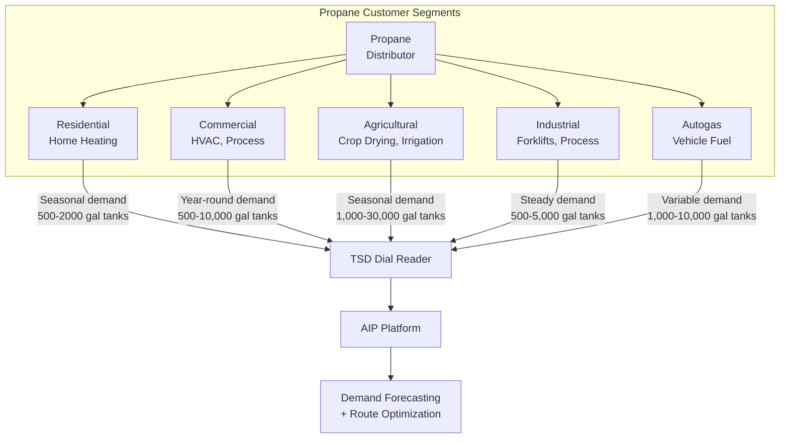

### 7.8.2 Seasonal Demand Patterns

Propane demand is among the most seasonal of any monitored product:

| Season | Residential Demand | Agricultural Demand | Commercial Demand |
|---|---|---|---|
| Winter (Dec-Feb) | Very High (heating) | Low | High (HVAC) |
| Spring (Mar-May) | Moderate (transitional) | Moderate (planting) | Moderate |
| Summer (Jun-Aug) | Low (cooking, water heating) | Low | Moderate |
| Fall (Sep-Nov) | Moderate to High | Very High (crop drying) | Moderate to High |

This seasonality creates a "wall of demand" in late fall and winter that overwhelms distribution fleets unless carefully managed. TSD monitoring enables distributors to:

- Pre-fill tanks before peak season begins
- Identify which customers are consuming fastest during cold snaps
- Prioritize deliveries to tanks closest to empty
- Avoid unnecessary deliveries to tanks that still have adequate supply

### 7.8.3 Degree-Day Enhancement with Actual Data

Traditionally, propane distributors used **degree-day calculations** to estimate consumption:

$$\text{Degree Days} = T_{\text{base}} - T_{\text{avg}}$$

Where $T_{\text{base}}$ is typically 65F and $T_{\text{avg}}$ is the average daily temperature. A customer's "K-factor" (gallons per degree-day) was used to estimate consumption.

!!! tip "From Estimated to Actual Consumption"
    TSD monitoring replaces degree-day estimation with actual consumption data. Instead of calculating what a customer *should* have used based on weather, the distributor knows what they *actually* used. This eliminates the inaccuracies inherent in degree-day methods:

    - Homes with poor insulation use more than predicted
    - Customers who turn down thermostats during vacations use less
    - Supplemental heating sources (wood stoves, electric heaters) reduce propane consumption unpredictably
    - New insulation or windows change the K-factor without warning

---

## 7.9 Agricultural Applications

### 7.9.1 Farm and Ranch Monitoring

Agricultural operations use large quantities of fuel, fertilizer, and chemicals spread across expansive properties. A single farming operation may cover thousands of acres with tanks at multiple locations.

**Common agricultural tanks:**

| Product | Tank Type | Size Range | Criticality |
|---|---|---|---|
| Diesel fuel | AST, horizontal | 500 - 10,000 gal | High (equipment runs on it) |
| Gasoline | AST, horizontal | 250 - 2,000 gal | Medium |
| Liquid fertilizer (UAN) | Vertical poly tank | 2,000 - 15,000 gal | Very High (seasonal, timing critical) |
| Anhydrous ammonia | Pressurized | 1,000 - 12,000 gal | Very High (seasonal, regulated) |
| Herbicide/pesticide | Small tanks, totes | 50 - 500 gal | High (application timing critical) |
| Propane (crop drying) | Pressurized | 1,000 - 30,000 gal | Very High (harvest timing critical) |
| Water | Vertical, poly or steel | 1,000 - 50,000 gal | Variable |

### 7.9.2 Seasonal Agricultural Demand

Agricultural monitoring is driven by the cropping cycle:

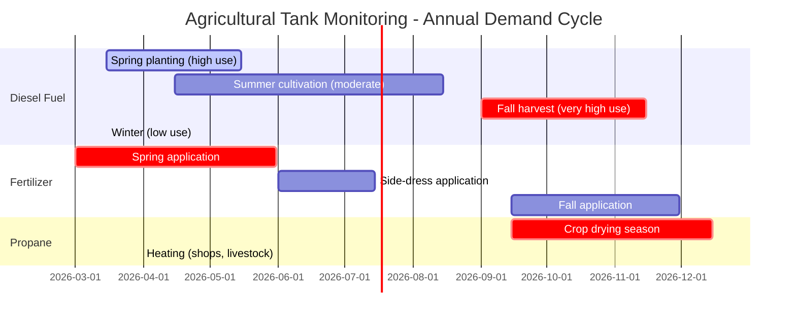

---

## 7.10 Manufacturing and Industrial

### 7.10.1 Manufacturing Tank Monitoring

Manufacturing facilities use tanks for a wide variety of products that keep production lines running:

| Application | Products | Monitoring Priority |
|---|---|---|
| CNC machining | Cutting fluids, coolants | High (line shutdown if empty) |
| Hydraulic systems | Hydraulic oil (various grades) | Very High (equipment damage) |
| Parts washing | Solvents, aqueous cleaners | Medium |
| Heat treating | Quench oils | High |
| Painting | Paints, solvents, primers | High (production scheduling) |
| Boiler operations | Fuel oil, water treatment chemicals | Very High (facility heating) |
| Emergency power | Generator diesel | Critical (business continuity) |

### 7.10.2 Just-In-Time Monitoring for Manufacturing

Manufacturing facilities that operate on just-in-time (JIT) principles need precise inventory visibility:

!!! warning "The Cost of a Production Line Shutdown"
    When a manufacturing line shuts down due to a fluid run-out (cutting oil, coolant, hydraulic fluid), the cost is typically $5,000 to $50,000 per hour in lost production, idle labor, and downstream schedule disruption. A $200 wireless monitor that prevents even one shutdown per year delivers extraordinary ROI.

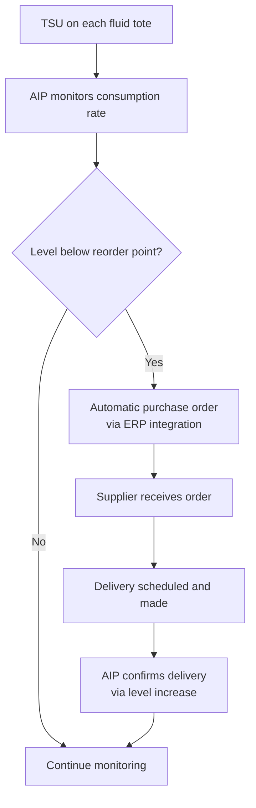

---

## 7.11 Cross-Industry Benefits

### 7.11.1 Universal Value Propositions

Regardless of industry, wireless tank monitoring delivers a common set of benefits:

| Benefit | Description | Typical Impact |
|---|---|---|
| Eliminate manual checks | No more sending people to read gauges | 80-95% reduction in site visits |
| Prevent run-outs | Alert before tank empties | 90-99% reduction in run-outs |
| Optimize deliveries | Route based on actual need, not schedule | 25-40% efficiency improvement |
| Reduce emergency calls | Planned deliveries replace emergency responses | 80-95% reduction in emergencies |
| Improve customer satisfaction | Proactive service instead of reactive | 20-40 point NPS improvement |
| Enable data-driven decisions | Historical data reveals patterns | Continuous improvement foundation |
| Support regulatory compliance | Automated monitoring documentation | Audit-ready records |
| Reduce environmental risk | Detect leaks and anomalies early | Significant risk mitigation |

### 7.11.2 Industry Comparison Matrix

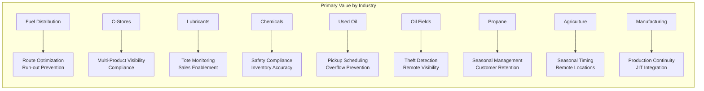

### 7.11.3 Total Addressable Market

The wireless tank monitoring market spans millions of tanks across all industries:

| Industry Segment | Estimated Tanks (US) | Current Monitoring Penetration | Growth Opportunity |
|---|---|---|---|
| Fuel distribution (ASTs) | 2,000,000+ | 15-20% | Very High |
| Convenience stores (USTs) | 600,000+ | 25-30% (ATG exists, but not cloud-connected) | High |
| Propane (residential) | 8,000,000+ | 5-10% | Very High |
| Lubricant totes | 5,000,000+ | < 5% | Very High |
| Oil field production | 500,000+ | 20-25% | High |
| Chemical storage | 1,000,000+ | 10-15% | High |
| Agricultural | 3,000,000+ | < 5% | Very High |
| Manufacturing | 2,000,000+ | < 5% | Very High |

!!! note "Market Maturity"
    Fuel distribution and convenience stores are the most mature segments for wireless tank monitoring, with established workflows and proven ROI. Lubricant tote monitoring and agricultural monitoring are earlier in their adoption curves, representing the greatest growth opportunities for TankScan.

---

## 7.12 Integration with Industry-Specific Software

### 7.12.1 Software Ecosystem by Industry

Each industry has its own specialized software systems. TankScan's AIP platform integrates with these through APIs and data feeds:

| Industry | Key Software Systems | Integration Method |
|---|---|---|
| Fuel distribution | ADD Systems, Cargas, P3, FuelCloud | API, flat file |
| Convenience stores | Veeder-Root, PDI/Cortex, Bulloch | ATG serial, API |
| Lubricants | Distribution One, VAI, Prophet 21 | API, EDI |
| Chemicals | SAP, Oracle, Infor | API, middleware |
| Oil field | Enverus, ARIES, OFS Portal | API |
| Propane | ADD Systems, Blue Cow, BSOG | API, flat file |
| Fleet management | Omnitracs, Samsara, Geotab | API |
| ERP (cross-industry) | SAP, Oracle, NetSuite, Dynamics | API, middleware |

### 7.12.2 Data Flow Architecture

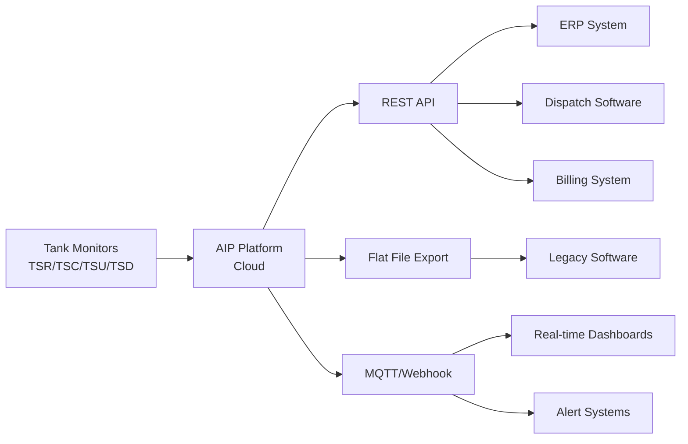

---

## 7.13 Chapter Summary

Wireless tank monitoring serves a diverse range of industries, each with unique requirements, workflows, and value propositions. Key takeaways:

1. **Fuel distribution** benefits primarily from route optimization and run-out prevention
2. **Convenience stores** leverage ATG integration for unified multi-product visibility
3. **Lubricant distributors** use tote monitoring to transform sales and delivery operations
4. **Specialty chemical** monitoring requires careful attention to material compatibility and hazardous area classification
5. **Used oil collection** applies monitoring in reverse -- tracking fill-up rather than draw-down
6. **Oil field support** demands satellite connectivity and extreme environment durability
7. **Propane distribution** addresses highly seasonal demand with actual consumption data replacing degree-day estimates
8. **Manufacturing** uses monitoring to prevent costly production line shutdowns

The common thread across all industries is the transformation from reactive, schedule-based operations to proactive, data-driven operations. The specific implementation varies, but the fundamental value proposition -- **the right product, at the right place, at the right time** -- is universal.

---

## Review Questions

!!! question "Question 1 -- Knowledge (Remember)"
    List at least five industries served by TankScan wireless monitoring and identify the primary TankScan product used in each (TSR, TSC, TSU, or TSD).

!!! question "Question 2 -- Comprehension (Understand)"
    Explain why used oil collection monitoring configures alerts differently from fuel delivery monitoring. Describe the specific alert direction and threshold differences, and explain the business logic behind each approach.

!!! question "Question 3 -- Application (Apply)"
    A propane distributor serves 2,500 residential customers and currently uses degree-day forecasting. During a recent cold snap, they experienced 15 run-outs in a single week. Design a monitoring deployment strategy using TSD monitors. Address the following: which customers to monitor first, how to phase the deployment, and what data from the monitors would replace degree-day calculations.

!!! question "Question 4 -- Analysis (Analyze)"
    Compare and contrast the monitoring requirements for a convenience store chain (500 locations with underground tanks and ATGs) versus a lubricant distributor (200 customer locations with an average of 8 totes each). Analyze the differences in: (a) monitor type and quantity, (b) connectivity approach, (c) integration requirements, (d) primary value proposition, and (e) deployment complexity.

!!! question "Question 5 -- Evaluation (Evaluate)"
    A specialty chemical company is evaluating whether to deploy TankScan monitors on 50 tanks containing various hazardous materials (acids, caustics, and flammable solvents). The company's safety director is concerned about installing electronic devices in hazardous areas. Evaluate the safety features and certifications of TankScan products that address these concerns. What additional information would you need before recommending a specific deployment plan?
