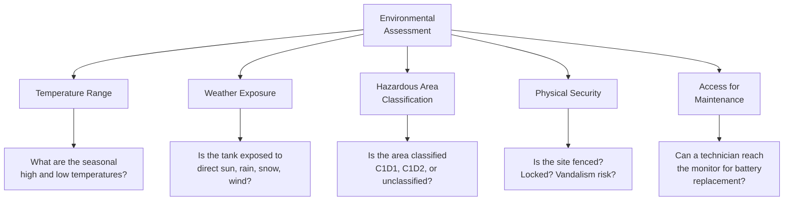
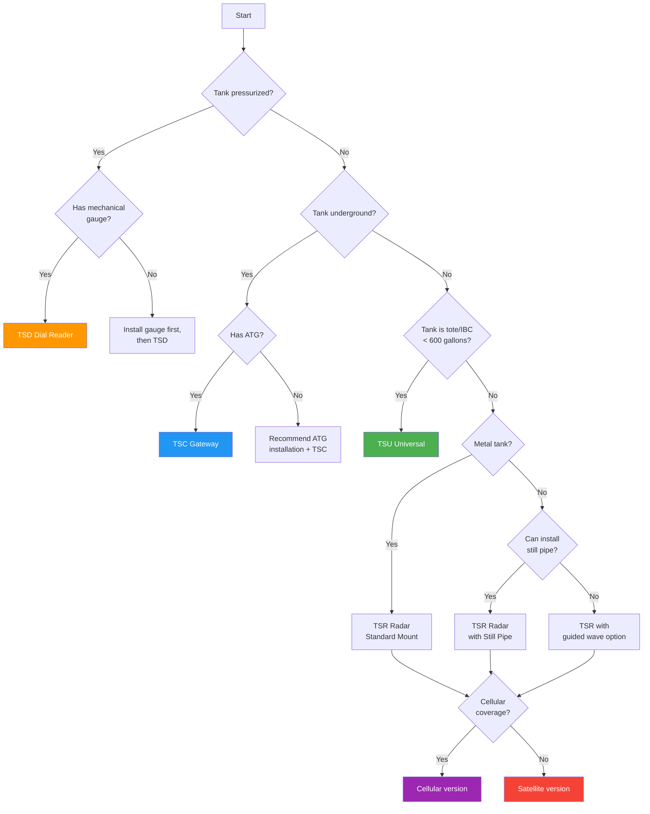
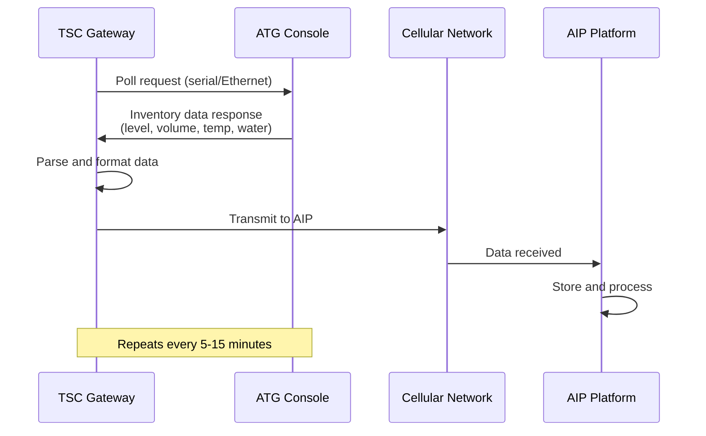
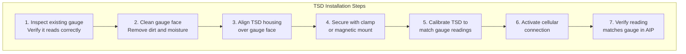
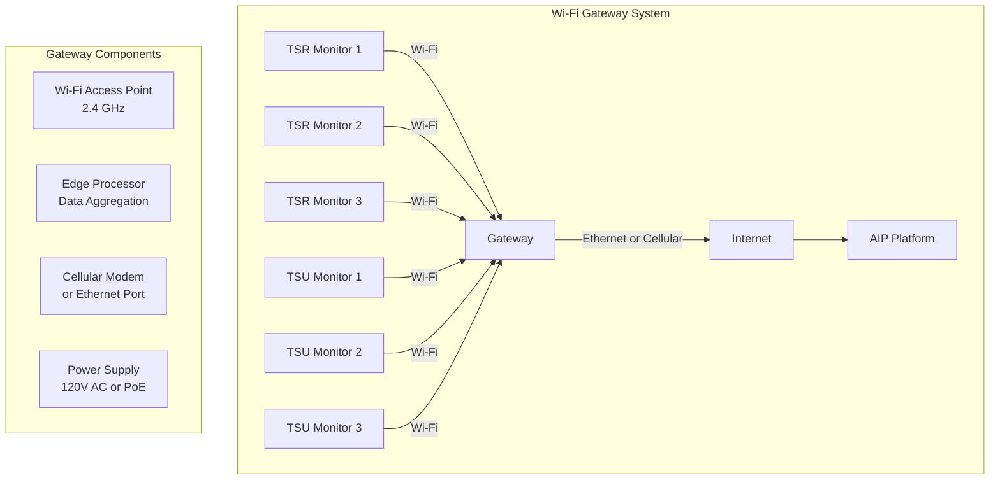
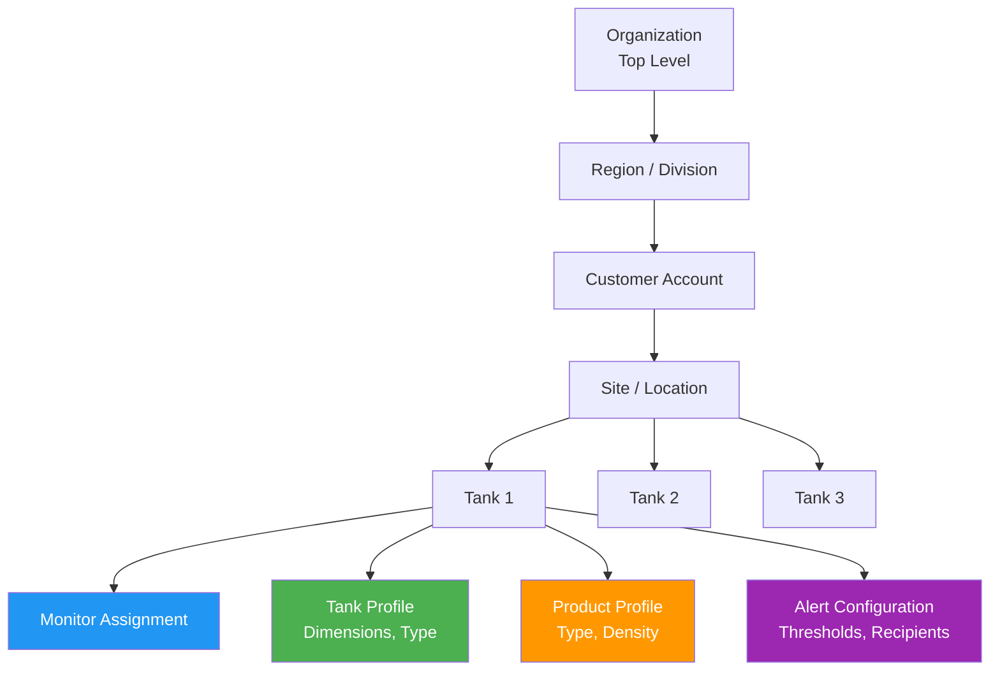
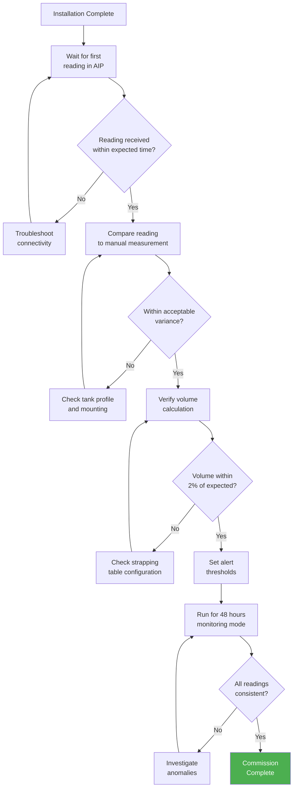
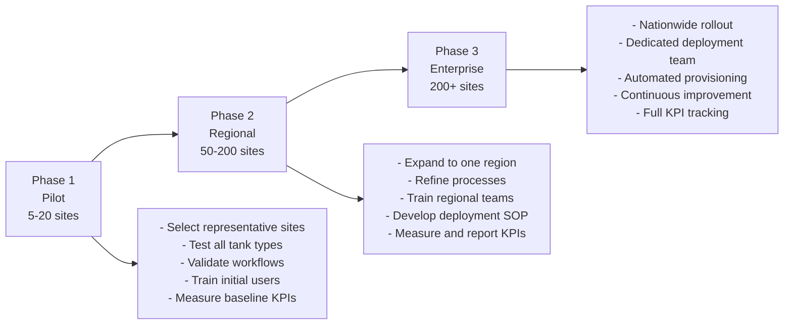
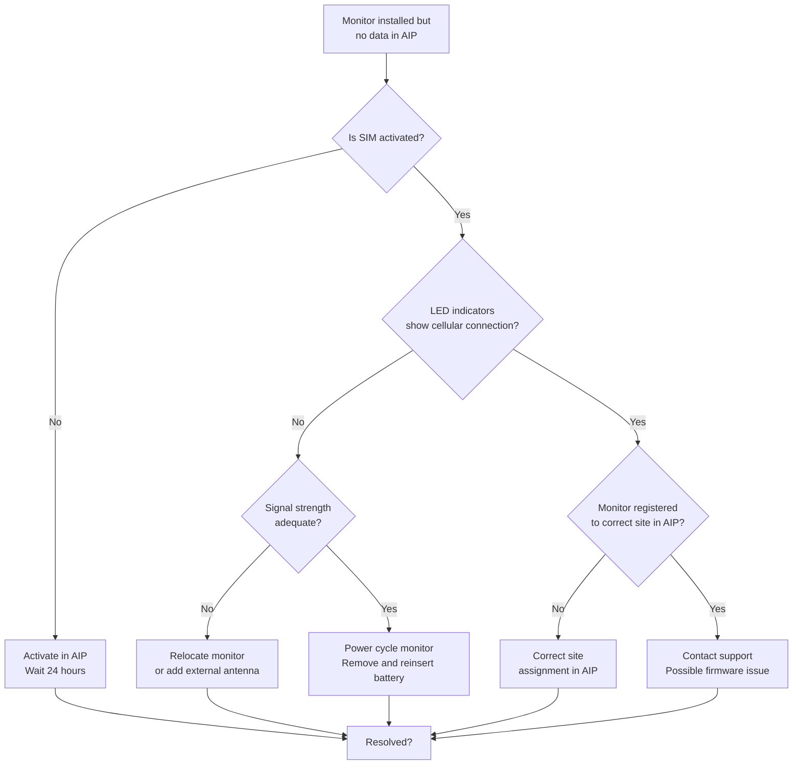

# Chapter 8: Installation and Deployment

## Learning Objectives

By the end of this chapter, you will be able to:

- Conduct a pre-installation site survey and assess cellular coverage
- Select and configure the correct monitor for a given tank
- Perform physical installation of TSR, TSC, TSU, and TSD monitors
- Configure tank profiles, dimensions, and product types in AIP
- Commission new installations and validate initial readings
- Plan and execute multi-site deployments at scale
- Diagnose and resolve common installation issues

---

## 8.1 Introduction: From Box to Dashboard

A wireless tank monitor is only valuable when it is correctly installed, properly configured, and reliably reporting data. This chapter walks through the complete installation lifecycle, from the initial site survey through commissioning and validation. Whether deploying a single monitor on a farm tank or rolling out thousands of units across a nationwide fleet, the fundamental process remains the same -- only the scale and logistics change.

!!! note "The Installation Quality Imperative"
    A poorly installed monitor wastes everyone's time and money. It generates inaccurate readings, triggers false alarms, and erodes user confidence in the system. Investing time in proper installation pays dividends throughout the life of the deployment. Industry data shows that 80% of post-installation support tickets trace back to installation errors that could have been avoided with proper site assessment and technique.


---

## 8.2 Pre-Installation Site Survey

### 8.2.1 Purpose of the Site Survey

The site survey is the most important step in ensuring a successful installation. It answers three fundamental questions:

1. **Will the monitor work here?** (Coverage, environment, compatibility)
2. **Which monitor is right for this tank?** (Type, size, product, access)
3. **What will the installation require?** (Tools, adapters, time, safety precautions)

### 8.2.2 Cellular Coverage Assessment

For cellular-connected monitors (TSR, TSU, TSD), cellular coverage at the tank location is the first and most critical assessment.

**Coverage testing methods:**

| Method | Tool | Accuracy | When to Use |
|---|---|---|---|
| Carrier coverage map | Online (carrier website) | Low (general area) | Initial screening |
| Smartphone signal test | Cell phone at tank location | Medium (phone vs. device antenna differ) | Quick field check |
| Dedicated signal tester | RF signal meter or test modem | High (actual device-level signal) | Final verification |
| Test unit deployment | Install a test monitor for 24-48 hours | Highest (real-world performance) | Questionable coverage areas |

!!! warning "Smartphone Signal Is Not a Guarantee"
    A smartphone showing 2-3 bars at a tank location does not guarantee that a TankScan monitor will connect. Smartphones have more powerful radios and larger antennas than IoT devices. Additionally, LTE-M and NB-IoT coverage (used by TankScan) differs from standard LTE coverage. Always use carrier IoT coverage maps or a test deployment for definitive assessment.

**Signal strength requirements:**

| Signal Metric | Minimum | Good | Excellent |
|---|---|---|---|
| RSSI (dBm) | -100 | -85 | -70 |
| RSRP (dBm) | -120 | -100 | -80 |
| RSRQ (dB) | -15 | -10 | -5 |
| SNR (dB) | 0 | 10 | 20 |

### 8.2.3 Tank Access and Openings Assessment

Every tank must be physically inspected to identify suitable mounting locations:

**For TSR (radar) installations:**

- [ ] Identify available openings on tank top (2" NPT bung is standard)
- [ ] Measure the opening thread type and size
- [ ] Verify the opening is not directly above a fill pipe, mixer, or baffle
- [ ] Check that the opening provides a clear path to the liquid surface
- [ ] Measure the distance from the opening to the tank bottom (sensor range check)
- [ ] Note any internal obstructions (heating coils, ladders, stiffening rings)

**For TSC (ATG gateway) installations:**

- [ ] Identify the ATG console model and firmware version
- [ ] Locate available communication ports (RS-232, RS-485, Ethernet)
- [ ] Verify power availability near the console (120V AC for TSC)
- [ ] Check for existing network connections (some TSC models use Ethernet backhaul)
- [ ] Note the number of tank probes connected to the ATG

**For TSU (tote/IBC) installations:**

- [ ] Verify IBC lid opening size (standard 6" or 150mm)
- [ ] Check that the IBC is accessible (not stacked, not against a wall)
- [ ] Note the product and whether it produces foam or vapor
- [ ] Assess whether Wi-Fi or cellular connectivity is appropriate

**For TSD (dial gauge reader) installations:**

- [ ] Identify the gauge manufacturer and model (Rochester, ME, etc.)
- [ ] Verify gauge face diameter and needle style
- [ ] Check that the gauge is readable and functioning correctly
- [ ] Ensure adequate clearance around the gauge for TSD mounting

### 8.2.4 Environmental Assessment



### 8.2.5 Site Survey Documentation

A complete site survey should document:

| Item | Details to Record |
|---|---|
| Site information | Customer name, address, GPS coordinates, site contact |
| Tank inventory | Number of tanks, types, sizes, products, ages |
| Tank measurements | Diameter, length, height, opening sizes, material |
| Cellular signal | Carrier, signal strength (dBm), test results |
| Hazardous areas | NEC classification, extent of classified zone |
| Access requirements | Keys, gate codes, scheduling restrictions |
| Power availability | Nearest outlet for TSC or gateway installations |
| Photos | Tank top openings, gauge faces, ATG consoles, site overview |
| Safety notes | PPE requirements, confined space, hot work restrictions |
| Special considerations | Foam, vapor, extreme temperatures, obstructions |

!!! tip "Photo Documentation"
    Take photos of everything during the site survey. A clear photo of a tank opening, gauge face, or ATG console often saves hours of troubleshooting later. Many field technicians use a standardized photo checklist: (1) overall site, (2) each tank exterior, (3) tank top/openings, (4) any existing gauges, (5) ATG console, (6) proposed mounting location.

---

## 8.3 Selecting the Right Monitor

### 8.3.1 Decision Framework

Based on the site survey, select the appropriate monitor using this systematic approach:



### 8.3.2 Monitor Configuration Options

Each monitor comes with configuration options that must be specified at the time of order:

**TSR Configuration Options:**

| Option | Choices | Selection Criteria |
|---|---|---|
| Mounting thread | 2" NPT, 1.5" NPT, flange | Match to tank opening |
| Antenna length | Standard, extended | Extended for deep tanks (> 40 ft) |
| Housing material | Standard, PVDF, stainless | Chemical compatibility |
| Communication | LTE-M cellular, satellite | Coverage at site |
| Hazardous area | Standard, C1D1, C1D2 | Site classification |
| Battery | Standard (5 yr), extended (10 yr) | Reporting frequency, accessibility |

**TSC Configuration Options:**

| Option | Choices | Selection Criteria |
|---|---|---|
| ATG protocol | Veeder-Root, Gilbarco, Franklin, Modbus | Match to ATG model |
| Connection type | RS-232, RS-485, Ethernet | Match to ATG port |
| Communication | Cellular, Ethernet backhaul | Site infrastructure |
| Power | AC adapter, PoE | Available power source |

---

## 8.4 Physical Installation

### 8.4.1 TSR Installation (Aboveground Tanks)

The TSR installation process for a typical aboveground tank:

```mermaid
graph TD
    subgraph "Step 1: Preparation"
        A1[Review site survey<br>and tank measurements]
        A2[Gather tools:<br>wrench, thread tape,<br>safety equipment]
        A3[Verify correct TSR<br>model and thread size]
    end

    subgraph "Step 2: Tank Access"
        B1[Ensure safe access<br>to tank top]
        B2[Use ladder or<br>scaffolding as needed]
        B3[Wear fall protection<br>if height > 4 ft]
    end

    subgraph "Step 3: Opening Prep"
        C1[Remove existing plug<br>or cap from bung]
        C2[Clean threads with<br>wire brush]
        C3[Apply PTFE tape or<br>pipe dope to threads]
    end

    subgraph "Step 4: Install Monitor"
        D1[Thread TSR into<br>opening by hand]
        D2[Tighten with wrench<br>to specified torque]
        D3[Verify monitor is<br>level and plumb]
    end

    subgraph "Step 5: Activate"
        E1[Power on monitor<br>via activation magnet]
        E2[Wait for cellular<br>connection (LED indicator)]
        E3[Verify first reading<br>appears in AIP]
    end

    A1 --> A2 --> A3 --> B1 --> B2 --> B3 --> C1 --> C2 --> C3 --> D1 --> D2 --> D3 --> E1 --> E2 --> E3
```

**Critical installation guidelines:**

!!! warning "Mounting Position"
    The TSR must be mounted so the radar beam has a clear, unobstructed path to the liquid surface. The sensor should be:

    - At least 6 inches away from any tank wall
    - Not directly above the fill pipe (turbulence causes false readings)
    - Not above heating coils, mixers, or baffles
    - Perpendicular to the liquid surface (within 2 degrees of vertical)

**Torque specifications:**

| Thread Size | Material | Recommended Torque |
|---|---|---|
| 2" NPT | Steel to steel | 40-50 ft-lbs |
| 2" NPT | Steel to aluminum | 25-35 ft-lbs |
| 1.5" NPT | Steel to steel | 30-40 ft-lbs |
| Flange (4-bolt) | With gasket | 15-20 ft-lbs per bolt, star pattern |

### 8.4.2 TSC Installation (ATG Gateway)

The TSC installation connects to an existing ATG console:

**Step-by-step process:**

1. **Power down the ATG communication port** (if possible; some ports are hot-swappable)
2. **Connect the TSC to the ATG**:
    - For RS-232: Use a straight-through DB-9 serial cable
    - For RS-485: Connect A/B wires to the appropriate terminals
    - For Ethernet: Use a standard Cat5/Cat6 patch cable
3. **Mount the TSC** in a dry, accessible location near the ATG console
4. **Connect power** (120V AC adapter or PoE, depending on model)
5. **Power on and configure** the ATG protocol on the TSC (via setup software or DIP switches)
6. **Verify communication** by checking the TSC status LEDs:
    - ATG LED: Solid green = communication established
    - Cell LED: Blinking green = cellular connected
    - Data LED: Flash = data transmitted to AIP



!!! tip "TSC and ATG Coexistence"
    The TSC is designed to share the ATG communication port with other systems (POS, BOS). It uses passive listening when possible and active polling during idle periods. However, some ATG configurations may require adjusting polling intervals to avoid communication conflicts. If the store's POS system uses the same ATG port, coordinate with the POS provider.

### 8.4.3 TSU Installation (Totes and IBCs)

TSU installation on totes and IBCs is the simplest of all TankScan products:

1. **Open the IBC lid** (typically a 6" threaded cap on top)
2. **Place the TSU adapter ring** on the opening
3. **Snap the TSU monitor** onto the adapter ring
4. **Close and secure** the assembly
5. **Scan the QR code** on the IBC (if available) to link the monitor to the container in AIP
6. **Activate** via the AIP mobile app or web interface

**Installation time**: 2-5 minutes per tote (including AIP configuration)

!!! example "Batch TSU Deployment"
    A lubricant distributor deploying TSU monitors on 200 totes developed the following batch process:

    1. Pre-configure all 200 monitors in AIP with customer and product data (office, 1 day)
    2. Label each monitor with its assigned customer and tote number
    3. Train 3 field technicians on the snap-on installation (1 hour)
    4. Deploy teams to customer sites (average 8 totes per site, 25 sites)
    5. Each technician installs 15-20 monitors per day
    6. Full deployment completed in 4 working days

    **Total deployment time**: 5 days (1 day prep + 4 days field) for 200 monitors

### 8.4.4 TSD Installation (Pressurized Tank Gauges)

The TSD installs over the existing mechanical gauge on a pressurized tank:



**TSD calibration process:**

The TSD must be calibrated to correctly read the specific gauge it is installed on:

1. Read the current gauge value (e.g., the gauge shows 65%)
2. Enter this value into the TSD setup interface
3. The TSD maps the sensor reading to the gauge value
4. Repeat at a different level if possible (e.g., after a delivery when gauge shows 85%)
5. The TSD creates a two-point calibration that maps sensor output to gauge percentage

| Calibration Points | Accuracy | Recommended For |
|---|---|---|
| Single point | +/- 5% | Quick installation, non-critical |
| Two-point | +/- 3% | Standard installation |
| Three-point | +/- 2% | High-accuracy requirements |
| Factory calibrated | +/- 1.5% | Pre-matched to specific gauge model |

---

## 8.5 Cellular Activation and Connectivity

### 8.5.1 Cellular Activation Process

TankScan monitors use embedded SIM cards (eSIM) or pre-installed SIM cards that are activated through the AIP platform.

**Activation workflow:**

1. Log into AIP and navigate to Device Management
2. Enter the monitor's serial number (printed on the device label and included in the packaging)
3. Select the cellular carrier (may be pre-assigned based on region)
4. Assign the monitor to a customer account and site location
5. The AIP platform sends an activation command to the carrier
6. The monitor's SIM is activated (typically within minutes)
7. On the next reporting cycle, the monitor transmits its first reading

!!! note "Activation Timing"
    Cellular activation can take up to 24 hours in some cases, though most activations complete within minutes. For planned installations, activate the SIM in AIP before arriving at the site so the monitor is ready to connect immediately after physical installation.

### 8.5.2 Connectivity Troubleshooting

| Symptom | Possible Cause | Resolution |
|---|---|---|
| No first reading after 24 hours | SIM not activated | Verify activation status in AIP |
| Intermittent reporting | Marginal signal strength | Check RSSI; consider external antenna |
| Delayed transmissions | Network congestion | Normal for NB-IoT; wait for off-peak |
| Monitor shows offline | Battery depleted | Replace or recharge battery |
| Readings but no data in AIP | Monitor not assigned to site | Check device-to-site mapping in AIP |
| Cellular connected but no ATG data (TSC) | Serial cable issue | Verify cable, port, and protocol settings |

### 8.5.3 External Antenna Options

When cellular signal is weak, an external antenna can improve connectivity:

| Antenna Type | Gain | Use Case |
|---|---|---|
| Standard (internal) | 0 dBi | Good coverage areas |
| Stub antenna (external) | 2-3 dBi | Moderate improvement |
| Panel antenna (directional) | 6-8 dBi | Aimed at distant cell tower |
| Yagi antenna (high-gain) | 10-14 dBi | Very weak signal areas |
| Cable extension | Loss: 1-3 dB per 10 ft | Move antenna to better location |

!!! warning "Antenna Cable Length"
    Every foot of coaxial cable between the monitor and an external antenna introduces signal loss. Keep cable runs as short as possible. A 50-foot cable run with standard RG-58 coax loses approximately 5 dB of signal -- enough to turn a marginal connection into no connection. Use low-loss cable (LMR-400) for runs longer than 20 feet.

---

## 8.6 Gateway Installation for Wi-Fi Systems

### 8.6.1 When to Use a Wi-Fi Gateway

Wi-Fi gateways are used when multiple monitors are concentrated at a single site and a local network is available or can be installed. Common scenarios:

- Tank farms with 10+ tanks in close proximity
- Warehouses with many totes/IBCs
- Manufacturing facilities with multiple fluid tanks
- Sites where cellular coverage is poor but internet is available

### 8.6.2 Gateway Architecture



### 8.6.3 Gateway Placement

The gateway must be positioned to provide Wi-Fi coverage to all monitors at the site:

| Factor | Guideline |
|---|---|
| Range (open air) | Up to 300 feet (100 meters) from each monitor |
| Range (obstructed) | 50-150 feet depending on obstructions (walls, tanks) |
| Height | Mount as high as practical; above tank tops is ideal |
| Orientation | Antenna should be vertical for horizontal coverage pattern |
| Power | Within cable reach of 120V outlet or PoE switch |
| Internet | Within Ethernet cable reach (or use cellular backhaul) |
| Weather | Outdoor-rated enclosure (NEMA 4X) for outdoor installations |

### 8.6.4 Gateway Configuration

1. Mount the gateway in the selected location
2. Connect power (AC adapter or PoE)
3. Connect to the internet (Ethernet or configure cellular)
4. Access the gateway's configuration interface (web browser or mobile app)
5. Configure the Wi-Fi network name and security settings
6. Register the gateway in AIP and assign it to the site
7. Configure each monitor to connect to the gateway's Wi-Fi network
8. Verify all monitors report through the gateway to AIP

---

## 8.7 AIP Configuration

### 8.7.1 Creating the Site in AIP

Before monitors can report data, the organizational structure must be configured in AIP:



### 8.7.2 Tank Profile Configuration

The tank profile tells AIP how to convert raw level readings into meaningful volume data:

| Parameter | Description | Example |
|---|---|---|
| Tank name | Descriptive identifier | "Main Diesel - North" |
| Tank type | Geometry selection | Horizontal cylinder |
| Diameter | Internal diameter | 64 inches |
| Length | Shell length | 144 inches |
| Head type | End cap geometry | 2:1 elliptical |
| Total capacity | Nameplate capacity | 4,000 gallons |
| Maximum fill | Maximum safe fill level | 95% (3,800 gallons) |
| Minimum level | Unusable heel/deadband | 3 inches (50 gallons) |
| Strapping source | How volume is calculated | Calculated from dimensions |
| Units | Display units | US gallons |

### 8.7.3 Product Profile Configuration

Each tank must be assigned a product profile:

| Parameter | Description | Example |
|---|---|---|
| Product name | Common product name | Diesel #2 |
| Product code | Internal product code | DSL-002 |
| Specific gravity | Density relative to water | 0.85 |
| Dielectric constant | For radar optimization | 2.2 |
| Temperature coefficient | For volume correction | 0.00046 per degree F |
| Color code | Dashboard display color | Yellow |
| Reorder threshold | Level triggering reorder alert | 25% |
| Critical threshold | Level triggering critical alert | 10% |

### 8.7.4 Alert Configuration

Alerts are the primary way AIP communicates actionable information to users:

| Alert Type | Trigger Condition | Typical Response |
|---|---|---|
| Low level | Tank falls below reorder threshold | Schedule delivery |
| Critical low | Tank falls below critical threshold | Urgent delivery dispatch |
| High level | Tank rises above maximum fill | Investigate (overfill or collection needed) |
| Sudden drop | Level decreases faster than normal | Investigate (leak, theft, meter error) |
| Sudden rise | Level increases unexpectedly | Verify delivery (unauthorized access?) |
| No communication | Monitor fails to report | Check device health |
| Temperature out of range | Product temperature abnormal | Investigate heating/cooling issue |
| Consumption anomaly | Usage pattern deviates from historical | Customer operational change |

**Alert delivery methods:**

| Method | Latency | Best For |
|---|---|---|
| Email | Minutes | Non-urgent alerts, reports |
| SMS text | Seconds | Urgent alerts, after-hours |
| Push notification (app) | Seconds | Field personnel |
| Webhook (API) | Seconds | System integration, automated workflows |
| Dashboard indicator | Real-time | Operations center monitoring |

!!! tip "Alert Fatigue Prevention"
    Configure alerts carefully to avoid "alert fatigue" -- the tendency for operators to ignore alerts when too many non-actionable alerts are generated. Start with conservative thresholds and adjust based on operational experience. Use alert suppression windows for expected events (e.g., suppress low-level alerts during scheduled deliveries).

---

## 8.8 Commissioning and Initial Readings

### 8.8.1 First Reading Validation

After installation and AIP configuration, the first readings must be validated against a known reference:

**Validation checklist:**

| Check | Method | Acceptable Variance |
|---|---|---|
| Level reading | Compare TSR level to manual dip stick or sight glass | +/- 0.5 inches |
| Volume calculation | Compare AIP volume to known delivery amount or manual calculation | +/- 2% |
| Product identification | Verify AIP shows correct product for the tank | Must match exactly |
| Temperature (if available) | Compare to independent thermometer | +/- 2 degrees F |
| Reporting interval | Monitor time between successive readings | Within 10% of configured interval |
| Signal strength | Check cellular signal metrics in AIP | Above minimum thresholds |

### 8.8.2 Commissioning Process



### 8.8.3 Burn-In Period

Allow a 48-72 hour "burn-in" period after installation before considering the monitor fully operational. During this period:

- Monitor should report at every expected interval
- Readings should be consistent (no wild fluctuations)
- Level should track logically (gradual decrease for consumption, jump for delivery)
- No false alarms should trigger
- Signal strength should remain stable

!!! example "Commissioning Example"
    **Tank**: 8,000-gallon horizontal steel diesel tank
    **Monitor**: TSR Cellular, 2" NPT mount
    **Manual dip stick reading**: 42.5 inches
    **TSR first reading**: 42.3 inches (delta: 0.2 inches -- within spec)
    **AIP calculated volume**: 5,240 gallons
    **Expected volume (from recent delivery receipt)**: 5,200 gallons (delta: 40 gallons, 0.8% -- within spec)
    **Signal strength**: RSSI -78 dBm (Good)
    **Result**: Commission approved. Monitor operational.

---

## 8.9 Calibration and Validation

### 8.9.1 When Calibration Is Needed

Most TankScan monitors are factory-calibrated and do not require field calibration for the level measurement itself. However, the level-to-volume conversion depends on accurate tank dimensions, which requires validation.

| Situation | Calibration Action |
|---|---|
| New installation | Validate level and volume against manual measurement |
| Tank dimensions uncertain | Perform wet calibration or verify with manufacturer data |
| Readings drift over time | Check for sensor fouling, condensation, or mechanical shift |
| After tank modification | Update tank profile dimensions in AIP |
| Accuracy concerns | Perform multi-point validation at different fill levels |
| Customer dispute | Independent verification with calibrated dip tape |

### 8.9.2 Multi-Point Validation

For critical tanks (custody transfer, regulatory compliance), a multi-point validation provides the highest confidence:

1. Record the current tank level (TSR reading and manual measurement)
2. Add a known quantity of product (e.g., 500 gallons from a calibrated meter)
3. Allow the liquid to settle (5-10 minutes)
4. Record the new level (TSR and manual)
5. Compare the volume change reported by AIP to the known quantity added
6. Repeat at different fill levels if possible (low, mid, high)

$$\text{Calibration Error} = \frac{V_{\text{AIP}} - V_{\text{actual}}}{V_{\text{actual}}} \times 100\%$$

Acceptable calibration error:

| Application | Maximum Error |
|---|---|
| General inventory monitoring | +/- 2% |
| Delivery optimization | +/- 1% |
| Custody transfer | +/- 0.5% |
| Regulatory compliance (EPA) | +/- 0.2% (may require certified equipment) |

---

## 8.10 Multi-Site Deployment Planning

### 8.10.1 Scaling from Pilot to Enterprise

Large deployments should follow a phased approach:



### 8.10.2 Pilot Program Design

A successful pilot program should:

| Element | Guideline |
|---|---|
| Duration | 60-90 days minimum |
| Site selection | Mix of easy and challenging sites |
| Tank variety | Include all tank types the enterprise uses |
| Success metrics | Define before pilot begins (run-out reduction, route efficiency, etc.) |
| User feedback | Structured surveys at 30 and 60 days |
| Executive sponsor | Ensure senior management visibility and support |
| Comparison group | Keep unmonitored sites as a control group |

### 8.10.3 Deployment Logistics at Scale

For large deployments (100+ sites), logistics planning becomes critical:

**Deployment team composition:**

| Role | Responsibility | Ratio |
|---|---|---|
| Project manager | Overall coordination, scheduling, reporting | 1 per deployment |
| AIP administrator | Platform configuration, user setup | 1 per 500 monitors |
| Field technician | Physical installation, commissioning | 1 per 8-12 installations/day |
| Training coordinator | End-user and dispatcher training | 1 per region |
| Support engineer | Post-installation troubleshooting | 1 per 200 monitors (during deployment) |

**Daily installation rate targets:**

| Monitor Type | Installs per Technician per Day | Notes |
|---|---|---|
| TSR (standard AST) | 6 - 10 | Depends on tank access and travel time |
| TSC (ATG gateway) | 4 - 6 | More complex configuration |
| TSU (tote/IBC) | 15 - 25 | Fastest installation |
| TSD (dial gauge) | 8 - 12 | Calibration adds time |
| Mixed types | 6 - 8 average | Typical for multi-type sites |

### 8.10.4 Deployment Planning Spreadsheet

A deployment plan should track:

| Column | Description |
|---|---|
| Site ID | Unique identifier |
| Customer name | Account name |
| Address | Physical address |
| Tank count | Number of tanks at site |
| Monitor types | TSR, TSC, TSU, TSD (and quantities) |
| Survey date | When site survey was completed |
| Survey status | Pass, conditional, fail |
| Scheduled install date | Planned installation date |
| Assigned technician | Who will install |
| Install status | Scheduled, in progress, complete, issue |
| Commission date | When validated and handed off |
| Notes | Any special requirements or issues |

---

## 8.11 Troubleshooting Common Installation Issues

### 8.11.1 No Communication After Installation



### 8.11.2 Inaccurate Level Readings

| Symptom | Likely Cause | Resolution |
|---|---|---|
| Reading stuck at one value | Sensor blocked or frozen | Clean sensor face; check for ice/debris |
| Reading shows empty on full tank | Wrong measurement range configured | Verify sensor-to-bottom distance in AIP |
| Reading shows full on empty tank | Sensor measuring its own reflection | Increase deadband distance in configuration |
| Readings fluctuate wildly | Interference from fill pipe or internal structure | Reposition sensor away from obstructions |
| Readings consistently high | Foam on liquid surface | Enable foam rejection; reposition away from fill |
| Readings consistently low | Dense vapor affecting radar speed | Apply vapor correction factor |
| Random spikes or drops | Electrical noise or multipath reflection | Check grounding; add signal filtering in AIP |

### 8.11.3 ATG Communication Issues (TSC)

| Symptom | Likely Cause | Resolution |
|---|---|---|
| TSC connected but no tank data | Wrong ATG protocol selected | Change protocol to match ATG model |
| Partial data (some tanks missing) | ATG probe numbering mismatch | Verify probe assignment in ATG and TSC |
| Data lag (readings are old) | ATG not updating inventory | Check ATG for alarm conditions; restart if needed |
| Intermittent data drops | Serial cable issue | Replace cable; check connector pins |
| "Communication error" in ATG log | TSC polling too aggressively | Increase poll interval; check for port conflicts |

### 8.11.4 Environmental Issues

| Issue | Cause | Prevention/Solution |
|---|---|---|
| Condensation on sensor lens | Temperature cycling, humid environment | Sensor has hydrophobic coating; replace if degraded |
| Corrosion on mounting threads | Chemical vapor exposure | Use stainless hardware; apply anti-seize compound |
| UV damage to housing | Years of sun exposure | UV-stabilized housing; replace if cracked |
| Spider webs in sensor | Insects nesting in the antenna area | Protective screen; periodic inspection |
| Ice formation on sensor | Freezing rain, condensation | Self-heating feature on some models; manual removal |
| Bird damage | Birds pecking at housing | Install protective cage or deterrent |

!!! tip "Preventive Maintenance Schedule"
    While TankScan monitors are designed for years of maintenance-free operation, a brief annual inspection prevents many issues:

    - **Visual check**: Look for physical damage, corrosion, or discoloration
    - **Mounting check**: Verify the monitor is still tight in its opening
    - **Signal check**: Confirm signal strength is stable (compare to installation baseline)
    - **Reading validation**: Compare monitor reading to a manual measurement
    - **Battery check**: Verify remaining battery life in AIP (most last 5+ years)
    - **Cleaning**: Remove any debris, spider webs, or buildup from the sensor area

---

## 8.12 Safety During Installation

### 8.12.1 General Safety Requirements

All TankScan installations must comply with applicable safety regulations:

| Hazard | Precaution |
|---|---|
| Falls (tank top access) | Fall protection required above 4 feet (OSHA 1926.501) |
| Confined space (tank entry) | TankScan installation should NEVER require tank entry |
| Hot work (welding, cutting) | TankScan installation should NEVER require hot work |
| Flammable atmospheres | Use only intrinsically safe (IS) tools and equipment in classified areas |
| Electrical hazards | Follow lockout/tagout procedures when connecting to powered equipment |
| Chemical exposure | Wear appropriate PPE (gloves, eye protection) when opening tank bungs |
| Vehicle traffic | Wear high-visibility clothing; use traffic cones at roadside sites |
| Wildlife/insects | Be aware of wasps, snakes, and other hazards in tank areas |

### 8.12.2 Hazardous Area Installation Procedures

When installing in classified hazardous areas (Class I, Div 1 or Div 2):

!!! warning "Hazardous Area Requirements"
    - Only install equipment that is certified for the area classification
    - Do not open any equipment housing in a hazardous area (risk of ignition)
    - Do not use non-intrinsically-safe tools (e.g., standard cell phones, radios, cameras)
    - Activate monitors BEFORE entering the hazardous area, or use IS-certified activation tools
    - Follow the site's hot work and equipment entry permit procedures
    - If in doubt about area classification, treat the area as Class I, Division 1

---

## 8.13 Chapter Summary

Successful installation and deployment of wireless tank monitors follows a systematic process:

1. **Site survey**: Assess coverage, access, environment, and tank characteristics before ordering equipment
2. **Monitor selection**: Match the right monitor to each tank based on type, product, and environment
3. **Physical installation**: Follow manufacturer guidelines for mounting, torque, and positioning
4. **Connectivity setup**: Activate cellular service, install gateways as needed, verify signal strength
5. **AIP configuration**: Create accurate tank profiles, product profiles, and alert configurations
6. **Commissioning**: Validate first readings against manual measurements
7. **Burn-in period**: Monitor for 48-72 hours before declaring operational
8. **Scale**: Use pilot-to-enterprise phasing for large deployments

The most common installation failures trace back to inadequate site surveys and incorrect AIP configuration. Investing time upfront in these steps dramatically reduces post-installation support needs and ensures that the monitoring system delivers accurate, reliable data from day one.

---

## Review Questions

!!! question "Question 1 -- Knowledge (Remember)"
    List the five main steps of the pre-installation site survey and identify at least two items that should be documented for each step.

!!! question "Question 2 -- Comprehension (Understand)"
    Explain why a smartphone signal strength test at a tank location is not a reliable predictor of TankScan monitor connectivity. Describe at least three technical differences between a smartphone's cellular capability and an IoT device's cellular capability.

!!! question "Question 3 -- Application (Apply)"
    You are installing a TSR monitor on a 12,000-gallon horizontal steel diesel tank. The tank has a 2" NPT bung on top, but it is located directly above the fill pipe. The only other opening is a 4" flange that currently holds a pressure/vacuum vent. Describe how you would proceed with the installation, including any adapter requirements and the reason you cannot use the opening above the fill pipe.

!!! question "Question 4 -- Analysis (Analyze)"
    A deployment of 50 TSR monitors across a fuel distribution network shows that 8 monitors (16%) are reporting intermittently -- some readings are missing. All monitors were installed by the same technician using the same process. Analyze the possible causes of this pattern and describe a systematic troubleshooting approach. What data from AIP would you examine first?

!!! question "Question 5 -- Synthesis (Create)"
    Design a deployment plan for a propane distributor who wants to install TSD monitors on 800 residential propane tanks across a 5-state territory. The distributor has 6 field technicians available and wants the deployment completed within 90 days. Address: phasing strategy, daily installation targets, AIP configuration workflow, quality assurance process, and how you would handle sites with no cellular coverage.
