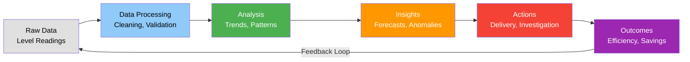
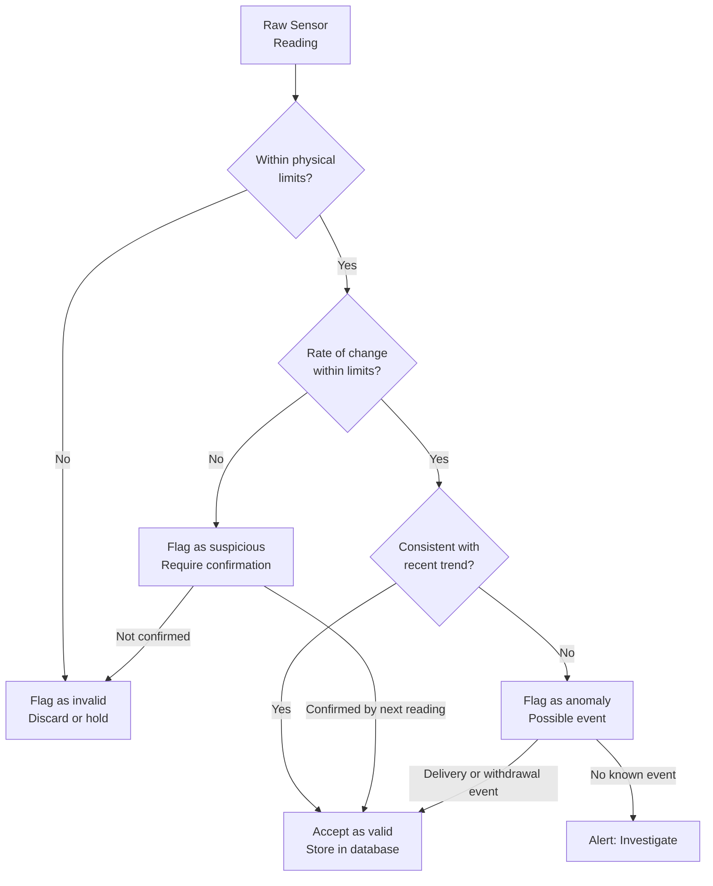
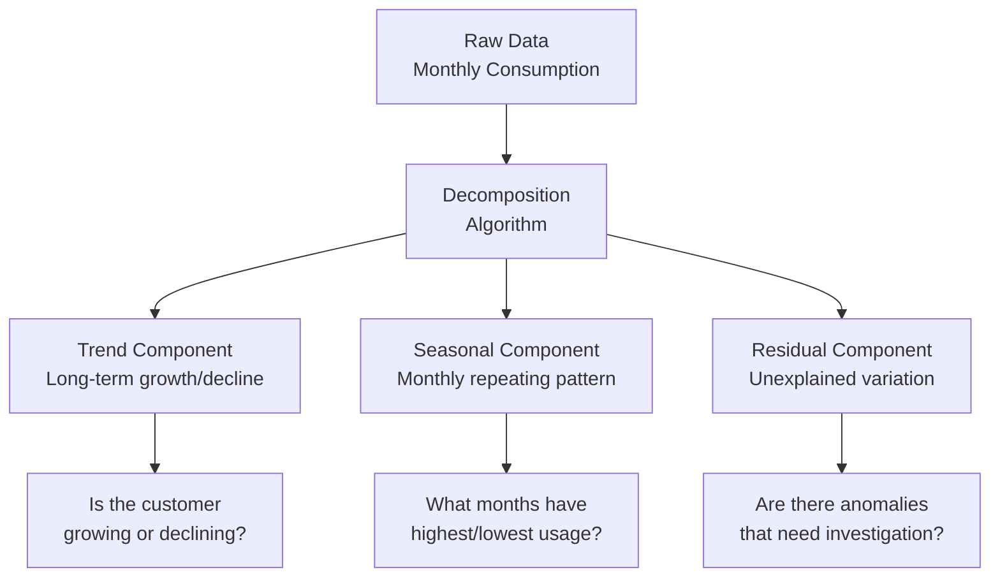
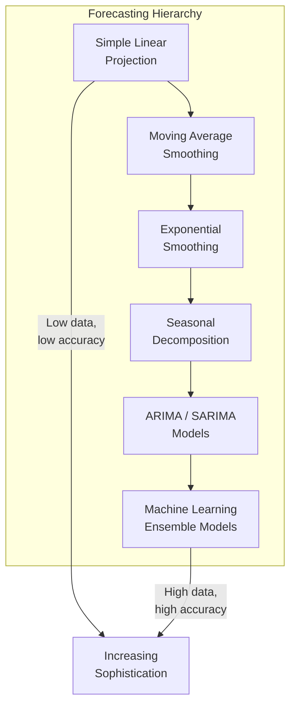
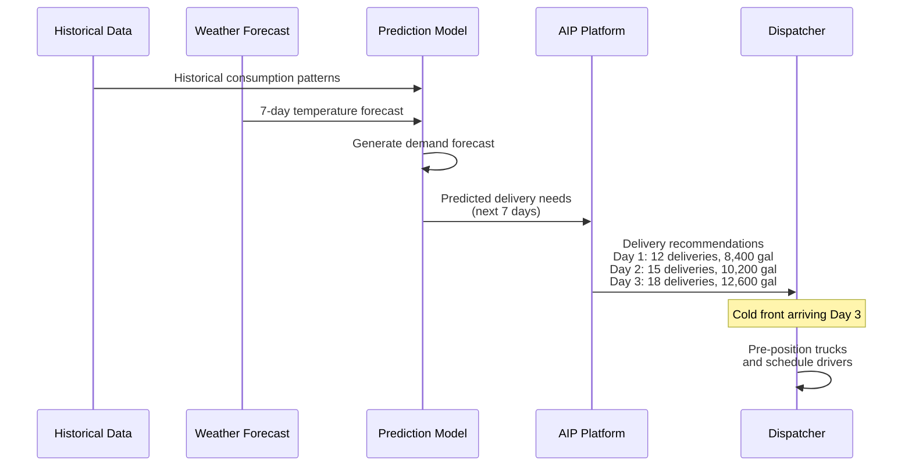
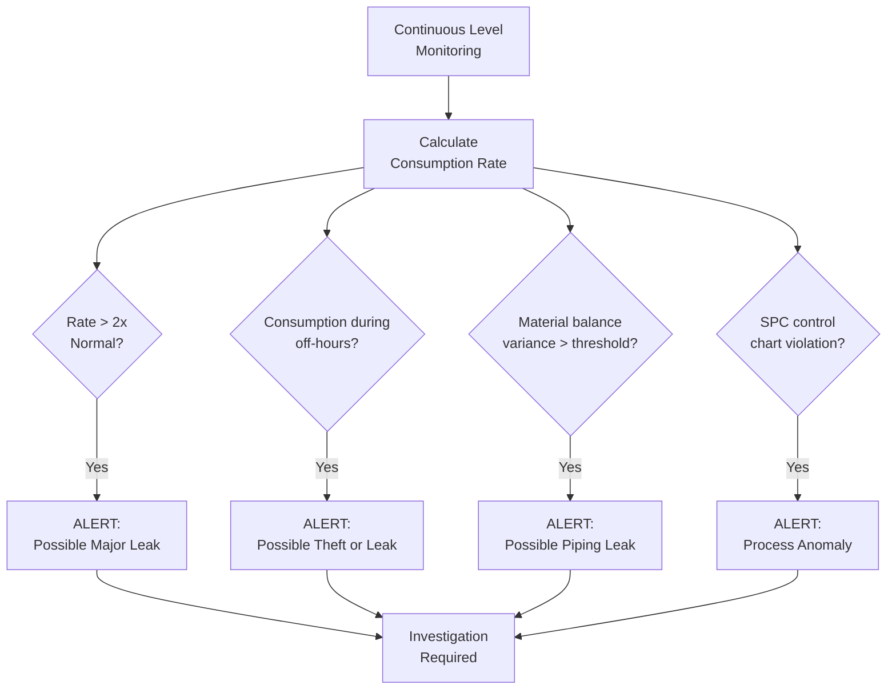
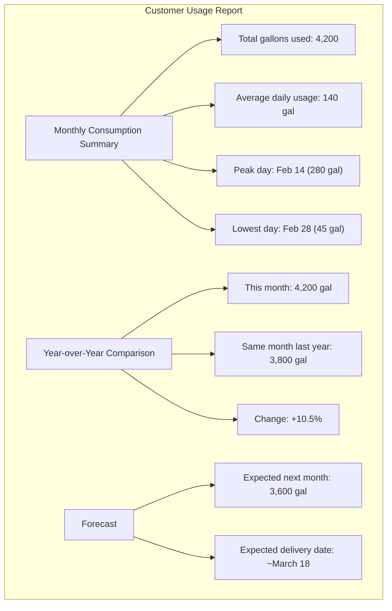
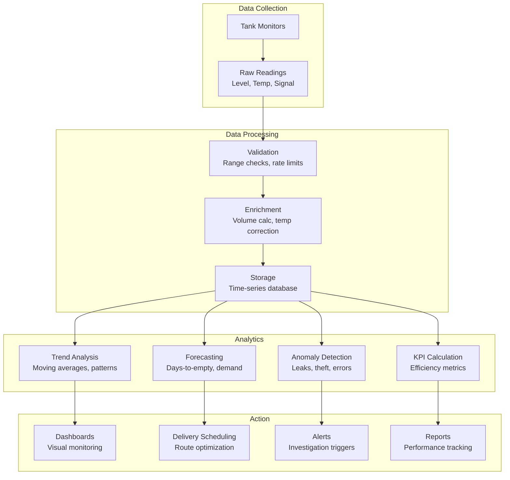

# Chapter 9: Data Analytics and Optimization

## Learning Objectives

By the end of this chapter, you will be able to:

- Describe the fundamentals of tank monitoring data collection and quality management
- Apply trend analysis techniques to identify consumption patterns and seasonal variations
- Calculate reorder points and forecast inventory levels using statistical methods
- Design anomaly detection algorithms for leak, theft, and meter error identification
- Interpret key performance indicators (KPIs) for tank monitoring operations
- Explain how Python analytics integration extends TankScan capabilities

---

## 9.1 Introduction: From Data to Decisions

A wireless tank monitor that reports a level reading every four hours generates approximately 2,190 data points per year. A fleet of 1,000 monitors generates 2.19 million data points per year. This data, in its raw form, is just numbers -- a stream of level measurements, timestamps, and device identifiers. The value of wireless monitoring lies not in the data itself, but in the **insights extracted from that data** and the **actions those insights enable**.

Data analytics transforms raw level readings into:

- **Trend lines** that reveal consumption patterns
- **Forecasts** that predict when tanks will need service
- **Anomaly alerts** that detect problems (leaks, theft, equipment failure)
- **Optimization recommendations** that improve operational efficiency
- **KPIs** that measure and improve business performance



This chapter explores the analytics capabilities built into the AIP platform and the advanced analytics techniques that can be applied to tank monitoring data.

---

## 9.2 Data Collection Fundamentals

### 9.2.1 Reporting Frequency

The reporting frequency determines how many data points are collected and how granular the analysis can be.

| Frequency | Data Points/Day | Data Points/Year | Best For |
|---|---|---|---|
| 1x per day | 1 | 365 | Slow-consumption tanks, satellite (cost savings) |
| 4x per day (every 6 hrs) | 4 | 1,460 | Standard monitoring, most applications |
| 6x per day (every 4 hrs) | 6 | 2,190 | Active consumption, delivery-critical |
| 12x per day (every 2 hrs) | 12 | 4,380 | High-throughput, leak detection |
| 24x per day (every 1 hr) | 24 | 8,760 | Critical applications, real-time operations |
| Event-driven | Variable | Variable | Level change triggers additional reports |

!!! note "Battery Life vs. Reporting Frequency"
    Higher reporting frequencies consume more battery power. A TSR monitor configured to report once per day may last 10+ years on a single battery, while one reporting every hour may last only 2-3 years. The AIP platform allows per-device frequency configuration to balance data granularity with battery life.

### 9.2.2 Data Quality Management

Raw data from field sensors contains noise, gaps, and occasional errors. Data quality management is essential before analytics can be trusted.

**Common data quality issues:**

| Issue | Cause | Detection Method | Correction |
|---|---|---|---|
| Missing readings | Communication failure, battery depletion | Gap in timestamp sequence | Interpolation between valid readings |
| Spike readings | Electrical noise, multipath reflection | Value exceeds physical limits or rate-of-change limits | Median filter or outlier rejection |
| Stuck readings | Sensor failure, frozen sensor | Identical values for extended period | Flag as suspect; alert for inspection |
| Gradual drift | Sensor aging, calibration shift | Comparison to manual measurement | Recalibration; offset correction |
| Offset error | Installation change, product change | Sudden shift in baseline level | Recalibrate after verifying tank condition |
| Temperature artifacts | Thermal expansion of product | Correlated with ambient temperature | Apply temperature compensation |

**Data quality pipeline:**



### 9.2.3 Data Storage and Retention

The AIP platform stores historical data for long-term analysis:

| Data Type | Resolution | Retention Period | Storage Method |
|---|---|---|---|
| Raw readings | As received (1-24 per day) | 2 years | Time-series database |
| Hourly summaries | 1 per hour (interpolated) | 5 years | Aggregated database |
| Daily summaries | 1 per day (min, max, avg, delta) | 10 years | Aggregated database |
| Events (deliveries, alerts) | As they occur | 10 years | Event database |
| Monthly reports | 1 per month | Indefinite | Report archive |

---

## 9.3 Trend Analysis and Consumption Patterns

### 9.3.1 Basic Consumption Rate Calculation

The simplest analytical metric is the consumption rate: how fast is the tank emptying?

$$\text{Consumption Rate} = \frac{\Delta V}{\Delta t} = \frac{V_1 - V_2}{t_2 - t_1}$$

Where:

- $V_1$ = volume at time $t_1$ (earlier measurement)
- $V_2$ = volume at time $t_2$ (later measurement)
- $\Delta t$ = time interval (hours, days)

!!! example "Consumption Rate Calculation"
    A diesel tank reported the following readings:

    - Monday 6:00 AM: 4,200 gallons
    - Monday 6:00 PM: 4,050 gallons
    - Tuesday 6:00 AM: 3,920 gallons
    - Tuesday 6:00 PM: 3,780 gallons

    **12-hour consumption rates:**

    - Monday day: $(4200 - 4050) / 12 = 12.5$ gallons/hour
    - Monday night: $(4050 - 3920) / 12 = 10.8$ gallons/hour
    - Tuesday day: $(3920 - 3780) / 12 = 11.7$ gallons/hour

    **Average consumption rate**: $11.7$ gallons/hour or $280$ gallons/day

### 9.3.2 Moving Average Smoothing

Raw consumption rates fluctuate. A **moving average** smooths these fluctuations to reveal the underlying trend.

**Simple Moving Average (SMA):**

$$\text{SMA}_n = \frac{1}{n} \sum_{i=0}^{n-1} R_{t-i}$$

Where $R_{t-i}$ is the consumption rate at time period $t-i$, and $n$ is the number of periods in the window.

**Exponential Moving Average (EMA):**

$$\text{EMA}_t = \alpha \cdot R_t + (1 - \alpha) \cdot \text{EMA}_{t-1}$$

Where $\alpha$ is the smoothing factor (typically 0.1 to 0.3). The EMA gives more weight to recent data, making it more responsive to trend changes than the SMA.

| Method | Window | Responsiveness | Noise Rejection | Best For |
|---|---|---|---|---|
| SMA (7-day) | 7 days | Moderate | Good | Weekly pattern detection |
| SMA (30-day) | 30 days | Low | Excellent | Monthly trend analysis |
| EMA (alpha = 0.2) | Effective ~10 periods | High | Moderate | Delivery forecasting |
| EMA (alpha = 0.1) | Effective ~20 periods | Moderate | Good | Seasonal analysis |

### 9.3.3 Consumption Pattern Visualization

The AIP platform provides several standard visualizations:

**Level Over Time (Primary Chart):**

```
Volume (gal)
5000 |---._                     .---.
     |     ---._           .--'     ---._
4000 |          ---._   .--'             ---._
     |               --'                      ---
3000 |   Delivery    Consumption    Delivery
     |   Event       Period         Event
2000 |
     |________________________________________________
     Jan 1     Jan 8     Jan 15    Jan 22    Jan 29
```

**Consumption Rate Over Time:**

```
Gal/Day
400 |
    |  *
300 |     *  *              *  *
    |  *     *  *        *     *
200 |           *  *  *           *  *
    |                                *  *
100 |                                     *
    |________________________________________________
    Jan 1     Jan 8     Jan 15    Jan 22    Jan 29
```

### 9.3.4 Day-of-Week Patterns

Many tanks show consistent day-of-week consumption patterns:

| Customer Type | Highest Days | Lowest Days | Pattern |
|---|---|---|---|
| Gas station | Friday, Saturday | Monday, Tuesday | Weekend traffic |
| Construction site | Monday - Friday | Saturday, Sunday | Workweek only |
| Restaurant (cooking oil) | Friday, Saturday | Monday | Weekend dining |
| Office building (HVAC fuel) | Monday - Friday | Saturday, Sunday | Workweek HVAC |
| Residential (heating) | All days similar | None | Weather-driven, not schedule-driven |

---

## 9.4 Seasonal Variation Analysis

### 9.4.1 Seasonal Decomposition

Many tank monitoring applications exhibit strong seasonal patterns. **Seasonal decomposition** separates the data into three components:

$$Y_t = T_t + S_t + R_t$$

Where:

- $Y_t$ = observed value at time $t$
- $T_t$ = trend component (long-term direction)
- $S_t$ = seasonal component (repeating pattern)
- $R_t$ = residual component (random variation)



### 9.4.2 Heating Fuel Seasonal Pattern

Heating fuel (heating oil, propane for residential heating) shows the most dramatic seasonality:

| Month | Typical Consumption Index | Category |
|---|---|---|
| January | 1.8x average | Peak |
| February | 1.7x average | Peak |
| March | 1.3x average | Shoulder |
| April | 0.7x average | Low |
| May | 0.3x average | Minimum |
| June | 0.2x average | Minimum |
| July | 0.2x average | Minimum |
| August | 0.2x average | Minimum |
| September | 0.4x average | Low |
| October | 0.8x average | Shoulder |
| November | 1.3x average | Shoulder |
| December | 1.6x average | Peak |

### 9.4.3 Using Seasonal Data for Planning

Seasonal patterns inform critical business decisions:

!!! tip "Pre-Season Fill Strategy"
    Fuel distributors often implement a "pre-season fill" strategy for heating fuel customers. Using historical seasonal data from TankScan, they identify all customers whose tanks will need delivery in the first month of heating season and pre-deliver during the off-peak shoulder months (September-October). This flattens the demand curve, reduces fleet stress during peak season, and ensures customers start winter with full tanks.

---

## 9.5 Inventory Level Forecasting

### 9.5.1 Days-to-Empty Calculation

The most fundamental forecast is **days-to-empty** (DTE) -- how many days until the tank reaches a critical level.

**Simple DTE (linear projection):**

$$\text{DTE} = \frac{V_{\text{current}} - V_{\text{minimum}}}{\text{Average Daily Consumption}}$$

!!! example "Days-to-Empty Calculation"
    - Current volume: 3,200 gallons
    - Minimum safe level: 500 gallons (pump suction limit)
    - Average daily consumption (last 7 days): 180 gallons/day

    $$\text{DTE} = \frac{3200 - 500}{180} = 15.0 \text{ days}$$

    The tank will reach the minimum safe level in approximately 15 days.

**Weighted DTE (accounting for trends):**

If consumption is increasing (e.g., approaching winter), a simple average underestimates consumption. A weighted approach gives more influence to recent data:

$$\text{DTE}_{\text{weighted}} = \frac{V_{\text{current}} - V_{\text{minimum}}}{\text{Weighted Average Consumption}}$$

Where the weighted average applies higher weights to more recent periods.

### 9.5.2 Reorder Point Calculation

The **reorder point** is the inventory level at which a delivery should be scheduled to prevent a run-out, accounting for delivery lead time.

$$\text{Reorder Point} = (D \times L) + SS$$

Where:

- $D$ = average daily consumption (gallons/day)
- $L$ = delivery lead time (days)
- $SS$ = safety stock (buffer for variability)

**Safety stock calculation:**

$$SS = z \times \sigma_D \times \sqrt{L}$$

Where:

- $z$ = service level factor (1.65 for 95%, 2.33 for 99%)
- $\sigma_D$ = standard deviation of daily consumption
- $L$ = lead time in days

!!! example "Reorder Point Calculation"
    A diesel tank at a construction site:

    - Average daily consumption: 200 gallons/day
    - Standard deviation of daily consumption: 50 gallons/day
    - Delivery lead time: 3 days
    - Desired service level: 99% (z = 2.33)

    Safety stock:
    $$SS = 2.33 \times 50 \times \sqrt{3} = 2.33 \times 50 \times 1.732 = 202 \text{ gallons}$$

    Reorder point:
    $$RP = (200 \times 3) + 202 = 802 \text{ gallons}$$

    When the tank reaches 802 gallons, a delivery should be scheduled.

### 9.5.3 Advanced Forecasting Methods

The AIP platform supports increasingly sophisticated forecasting:

| Method | Complexity | Accuracy | Data Required | Best For |
|---|---|---|---|---|
| Linear projection | Low | Low-moderate | 7+ days history | Simple, steady consumption |
| Moving average | Low | Moderate | 30+ days history | Smoothed trends |
| Exponential smoothing | Medium | Moderate-high | 30+ days history | Responsive to recent changes |
| Seasonal decomposition | Medium | High | 1+ year history | Seasonal products (heating fuel) |
| ARIMA models | High | High | 1+ year history | Complex patterns |
| Machine learning (ML) | Very high | Very high | 2+ years, external data | Enterprise optimization |



---

## 9.6 Demand Prediction

### 9.6.1 From Individual Tanks to Fleet Demand

While forecasting individual tank consumption is valuable, the real power comes from aggregating forecasts across an entire customer fleet to predict total demand.

**Fleet demand aggregation:**

$$D_{\text{fleet}}(t) = \sum_{i=1}^{N} D_i(t)$$

Where $D_i(t)$ is the predicted demand for tank $i$ at time $t$, and $N$ is the total number of monitored tanks.

This aggregated demand forecast enables:

| Application | How It Works |
|---|---|
| Supply planning | Total predicted demand informs bulk purchasing and terminal resupply |
| Fleet sizing | Peak demand periods determine how many trucks are needed |
| Staff scheduling | Predicted delivery volumes determine driver shifts |
| Cash flow forecasting | Revenue prediction based on delivery volumes |
| Seasonal preparation | Identify demand ramps early to build inventory |

### 9.6.2 External Factors Affecting Demand

Tank consumption is influenced by external factors that can improve forecast accuracy when incorporated:

| Factor | Applicable Products | Correlation | Data Source |
|---|---|---|---|
| Ambient temperature | Heating fuels, propane | Strong negative (cold = more consumption) | Weather API |
| Heating degree days | Heating oil, propane | Strong positive | NOAA data |
| Cooling degree days | Diesel (generators for AC) | Moderate positive | NOAA data |
| Day of week | Commercial fuels | Moderate (workday vs. weekend) | Calendar |
| Holidays | All products | Moderate (closed = less consumption) | Calendar |
| Crop cycle stage | Agricultural fuels, fertilizer | Strong seasonal | Agricultural calendars |
| Oil/gas production rate | Production chemicals, fuel | Strong | Production data |
| Economic indicators | All products | Weak-moderate | Economic data |

!!! tip "Weather-Enhanced Forecasting"
    For heating fuel customers, incorporating weather forecast data can dramatically improve delivery predictions. If a cold front is approaching, the system can proactively schedule deliveries to customers who will run low during the cold snap, rather than waiting for tanks to hit their normal reorder points.

### 9.6.3 Demand Prediction Workflow



---

## 9.7 Anomaly Detection

### 9.7.1 Types of Anomalies

Anomaly detection identifies tank behavior that deviates from expected patterns. Anomalies fall into several categories:

| Anomaly Type | Description | Severity | Possible Causes |
|---|---|---|---|
| Sudden level drop | Level decreases much faster than normal | High | Leak, theft, large withdrawal, meter error |
| Gradual leak | Consumption rate consistently higher than expected | Medium | Slow leak, unmetered withdrawal |
| Unexpected delivery | Level increases when no delivery was scheduled | Medium | Unauthorized delivery, rain in open tank |
| Consumption stop | Level stops decreasing when consumption is expected | Low | Customer closed, equipment shutdown |
| Consumption spike | Consumption rate dramatically increases | Medium | Increased production, equipment malfunction |
| Oscillating readings | Level goes up and down without deliveries | Low | Sensor issue, sloshing, thermal effects |

### 9.7.2 Statistical Anomaly Detection

The simplest anomaly detection uses statistical thresholds:

**Z-score method:**

$$z = \frac{x - \mu}{\sigma}$$

Where $x$ is the current consumption rate, $\mu$ is the historical mean, and $\sigma$ is the historical standard deviation.

| Z-score | Probability | Interpretation | Action |
|---|---|---|---|
| |z| < 1 | 68% of data | Normal variation | No action |
| 1 < |z| < 2 | 27% of data | Notable deviation | Monitor |
| 2 < |z| < 3 | 4.3% of data | Unusual | Investigate |
| |z| > 3 | 0.3% of data | Anomalous | Alert immediately |

!!! example "Anomaly Detection Example"
    A diesel tank has a historical consumption rate of 150 gallons/day with a standard deviation of 30 gallons/day.

    - **Day 1**: Consumption = 160 gal/day. Z-score = (160-150)/30 = 0.33. **Normal.**
    - **Day 2**: Consumption = 220 gal/day. Z-score = (220-150)/30 = 2.33. **Unusual -- investigate.**
    - **Day 3**: Consumption = 350 gal/day. Z-score = (350-150)/30 = 6.67. **Anomalous -- alert immediately.**

    Day 3's consumption is 6.67 standard deviations above the mean, which is extremely unlikely under normal conditions. Investigation reveals a cracked discharge line causing a leak.

### 9.7.3 Leak Detection Algorithms

Leak detection is one of the highest-value analytics capabilities. The AIP platform uses multiple methods:

**Method 1: Rate-of-change threshold**

If the level drops faster than a configurable threshold (e.g., more than 2x the normal consumption rate), an alert is triggered.

**Method 2: Night/off-hours consumption**

For tanks that should have zero consumption during certain hours (e.g., a construction site diesel tank at night), any consumption during those hours indicates a potential leak or theft.

**Method 3: Material balance**

Compare the total consumption measured by the tank monitor against the total consumption measured by downstream meters (flow meters, POS totals):

$$\text{Variance} = V_{\text{tank monitor}} - V_{\text{downstream meters}}$$

A persistent positive variance (more consumption measured at the tank than at the meters) indicates a loss between the tank and the meter -- potentially a leak in the piping.

**Method 4: Statistical process control (SPC)**

Use control charts to monitor the consumption rate over time. Consumption rate values outside the control limits ($\mu \pm 3\sigma$) or systematic patterns (e.g., a run of 7 consecutive points above the mean) indicate an out-of-control process.



### 9.7.4 Theft Detection

Theft detection uses the same anomaly detection techniques but with additional logic:

| Indicator | Description | Confidence Level |
|---|---|---|
| Off-hours level drop | Level decreases during nights/weekends when no authorized activity occurs | High |
| Level drop without delivery ticket | Volume removed but no corresponding sales or transfer record | High |
| Repeated pattern | Same amount removed at same time on multiple occasions | Very High |
| Location correlation | Anomalies at remote, unattended sites | Moderate (higher theft risk) |
| Volume mismatch | More removed than any authorized user would need | Moderate |

---

## 9.8 Data Visualization Best Practices

### 9.8.1 Dashboard Design Principles

Effective tank monitoring dashboards follow established data visualization principles:

| Principle | Application |
|---|---|
| Overview first, details on demand | Show fleet summary; allow drill-down to individual tanks |
| Color for meaning, not decoration | Green = OK, Yellow = attention needed, Red = critical |
| Consistent scales | All tanks in a view should use the same percentage or volume scale |
| Time context | Always show time range; provide easy range selection (day, week, month, year) |
| Minimize clutter | Show only actionable information; hide noise |
| Anomaly highlighting | Visually distinguish anomalous readings from normal ones |

### 9.8.2 Key Visualizations

**1. Tank Level Gauge (Single Tank)**

A simple gauge showing current fill level, with color coding:

- 0-10%: Red (critical)
- 10-25%: Orange (low, needs delivery)
- 25-75%: Green (normal)
- 75-95%: Green (full)
- 95-100%: Blue (recently filled)

**2. Fleet Heatmap (Multi-Tank)**

A grid showing all tanks, color-coded by fill level, allowing rapid identification of tanks needing attention.

**3. Consumption Trend Chart**

Time-series chart showing volume over time, with delivery events marked and trend line overlay.

**4. Days-to-Empty Bar Chart**

Horizontal bar chart showing all tanks sorted by days-to-empty, with color coding for urgency.

**5. Geographic Map View**

Map showing tank locations, with color-coded markers for fill level. Enables geographic clustering for route planning.

### 9.8.3 Report Types

The AIP platform generates several standard report types:

| Report | Frequency | Content | Audience |
|---|---|---|---|
| Daily summary | Daily | All alerts, deliveries, current levels | Operations |
| Weekly operations | Weekly | Consumption trends, delivery efficiency, fleet status | Management |
| Monthly inventory | Monthly | Beginning/ending inventory, deliveries, consumption | Accounting |
| Anomaly report | As needed | Details of detected anomalies, investigation status | Operations |
| Customer report | Monthly | Individual customer tank history, delivery summary | Customer-facing |
| Reconciliation | Monthly | Book vs. physical inventory comparison | Accounting/Compliance |

---

## 9.9 Key Performance Indicators (KPIs)

### 9.9.1 Operational KPIs

| KPI | Definition | Target | Improvement Lever |
|---|---|---|---|
| Run-out rate | Percentage of tanks that reach empty before delivery | < 0.5% | Better forecasting, lower reorder points |
| Delivery efficiency | Gallons delivered per truck mile | > 50 gal/mile | Optimized routing, fuller deliveries |
| Average drop size | Average gallons delivered per stop | Maximize | Deliver when tanks are emptier (not too empty) |
| Truck utilization | Percentage of truck capacity delivered per route | > 85% | Better route planning, load optimization |
| Forecast accuracy | Predicted vs. actual consumption (MAPE) | < 10% | More data, better models |
| Alert accuracy | Percentage of alerts that require action | > 80% | Tuned thresholds, better algorithms |

### 9.9.2 Financial KPIs

| KPI | Definition | Target | Impact |
|---|---|---|---|
| Cost per gallon delivered | Total delivery cost / gallons delivered | Minimize | Direct profitability |
| Emergency delivery ratio | Emergency deliveries / total deliveries | < 2% | Cost avoidance ($100-300 per emergency) |
| Customer retention rate | Customers retained year-over-year | > 95% | Revenue stability |
| Revenue per truck | Annual revenue generated per delivery vehicle | Maximize | Asset efficiency |
| Monitor ROI | Annual savings per monitor / monitor cost | > 200% | Investment justification |

### 9.9.3 Data Quality KPIs

| KPI | Definition | Target | Indicates |
|---|---|---|---|
| Reporting uptime | Percentage of expected readings received | > 98% | Device and network health |
| Data accuracy | Percentage of readings within calibration tolerance | > 99% | Sensor health, installation quality |
| False alert rate | Percentage of alerts that are false positives | < 10% | Algorithm and threshold quality |
| Mean time to first reading | Average time from installation to first valid reading | < 4 hours | Installation process quality |

---

## 9.10 Using Analytics for Customer Service

### 9.10.1 Proactive Customer Service

Tank monitoring analytics enable a fundamental shift from reactive to proactive customer service:

| Reactive (Without Data) | Proactive (With Analytics) |
|---|---|
| Customer calls when tank is empty | Alert sent before tank reaches critical level |
| Dispatcher scrambles to schedule emergency delivery | Delivery pre-scheduled based on forecast |
| Customer blames supplier for run-out | Customer receives proactive notification |
| Loss of trust, potential customer churn | Strengthened trust, increased loyalty |

### 9.10.2 Customer Usage Reports

Providing customers with their own usage data creates value beyond the product itself:



### 9.10.3 Service Level Agreements (SLAs)

Analytics enable data-driven SLAs with customers:

| SLA Metric | Definition | Typical Target |
|---|---|---|
| Maximum days between deliveries | Longest gap allowed before customer is at risk | Product-dependent |
| Minimum fill level guarantee | Tank will never drop below this level | 15% for non-critical, 25% for critical |
| Delivery response time | Time from alert to delivery arrival | 24-48 hours standard, 4-8 hours emergency |
| Reporting frequency | How often customer receives usage reports | Weekly or monthly |
| Anomaly notification time | How quickly customer is notified of anomalies | Within 1 hour of detection |

---

## 9.11 Python Analytics Integration

### 9.11.1 AIP Data Export and API

The AIP platform provides data export capabilities for advanced analytics:

**API endpoints:**

| Endpoint | Description | Format |
|---|---|---|
| `/api/v1/readings` | Historical level readings | JSON |
| `/api/v1/tanks` | Tank configuration and current status | JSON |
| `/api/v1/events` | Delivery events, alerts, anomalies | JSON |
| `/api/v1/reports` | Pre-generated reports | JSON/CSV |
| `/api/v1/forecast` | AIP-generated forecasts | JSON |

### 9.11.2 Python Analytics Example: Consumption Analysis

```python
import pandas as pd
import numpy as np
from datetime import datetime, timedelta

# Fetch tank reading data from AIP API
# (In practice, use the requests library with API key authentication)
readings = pd.read_csv('tank_readings.csv', parse_dates=['timestamp'])

# Calculate daily consumption
readings = readings.sort_values('timestamp')
readings['daily_consumption'] = -readings['volume_gallons'].diff()

# Remove delivery events (positive volume changes)
consumption = readings[readings['daily_consumption'] > 0].copy()

# Calculate rolling 7-day average
consumption['rolling_avg'] = consumption['daily_consumption'].rolling(
    window=7, min_periods=3
).mean()

# Calculate days-to-empty
current_volume = readings['volume_gallons'].iloc[-1]
min_volume = 200  # minimum safe level in gallons
avg_consumption = consumption['daily_consumption'].tail(7).mean()

days_to_empty = (current_volume - min_volume) / avg_consumption
print(f"Current volume: {current_volume:.0f} gallons")
print(f"Average consumption (7-day): {avg_consumption:.1f} gallons/day")
print(f"Days to empty: {days_to_empty:.1f} days")
```

### 9.11.3 Python Analytics Example: Anomaly Detection

```python
import numpy as np
from scipy import stats

def detect_anomalies(consumption_series, window=30, threshold=3.0):
    """
    Detect consumption anomalies using rolling Z-score method.

    Parameters:
    -----------
    consumption_series : pd.Series
        Daily consumption values
    window : int
        Rolling window size for calculating mean and std
    threshold : float
        Z-score threshold for anomaly detection

    Returns:
    --------
    pd.DataFrame with anomaly flags and z-scores
    """
    rolling_mean = consumption_series.rolling(window=window).mean()
    rolling_std = consumption_series.rolling(window=window).std()

    z_scores = (consumption_series - rolling_mean) / rolling_std

    anomalies = pd.DataFrame({
        'consumption': consumption_series,
        'rolling_mean': rolling_mean,
        'rolling_std': rolling_std,
        'z_score': z_scores,
        'is_anomaly': abs(z_scores) > threshold,
        'anomaly_type': np.where(
            z_scores > threshold, 'high_consumption',
            np.where(z_scores < -threshold, 'low_consumption', 'normal')
        )
    })

    return anomalies

# Apply anomaly detection
anomalies = detect_anomalies(consumption['daily_consumption'])
flagged = anomalies[anomalies['is_anomaly']]
print(f"Detected {len(flagged)} anomalies in {len(anomalies)} days")
```

### 9.11.4 Python Analytics Example: Seasonal Decomposition

```python
from statsmodels.tsa.seasonal import seasonal_decompose
import matplotlib.pyplot as plt

# Resample to monthly consumption totals
monthly = consumption.resample('M', on='timestamp')['daily_consumption'].sum()

# Perform seasonal decomposition
decomposition = seasonal_decompose(
    monthly,
    model='additive',
    period=12  # 12-month seasonal cycle
)

# Plot results
fig, axes = plt.subplots(4, 1, figsize=(12, 10))
decomposition.observed.plot(ax=axes[0], title='Observed')
decomposition.trend.plot(ax=axes[1], title='Trend')
decomposition.seasonal.plot(ax=axes[2], title='Seasonal')
decomposition.resid.plot(ax=axes[3], title='Residual')
plt.tight_layout()
plt.savefig('seasonal_decomposition.png')
```

### 9.11.5 Python Analytics Example: Demand Forecasting

```python
from statsmodels.tsa.holtwinters import ExponentialSmoothing

# Prepare monthly consumption data
monthly_consumption = consumption.resample('M', on='timestamp')[
    'daily_consumption'
].sum()

# Fit Holt-Winters model with seasonal component
model = ExponentialSmoothing(
    monthly_consumption,
    seasonal_periods=12,
    trend='add',
    seasonal='add',
    use_boxcox=True
)
fitted_model = model.fit()

# Forecast next 6 months
forecast = fitted_model.forecast(6)

print("6-Month Demand Forecast:")
for date, volume in forecast.items():
    print(f"  {date.strftime('%B %Y')}: {volume:.0f} gallons")
```

!!! note "Python Analytics as a TankScan Feature"
    TankScan's AIP platform includes a built-in Python analytics environment for enterprise customers. This allows data scientists and analysts to build custom models, visualizations, and reports using familiar Python tools (pandas, numpy, scikit-learn, statsmodels) directly on their tank monitoring data, without needing to export data to external systems.

---

## 9.12 Analytics Workflow: Putting It All Together

### 9.12.1 End-to-End Analytics Pipeline



### 9.12.2 Analytics Maturity Model

Organizations typically progress through stages of analytics sophistication:

| Stage | Capability | Question Answered | AIP Feature |
|---|---|---|---|
| 1. Visibility | What is the current level? | "How full is the tank right now?" | Real-time dashboard |
| 2. Reporting | What happened? | "How much was consumed last month?" | Historical reports |
| 3. Analysis | Why did it happen? | "Why did consumption spike in January?" | Trend analysis, decomposition |
| 4. Prediction | What will happen? | "When will this tank need a delivery?" | Forecasting, DTE calculation |
| 5. Optimization | What should we do? | "What's the optimal delivery schedule?" | Route optimization, demand planning |
| 6. Automation | Make it happen automatically. | "Schedule the delivery without human intervention." | API integration, automated workflows |

---

## 9.13 Chapter Summary

Data analytics transforms raw tank level readings into actionable business intelligence. Key concepts covered:

1. **Data quality management** ensures that analytics are built on reliable inputs through validation, filtering, and enrichment
2. **Trend analysis** reveals consumption patterns across hours, days, weeks, and seasons
3. **Forecasting** predicts when tanks will need service, using methods ranging from simple linear projection to machine learning
4. **Reorder point calculation** combines consumption rate, lead time, and safety stock to trigger timely deliveries
5. **Anomaly detection** identifies leaks, theft, and equipment problems using statistical methods
6. **KPIs** provide measurable targets for operational, financial, and data quality performance
7. **Python integration** enables custom analytics beyond the built-in AIP capabilities

The progression from basic visibility ("what is the level?") to automated optimization ("schedule the delivery automatically") represents a maturity journey that most organizations complete over 12-24 months as they accumulate data and build confidence in analytics-driven operations.

---

## Review Questions

!!! question "Question 1 -- Knowledge (Remember)"
    List the six stages of the analytics maturity model described in this chapter, and for each stage, state the key question it answers.

!!! question "Question 2 -- Comprehension (Understand)"
    Explain the difference between a Simple Moving Average (SMA) and an Exponential Moving Average (EMA) for consumption rate smoothing. Under what circumstances would the EMA be preferred over the SMA, and why?

!!! question "Question 3 -- Application (Apply)"
    A heating oil tank has the following characteristics:

    - Current volume: 800 gallons
    - Minimum safe level: 100 gallons
    - Average daily consumption (last 30 days): 25 gallons/day
    - Standard deviation of daily consumption: 8 gallons/day
    - Delivery lead time: 4 days
    - Desired service level: 95% (z = 1.65)

    Calculate: (a) the days-to-empty, (b) the safety stock, and (c) the reorder point. Should a delivery be scheduled now?

!!! question "Question 4 -- Analysis (Analyze)"
    A fleet of 200 monitored diesel tanks shows the following anomaly during a single week: 15 tanks (7.5%) report consumption rates more than 2 standard deviations above their historical averages. All 15 tanks are located within the same geographic region. Analyze the possible explanations for this cluster of anomalies. What additional data would you examine to determine the root cause? How would your investigation differ if the anomalous tanks were spread across random locations?

!!! question "Question 5 -- Evaluation (Evaluate)"
    A tank monitoring customer requests that the system detect all leaks greater than 5 gallons per day with 99% accuracy and zero false alarms. Evaluate whether this requirement is achievable given the limitations of wireless tank monitoring (measurement accuracy of +/- 3mm, reporting frequency of 4-6 times per day, environmental noise factors). What trade-offs exist between sensitivity (detecting small leaks) and specificity (avoiding false alarms)? Recommend a practical detection threshold and explain your reasoning.
