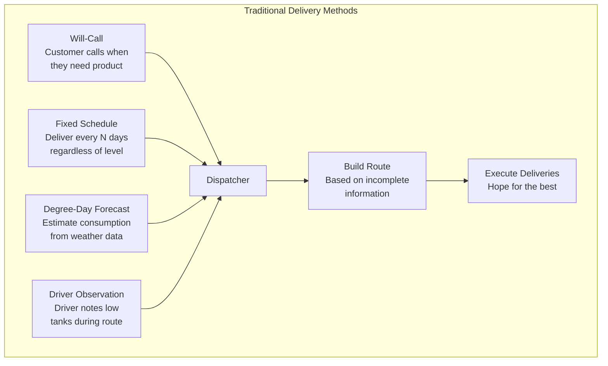
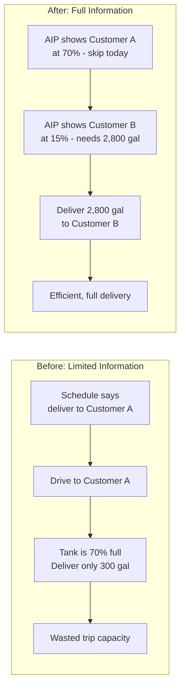
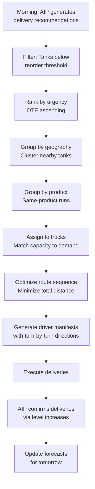
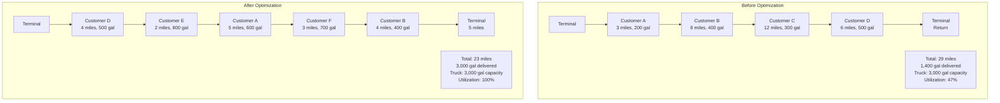
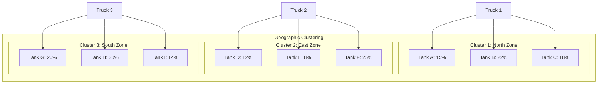
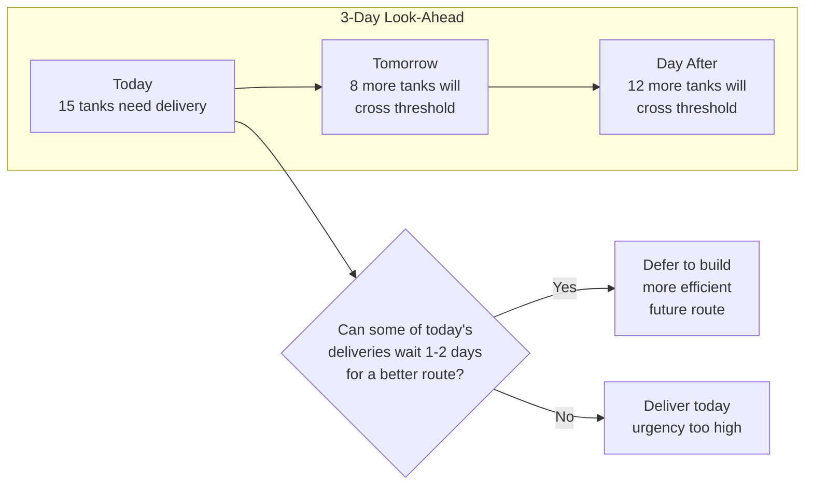
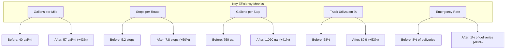
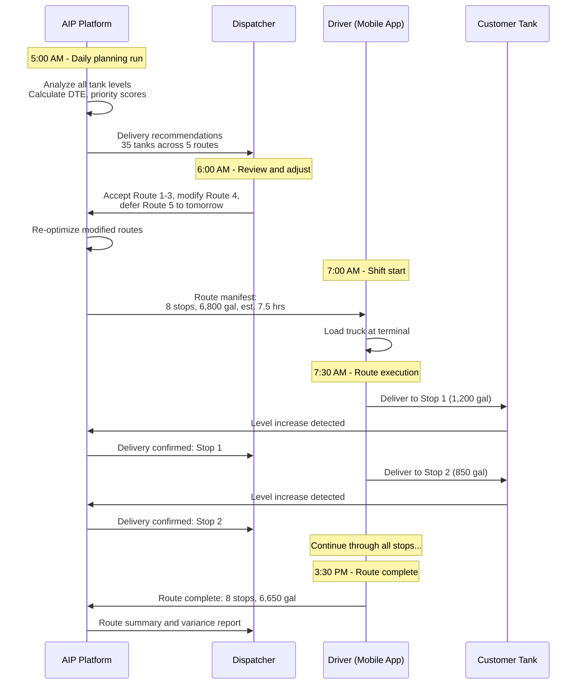
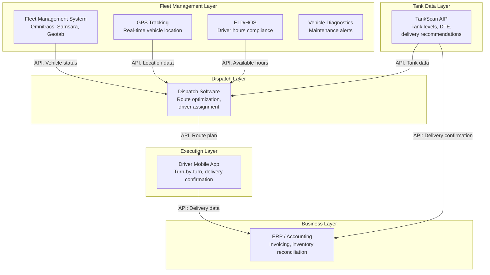
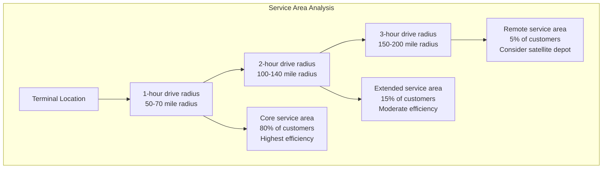

# Chapter 10: Fleet Management and Routing

## Learning Objectives

By the end of this chapter, you will be able to:

- Describe the delivery challenges that existed before wireless tank monitoring
- Explain how real-time tank data transforms fleet operations and routing decisions
- Apply route optimization algorithms to delivery scheduling problems
- Calculate the efficiency gains from data-driven delivery optimization
- Design dispatch workflows that integrate tank monitoring with fleet management
- Evaluate the TankScan claim of 30% delivery efficiency improvement

---

## 10.1 Introduction: The Last Mile of Liquid Logistics

Delivering liquid products to tanks is a "last mile" logistics problem. Regardless of how efficiently product is manufactured, refined, or transported in bulk, the final delivery to individual customer tanks determines the overall cost and customer experience. A fuel distributor with 2,000 customer tanks faces a daily puzzle: which tanks need product, how much should be delivered, and in what sequence should the driver visit them to minimize cost and maximize efficiency?

Before wireless monitoring, this puzzle was largely unsolvable because the distributor lacked the most critical piece of information: **the current level in each customer's tank**. Dispatchers worked from estimates, schedules, and customer phone calls. The result was inefficiency -- trucks running half-full, unnecessary trips to tanks that did not need product, and emergency deliveries to tanks that ran dry unexpectedly.

Wireless tank monitoring provides the missing data. When every tank reports its level multiple times per day, the dispatch puzzle transforms from guesswork into a solvable optimization problem.

!!! note "The 30% Efficiency Claim"
    TankScan and other wireless monitoring providers frequently cite a 25-35% improvement in delivery fleet efficiency. This chapter examines the mathematical and operational basis for this claim, breaking it down into its component improvements and showing how each contributes to the total.

---

## 10.2 The Delivery Challenge (Before Wireless Monitoring)

### 10.2.1 Traditional Delivery Methods

Without real-time tank data, fuel and liquid product distributors relied on a combination of imperfect methods:



Each method had significant drawbacks:

| Method | How It Works | Key Weakness | Impact |
|---|---|---|---|
| Will-call | Customer phones when tank is low | Late notice; often at crisis point | 40-60% of deliveries are emergencies |
| Fixed schedule | Deliver every 14, 21, or 28 days | Ignores actual consumption | Over-delivery (tank still 60% full) or under-delivery (tank empty before schedule) |
| Degree-day | Estimate usage from temperature history | Assumes uniform housing/insulation | 15-25% forecast error for individual tanks |
| Driver observation | Driver checks nearby tanks visually | Depends on route proximity; inconsistent | Misses tanks not on current route |

### 10.2.2 The Cost of Uncertainty

Without knowing actual tank levels, distributors suffered predictable inefficiencies:

**1. Partial loads (under-utilization)**

When a dispatcher cannot predict exactly how much product each customer needs, they cannot fill the truck to capacity. Arriving at a tank that is 70% full means delivering only 30% of its capacity -- far less than the truck can carry. The truck returns to the terminal with unused capacity.

$$\text{Truck Utilization} = \frac{\text{Gallons Actually Delivered}}{\text{Truck Capacity}} \times 100\%$$

Typical pre-monitoring truck utilization: **55-65%**

**2. Unnecessary stops (wasted trips)**

A fixed-schedule approach sends the truck to every customer on the schedule, regardless of whether they need product. If a customer's tank is still 75% full, the stop delivers minimal gallons but consumes the same travel time as a full delivery.

**3. Emergency deliveries (crisis response)**

When a tank runs out unexpectedly, the distributor must dispatch a truck immediately, regardless of the current route plan. Emergency deliveries are the most expensive type:

| Delivery Type | Cost Multiple | Reason |
|---|---|---|
| Planned (on-route) | 1.0x (baseline) | Included in optimized route |
| Unplanned (added to route) | 1.5-2.0x | Route detour, partial load |
| Emergency (dedicated trip) | 3.0-5.0x | Single destination, possibly overtime |
| After-hours emergency | 5.0-8.0x | Overtime labor, on-call driver |

**4. Customer dissatisfaction**

Run-outs cause immediate customer dissatisfaction. A home without heating fuel in winter, a gas station with empty pumps, or a construction site with idle equipment all result in lost revenue and damaged relationships.

### 10.2.3 Quantifying Pre-Monitoring Inefficiency

A representative mid-size fuel distributor before wireless monitoring:

| Metric | Typical Value |
|---|---|
| Customer tanks served | 1,500 |
| Delivery trucks | 8 |
| Deliveries per day (fleet) | 35-45 |
| Average drop size | 600-900 gallons |
| Truck utilization | 55-65% |
| Gallons per mile | 30-40 |
| Emergency deliveries per month | 25-40 |
| Run-outs per month | 5-15 |
| Annual delivery cost per tank | $180-280 |

---

## 10.3 How Tank Data Transforms Fleet Operations

### 10.3.1 The Information Advantage

With wireless monitoring, the dispatcher has real-time access to the level, consumption rate, and days-to-empty for every tank in the fleet. This fundamentally changes the optimization problem:



**Key data points that enable optimization:**

| Data Point | How It Enables Optimization |
|---|---|
| Current level (%) | Know exactly which tanks need product |
| Days-to-empty (DTE) | Prioritize by urgency |
| Available capacity (ullage) | Know exactly how much to deliver |
| Consumption rate (gal/day) | Predict when non-urgent tanks will become urgent |
| Product type | Group same-product deliveries on the same truck |
| GPS location | Calculate optimal drive routes |
| Historical pattern | Predict future needs beyond current DTE |

### 10.3.2 The Decision Framework

With complete tank data, the dispatcher's daily decision becomes a structured optimization:



---

## 10.4 Route Optimization Algorithms

### 10.4.1 The Vehicle Routing Problem (VRP)

Delivery routing is a variant of the **Vehicle Routing Problem (VRP)**, one of the most studied problems in operations research. The VRP asks: given a fleet of vehicles at a depot, a set of customers to serve, and constraints on vehicle capacity and driver hours, what is the optimal set of routes?

!!! note "NP-Hard Complexity"
    The VRP is NP-hard, meaning there is no known algorithm that can find the absolute optimal solution in polynomial time for large problem instances. For a distributor with 200 tanks needing delivery, the number of possible route permutations exceeds the number of atoms in the universe. Practical solutions use heuristic and metaheuristic algorithms that find near-optimal solutions in reasonable computing time.

**VRP formulation:**

Minimize total route cost:

$$\text{Minimize } \sum_{k=1}^{K} \sum_{i=0}^{N} \sum_{j=0}^{N} c_{ij} \cdot x_{ijk}$$

Subject to constraints:

- Each customer is visited exactly once: $\sum_{k=1}^{K} \sum_{i=0}^{N} x_{ijk} = 1 \quad \forall j$
- Vehicle capacity: $\sum_{j=1}^{N} d_j \cdot \sum_{i=0}^{N} x_{ijk} \leq Q_k \quad \forall k$
- Route continuity: Each vehicle leaves every visited customer
- Driver hours: Total route time does not exceed shift length

Where:

- $K$ = number of vehicles
- $N$ = number of customers
- $c_{ij}$ = cost of traveling from customer $i$ to customer $j$
- $x_{ijk}$ = 1 if vehicle $k$ travels from $i$ to $j$, 0 otherwise
- $d_j$ = demand at customer $j$ (gallons needed)
- $Q_k$ = capacity of vehicle $k$

### 10.4.2 Practical Optimization Approaches

Since exact VRP solutions are computationally infeasible for real-world problem sizes, practical systems use heuristic methods:

| Algorithm | Approach | Quality | Speed | Best For |
|---|---|---|---|---|
| Nearest neighbor | Visit the closest unvisited customer next | Low-moderate | Very fast | Quick estimates, small fleets |
| Clarke-Wright savings | Merge routes that share nearby customers | Moderate-good | Fast | Medium-size problems |
| Sweep algorithm | Sweep a line from depot, group by angle | Moderate | Fast | Geographically distributed customers |
| Genetic algorithm | Evolve a population of candidate routes | Good-excellent | Moderate | Large, complex problems |
| Simulated annealing | Accept worse solutions to escape local optima | Good-excellent | Moderate | Complex constraints |
| Ant colony optimization | Simulate ant pheromone trails to find routes | Good | Moderate | Dynamic environments |
| Google OR-Tools | Open-source constraint solver | Excellent | Fast-moderate | Industry standard |

### 10.4.3 Tank Monitoring-Specific VRP Extensions

Standard VRP assumes fixed customer demand. Tank monitoring adds several dimensions:

**1. Variable demand (known through monitoring)**

Unlike a package delivery where every customer gets one package, tank deliveries vary in size. Tank monitoring tells the dispatcher exactly how many gallons each tank needs:

$$d_j = V_{\text{capacity},j} \times \text{Fill Target \%} - V_{\text{current},j}$$

**2. Time flexibility (DTE-based scheduling)**

Not all deliveries are equally urgent. A tank with 2 days-to-empty must be served today; a tank with 10 days-to-empty can be deferred to a better route day.

$$\text{Urgency Score}_j = \frac{1}{\text{DTE}_j}$$

**3. Product constraints (same-product routing)**

A truck carrying diesel cannot simultaneously carry gasoline (unless it has compartments). Deliveries must be grouped by product type.

**4. Delivery window constraints**

Some customers have restricted delivery windows (e.g., gas stations may only accept fuel deliveries at night; residential customers may restrict delivery to business hours).

### 10.4.4 Optimization Example



The optimized route includes different customers (D, E, F instead of C, D) because the optimizer selected tanks that are emptier (needing more gallons) and closer together, resulting in more gallons delivered per mile.

---

## 10.5 Geographic Clustering

### 10.5.1 Cluster-Based Routing

Geographic clustering groups nearby customers into delivery zones, reducing the total distance traveled by keeping trucks within concentrated areas.



### 10.5.2 Clustering Algorithms

| Algorithm | How It Works | Strengths | Weaknesses |
|---|---|---|---|
| K-means | Partition customers into K groups by proximity | Simple, fast | Assumes equal-size clusters |
| DBSCAN | Group by density, identify outliers | Handles irregular shapes | Sensitive to parameters |
| Hierarchical | Build tree of nested clusters | Flexible, visual | Computationally expensive |
| Grid-based | Divide service area into grid cells | Simple, predictable | Ignores road network |
| Road-network-based | Cluster by actual driving distance | Most realistic | Requires road network data |

### 10.5.3 Dynamic Clustering with Tank Data

Static geographic clusters work well for fixed-schedule operations, but tank monitoring enables **dynamic clustering** -- regrouping based on which tanks actually need service each day.

**Daily dynamic clustering workflow:**

1. AIP identifies all tanks below reorder threshold (need delivery within N days)
2. Tanks are plotted on a map by GPS coordinates
3. Clustering algorithm groups nearby "needs-delivery" tanks
4. Each cluster is assigned to a truck
5. Within each cluster, route optimization determines the visit sequence

This dynamic approach means that clusters change daily based on actual tank levels. A customer who consumed more than expected joins today's cluster; one who consumed less drops out.

---

## 10.6 Delivery Scheduling Based on Tank Levels

### 10.6.1 The Scheduling Decision Matrix

Not every tank below the reorder point needs delivery today. The scheduling decision considers urgency, efficiency, and constraints:

| Factor | Question | Impact on Scheduling |
|---|---|---|
| Days-to-empty | How urgent is this delivery? | Lower DTE = higher priority |
| Geographic proximity | Are there other nearby deliveries? | Cluster with others for efficiency |
| Drop size | How many gallons will be delivered? | Larger drops = more efficient |
| Product type | Can this tank share a truck load? | Same-product tanks grouped together |
| Delivery window | When can this site accept delivery? | Must fit within allowed times |
| Truck availability | Is a truck with the right product available? | Constrained by fleet composition |
| Weather | Will road/weather conditions allow access? | May delay rural/remote deliveries |

### 10.6.2 Priority Scoring Algorithm

AIP uses a priority score to rank delivery candidates:

$$\text{Priority Score} = w_1 \cdot \frac{1}{\text{DTE}} + w_2 \cdot \frac{d_j}{Q_{\max}} + w_3 \cdot C_j + w_4 \cdot H_j$$

Where:

- $\frac{1}{\text{DTE}}$ = urgency factor (higher when tank is closer to empty)
- $\frac{d_j}{Q_{\max}}$ = efficiency factor (larger drops score higher)
- $C_j$ = cluster bonus (tanks near other pending deliveries score higher)
- $H_j$ = historical importance (tanks with history of run-outs score higher)
- $w_1, w_2, w_3, w_4$ = configurable weights

!!! tip "Tuning Priority Weights"
    The default priority weights emphasize urgency (preventing run-outs). Distributors focused on efficiency can increase the efficiency weight ($w_2$) to favor larger drops. Those managing customer relationships can increase the cluster bonus ($w_3$) to favor routes with more stops in the same area.

### 10.6.3 Look-Ahead Scheduling

Instead of scheduling only for today, advanced systems use **look-ahead scheduling** to optimize over a multi-day horizon:



Look-ahead scheduling can improve efficiency by 5-10% beyond single-day optimization. For example, if Customer A needs delivery today (DTE = 3) but Customer A's neighbor, Customer B, will need delivery tomorrow (DTE = 4), it may be more efficient to deliver both tomorrow rather than making two separate trips.

---

## 10.7 The 30% Efficiency Improvement: How It Works

### 10.7.1 Decomposing the Efficiency Gain

The commonly cited 25-35% improvement in delivery efficiency comes from multiple compounding factors:

| Efficiency Lever | Individual Improvement | How It Works |
|---|---|---|
| Eliminate unnecessary stops | 10-15% | Only visit tanks that actually need product |
| Increase average drop size | 8-12% | Deliver when tanks are emptier (higher ullage) |
| Optimize route sequence | 5-8% | Shorter total route distance |
| Reduce emergency deliveries | 3-5% | Planned deliveries replace expensive emergencies |
| Better truck loading | 3-5% | Know exact gallons needed; load truck optimally |

**Compounding effect:**

These improvements compound. If you eliminate 12% of unnecessary stops AND increase drop size by 10% AND optimize routes by 6%, the combined effect is:

$$\text{Combined Improvement} = 1 - (1 - 0.12)(1 - 0.10)(1 - 0.06) = 1 - 0.744 = 25.6\%$$

### 10.7.2 Detailed Efficiency Calculations

**Before monitoring:**

| Metric | Value |
|---|---|
| Total tanks served | 1,500 |
| Deliveries per year | 12,000 |
| Average drop size | 750 gallons |
| Total gallons delivered/year | 9,000,000 |
| Total route miles/year | 225,000 |
| Gallons per mile | 40 |
| Delivery trucks | 8 |
| Cost per delivery | $85 |
| Total delivery cost/year | $1,020,000 |

**After monitoring (with optimization):**

| Metric | Value | Change |
|---|---|---|
| Total tanks served | 1,500 | Same |
| Deliveries per year | 8,500 | -29% (fewer, more productive stops) |
| Average drop size | 1,060 gallons | +41% (tank is emptier when served) |
| Total gallons delivered/year | 9,010,000 | Same (demand unchanged) |
| Total route miles/year | 157,000 | -30% |
| Gallons per mile | 57 | +43% |
| Delivery trucks | 6 | -2 trucks (-25%) |
| Cost per delivery | $82 | -4% (less time per stop) |
| Total delivery cost/year | $697,000 | -32% |

**Annual savings: $323,000 (32% reduction)**

!!! example "Breaking Down the Savings"
    | Savings Category | Annual Amount | Explanation |
    |---|---|---|
    | Fuel cost reduction | $68,000 | 68,000 fewer miles at $1.00/mile fuel cost |
    | Vehicle maintenance | $34,000 | Fewer miles = less wear, tires, oil changes |
    | Driver labor | $120,000 | Eliminated need for 2 drivers (including benefits) |
    | Emergency delivery elimination | $48,000 | 30 fewer emergencies/month at $133 premium each |
    | Vehicle lease/depreciation | $53,000 | 2 fewer trucks in fleet |
    | **Total** | **$323,000** | |

### 10.7.3 Efficiency Metrics Comparison



---

## 10.8 Dispatch Optimization

### 10.8.1 The Dispatcher's New Role

With wireless monitoring, the dispatcher's role shifts from firefighting to optimization:

| Before Monitoring | After Monitoring |
|---|---|
| Answer customer calls requesting delivery | Review AIP's automated delivery recommendations |
| Guess which tanks need product | See exact tank levels and days-to-empty |
| Build routes from memory and experience | Optimize routes using algorithms and data |
| React to emergencies throughout the day | Plan proactively with minimal emergencies |
| Manually track deliveries via phone/radio | Track deliveries in real-time via GPS and auto-confirmation |
| Reconcile delivery tickets manually | Automated reconciliation via AIP delivery detection |

### 10.8.2 Dispatch Workflow



### 10.8.3 Real-Time Route Adjustment

During route execution, conditions may change. The dispatch system should support real-time adjustments:

| Situation | Response |
|---|---|
| Road closure or traffic | Reroute to alternate path |
| Customer unavailable | Skip stop, reschedule |
| Tank level changed (e.g., customer drew down more) | Adjust delivery quantity |
| New urgent delivery identified | Insert stop into current route if feasible |
| Driver running ahead of schedule | Add an opportunistic stop |
| Driver running behind schedule | Drop lowest-priority stop, reschedule |
| Truck mechanical issue | Transfer remaining stops to another truck |

---

## 10.9 Driver Assignment and Load Optimization

### 10.9.1 Driver Assignment Factors

Assigning the right driver to each route considers multiple factors:

| Factor | Consideration |
|---|---|
| CDL class | Truck type requires appropriate license class |
| Hazmat endorsement | Required for certain products |
| Hours of service (HOS) | DOT regulations limit driving and on-duty hours |
| Route familiarity | Experienced drivers on complex routes |
| Customer relationship | Some customers prefer specific drivers |
| Shift schedule | Match route duration to driver's shift |
| Equipment qualification | Driver must be trained on specific truck type |

### 10.9.2 Load Optimization

**Full truck vs. partial load:**

The goal is to load each truck as close to capacity as possible for each route:

$$\text{Load Factor} = \frac{\sum_{j \in \text{Route}} d_j}{Q_k} \times 100\%$$

Where $d_j$ is the demand at each stop on the route and $Q_k$ is the truck capacity.

| Load Factor | Assessment | Action |
|---|---|---|
| 95-100% | Optimal | Execute route as planned |
| 85-95% | Good | Acceptable; check for nearby add-on stops |
| 70-85% | Moderate | Look for additional stops to improve utilization |
| < 70% | Poor | Combine with another partial route or defer stops |

**Multi-compartment trucks:**

Many delivery trucks have multiple compartments for different products (e.g., a fuel truck with compartments for diesel and gasoline). Load optimization must consider:

$$\sum_{j \in \text{Route, Product P}} d_j \leq Q_{k,P}$$

Each product's total demand on the route must fit within the corresponding compartment.

!!! example "Multi-Compartment Loading"
    A delivery truck has two compartments:

    - Compartment 1: 3,500 gallons (diesel)
    - Compartment 2: 2,500 gallons (gasoline)
    - Total capacity: 6,000 gallons

    Route has 10 stops:

    | Stop | Product | Gallons Needed |
    |---|---|---|
    | 1 | Diesel | 800 |
    | 2 | Diesel | 600 |
    | 3 | Gasoline | 500 |
    | 4 | Diesel | 450 |
    | 5 | Gasoline | 700 |
    | 6 | Diesel | 900 |
    | 7 | Gasoline | 400 |
    | 8 | Diesel | 500 |
    | 9 | Gasoline | 600 |
    | 10 | Diesel | 350 |

    **Diesel total**: 3,600 gallons (exceeds 3,500 compartment capacity)
    **Gasoline total**: 2,200 gallons (under 2,500 compartment capacity)

    **Resolution**: Defer Stop 10 (350 gal diesel, lowest priority) to tomorrow's route.
    **Final load**: Diesel: 3,250 gal (93%), Gasoline: 2,200 gal (88%), Total: 5,450 gal (91%)

---

## 10.10 Integration with Fleet Management Systems

### 10.10.1 System Integration Architecture

TankScan's AIP platform integrates with fleet management and dispatch systems to create a unified operational workflow:



### 10.10.2 Integration Data Flows

| Data Flow | Source | Destination | Frequency | Purpose |
|---|---|---|---|---|
| Tank levels and DTE | AIP | Dispatch software | Real-time | Delivery scheduling |
| Delivery recommendations | AIP | Dispatch software | Daily batch | Route planning |
| Vehicle location | GPS system | Dispatch software | Real-time | Route tracking |
| Driver hours available | ELD system | Dispatch software | Daily | Compliance |
| Route plan | Dispatch software | Driver mobile app | Per route | Execution |
| Delivery confirmation | AIP (level change detection) | ERP/accounting | Per delivery | Invoicing |
| Fuel consumption | Vehicle diagnostics | Fleet management | Continuous | Cost tracking |

### 10.10.3 Common Integration Partners

| System | Category | Integration Method | Key Data Exchanged |
|---|---|---|---|
| ADD Systems | Fuel distribution ERP | API, flat file | Orders, deliveries, invoices |
| Cargas Energy | Fuel distribution ERP | API | Delivery scheduling, invoicing |
| Omnitracs | Fleet management | API | Vehicle location, HOS |
| Samsara | Fleet management / telematics | API | GPS, vehicle health, HOS |
| Geotab | Fleet management / telematics | API | GPS, driver behavior |
| FuelCloud | Fuel management | API | Fuel dispensing data |
| P3 Software | Propane distribution | API, flat file | Delivery scheduling |
| Google Maps Platform | Mapping / routing | API | Geocoding, directions, traffic |

---

## 10.11 GPS and Mapping Integration in AIP

### 10.11.1 Mapping Features

The AIP platform includes integrated mapping capabilities:

| Feature | Description | Value |
|---|---|---|
| Tank location map | All monitored tanks plotted on a map | Visual fleet overview |
| Color-coded markers | Fill level indicated by marker color | Instantly identify low tanks |
| Cluster view | Zoom out to see geographic clusters | Identify delivery zones |
| Route visualization | Planned route drawn on map | Driver orientation |
| Geocoding | Automatic lat/lon from address | Accurate location data |
| Geofencing | Define geographic zones for alerts | Zone-based management |
| Traffic overlay | Real-time traffic data on routes | Realistic time estimates |

### 10.11.2 Geographic Analysis for Fleet Planning

Tank location data enables strategic fleet planning:

**Service area analysis:**

| Analysis | Question Answered | Planning Impact |
|---|---|---|
| Customer density map | Where are customers concentrated? | Terminal and depot placement |
| Drive time isochrones | How far can a truck travel in 4 hours? | Service area boundaries |
| Delivery frequency heat map | Where do trucks go most often? | Pre-positioning of product |
| Distance distribution | How far are customers from the terminal? | Fleet sizing and type selection |
| Growth analysis | Where are new customers being added? | Expansion planning |



---

## 10.12 Real-World Efficiency Metrics

### 10.12.1 Industry Benchmarks

Based on published case studies and industry data, the following benchmarks represent typical performance with and without wireless monitoring:

| Metric | Without Monitoring | With Monitoring | Industry Best |
|---|---|---|---|
| Gallons per mile | 30-45 | 50-70 | 80+ |
| Stops per route | 4-7 | 7-12 | 14+ |
| Average drop size (gal) | 500-900 | 900-1,500 | 1,800+ |
| Truck utilization | 50-65% | 80-95% | 95%+ |
| Emergency delivery rate | 5-15% | 0.5-2% | < 0.5% |
| Run-out rate (annual) | 2-8% | 0.1-0.5% | < 0.1% |
| Gallons per driver-hour | 200-400 | 400-700 | 800+ |
| Cost per gallon delivered | $0.06-0.12 | $0.03-0.06 | < $0.03 |
| Annual deliveries per tank | 8-15 | 5-8 | 4-6 |

### 10.12.2 Continuous Improvement Tracking

AIP provides dashboards for tracking efficiency metrics over time:

```
Efficiency Trend: Gallons per Mile

80 |
   |                                    *  *
70 |                              *  *
   |                        *  *
60 |                  *  *
   |            *  *
50 |      *  *
   |  *
40 |*
   |___________________________________
   Q1    Q2    Q3    Q4    Q1    Q2
   |<-- Year 1 -->|  |<-- Year 2 -->|

Note: Efficiency improves rapidly in first 6 months
as optimization algorithms learn consumption patterns,
then continues to improve gradually.
```

### 10.12.3 Factors That Limit Efficiency Gains

Not every deployment achieves the full 30% efficiency improvement. Factors that limit gains:

| Factor | Impact | Mitigation |
|---|---|---|
| Customer density | Sparse, rural customers limit route optimization | Focus on cluster efficiency; consider depot placement |
| Product diversity | Many different products limit truck sharing | Multi-compartment trucks; product-specific routes |
| Delivery windows | Restricted delivery times reduce scheduling flexibility | Negotiate wider windows; prioritize restricted sites |
| Road network | Poor roads, seasonal access limit routing | Seasonal route planning; weather-based scheduling |
| Driver resistance | Drivers prefer familiar routes | Training; incentive programs tied to efficiency KPIs |
| Small fleet size | Fewer vehicles = less optimization flexibility | Focus on route sequencing and load optimization |
| Legacy systems | Inability to integrate dispatch and tank data | API integration; middleware solutions |

---

## 10.13 Chapter Summary

Wireless tank monitoring transforms fleet management and delivery routing from a guessing game into a data-driven optimization problem. The key concepts covered in this chapter:

1. **Traditional delivery methods** (will-call, fixed schedule, degree-day) are fundamentally limited by the absence of real-time tank data
2. **Tank monitoring provides the missing data** -- current levels, consumption rates, and days-to-empty for every tank
3. **Route optimization algorithms** (VRP variants, geographic clustering) use this data to minimize delivery cost
4. **The 30% efficiency improvement** comes from compounding multiple factors: eliminating unnecessary stops, increasing drop sizes, optimizing route sequences, and reducing emergencies
5. **Dispatch workflows** shift from reactive firefighting to proactive optimization
6. **Integration with fleet management systems** creates an end-to-end operational platform
7. **Real-world metrics** consistently show significant improvements in gallons per mile, truck utilization, and delivery cost

The transformation is not merely incremental. It is a fundamental change in how liquid product distribution operates -- from a schedule-based, estimate-driven model to a demand-driven, data-optimized model. Organizations that fully embrace this transformation achieve sustainable competitive advantages in cost, service quality, and customer retention.

---

## Review Questions

!!! question "Question 1 -- Knowledge (Remember)"
    List the five main efficiency levers that contribute to the 30% delivery efficiency improvement claim, and state the approximate individual contribution of each.

!!! question "Question 2 -- Comprehension (Understand)"
    Explain the difference between static geographic clustering and dynamic clustering based on tank monitoring data. Describe a scenario where dynamic clustering would produce significantly better results than static clustering.

!!! question "Question 3 -- Application (Apply)"
    A fuel distributor has a truck with 5,000-gallon capacity and the following tanks needing delivery today:

    | Tank | Location | Product | Gallons Needed | DTE |
    |---|---|---|---|---|
    | A | North zone | Diesel | 1,200 | 2 |
    | B | North zone | Diesel | 800 | 5 |
    | C | East zone | Diesel | 1,500 | 3 |
    | D | East zone | Gasoline | 900 | 1 |
    | E | South zone | Diesel | 600 | 7 |
    | F | North zone | Diesel | 1,100 | 4 |

    The truck can only carry one product type per trip. Build the optimal diesel delivery route, specifying which tanks to include, the load quantity, the estimated truck utilization, and which tank(s) to defer. Justify your choices.

!!! question "Question 4 -- Analysis (Analyze)"
    A distributor deployed wireless monitoring on 1,000 tanks six months ago. They expected a 30% efficiency improvement but have achieved only 12%. Analyze the possible reasons for this gap. Consider factors related to: (a) data quality and system configuration, (b) dispatch process adoption, (c) driver behavior, (d) customer and geographic characteristics, and (e) integration with existing systems. For each factor, suggest a diagnostic test and a corrective action.

!!! question "Question 5 -- Evaluation (Evaluate)"
    Compare the following two delivery strategies for a propane distributor serving 3,000 residential customers:

    **Strategy A**: Monitor all 3,000 tanks with TSD gauges, use AI-driven dispatch optimization, deliver only when tanks reach 20%.

    **Strategy B**: Monitor only the top 500 highest-volume customers with TSD gauges, use degree-day forecasting for the remaining 2,500, deliver when estimated at 30%.

    Evaluate both strategies on: (a) investment cost, (b) expected efficiency improvement, (c) run-out risk, (d) customer equity concerns, and (e) long-term competitiveness. Which would you recommend and why?
