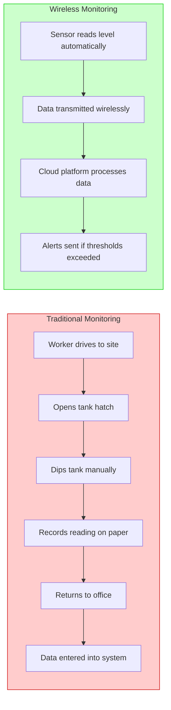
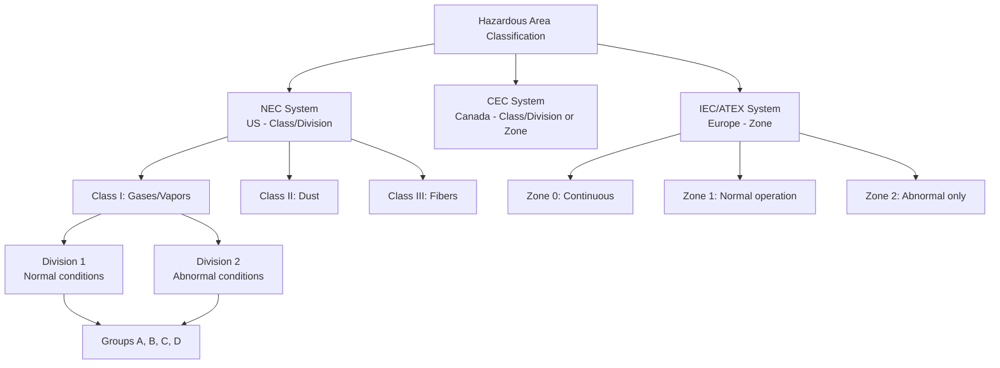
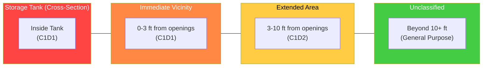
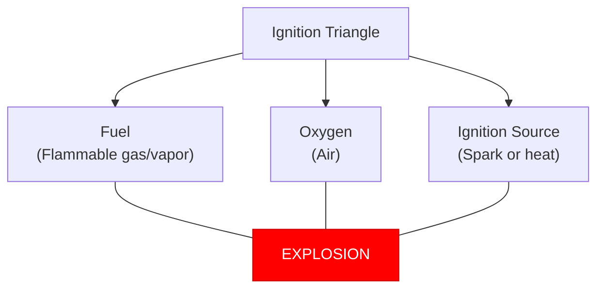
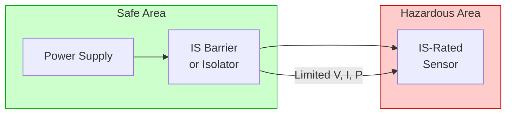
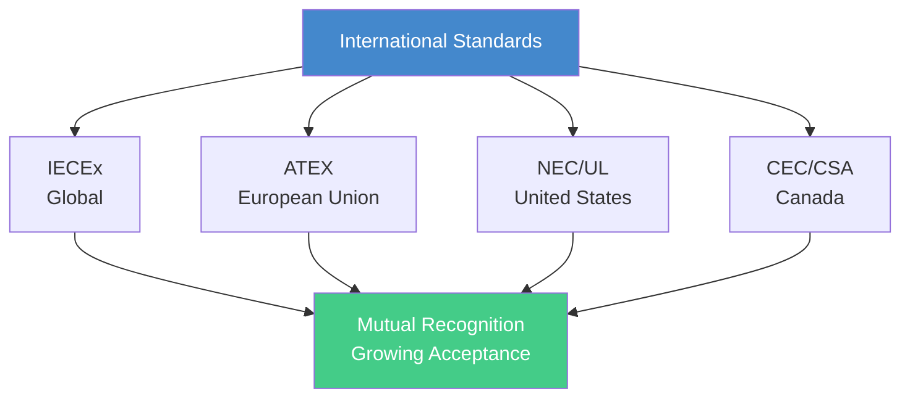
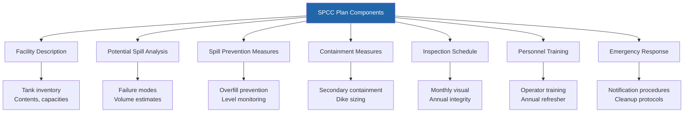
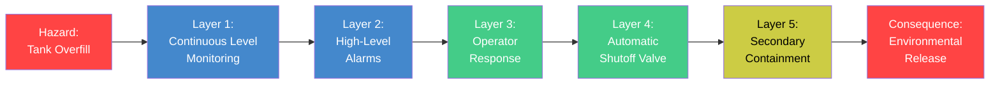
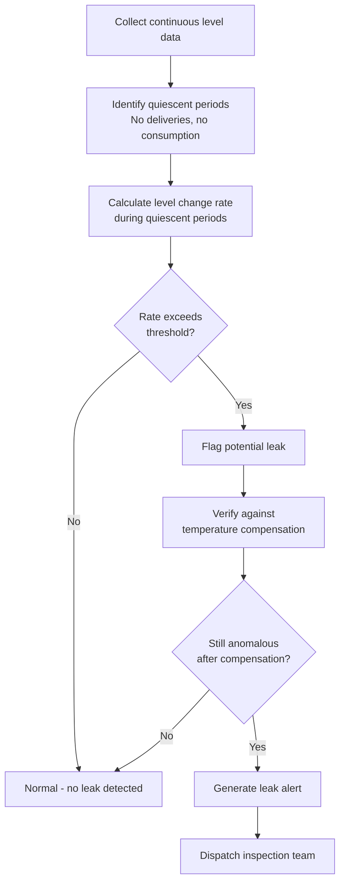
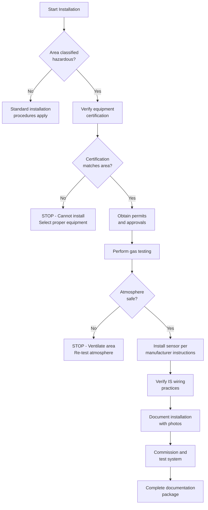

# Chapter 11: Safety, Compliance, and Hazardous Environments

## Learning Objectives

By the end of this chapter, you will be able to:

- Explain why safety is paramount in tank monitoring environments
- Differentiate between NEC/CEC hazardous area classification systems
- Describe Class 1 Division 1 (C1D1) and Class 1 Division 2 (C1D2) requirements
- Apply intrinsic safety design principles to equipment selection
- Map ATEX European standards to North American equivalents
- Identify TankScan products rated for hazardous environments
- Outline EPA and SPCC regulatory requirements for tank installations
- Design spill prevention and overfill protection strategies
- Implement compliance documentation and reporting workflows

---

## 11.1 Why Safety Matters in Tank Monitoring

Tank monitoring is not merely an operational convenience -- it is a safety imperative. The substances stored in industrial tanks range from mildly hazardous to extraordinarily dangerous. A single failure in monitoring can cascade into catastrophic consequences affecting human life, environmental systems, and corporate viability.

### The Consequences of Failure

!!! danger "Real-World Incident: Buncefield Oil Storage Depot (2005)"
    On December 11, 2005, a series of explosions at the Buncefield oil storage depot in Hertfordshire, England, created the largest peacetime explosion in Europe. The root cause was a failed tank level gauge that allowed gasoline to overflow a storage tank. The resulting vapor cloud ignited, injuring 43 people and causing over $1.5 billion in damages. Continuous, reliable tank monitoring could have prevented this disaster.

The three primary categories of risk in tank monitoring environments are:

| Risk Category | Examples | Potential Impact |
|---|---|---|
| **Human Safety** | Explosions, toxic exposure, burns, asphyxiation | Fatalities, injuries, long-term health effects |
| **Environmental Damage** | Spills, soil contamination, groundwater pollution, air emissions | Ecosystem destruction, remediation costs, community harm |
| **Business Impact** | Regulatory fines, facility shutdowns, lawsuits, reputational damage | Financial losses ranging from thousands to billions of dollars |

### The Economics of Safety

The cost of prevention is always a fraction of the cost of failure. Consider the following comparison:

| Investment | Typical Cost | Potential Savings |
|---|---|---|
| Certified hazardous-area sensor | $800 - $2,500 per unit | Prevents single incident worth $50K - $500K+ |
| Continuous monitoring system | $15,000 - $50,000 for a site | Avoids EPA fines of $25,000 - $75,000 per day |
| SPCC plan development | $5,000 - $15,000 | Prevents cleanup costs of $100K - $10M+ |
| Annual compliance audit | $3,000 - $10,000 | Avoids facility shutdown orders |

!!! tip "Safety as a Value Proposition"
    When selling or deploying TankScan systems, frame safety not as a cost but as a strategic investment. Organizations that invest proactively in safety monitoring consistently outperform their peers in total cost of ownership, insurance premiums, and operational uptime.

### How Wireless Monitoring Improves Safety

Traditional tank monitoring -- manual dipping with sticks, visual inspection of sight glasses, periodic truck rolls -- introduces human risk at every step. Workers must physically approach hazardous tanks, open hatches, and take measurements in potentially explosive atmospheres.

Wireless monitoring fundamentally changes this risk profile:



**Key safety improvements with wireless monitoring:**

1. **Reduced human exposure** -- Workers no longer need to physically approach hazardous tanks for routine readings
2. **Continuous monitoring** -- Level data is captured every few minutes, not once a week
3. **Automated alerts** -- Overfill warnings trigger before dangerous conditions develop
4. **Trend analysis** -- Gradual leaks detectable through data analytics, not just catastrophic failures
5. **Remote diagnostics** -- Sensor health can be verified without site visits

---

## 11.2 Hazardous Area Classification Systems

Before installing any electrical or electronic equipment near flammable or combustible materials, the area must be classified according to the type and likelihood of hazardous atmospheres present. Two primary systems govern this classification in North America.

### NEC (National Electrical Code) -- United States

The National Electrical Code (NFPA 70) defines hazardous locations in **Articles 500-506**. The system uses a hierarchy of **Class**, **Division**, and **Group** to categorize the hazard.

#### Classes -- Type of Hazard

| Class | Hazardous Material | Common Environments |
|---|---|---|
| **Class I** | Flammable gases, vapors, or liquids | Petroleum refineries, fuel depots, chemical plants, gas stations |
| **Class II** | Combustible dust | Grain elevators, coal processing, flour mills, metal powder facilities |
| **Class III** | Ignitable fibers or flyings | Textile mills, cotton gins, woodworking shops |

!!! note "TankScan Focus"
    The vast majority of TankScan deployments involve **Class I** environments because the monitored substances are typically flammable liquids (fuels, solvents, chemicals) or produce flammable vapors.

#### Divisions -- Probability of Hazard

| Division | Description | Condition |
|---|---|---|
| **Division 1** | Hazardous atmosphere exists under **normal** operating conditions | Continuous or frequent hazard presence |
| **Division 2** | Hazardous atmosphere exists only under **abnormal** conditions | Hazard present only during accidents, equipment failure, or unusual operations |

#### Groups -- Specific Substances

Within Class I, substances are further categorized by their explosive properties:

| Group | Representative Substances | Ignition Energy |
|---|---|---|
| **A** | Acetylene | Extremely low |
| **B** | Hydrogen, butadiene, ethylene oxide | Very low |
| **C** | Ethylene, carbon monoxide, hydrogen sulfide | Low |
| **D** | Gasoline, propane, methane, natural gas, acetone | Moderate |

!!! info "Temperature Class (T-Code)"
    Every classified device also carries a Temperature Class (T1 through T6) indicating the maximum surface temperature the equipment can reach. This temperature must be below the auto-ignition temperature of any gas or vapor in the environment.

    | T-Code | Max Surface Temp (C) | Max Surface Temp (F) |
    |---|---|---|
    | T1 | 450 | 842 |
    | T2 | 300 | 572 |
    | T3 | 200 | 392 |
    | T4 | 135 | 275 |
    | T5 | 100 | 212 |
    | T6 | 85 | 185 |

### CEC (Canadian Electrical Code) -- Canada

The Canadian Electrical Code (CSA C22.1) uses a nearly identical Class/Division/Group system but with some differences in specific requirements and testing standards. Canada also supports the **Zone** system (harmonized with IEC international standards):

| Zone | Equivalent Division | Description |
|---|---|---|
| Zone 0 | More restrictive than Div 1 | Explosive atmosphere present continuously or for long periods |
| Zone 1 | Approximately Division 1 | Explosive atmosphere likely during normal operation |
| Zone 2 | Approximately Division 2 | Explosive atmosphere unlikely except abnormal conditions |



---

## 11.3 Class 1 Division 1 (C1D1) Explained

Class 1 Division 1 represents the most demanding classification for gas and vapor environments in the NEC system. Understanding it thoroughly is essential for specifying TankScan equipment in hazardous locations.

### Definition

A **Class 1, Division 1** location is one in which:

1. **Ignitable concentrations** of flammable gases, vapors, or liquids **can exist under normal operating conditions**, OR
2. **Ignitable concentrations** may exist **frequently** because of repair or maintenance operations or because of leakage, OR
3. **Breakdown or faulty operation** of equipment or processes might release ignitable concentrations of flammable gases or vapors AND might also cause simultaneous failure of electrical equipment in a way that could cause ignition

### Where C1D1 Areas Are Found

!!! example "Common C1D1 Locations in Tank Monitoring"
    - **Inside a tank** containing flammable liquid (the vapor space above the liquid)
    - **Within the containment dike** of a flammable liquid tank during normal venting
    - **Spray booth interiors** where volatile solvents are used
    - **Pump rooms** for flammable liquids without adequate ventilation
    - **Areas around open containers** of volatile flammable liquids
    - **Tank truck loading/unloading points** during transfer operations
    - **Chemical tote storage areas** where routine spills or vapor release is expected

### Equipment Requirements for C1D1

Equipment installed in C1D1 areas must meet one of these protection methods:

| Protection Method | Code | Description |
|---|---|---|
| **Explosion-proof (Flameproof)** | Ex d | Enclosure contains any internal explosion and prevents ignition of surrounding atmosphere |
| **Intrinsically Safe** | Ex i (ia) | Circuit energy limited so it cannot ignite the atmosphere even under fault conditions |
| **Purged/Pressurized** | Ex p | Enclosure maintained at positive pressure with inert gas to exclude hazardous atmosphere |
| **Hermetically Sealed** | Ex m | Components encapsulated so no spark can reach the atmosphere |

!!! warning "Critical Design Constraint"
    In C1D1 environments, equipment must be safe even during **two simultaneous faults**. This is significantly more stringent than C1D2, which only requires safety during **one fault condition**. This distinction drives significant differences in design complexity and cost.

### The Intrinsic Safety Barrier Concept for C1D1

For intrinsically safe C1D1 installations, the circuit must meet **"ia" level** intrinsic safety:

$$P_{max} = V_{oc} \times I_{sc} < P_{ignition}$$

Where:

- $V_{oc}$ = Maximum open-circuit voltage
- $I_{sc}$ = Maximum short-circuit current
- $P_{ignition}$ = Minimum ignition power for the gas group

The "ia" level requires that the circuit remain safe with **any two faults** applied simultaneously, and must include a **safety factor of 1.5** applied to all energy calculations.

---

## 11.4 Class 1 Division 2 (C1D2) Explained

Class 1 Division 2 is the more common classification encountered in TankScan deployments and represents a lower -- but still significant -- level of hazard.

### Definition

A **Class 1, Division 2** location is one in which:

1. Volatile flammable liquids or gases are **handled, processed, or used**, but in which they are normally confined within **closed containers or systems** and can only escape through accidental rupture or breakdown, OR
2. Ignitable concentrations are **normally prevented** by positive mechanical ventilation, and which might become hazardous through failure or abnormal operation of ventilation equipment, OR
3. The area is **adjacent to a C1D1 location** and to which ignitable concentrations of gases or vapors might occasionally be communicated

### Where C1D2 Areas Are Found

!!! example "Common C1D2 Locations in Tank Monitoring"
    - **Area surrounding a sealed tank** of flammable liquid (outside the immediate venting zone)
    - **Tank farms** with properly sealed vessels and adequate ventilation
    - **Pipe runs** carrying flammable liquids in sealed systems
    - **Ventilated pump rooms** for flammable liquids
    - **Warehouse areas** storing sealed containers of flammable liquids
    - **Dispensing areas** with adequate ventilation
    - **Areas surrounding C1D1 zones** (typically extending 3-10 feet depending on substance)

### Equipment Requirements for C1D2

C1D2 requirements are less stringent than C1D1 but still demand certified equipment:

| Protection Method | Code | Suitable for C1D2? |
|---|---|---|
| **Explosion-proof** | Ex d | Yes (exceeds requirement) |
| **Intrinsically Safe (ia)** | Ex ia | Yes (exceeds requirement) |
| **Intrinsically Safe (ib)** | Ex ib | Yes |
| **Non-incendive** | Ex nA | Yes |
| **Sealed device** | Ex nC | Yes |
| **Restricted breathing** | Ex nR | Yes |
| **Energy-limited** | Ex nL | Yes |

The "ib" level of intrinsic safety requires the circuit to remain safe with **one fault** condition:

$$E_{stored} = \frac{1}{2}CV^2 + \frac{1}{2}LI^2 < E_{MIC}$$

Where:

- $C$ = Circuit capacitance
- $V$ = Maximum voltage
- $L$ = Circuit inductance
- $I$ = Maximum current
- $E_{MIC}$ = Minimum Ignition Energy of the target gas group

### C1D1 vs. C1D2 -- Key Differences

| Characteristic | C1D1 | C1D2 |
|---|---|---|
| **Hazard Presence** | Normal operations | Abnormal conditions only |
| **Equipment Cost** | 2-5x higher | Baseline |
| **Installation Complexity** | Very high | Moderate |
| **Wiring Requirements** | Rigid conduit, sealed fittings | Flexible conduit acceptable |
| **Maintenance Restrictions** | Hot work permits always required | Hot work with gas testing |
| **IS Level Required** | "ia" (two faults) | "ib" (one fault) sufficient |
| **Typical Distance from Source** | 0-3 feet from source | 3-10+ feet from source |



---

## 11.5 Intrinsic Safety Design Principles

Intrinsic safety (IS) is the most elegant approach to hazardous area protection because it addresses the root cause of ignition rather than merely containing the consequences.

### The Ignition Triangle

For an explosion to occur, three elements must be present simultaneously:



Intrinsic safety works by eliminating the **ignition source**. It limits the electrical and thermal energy in circuits to levels below what can ignite the specific hazardous atmosphere, even under fault conditions.

### Core IS Design Principles

**Principle 1: Energy Limitation**

The total energy available in a circuit -- both electrical and stored -- must be kept below the minimum ignition energy (MIE) of the target gas group.

| Gas Group | Minimum Ignition Energy (MIE) |
|---|---|
| Group A (Acetylene) | 17 microjoules |
| Group B (Hydrogen) | 17 microjoules |
| Group C (Ethylene) | 60 microjoules |
| Group D (Propane) | 240 microjoules |

!!! note "Design Margin"
    IS circuits are designed with substantial safety margins. A Group D rated circuit typically limits energy to less than 160 microjoules -- well below the 240 microjoule MIE.

**Principle 2: Voltage and Current Limiting**

IS barriers or isolators are placed between the safe area power supply and the hazardous area device:



Two types of barriers are used:

| Barrier Type | Method | Advantages | Disadvantages |
|---|---|---|---|
| **Zener Barrier** | Shunt diodes and resistors limit voltage/current; relies on earth ground | Simple, inexpensive | Requires reliable ground, energy waste |
| **Galvanic Isolator** | Transformer isolation with energy limiting | No ground required, better noise immunity | More expensive, slightly larger |

**Principle 3: Stored Energy Control**

Capacitance and inductance in hazardous-area wiring can store energy that, if released suddenly, could produce a spark. IS design requires:

- **Capacitance limit**: Total cable plus device capacitance must stay below the certified maximum
- **Inductance limit**: Total cable plus device inductance must stay below the certified maximum
- **Cable parameters**: Typically limited to specific maximum lengths based on cable capacitance/inductance per unit length

$$C_{total} = C_{cable} \times L_{cable} + C_{device} \leq C_{max}$$

$$L_{total} = L_{cable} \times L_{cable} + L_{device} \leq L_{max}$$

**Principle 4: Temperature Limiting**

Even without a spark, a sufficiently hot surface can ignite a flammable atmosphere. IS design ensures that no component surface temperature can exceed the auto-ignition temperature of the target gas, even under fault conditions:

$$T_{surface\_max} < T_{auto\_ignition} - T_{safety\_margin}$$

### Entity Parameters

Every IS device and barrier is characterized by a set of "entity parameters" that must be matched for a valid installation:

| Parameter | Symbol | Barrier Provides | Device Requires |
|---|---|---|---|
| Open-circuit voltage | Voc / Vmax | Voc (barrier output) | Vmax (device input) |
| Short-circuit current | Isc / Imax | Isc (barrier output) | Imax (device input) |
| Maximum power | Po / Pi | Po (barrier output) | Pi (device input) |
| Maximum capacitance | Ca / Ci | Ca (permitted by barrier) | Ci (presented by device) |
| Maximum inductance | La / Li | La (permitted by barrier) | Li (presented by device) |

!!! warning "Entity Parameter Matching Rule"
    For a valid IS installation: **Voc <= Vmax**, **Isc <= Imax**, **Ca >= Ci + Ccable**, **La >= Li + Lcable**. If ANY parameter is violated, the installation is NOT intrinsically safe.

---

## 11.6 ATEX European Standards

For TankScan deployments in Europe or equipment destined for international markets, the ATEX directive system applies.

### What Is ATEX?

**ATEX** derives from the French "**AT**mospheres **EX**plosibles." Two EU directives govern equipment and workplaces in explosive atmospheres:

- **ATEX 114 (2014/34/EU)** -- Equipment Directive: Requirements for equipment intended for use in explosive atmospheres
- **ATEX 153 (1999/92/EC)** -- Workplace Directive: Requirements for protecting workers in explosive atmospheres

### ATEX Zone Classification

ATEX uses a Zone system rather than the North American Division system:

| ATEX Zone | Gas/Vapor | Dust | Frequency of Hazard | NEC Equivalent |
|---|---|---|---|---|
| **Zone 0** | Yes | -- | Continuous or long periods | More restrictive than Div 1 |
| **Zone 1** | Yes | -- | Likely in normal operation | ~ Division 1 |
| **Zone 2** | Yes | -- | Not likely, short duration if occurs | ~ Division 2 |
| **Zone 20** | -- | Yes | Continuous or long periods | More restrictive than Div 1 |
| **Zone 21** | -- | Yes | Likely in normal operation | ~ Division 1 |
| **Zone 22** | -- | Yes | Not likely, short duration if occurs | ~ Division 2 |

### ATEX Equipment Categories

| Category | Suitable Zones | Protection Level |
|---|---|---|
| **Category 1** | Zones 0, 1, 2 (or 20, 21, 22) | Very high -- safe with two independent faults |
| **Category 2** | Zones 1, 2 (or 21, 22) | High -- safe with one fault |
| **Category 3** | Zone 2 only (or 22 only) | Normal -- safe in normal operation |

### ATEX Marking Example

A typical ATEX marking on a TankScan-compatible device might read:

```
Ex II 1 G Ex ia IIC T4 Ga
```

Breaking this down:

| Element | Meaning |
|---|---|
| **Ex** | Certified for explosive atmospheres |
| **II** | Equipment Group II (surface industries, not mining) |
| **1** | Category 1 (suitable for Zone 0) |
| **G** | Gas hazard (not dust) |
| **Ex ia** | Intrinsically safe, "ia" level |
| **IIC** | Gas group IIC (includes hydrogen -- most restrictive) |
| **T4** | Temperature class T4 (max 135 degrees C surface temp) |
| **Ga** | Equipment Protection Level: highest for gas |

### IECEx -- Global Harmonization

The **IECEx** system is an international certification scheme that aims to harmonize hazardous area equipment certification worldwide. Equipment certified under IECEx may be accepted in many countries without re-certification, reducing barriers for global TankScan deployments.



---

## 11.7 TankScan C1D1-Rated Products

TankScan offers specific products designed for the most demanding hazardous environments.

### TSR Sensor for Chemical Totes

The **TankScan TSR** (Tank Sensor, Radar) is specifically designed for chemical tote monitoring in C1D1 environments.

!!! info "TSR Key Specifications"
    - **Hazardous Area Rating**: Class 1, Division 1, Groups C and D
    - **Housing Material**: PVDF (Polyvinylidene Fluoride)
    - **Measurement Technology**: Radar-based level sensing
    - **Chemical Compatibility**: Resistant to strong acids, bases, and organic solvents
    - **Communication**: Wireless to TankScan gateway
    - **Power**: Long-life battery (intrinsically safe energy levels)
    - **Mounting**: Standard 2-inch bung fitting for IBC/tote tanks

### Why PVDF Housing?

PVDF (Polyvinylidene Fluoride) is a high-purity thermoplastic fluoropolymer chosen for the TSR housing because of its exceptional properties:

| Property | PVDF Performance | Why It Matters |
|---|---|---|
| **Chemical Resistance** | Resistant to most acids, bases, solvents | Survives exposure to monitored chemicals |
| **Temperature Range** | -40 to +150 degrees C | Handles outdoor and process environments |
| **Mechanical Strength** | High tensile and impact strength | Withstands handling and vibration |
| **Flame Resistance** | Self-extinguishing, low smoke | Does not contribute to fire propagation |
| **Static Dissipation** | Can be formulated as anti-static | Prevents electrostatic discharge ignition |
| **UV Resistance** | Excellent weatherability | Long outdoor service life |

### Product Selection Matrix for Hazardous Environments

| TankScan Product | Hazardous Rating | Target Application | Gas Groups |
|---|---|---|---|
| **TSR (PVDF)** | C1D1 | Chemical totes, IBCs | C, D |
| **Standard Sensor** | C1D2 or General Purpose | Fuel tanks, bulk storage | D |
| **TSM Sensor** | General Purpose | Non-hazardous liquids | N/A |
| **Gateway** | Typically in safe area | Data aggregation | N/A (install in safe area) |

!!! warning "Installation Placement"
    The TankScan gateway should **always** be installed in an unclassified (safe) area. Only the sensors themselves carry hazardous area ratings. If a gateway must be placed near hazardous areas, additional protective measures and certifications may be required.

---

## 11.8 Environmental Regulations

Beyond electrical safety, tank monitoring must comply with a comprehensive framework of environmental regulations.

### EPA Regulations (United States)

The **Environmental Protection Agency (EPA)** administers several regulations directly relevant to tank monitoring:

**40 CFR Part 112 -- Oil Pollution Prevention (SPCC)**

Facilities that store more than 1,320 gallons of oil above ground (or 42,000 gallons underground) in aggregate must develop a **Spill Prevention, Control, and Countermeasure (SPCC) Plan**.

**40 CFR Part 280 -- Underground Storage Tanks (UST)**

Regulates underground storage tanks containing petroleum products or hazardous substances. Key requirements include:

- Leak detection systems
- Overfill prevention equipment
- Corrosion protection
- Financial responsibility for cleanup
- Periodic compliance inspections

**40 CFR Part 264/265 -- Hazardous Waste Storage**

Regulates storage of hazardous waste in tanks, including monitoring requirements.

### SPCC Plan Requirements

An SPCC plan must address:



!!! tip "TankScan's Role in SPCC Compliance"
    TankScan systems directly support SPCC compliance by providing:

    - **Continuous level monitoring** -- Exceeds the inspection frequency requirements
    - **Overfill alerts** -- Automated high-level warnings prevent spills during deliveries
    - **Historical data logs** -- Provides auditable records of tank levels over time
    - **Leak detection analytics** -- Identifies unexplained level drops that may indicate leaks
    - **Reporting tools** -- Generates compliance documentation automatically

### State-Level Regulations

Many states impose additional requirements beyond federal standards:

| State/Region | Additional Requirement | TankScan Relevance |
|---|---|---|
| **California (CUPA)** | Unified program for hazardous materials | Enhanced monitoring and reporting |
| **New York** | Bulk storage registration | Tank inventory management |
| **New Jersey** | Discharge prevention | Leak detection analytics |
| **Texas (TCEQ)** | Petroleum storage tank program | UST compliance monitoring |
| **Florida (DEP)** | Storage tank compliance verification | Inspection documentation |

---

## 11.9 Spill Prevention and Containment

Spill prevention is the first line of defense in environmental protection. TankScan monitoring systems serve as a critical component of a multi-layered spill prevention strategy.

### The Swiss Cheese Model Applied to Spill Prevention



Each layer has potential "holes" (failures), but stacking multiple independent layers makes it extremely unlikely that a hazard passes through all layers to cause a consequence.

### Overfill Prevention Alert Configuration

TankScan systems support multiple alert thresholds for overfill prevention:

| Alert Level | Typical Threshold | Action Required |
|---|---|---|
| **Pre-Alert** | 80% full | Notify operations team; prepare for delivery scheduling |
| **High-Level Warning** | 90% full | Alert delivery driver; reduce fill rate |
| **High-High Alarm** | 95% full | Stop delivery immediately; verify containment |
| **Critical Alarm** | 98% full | Emergency shutdown; activate containment; notify management |

!!! example "Alert Configuration Best Practice"
    Configure alert thresholds based on the **ullage volume** (remaining capacity), not just percentage. A 95% alarm on a 10,000-gallon tank leaves 500 gallons of margin. The same 95% on a 500-gallon tote leaves only 25 gallons -- which may not be enough for thermal expansion.

    $$V_{ullage} = V_{total} \times (1 - \frac{Level\%}{100})$$

    $$V_{expansion} = V_{liquid} \times \beta \times \Delta T$$

    Where $\beta$ is the volumetric expansion coefficient of the liquid and $\Delta T$ is the expected temperature increase.

### Secondary Containment Sizing

Regulations typically require secondary containment to hold:

- **110%** of the volume of the largest single tank within the containment area, OR
- **100%** of the largest tank plus **10%** of the aggregate volume of all other tanks

$$V_{containment} = \max\left(1.1 \times V_{largest}, V_{largest} + 0.1 \times \sum_{i \neq largest} V_i\right)$$

---

## 11.10 Leak Detection Through Data Analytics

One of the most powerful safety capabilities of continuous wireless monitoring is the ability to detect slow leaks that would be invisible to periodic manual inspection.

### Types of Tank Leaks

| Leak Type | Rate | Detection Method | Traditional Detection Time |
|---|---|---|---|
| **Catastrophic failure** | Hundreds of gallons/hour | Visual, alarms | Minutes |
| **Major leak** | 10-100 gallons/hour | Visual, level drop | Hours |
| **Moderate leak** | 1-10 gallons/day | Level trend analysis | Days to weeks |
| **Slow seep** | < 1 gallon/day | Statistical analysis | Weeks to months |

### TankScan Leak Detection Analytics

TankScan's platform can detect leaks by analyzing level trends during periods of no known consumption:



### Statistical Leak Detection Method

The statistical method compares observed level changes against expected changes:

$$\Delta L_{observed} = L(t_2) - L(t_1)$$

$$\Delta L_{expected} = \Delta L_{thermal} + \Delta L_{consumption}$$

$$\Delta L_{anomaly} = \Delta L_{observed} - \Delta L_{expected}$$

If $|\Delta L_{anomaly}|$ exceeds a threshold $k$ standard deviations from the historical mean:

$$|\Delta L_{anomaly}| > \mu_{historical} + k \cdot \sigma_{historical}$$

Then a leak alert is triggered. Typical values of $k$ range from 2.5 to 3.5, balancing sensitivity against false alarm rate.

!!! note "Temperature Compensation Is Critical"
    Liquids expand and contract with temperature changes. Without temperature compensation, a 20 degrees F temperature rise could cause a level increase equivalent to 1-2% of tank volume in petroleum products, triggering false leak alarms. The volumetric thermal expansion coefficient for common liquids:

    | Liquid | Expansion Coefficient (per degree F) |
    |---|---|
    | Gasoline | 0.00060 |
    | Diesel fuel | 0.00046 |
    | Heating oil | 0.00040 |
    | Water | 0.00012 |
    | Propylene glycol | 0.00035 |

---

## 11.11 Underground Storage Tank (UST) Regulations

Underground storage tanks present unique safety and environmental challenges due to the difficulty of visual inspection and the direct risk to groundwater.

### Federal UST Program (40 CFR Part 280)

The EPA's UST program requires:

| Requirement | Description | TankScan Support |
|---|---|---|
| **Release Detection** | Monthly monitoring for leaks | Continuous level monitoring exceeds monthly requirement |
| **Overfill Prevention** | Automatic shutoff or alarm at 90% | Configurable high-level alarms |
| **Spill Prevention** | Spill containment at fill ports | Alert during delivery operations |
| **Corrosion Protection** | Cathodic protection or fiberglass tanks | Tank condition monitoring (indirect) |
| **Financial Responsibility** | Insurance or self-insurance for cleanup | Data records support claims |
| **Operator Training** | Class A, B, C operators trained | Training on monitoring system |

### UST Leak Detection Methods

| Method | Type | Sensitivity | TankScan Role |
|---|---|---|---|
| **Automatic Tank Gauging (ATG)** | In-tank | 0.1 gal/hr | Direct replacement or supplement |
| **Statistical Inventory Reconciliation (SIR)** | Analytical | 0.1-0.2 gal/hr | Data feeds SIR calculations |
| **Interstitial Monitoring** | Between walls | Presence/absence | Complementary system |
| **Groundwater Monitoring** | External | Presence/absence | Not applicable |
| **Vapor Monitoring** | External | Presence/absence | Not applicable |

!!! tip "TankScan as ATG Supplement"
    While TankScan wireless sensors may not replace a certified ATG system for formal EPA compliance testing, they provide a valuable **continuous monitoring overlay** that supplements periodic ATG tests with real-time visibility.

---

## 11.12 Safety Protocols for Hazardous Area Installation

Installing wireless monitoring equipment in hazardous areas requires strict adherence to safety protocols.

### Pre-Installation Requirements

1. **Area Classification Verification** -- Confirm the hazardous area classification with a qualified engineer
2. **Equipment Certification Review** -- Verify that the sensor's certification matches or exceeds the area classification
3. **Hot Work Permit** -- If any drilling, welding, or spark-producing activities are needed during installation
4. **Gas Testing** -- Atmospheric monitoring before and during installation
5. **Lock-Out/Tag-Out (LOTO)** -- Isolate energy sources in the immediate work area
6. **Personal Protective Equipment (PPE)** -- Flame-resistant clothing, safety glasses, hard hat, steel-toe boots

### Installation Checklist for Hazardous Areas

!!! warning "Installation Safety Checklist"
    Before beginning any installation in a classified hazardous area:

    - [ ] Area classification documented and verified
    - [ ] Sensor certification matches or exceeds area classification
    - [ ] Hot work permit obtained (if applicable)
    - [ ] Gas testing performed -- atmosphere confirmed safe
    - [ ] LOTO procedures implemented
    - [ ] PPE donned by all personnel
    - [ ] Fire extinguisher at work site
    - [ ] Emergency response plan communicated
    - [ ] Installation tools verified as non-sparking (if in C1D1)
    - [ ] Two-person rule followed (never work alone in hazardous area)

### Wiring Practices for IS Circuits

| Practice | Requirement |
|---|---|
| **Wire Color** | IS circuits must use light blue wire or cables with light blue identification |
| **Segregation** | IS wiring must be physically separated from non-IS wiring |
| **Minimum Separation** | At least 2 inches (50 mm) in cable trays; separate conduit preferred |
| **Grounding** | Per barrier manufacturer requirements; single-point grounding for Zener barriers |
| **Cable Type** | Shielded twisted pair recommended; maximum cable parameters per IS certification |
| **Termination** | Connections must be secure; no loose wires that could contact other circuits |
| **Labeling** | All IS circuits clearly labeled at both ends and at junction points |



---

## 11.13 Documentation and Compliance Reporting

Comprehensive documentation is not optional -- it is a regulatory requirement and a critical risk management practice.

### Required Documentation

| Document | Purpose | Retention Period |
|---|---|---|
| **Area Classification Drawing** | Shows classified zones and boundaries | Life of facility |
| **Equipment Certification Certificates** | Proves equipment is rated for the area | Life of equipment |
| **IS Loop Drawings** | Entity parameter verification for each IS circuit | Life of installation |
| **Installation Records** | Who installed what, when, and where | Life of facility |
| **Inspection Logs** | Periodic verification of equipment condition | 3-5 years minimum |
| **SPCC Plan** | Spill prevention strategy and procedures | Updated every 5 years |
| **Training Records** | Proof that operators are trained | 3-5 years after employment |
| **Incident Reports** | Documentation of any spills or releases | Permanent |
| **Calibration Records** | Proof that sensors provide accurate readings | 3-5 years |

### TankScan Compliance Reporting Features

The TankScan platform provides several features that directly support compliance documentation:

1. **Historical Level Data** -- Exportable records of tank levels at configurable intervals
2. **Alert History** -- Timestamped log of all alerts generated and actions taken
3. **Delivery Reconciliation** -- Comparison of delivered volumes against measured level changes
4. **Audit Trail** -- Who accessed what data and when
5. **Automated Reports** -- Scheduled compliance reports delivered to stakeholders
6. **Data Retention** -- Long-term storage of monitoring data for regulatory review

!!! example "Generating a Compliance Report"
    To generate a monthly compliance report in the TankScan platform:

    1. Navigate to **Reports > Compliance**
    2. Select the reporting period (month/quarter/year)
    3. Choose the tank group or facility
    4. Select report type (SPCC, UST, or custom)
    5. Click **Generate Report**
    6. Review, annotate if needed, and export as PDF
    7. Archive the report per your retention policy

### Audit Readiness

Being audit-ready means maintaining documentation in a state that can be presented to regulators at any time without prior preparation. TankScan's cloud-based platform supports this by:

- Keeping all data online and searchable
- Providing role-based access so auditors can be given read-only access
- Maintaining tamper-evident records (data cannot be altered after recording)
- Supporting bulk data export for regulatory submission

---

## 11.14 Building a Safety Culture

Technology alone does not prevent accidents. A strong safety culture is the foundation upon which all technical safeguards rest.

### Key Elements of Safety Culture in Tank Monitoring

1. **Leadership commitment** -- Management visibly prioritizes safety over production pressure
2. **Employee empowerment** -- Workers can stop operations if they identify unsafe conditions
3. **Continuous training** -- Regular refresher training, not just initial onboarding
4. **Incident investigation** -- Near-misses are investigated as seriously as actual incidents
5. **Technology investment** -- Modern monitoring systems like TankScan are funded and maintained
6. **Open communication** -- Safety concerns are reported without fear of retaliation

!!! quote "Safety Wisdom"
    "Safety is not a gadget but a state of mind." -- Eleanor Everet

    The most sophisticated monitoring system in the world cannot prevent incidents if operators ignore its alerts, bypass its safeguards, or fail to maintain its components.

### Integrating TankScan into Safety Management Systems

TankScan monitoring should be integrated into the facility's overall Safety Management System (SMS):

| SMS Element | TankScan Integration |
|---|---|
| **Hazard Identification** | Sensor data identifies abnormal conditions |
| **Risk Assessment** | Historical data informs risk probability estimates |
| **Operating Procedures** | Alarm response procedures reference TankScan alerts |
| **Training** | Operators trained on platform and alert response |
| **Emergency Response** | TankScan data feeds emergency response decisions |
| **Management Review** | Monthly dashboards reviewed by management |
| **Continuous Improvement** | Trend analysis identifies improvement opportunities |

---

## Chapter 11 Summary

This chapter covered the critical intersection of safety, regulatory compliance, and hazardous environment considerations in tank monitoring:

- **Safety is paramount** -- The consequences of monitoring failures include explosions, environmental damage, and regulatory penalties that far exceed the cost of prevention
- **Hazardous area classification** (NEC Class/Division and ATEX Zone systems) determines what equipment can be installed where
- **C1D1 environments** require the highest level of protection, including "ia" level intrinsic safety
- **C1D2 environments** are more common and require "ib" level intrinsic safety or equivalent
- **Intrinsic safety** works by limiting circuit energy below ignition thresholds
- **TankScan's TSR sensor** with PVDF housing is specifically designed for C1D1 chemical tote monitoring
- **Environmental regulations** (SPCC, UST) mandate monitoring, containment, and reporting
- **Leak detection analytics** can identify slow leaks invisible to periodic inspection
- **Installation protocols** for hazardous areas must be followed rigorously
- **Documentation and compliance reporting** are as important as the monitoring itself

---

## Review Questions

!!! question "Question 1 -- Knowledge (Remember)"
    What are the two divisions in the NEC Class 1 hazardous area classification system, and what is the fundamental difference between them?

    ??? success "Answer"
        **Division 1** applies to locations where ignitable concentrations of flammable gases or vapors can exist under **normal** operating conditions. **Division 2** applies to locations where ignitable concentrations exist only under **abnormal** conditions (equipment failure, accidents, or unusual operations). The key difference is the probability of the hazardous atmosphere being present: frequent/expected in Division 1 versus unlikely/accidental in Division 2.

!!! question "Question 2 -- Comprehension (Understand)"
    Explain why PVDF was chosen as the housing material for TankScan's TSR sensor designed for chemical tote monitoring. What specific properties make it suitable?

    ??? success "Answer"
        PVDF (Polyvinylidene Fluoride) was chosen because it provides an exceptional combination of properties needed for chemical environments: **chemical resistance** to strong acids, bases, and organic solvents (so it survives exposure to the chemicals being monitored); **temperature tolerance** from -40 to +150 degrees C for harsh environments; **mechanical strength** to withstand handling and vibration; **flame resistance** (self-extinguishing) so it does not contribute to fire risk; potential for **anti-static formulation** to prevent electrostatic discharge; and excellent **UV resistance** for long outdoor life.

!!! question "Question 3 -- Application (Apply)"
    A facility has a 15,000-gallon diesel tank and a 5,000-gallon gasoline tank within the same containment area. Calculate the minimum required secondary containment volume using the regulatory formula.

    ??? success "Answer"
        Using the formula: $V_{containment} = \max(1.1 \times V_{largest}, V_{largest} + 0.1 \times \sum V_{others})$

        - Option 1: $1.1 \times 15{,}000 = 16{,}500$ gallons
        - Option 2: $15{,}000 + 0.1 \times 5{,}000 = 15{,}500$ gallons

        The minimum required containment is **16,500 gallons** (the larger of the two calculations).

!!! question "Question 4 -- Analysis (Analyze)"
    A TankScan sensor records the following level data for a tank during a weekend when no deliveries or consumption occurred. The tank is outdoors and ambient temperature rose by 15 degrees F during this period. The liquid is diesel fuel. Analyze whether a leak should be suspected.

    - Friday 6 PM: 72.3% full
    - Saturday 6 AM: 72.1% full
    - Saturday 6 PM: 72.4% full
    - Sunday 6 AM: 72.0% full
    - Sunday 6 PM: 72.3% full
    - Monday 6 AM: 71.8% full

    ??? success "Answer"
        The data shows a **diurnal pattern** consistent with thermal expansion/contraction: levels rise during the warmer daytime hours and fall during cooler nighttime hours. Diesel's expansion coefficient is approximately 0.00046 per degree F. However, there is also a **downward trend**: the AM readings decrease from 72.1% to 72.0% to 71.8%, a total drop of 0.3% over two days. This declining trend superimposed on the thermal cycle could indicate a **slow leak** and warrants further investigation -- specifically, a more rigorous statistical analysis with temperature compensation applied to isolate the true level change from thermal effects.

!!! question "Question 5 -- Evaluation (Evaluate)"
    A client wants to save money by installing a general-purpose (non-rated) sensor on a chemical tote stored in a warehouse, arguing that "the warehouse is well-ventilated and there has never been a spill." Evaluate this argument and formulate a professional response.

    ??? success "Answer"
        This argument is **dangerous and non-compliant**. The proper response should address several points:

        1. **Regulatory requirement**: If the area has been classified as C1D1 or C1D2 by a qualified engineer, using non-rated equipment violates NEC Article 500 and is a code violation regardless of ventilation or spill history.
        2. **Division 2 rationale**: Even with sealed containers and good ventilation, a chemical tote storage area is likely classified at minimum as C1D2, because the hazard "can exist through accidental rupture or breakdown." The absence of past spills does not change the classification.
        3. **Liability exposure**: Installing non-rated equipment in a classified area creates enormous liability. If an incident occurs, the facility owner, the installer, and potentially the equipment supplier could face criminal negligence charges.
        4. **Insurance implications**: Insurance policies typically exclude coverage for incidents caused by non-compliant installations.
        5. **Cost perspective**: The incremental cost of a properly rated sensor ($500-$1,500 more) is trivial compared to the potential consequences.

        The professional recommendation is to always match equipment certification to the area classification as determined by a qualified engineer.
