# Chapter 13: Predictive Maintenance and AI

## Learning Objectives

By the end of this chapter, you will be able to:

- Explain the role of artificial intelligence in industrial tank monitoring
- Differentiate between supervised, unsupervised, and reinforcement learning approaches
- Apply anomaly detection algorithms to identify unusual tank behavior
- Compare predictive, preventive, and reactive maintenance strategies
- Design demand forecasting models using time-series analysis
- Describe digital twin technology and its application to tank monitoring
- Evaluate edge AI processing capabilities for gateway devices
- Build basic machine learning models on tank level data using Python
- Assess emerging AI capabilities including NLP interfaces and computer vision

---

## 13.1 Introduction to AI in Industrial Monitoring

Artificial intelligence is transforming industrial monitoring from a passive data collection activity into an active, predictive, and prescriptive system. In the context of tank monitoring, AI enables systems to move beyond simply answering "what is the current level?" to answering far more valuable questions.

### The AI Value Ladder

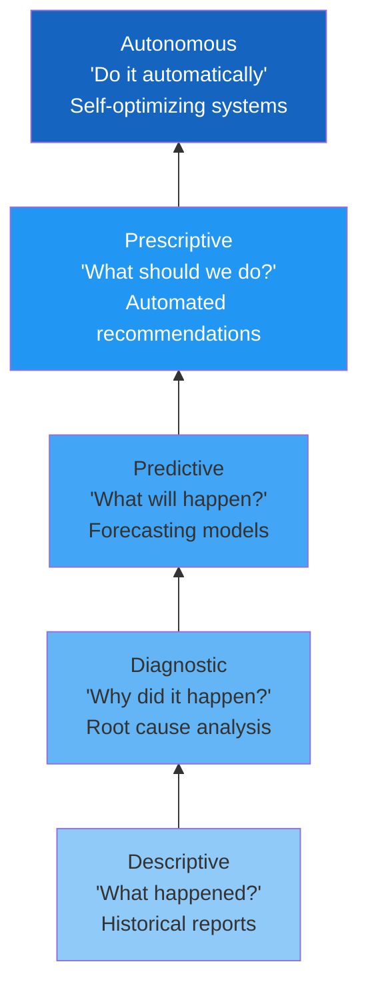

| Level | Question Answered | TankScan Example | AI Technique |
|---|---|---|---|
| **Descriptive** | What is happening now? | Current tank level is 34% | Dashboards, reports |
| **Diagnostic** | Why did it happen? | Level dropped 20% in 2 hours due to unexpected consumption | Pattern matching, correlation |
| **Predictive** | What will happen next? | Tank will reach 15% in 3.2 days at current consumption rate | Time-series forecasting |
| **Prescriptive** | What should we do? | Schedule delivery for Thursday morning via Route A | Optimization algorithms |
| **Autonomous** | Execute automatically | Delivery order placed and route optimized without human input | End-to-end ML pipeline |

### Why AI Matters for Tank Monitoring

Traditional tank monitoring generates enormous volumes of time-series data. A single sensor reporting every 15 minutes produces 35,040 readings per year. A fleet of 1,000 sensors generates over 35 million readings per year. Human operators cannot possibly analyze this data manually to extract all available insights.

!!! note "The Data Advantage"
    TankScan's cloud platform has accumulated years of tank level data across thousands of tanks in diverse environments and applications. This historical dataset is a strategic asset for training AI models that can predict behavior, detect anomalies, and optimize operations with increasing accuracy over time.

---

## 13.2 Machine Learning Fundamentals

Machine learning (ML) is a subset of AI where systems learn patterns from data rather than being explicitly programmed with rules.

### Supervised Learning

In supervised learning, the model learns from **labeled examples** -- historical data where both the input and the correct output are known.

**How it works:**

$$\hat{y} = f(X; \theta)$$

Where:
- $X$ = Input features (e.g., time of day, day of week, temperature, historical levels)
- $\theta$ = Model parameters (learned from training data)
- $\hat{y}$ = Predicted output (e.g., tomorrow's tank level)

**Tank monitoring applications of supervised learning:**

| Task | Input Features | Output (Label) | Algorithm Examples |
|---|---|---|---|
| Demand forecasting | Historical levels, weather, day of week | Future consumption volume | Linear regression, LSTM, Prophet |
| Delivery prediction | Consumption rate, current level, capacity | Days until delivery needed | Gradient boosting, random forest |
| Anomaly classification | Level changes, temperature, time patterns | Normal vs. anomalous | SVM, logistic regression |
| Sensor failure prediction | Signal strength, battery, temperature, age | Days until failure | Survival analysis, random forest |

### Unsupervised Learning

In unsupervised learning, the model finds **hidden patterns** in data without labeled examples.

**Tank monitoring applications:**

| Task | Technique | Description |
|---|---|---|
| **Clustering** | K-means, DBSCAN | Group tanks with similar consumption patterns |
| **Anomaly detection** | Isolation Forest, Autoencoder | Identify readings that deviate from normal patterns |
| **Dimensionality reduction** | PCA, t-SNE | Compress multi-sensor data for visualization |
| **Pattern discovery** | Association rules | Find correlations between environmental conditions and consumption |

### Reinforcement Learning

In reinforcement learning, an agent learns optimal actions through trial and error, receiving rewards for good decisions and penalties for poor ones.

**Potential tank monitoring applications:**

- **Route optimization** -- An RL agent learns the optimal delivery sequence across multiple tanks, adapting to changing conditions
- **Inventory policy** -- Learning the optimal reorder point for each tank that minimizes both delivery costs and stock-out risk
- **Alert tuning** -- Automatically adjusting alert thresholds to minimize false alarms while catching true anomalies

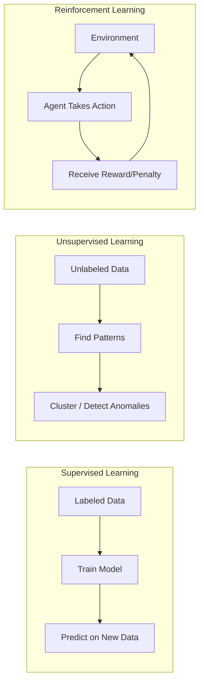

---

## 13.3 Anomaly Detection Algorithms for Tank Data

Anomaly detection is arguably the most immediately valuable AI application in tank monitoring. Detecting unusual patterns can indicate leaks, theft, sensor malfunction, or process upsets.

### Types of Anomalies

| Anomaly Type | Description | Example | Significance |
|---|---|---|---|
| **Point anomaly** | A single reading far from expected | Level jumps from 50% to 95% in one reading | Possible sensor error |
| **Contextual anomaly** | Reading is unusual for its context | Consumption at 2 AM on a Sunday | Possible theft or leak |
| **Collective anomaly** | A sequence of readings is unusual together | Gradual decline during a period of no consumption | Slow leak |

### Statistical Methods

**Z-Score Method:**

The simplest approach -- flag readings that are more than $k$ standard deviations from the mean:

$$z = \frac{x - \mu}{\sigma}$$

If $|z| > k$ (typically $k = 3$), the reading is flagged as anomalous.

!!! warning "Limitation"
    The Z-score method assumes a normal distribution and a stationary process. Tank level data is often non-stationary (levels rise during deliveries and fall during consumption), so raw Z-scores applied to level data will generate many false positives. Instead, apply Z-scores to the **rate of change** (first derivative) rather than the absolute level.

**Moving Average Residual Method:**

Compare each reading to a moving average and flag large residuals:

$$r_t = x_t - \frac{1}{w}\sum_{i=t-w}^{t-1} x_i$$

Where $w$ is the window size. If $|r_t| > k \cdot \sigma_r$, flag as anomalous.

### Machine Learning Methods

**Isolation Forest:**

Isolation Forest works by randomly partitioning data. Anomalies, being rare and different, require fewer partitions to isolate:

```python
from sklearn.ensemble import IsolationForest
import pandas as pd
import numpy as np

# Load tank data
df = pd.read_csv("tank_readings.csv", parse_dates=["timestamp"])

# Engineer features
df["hour"] = df["timestamp"].dt.hour
df["day_of_week"] = df["timestamp"].dt.dayofweek
df["level_change"] = df["level_percent"].diff()
df["change_rate"] = df["level_change"] / df["timestamp"].diff().dt.total_seconds() * 3600

# Select features for anomaly detection
features = ["level_change", "change_rate", "hour", "day_of_week"]
X = df[features].dropna()

# Train Isolation Forest
model = IsolationForest(
    contamination=0.01,  # Expected 1% anomalies
    random_state=42,
    n_estimators=200
)
model.fit(X)

# Predict anomalies (-1 = anomaly, 1 = normal)
df.loc[X.index, "anomaly"] = model.predict(X)
anomalies = df[df["anomaly"] == -1]
print(f"Detected {len(anomalies)} anomalous readings out of {len(df)}")
```

**Autoencoder Neural Network:**

An autoencoder learns to compress and reconstruct normal data. Anomalies produce high reconstruction error:

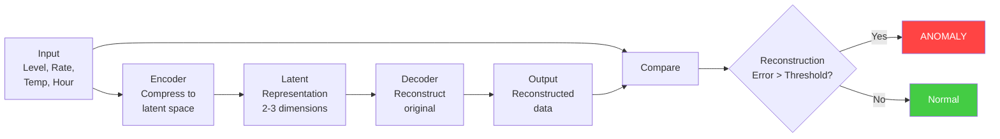

$$\text{Reconstruction Error} = \|x - \hat{x}\|^2 = \sum_{i=1}^{n}(x_i - \hat{x}_i)^2$$

If the reconstruction error exceeds a threshold (e.g., 95th percentile of training errors), the reading is classified as anomalous.

---

## 13.4 Predictive Maintenance Concepts

Maintenance strategy has a profound impact on the reliability and cost of tank monitoring systems. AI enables a shift from reactive and preventive approaches to truly predictive maintenance.

### Maintenance Strategy Comparison

| Strategy | Description | When Action Taken | Cost Profile |
|---|---|---|---|
| **Reactive** | Fix it when it breaks | After failure | Low maintenance cost, HIGH failure cost |
| **Preventive** | Service on a fixed schedule | Calendar or usage-based | Moderate cost, some unnecessary service |
| **Predictive (PdM)** | Service when data indicates impending failure | Before failure, based on condition | Optimal cost, minimal unnecessary service |
| **Prescriptive** | AI recommends specific action and timing | When and what to do, optimized | Lowest total cost |

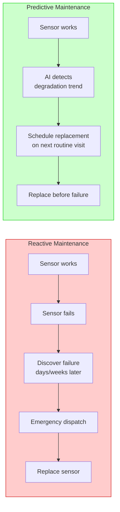

### Cost Comparison Model

The total cost of each maintenance strategy can be modeled:

**Reactive maintenance cost per sensor per year:**

$$C_{reactive} = P_{failure} \times (C_{emergency\_dispatch} + C_{downtime} + C_{replacement})$$

**Preventive maintenance cost per sensor per year:**

$$C_{preventive} = \frac{C_{scheduled\_visit} + C_{replacement}}{T_{replacement\_interval}} + P_{residual\_failure} \times C_{emergency\_dispatch}$$

**Predictive maintenance cost per sensor per year:**

$$C_{predictive} = C_{monitoring} + C_{analytics} + P_{predicted\_failure} \times C_{planned\_replacement}$$

!!! example "Cost Comparison Example"
    For a fleet of 500 sensors:

    | Cost Component | Reactive | Preventive | Predictive |
    |---|---|---|---|
    | Emergency dispatches/year | 75 at $350 each | 15 at $350 each | 5 at $350 each |
    | Scheduled replacements/year | 0 | 100 at $200 each | 70 at $200 each |
    | Monitoring/analytics | $0 | $0 | $5,000 |
    | Downtime cost | $50,000 | $10,000 | $2,000 |
    | **Total annual cost** | **$76,250** | **$35,250** | **$22,750** |
    | **Savings vs. reactive** | -- | **54%** | **70%** |

---

## 13.5 Predicting Sensor Failures

Wireless tank sensors are remote, battery-powered devices in harsh environments. Predicting failures before they occur is critical for maintaining data continuity.

### Failure Indicators

| Indicator | Data Source | Warning Sign |
|---|---|---|
| **Battery voltage** | Sensor telemetry | Accelerating voltage decline |
| **Signal strength (RSSI)** | Sensor telemetry | Degrading over time |
| **Reading frequency** | Platform data | Missed or delayed readings |
| **Temperature extremes** | Sensor telemetry | Prolonged exposure outside rated range |
| **Reading variance** | Platform data | Increasing noise in measurements |
| **Sensor age** | Asset management | Approaching end of rated life |

### Building a Sensor Failure Prediction Model

```python
import pandas as pd
import numpy as np
from sklearn.ensemble import GradientBoostingClassifier
from sklearn.model_selection import train_test_split
from sklearn.metrics import classification_report

# Load sensor telemetry data
# Each row = one sensor's monthly summary
df = pd.read_csv("sensor_health.csv")

# Feature engineering
features = [
    "battery_voltage_mean",
    "battery_voltage_slope",       # Rate of voltage decline
    "rssi_mean",
    "rssi_std",                    # Signal stability
    "missed_readings_count",
    "reading_variance",
    "temperature_max",
    "temperature_min",
    "sensor_age_months",
    "readings_per_day_mean"
]

# Target: did the sensor fail within the next 30 days?
target = "failed_within_30_days"

X = df[features]
y = df[target]

# Split data
X_train, X_test, y_train, y_test = train_test_split(
    X, y, test_size=0.2, random_state=42, stratify=y
)

# Train model
model = GradientBoostingClassifier(
    n_estimators=200,
    max_depth=4,
    learning_rate=0.1,
    random_state=42
)
model.fit(X_train, y_train)

# Evaluate
y_pred = model.predict(X_test)
print(classification_report(y_test, y_pred))

# Feature importance
importance = pd.Series(
    model.feature_importances_,
    index=features
).sort_values(ascending=False)
print("\nFeature Importance:")
print(importance)
```

**Typical feature importance ranking:**

| Rank | Feature | Importance |
|---|---|---|
| 1 | Battery voltage slope | 0.28 |
| 2 | Missed readings count | 0.22 |
| 3 | Sensor age (months) | 0.15 |
| 4 | Battery voltage mean | 0.12 |
| 5 | Reading variance | 0.09 |
| 6 | RSSI mean | 0.07 |
| 7 | Temperature extremes | 0.04 |
| 8 | Other features | 0.03 |

!!! tip "Actionable Predictions"
    A prediction model is only valuable if it drives action. For each sensor predicted to fail within 30 days, the system should automatically:

    1. Create a work order in the maintenance management system
    2. Assign the replacement to the next scheduled visit to that area
    3. Ensure a replacement sensor is in the technician's inventory
    4. Alert the account manager so the customer is informed proactively

---

## 13.6 Predicting Delivery Needs

For distributors, predicting when each tank will need a delivery is the foundation of route optimization and customer service excellence.

### Delivery Prediction Pipeline

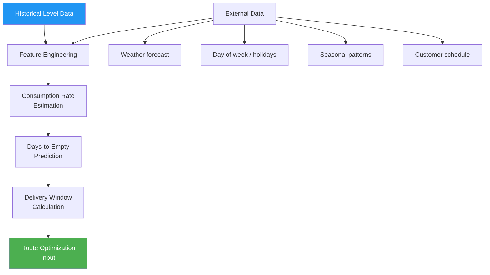

### Simple Days-to-Empty Calculation

The most basic prediction uses the average consumption rate:

$$\text{Days to Empty} = \frac{V_{current} - V_{reorder}}{R_{avg}}$$

Where:
- $V_{current}$ = Current volume in the tank
- $V_{reorder}$ = Volume at which reorder should be triggered
- $R_{avg}$ = Average daily consumption rate

!!! warning "Limitation of Simple Average"
    Using a simple average consumption rate ignores seasonality, day-of-week effects, and trends. A propane tank that averages 5 gallons/day across the year might consume 12 gallons/day in January and 1 gallon/day in July. The simple average would drastically underpredict winter delivery needs and overpredict summer needs.

### Advanced Forecasting with Weighted Moving Average

A better approach weights recent data more heavily:

$$R_{weighted} = \frac{\sum_{i=1}^{n} w_i \cdot r_i}{\sum_{i=1}^{n} w_i}$$

Where $w_i = \alpha^{n-i}$ is an exponential decay weight with $0 < \alpha < 1$.

### Time Series Forecasting with Facebook Prophet

For tanks with complex seasonal patterns, Facebook Prophet provides excellent forecasting:

```python
from prophet import Prophet
import pandas as pd

# Prepare data in Prophet format
df_prophet = pd.DataFrame({
    'ds': df['timestamp'],      # Date column
    'y': df['volume_gallons']   # Value to forecast
})

# Create and configure model
model = Prophet(
    changepoint_prior_scale=0.05,  # Flexibility for trend changes
    seasonality_mode='multiplicative',
    yearly_seasonality=True,
    weekly_seasonality=True,
    daily_seasonality=False  # Tank readings typically too sparse for daily patterns
)

# Add weather as external regressor if available
if 'temperature_avg' in df.columns:
    df_prophet['temperature'] = df['temperature_avg']
    model.add_regressor('temperature')

# Fit model
model.fit(df_prophet)

# Forecast 30 days ahead
future = model.make_future_dataframe(periods=30)
if 'temperature' in df_prophet.columns:
    # Add forecasted temperature (from weather API)
    future['temperature'] = get_weather_forecast(30)

forecast = model.predict(future)

# Find the date when level crosses reorder threshold
reorder_volume = 500  # gallons
delivery_date = forecast[forecast['yhat'] <= reorder_volume]['ds'].min()
print(f"Predicted delivery needed by: {delivery_date}")
```

---

## 13.7 Demand Forecasting Models

Beyond individual tank delivery prediction, AI enables demand forecasting at the fleet level -- predicting total product demand across all monitored tanks.

### Time Series Decomposition

Tank consumption data can be decomposed into four components:

$$y_t = T_t + S_t + C_t + \epsilon_t$$

Where:
- $T_t$ = **Trend** -- Long-term increase or decrease in consumption
- $S_t$ = **Seasonality** -- Recurring patterns (weekly, monthly, yearly)
- $C_t$ = **Cyclical** -- Longer-period fluctuations (economic cycles)
- $\epsilon_t$ = **Residual** -- Random variation

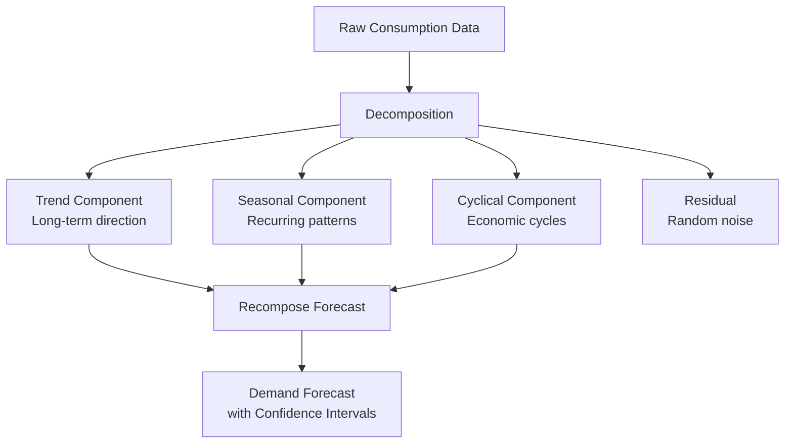

### Regression-Based Forecasting

Multiple regression can incorporate external variables that influence consumption:

$$\hat{y} = \beta_0 + \beta_1 x_{temp} + \beta_2 x_{day} + \beta_3 x_{season} + \beta_4 x_{price} + \epsilon$$

| Variable | Type | Influence on Consumption |
|---|---|---|
| Temperature ($x_{temp}$) | Continuous | Strong (heating fuels, HVAC) |
| Day of week ($x_{day}$) | Categorical | Moderate (business vs. weekend) |
| Season ($x_{season}$) | Categorical | Strong (seasonal products) |
| Product price ($x_{price}$) | Continuous | Weak-moderate (price elasticity) |
| Holidays ($x_{holiday}$) | Binary | Moderate (business closures) |
| Economic indicators ($x_{econ}$) | Continuous | Weak (long-term trends) |

### LSTM Neural Networks for Time Series

Long Short-Term Memory (LSTM) networks are a type of recurrent neural network particularly well-suited for time-series forecasting:

```python
import numpy as np
from tensorflow.keras.models import Sequential
from tensorflow.keras.layers import LSTM, Dense, Dropout

# Prepare sequences
def create_sequences(data, lookback=30, forecast=7):
    X, y = [], []
    for i in range(lookback, len(data) - forecast):
        X.append(data[i-lookback:i])
        y.append(data[i:i+forecast])
    return np.array(X), np.array(y)

# Normalize data
from sklearn.preprocessing import MinMaxScaler
scaler = MinMaxScaler()
scaled_data = scaler.fit_transform(consumption_data.reshape(-1, 1))

# Create sequences: use 30 days to predict next 7 days
X, y = create_sequences(scaled_data, lookback=30, forecast=7)

# Build LSTM model
model = Sequential([
    LSTM(64, return_sequences=True, input_shape=(30, 1)),
    Dropout(0.2),
    LSTM(32, return_sequences=False),
    Dropout(0.2),
    Dense(16, activation='relu'),
    Dense(7)  # Predict 7 days ahead
])

model.compile(optimizer='adam', loss='mse')
model.fit(X, y, epochs=50, batch_size=32, validation_split=0.2)

# Forecast
last_30_days = scaled_data[-30:].reshape(1, 30, 1)
forecast_scaled = model.predict(last_30_days)
forecast = scaler.inverse_transform(forecast_scaled.reshape(-1, 1))
print(f"7-day consumption forecast: {forecast.flatten()}")
```

### Forecast Accuracy Metrics

| Metric | Formula | Interpretation |
|---|---|---|
| **MAE** (Mean Absolute Error) | $\frac{1}{n}\sum\|y_i - \hat{y}_i\|$ | Average absolute prediction error |
| **RMSE** (Root Mean Square Error) | $\sqrt{\frac{1}{n}\sum(y_i - \hat{y}_i)^2}$ | Penalizes large errors more |
| **MAPE** (Mean Absolute % Error) | $\frac{100}{n}\sum\left\|\frac{y_i - \hat{y}_i}{y_i}\right\|$ | Percentage error (scale-independent) |
| **R-squared** ($R^2$) | $1 - \frac{\sum(y_i - \hat{y}_i)^2}{\sum(y_i - \bar{y})^2}$ | Proportion of variance explained |

!!! note "Acceptable Accuracy"
    For tank delivery prediction, a MAPE of 10-15% is typically acceptable for 7-day forecasts. For 30-day forecasts, 15-25% MAPE is common. Accuracy improves significantly with more historical data and the inclusion of external variables like weather.

---

## 13.8 Digital Twin Technology for Tanks

A **digital twin** is a virtual replica of a physical asset that mirrors its real-time state and behavior. For tank monitoring, digital twins enable simulation, prediction, and optimization that goes beyond what sensor data alone can provide.

### Digital Twin Architecture

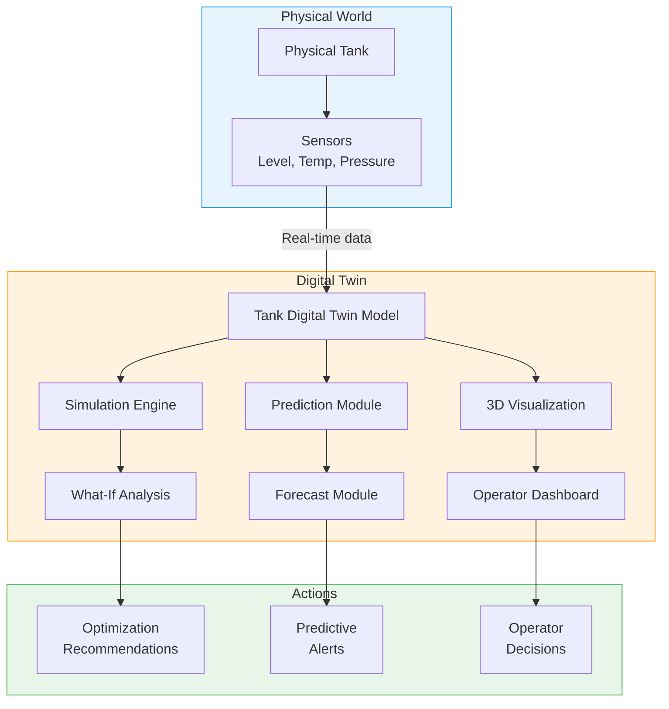

### Digital Twin Components

| Component | Data Source | Purpose |
|---|---|---|
| **Geometric model** | Tank specifications | Volume calculations, 3D visualization |
| **Fluid model** | Product data sheets | Thermal expansion, viscosity, density |
| **Thermal model** | Temperature sensors, weather data | Predict temperature effects on level readings |
| **Consumption model** | Historical level data | Forecast future consumption patterns |
| **Structural model** | Material specs, age, inspections | Predict corrosion and structural degradation |
| **Environmental model** | Weather API, site conditions | Account for external influences |

### What-If Simulation Examples

Digital twins enable "what-if" analysis without risking the physical asset:

| Scenario | Simulation Question | Business Value |
|---|---|---|
| Capacity change | "What if we replaced this 5,000-gal tank with 10,000-gal?" | Capital planning |
| Delivery frequency | "What if we delivered every 2 weeks instead of weekly?" | Route optimization |
| Temperature extreme | "What if ambient temp hits 110 degrees F for 3 days?" | Safety planning |
| Demand surge | "What if consumption doubles for 2 weeks?" | Emergency planning |
| Product switch | "What if we switch from Diesel #2 to biodiesel blend?" | Compatibility assessment |

---

## 13.9 Edge AI Processing on Gateway Devices

While cloud-based AI is powerful, some applications require intelligence at the edge -- on the gateway device itself -- to reduce latency, bandwidth, and cloud dependency.

### Cloud AI vs. Edge AI

| Characteristic | Cloud AI | Edge AI |
|---|---|---|
| **Processing power** | Virtually unlimited | Constrained (embedded processor) |
| **Latency** | Seconds to minutes (network dependent) | Milliseconds |
| **Bandwidth required** | All data uploaded | Only summaries/alerts uploaded |
| **Connectivity required** | Always (for real-time) | Can operate offline |
| **Model complexity** | Any (large models, ensembles) | Limited (small, efficient models) |
| **Update frequency** | Real-time | Periodic OTA updates |
| **Cost** | Cloud compute charges | One-time hardware cost |

### Edge AI Use Cases for TankScan

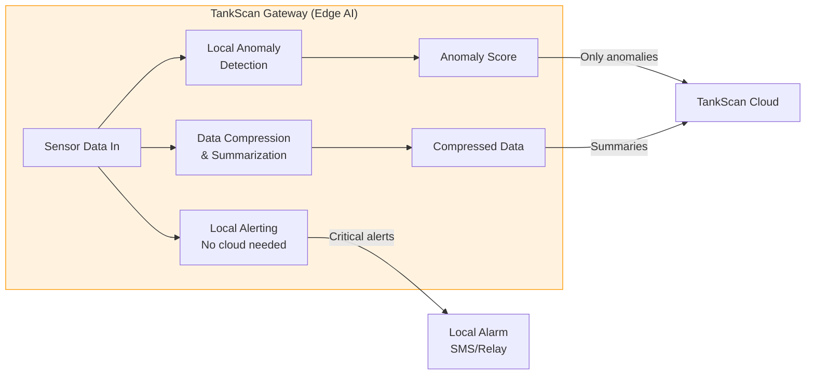

| Edge AI Task | Description | Benefit |
|---|---|---|
| **Local anomaly detection** | Run lightweight anomaly detection on the gateway | Immediate alerts even without connectivity |
| **Data compression** | Send only significant changes, not every reading | Reduce cellular data costs by 70-80% |
| **Predictive alerting** | Calculate hours-to-empty locally | Alerts continue during cloud outages |
| **Sensor fusion** | Combine multiple sensor inputs locally | Reduce noise, improve accuracy |
| **Adaptive sampling** | Increase reading frequency when changes detected | Better resolution during critical periods |

### TinyML for Gateway Deployment

**TinyML** refers to machine learning models optimized for microcontrollers and edge devices:

```python
# Example: Convert a trained model to TensorFlow Lite for edge deployment
import tensorflow as tf

# Assume 'model' is a trained Keras model
converter = tf.lite.TFLiteConverter.from_keras_model(model)

# Optimize for size and speed
converter.optimizations = [tf.lite.Optimize.DEFAULT]
converter.target_spec.supported_types = [tf.float16]

# Convert
tflite_model = converter.convert()

# Save for deployment to gateway
with open("anomaly_detector.tflite", "wb") as f:
    f.write(tflite_model)

print(f"Model size: {len(tflite_model) / 1024:.1f} KB")
# Typical output: "Model size: 12.3 KB"
```

!!! tip "Model Size Targets"
    For gateway deployment, ML models should typically be under 100 KB and require less than 256 KB of RAM during inference. This constrains model architecture but is achievable for common tank monitoring tasks using techniques like quantization, pruning, and knowledge distillation.

---

## 13.10 Natural Language Interfaces for Tank Data

Natural Language Processing (NLP) enables non-technical users to query tank data conversationally, removing the barrier of complex dashboards and report builders.

### Conversational Tank Data Queries

Instead of navigating through multiple dashboard screens, a user could simply ask:

| Natural Language Query | System Action | Response |
|---|---|---|
| "Which tanks need delivery this week?" | Query all tanks, filter by days-to-empty < 7 | "14 tanks need delivery by Friday. The most urgent is Tank 456 (Diesel) at Site 23 with 12% remaining." |
| "What was the consumption at Site 15 last month?" | Aggregate consumption data for all tanks at Site 15 | "Site 15 consumed 12,400 gallons of diesel and 3,200 gallons of DEF in January." |
| "Are any sensors having issues?" | Check sensor health metrics across fleet | "3 sensors show degraded signal strength. Sensor at Tank 789 has been intermittent for 48 hours." |
| "Compare this winter's propane usage to last winter." | Year-over-year consumption analysis | "Propane consumption is 8% higher than last winter, likely due to 12% more heating degree days." |

### Architecture of an NLP Interface

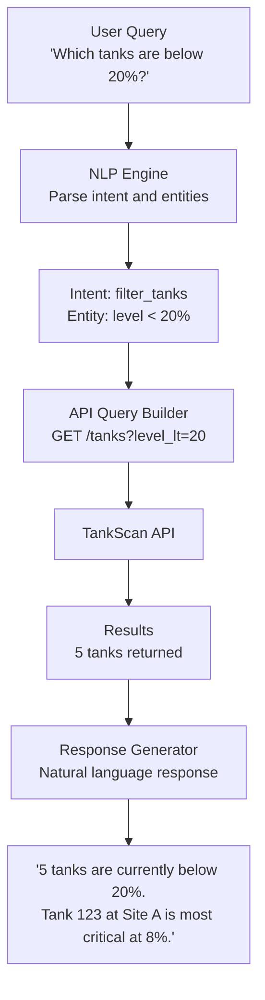

### LLM-Powered Analytics Assistant

Modern Large Language Models (LLMs) can serve as intelligent analytics assistants:

```python
# Example: LLM-powered tank data assistant
from openai import OpenAI
import json

client = OpenAI()

# Define available functions the LLM can call
tools = [
    {
        "type": "function",
        "function": {
            "name": "get_tank_level",
            "description": "Get the current level of a specific tank",
            "parameters": {
                "type": "object",
                "properties": {
                    "tank_id": {"type": "string"},
                    "tank_name": {"type": "string"}
                }
            }
        }
    },
    {
        "type": "function",
        "function": {
            "name": "get_low_tanks",
            "description": "Get all tanks below a specified level percentage",
            "parameters": {
                "type": "object",
                "properties": {
                    "threshold_percent": {"type": "number", "default": 20}
                }
            }
        }
    }
]

def chat_with_tanks(user_message):
    response = client.chat.completions.create(
        model="gpt-4",
        messages=[
            {"role": "system", "content": "You are a helpful tank monitoring assistant."},
            {"role": "user", "content": user_message}
        ],
        tools=tools,
        tool_choice="auto"
    )
    # Process tool calls and generate response
    return response
```

---

## 13.11 Computer Vision for Tank Inspection

Computer vision -- AI that interprets images and video -- opens new possibilities for tank inspection that complement level monitoring data.

### Computer Vision Applications

| Application | Input | Output | Benefit |
|---|---|---|---|
| **Corrosion detection** | Tank exterior photos | Corrosion severity map | Early structural issue identification |
| **Leak visualization** | Thermal camera images | Leak location highlighted | Pinpoint leak sources on large tanks |
| **Label/marking reading** | Photos of tank labels | Extracted text (tank ID, capacity, product) | Automated asset inventory |
| **Containment area inspection** | Drone photos | Deficiency annotations | Efficient compliance auditing |
| **Delivery verification** | Camera at fill port | Delivery start/stop timestamps | Automated delivery documentation |

### Thermal Imaging for Leak Detection

Thermal cameras can detect leaks by identifying temperature differences where liquid contacts tank surfaces:

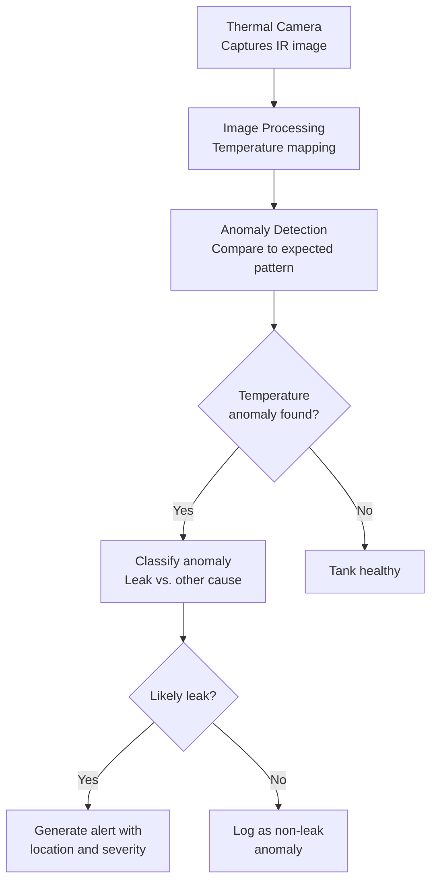

!!! note "Complementary to Level Monitoring"
    Computer vision does not replace level monitoring -- it complements it. Level monitoring detects that a leak exists (unexplained level drop); computer vision helps locate where the leak is. Together, they provide both detection and diagnosis.

---

## 13.12 TankScan Python Analytics Capability

TankScan's platform includes Python-based analytics capabilities for customers who want to build custom models on their tank data.

### Analytics Environment

```python
# TankScan Python Analytics - Example Workflow

import tankscan.analytics as tsa

# Connect to your TankScan data
session = tsa.connect(api_key="YOUR_KEY")

# Load data for analysis
tanks = session.get_tanks(group="Northeast Region")
data = session.get_readings(
    tanks=tanks,
    start="2024-01-01",
    end="2025-01-01",
    frequency="daily"
)

# Built-in analytics functions
# 1. Consumption analysis
consumption = tsa.analyze_consumption(data)
print(consumption.summary())

# 2. Seasonal decomposition
decomposition = tsa.decompose(data, period="yearly")
decomposition.plot()

# 3. Anomaly detection
anomalies = tsa.detect_anomalies(data, method="isolation_forest")
print(f"Found {len(anomalies)} anomalous readings")

# 4. Delivery prediction
predictions = tsa.predict_deliveries(data, horizon_days=14)
for tank_id, pred in predictions.items():
    print(f"Tank {tank_id}: delivery needed by {pred.date} "
          f"(confidence: {pred.confidence:.0%})")

# 5. Export results
predictions.to_csv("delivery_forecast.csv")
predictions.to_dashboard("Delivery Forecast Dashboard")
```

### Pre-Built Analytics Templates

| Template | Description | Output |
|---|---|---|
| **Consumption Report** | Monthly/weekly consumption by tank, group, or product | PDF report + CSV data |
| **Delivery Optimizer** | Optimal delivery schedule for next N days | Route plan + delivery volumes |
| **Anomaly Report** | All detected anomalies with severity scores | Alert list + visualizations |
| **Sensor Health** | Fleet-wide sensor health assessment | Maintenance priority list |
| **Seasonal Forecast** | Next-season demand forecast by product and region | Forecast charts + data |

---

## 13.13 Building ML Models on Tank Level Data

This section provides a practical, end-to-end guide to building a machine learning model for tank delivery prediction.

### End-to-End ML Pipeline

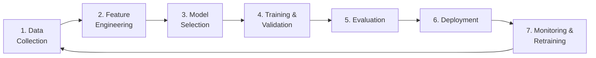

### Step-by-Step Implementation

```python
"""
Complete ML Pipeline: Predict days until delivery needed
"""
import pandas as pd
import numpy as np
from sklearn.model_selection import train_test_split, cross_val_score
from sklearn.ensemble import GradientBoostingRegressor
from sklearn.metrics import mean_absolute_error, mean_squared_error
import joblib

# ============================================================
# STEP 1: Data Collection
# ============================================================
# Load historical tank data with delivery events
readings = pd.read_csv("tank_readings.csv", parse_dates=["timestamp"])
deliveries = pd.read_csv("delivery_events.csv", parse_dates=["delivery_date"])

# ============================================================
# STEP 2: Feature Engineering
# ============================================================
def engineer_features(df):
    """Create predictive features from raw tank readings."""
    features = pd.DataFrame()

    # Current state
    features["current_level_pct"] = df["level_percent"]
    features["current_volume"] = df["volume_gallons"]

    # Consumption rates (multiple windows)
    features["consumption_rate_7d"] = (
        df["volume_gallons"].diff(-7*24) / 7  # 7-day avg daily consumption
    )
    features["consumption_rate_30d"] = (
        df["volume_gallons"].diff(-30*24) / 30  # 30-day avg daily consumption
    )

    # Consumption acceleration
    features["consumption_acceleration"] = (
        features["consumption_rate_7d"] - features["consumption_rate_30d"]
    )

    # Temporal features
    features["day_of_week"] = df["timestamp"].dt.dayofweek
    features["month"] = df["timestamp"].dt.month
    features["is_weekend"] = (df["timestamp"].dt.dayofweek >= 5).astype(int)

    # Environmental
    if "temperature_f" in df.columns:
        features["temperature"] = df["temperature_f"]
        features["heating_degree_days"] = np.maximum(65 - df["temperature_f"], 0)

    # Tank characteristics
    features["tank_capacity"] = df["tank_capacity"]
    features["fill_ratio"] = df["volume_gallons"] / df["tank_capacity"]

    return features

features = engineer_features(readings)

# ============================================================
# STEP 3: Create Target Variable
# ============================================================
# For each reading, calculate how many days until the next delivery
# (This requires joining with delivery events)
def calculate_days_to_delivery(readings_df, deliveries_df):
    """Calculate days until next delivery for each reading."""
    days_to_delivery = []
    for _, reading in readings_df.iterrows():
        future_deliveries = deliveries_df[
            (deliveries_df["tank_id"] == reading["tank_id"]) &
            (deliveries_df["delivery_date"] > reading["timestamp"])
        ]
        if len(future_deliveries) > 0:
            next_delivery = future_deliveries["delivery_date"].min()
            days = (next_delivery - reading["timestamp"]).days
            days_to_delivery.append(days)
        else:
            days_to_delivery.append(np.nan)
    return days_to_delivery

features["days_to_delivery"] = calculate_days_to_delivery(readings, deliveries)
features = features.dropna()

# ============================================================
# STEP 4: Train Model
# ============================================================
X = features.drop("days_to_delivery", axis=1)
y = features["days_to_delivery"]

X_train, X_test, y_train, y_test = train_test_split(
    X, y, test_size=0.2, random_state=42
)

model = GradientBoostingRegressor(
    n_estimators=300,
    max_depth=5,
    learning_rate=0.05,
    subsample=0.8,
    random_state=42
)

# Cross-validation
cv_scores = cross_val_score(model, X_train, y_train,
                            cv=5, scoring='neg_mean_absolute_error')
print(f"CV MAE: {-cv_scores.mean():.1f} +/- {cv_scores.std():.1f} days")

# Fit final model
model.fit(X_train, y_train)

# ============================================================
# STEP 5: Evaluate
# ============================================================
y_pred = model.predict(X_test)
mae = mean_absolute_error(y_test, y_pred)
rmse = np.sqrt(mean_squared_error(y_test, y_pred))
print(f"Test MAE: {mae:.1f} days")
print(f"Test RMSE: {rmse:.1f} days")

# ============================================================
# STEP 6: Save Model for Deployment
# ============================================================
joblib.dump(model, "delivery_predictor_v1.pkl")
print("Model saved for deployment")
```

!!! tip "Model Improvement Strategies"
    If initial model accuracy is insufficient:

    1. **Add more features**: Weather data, holidays, customer-specific patterns
    2. **Use more data**: Longer training history improves seasonal pattern capture
    3. **Try different algorithms**: Random Forest, XGBoost, LightGBM, or LSTM
    4. **Per-tank models**: Individual models for high-volume tanks, grouped models for similar tanks
    5. **Ensemble methods**: Combine multiple model predictions for robustness

---

## 13.14 Future AI Roadmap

The application of AI to tank monitoring is still in its early stages. Several emerging capabilities will reshape the field over the coming years.

### Near-Term (1-2 Years)

| Capability | Description | Impact |
|---|---|---|
| **Automated anomaly classification** | AI not only detects anomalies but classifies them (leak, theft, sensor error, delivery) | Reduces investigation time from hours to minutes |
| **Fleet-wide pattern recognition** | Identify patterns across thousands of tanks simultaneously | Discover systemic issues before they affect individual tanks |
| **Weather-integrated forecasting** | Automatic incorporation of weather forecasts into demand predictions | 15-25% improvement in forecast accuracy |
| **Natural language reporting** | AI generates written analysis of fleet status in plain English | Executives get actionable summaries without dashboard navigation |

### Medium-Term (3-5 Years)

| Capability | Description | Impact |
|---|---|---|
| **Fully autonomous delivery scheduling** | AI schedules all deliveries without human intervention | Reduces planning labor by 90%; improves delivery efficiency by 20% |
| **Predictive structural monitoring** | AI predicts tank structural degradation from indirect indicators | Prevents catastrophic failures; extends tank service life |
| **Multi-modal AI** | Combines level data, imagery, weather, market data, and more | Holistic understanding of tank operations |
| **Federated learning** | Train ML models across customer data without sharing raw data | Better models while preserving data privacy |

### Long-Term (5-10 Years)

| Capability | Description | Impact |
|---|---|---|
| **Autonomous supply chains** | End-to-end automation from demand sensing to delivery | Minimal human intervention in routine operations |
| **Self-healing sensor networks** | AI automatically reconfigures network when sensors fail | Near-zero monitoring downtime |
| **Digital twin ecosystems** | Complete virtual replica of entire supply chain | Full simulation capability for strategic planning |

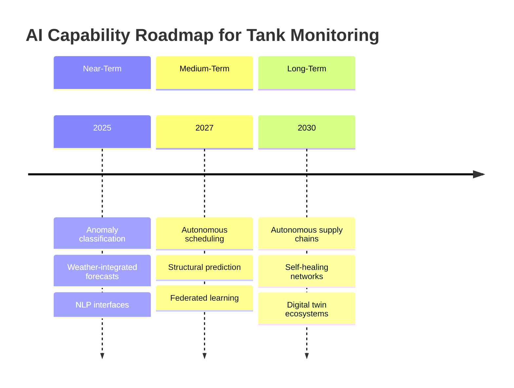

---

## Chapter 13 Summary

This chapter explored how artificial intelligence and machine learning are transforming tank monitoring from passive data collection to proactive, predictive intelligence:

- **AI enables a progression** from descriptive ("what happened?") to autonomous ("do it automatically") capabilities
- **Machine learning fundamentals** -- supervised, unsupervised, and reinforcement learning -- each have specific applications in tank monitoring
- **Anomaly detection** using statistical methods and ML algorithms can identify leaks, theft, and sensor failures
- **Predictive maintenance** reduces costs by 70% compared to reactive approaches by predicting failures before they occur
- **Delivery prediction** and **demand forecasting** use time-series models to optimize logistics
- **Digital twins** create virtual replicas of physical tanks for simulation and optimization
- **Edge AI** on gateway devices enables local intelligence for low-latency, offline-capable operation
- **NLP interfaces** allow natural language queries against tank data
- **Computer vision** complements level monitoring for inspection and leak location
- **Python analytics** capabilities enable custom model development on TankScan data
- The **AI roadmap** points toward increasingly autonomous tank monitoring and supply chain management

---

## Review Questions

!!! question "Question 1 -- Knowledge (Remember)"
    Name and briefly describe the three main categories of machine learning, and give one tank monitoring example for each.

    ??? success "Answer"
        1. **Supervised learning**: The model learns from labeled examples (input-output pairs). Tank monitoring example: predicting days until delivery needed, where the input is current level, consumption rate, etc., and the output is the known delivery date from historical records.

        2. **Unsupervised learning**: The model finds hidden patterns in data without labels. Tank monitoring example: clustering tanks into groups with similar consumption patterns to identify segment-specific behaviors.

        3. **Reinforcement learning**: An agent learns by taking actions in an environment and receiving rewards or penalties. Tank monitoring example: a route optimization agent that learns the most efficient delivery sequence through trial and error, adapting to changing conditions.

!!! question "Question 2 -- Comprehension (Understand)"
    Explain why a simple average consumption rate is insufficient for predicting delivery needs, and describe two more sophisticated approaches that address its limitations.

    ??? success "Answer"
        A simple average consumption rate fails because it assumes consumption is constant over time. In reality, consumption varies significantly due to **seasonality** (propane usage is much higher in winter), **day-of-week effects** (industrial tanks consume more on weekdays), and **trends** (growing or declining business). A simple average over a year would underpredict winter needs and overpredict summer needs.

        Two better approaches:
        1. **Exponential Weighted Moving Average**: Weights recent data more heavily using $R_{weighted} = \frac{\sum w_i \cdot r_i}{\sum w_i}$ where $w_i = \alpha^{n-i}$. This adapts quickly to changing consumption patterns.
        2. **Facebook Prophet (or similar time-series model)**: Decomposes consumption into trend, seasonality, and residual components, and can incorporate external regressors like temperature. This handles complex seasonal patterns and holidays automatically.

!!! question "Question 3 -- Application (Apply)"
    A sensor's battery voltage has been declining at a rate of 0.015V per month. The current voltage is 3.25V and the sensor stops functioning at 2.80V. Build a simple prediction for when this sensor will fail, and describe what additional data would improve the prediction.

    ??? success "Answer"
        **Simple linear prediction:**
        - Remaining voltage: $3.25V - 2.80V = 0.45V$
        - Months until failure: $0.45V \div 0.015V/month = 30$ months

        The sensor is predicted to fail in approximately **30 months** (2.5 years).

        **Additional data to improve prediction:**
        - **Temperature history**: Battery voltage decline accelerates in extreme temperatures. Knowing the seasonal temperature profile would reveal that winter months might drain the battery 2-3x faster.
        - **Transmission frequency**: More frequent readings drain the battery faster. If the sensor's reporting interval changes, the decline rate will change.
        - **Signal strength (RSSI)**: Poor signal requires higher transmission power, draining the battery faster. If the sensor's RF environment deteriorates, battery drain accelerates.
        - **Historical failure data from similar sensors**: Other sensors of the same model in similar environments provide empirical failure distributions.
        - **Non-linear decline patterns**: Battery voltage often declines exponentially near end-of-life, not linearly. A model trained on actual battery discharge curves would predict a shorter remaining life.

!!! question "Question 4 -- Analysis (Analyze)"
    Compare cloud-based AI and edge AI for anomaly detection in tank monitoring. Under what specific conditions would you recommend edge AI over cloud AI, and vice versa?

    ??? success "Answer"
        **Recommend Edge AI when:**
        - **Connectivity is unreliable**: Remote sites with intermittent cellular coverage need local anomaly detection to ensure critical alerts are not delayed by network outages
        - **Latency is critical**: Safety-critical applications (C1D1 environments) where even seconds of delay are unacceptable
        - **Bandwidth costs are high**: Satellite-connected sites where transmitting every reading is expensive; edge AI can filter and only transmit anomalies
        - **Scale requires cost optimization**: Thousands of sensors where cloud compute costs for real-time anomaly detection become significant
        - **Privacy or regulatory constraints**: Industries where data must be processed locally before any cloud transmission

        **Recommend Cloud AI when:**
        - **Model complexity is high**: Sophisticated models (LSTMs, large ensembles) that exceed gateway processing capacity
        - **Cross-tank analysis is needed**: Patterns that span multiple tanks or sites require centralized data
        - **Rapid model iteration is needed**: Cloud models can be updated instantly; edge models require OTA firmware updates
        - **Rich feature sets are available**: Cloud can combine tank data with weather, ERP, and market data for richer analysis
        - **Historical context is important**: Anomaly detection that considers months of history requires cloud-scale storage

        **Optimal approach**: Use edge AI for immediate, safety-critical anomaly detection with simple models, and cloud AI for deeper, context-rich analysis with complex models. The two are complementary, not competing.

!!! question "Question 5 -- Synthesis (Create)"
    Design an AI-powered system that automatically detects fuel theft from monitored tanks. Describe the data inputs, algorithm approach, alert logic, and how you would handle false positives.

    ??? success "Answer"
        **System Design: AI-Powered Fuel Theft Detection**

        **Data Inputs:**
        - Real-time tank level readings (every 15 minutes)
        - Historical consumption patterns (baseline)
        - Scheduled delivery records (to exclude delivery events)
        - Time of day and day of week
        - Site access logs (if available)
        - Weather data (temperature for thermal expansion compensation)

        **Algorithm Approach:**
        1. **Baseline modeling**: Train a time-series model on 90+ days of historical data to establish normal consumption patterns for each tank. The model learns typical weekday vs. weekend rates, daily patterns (e.g., consumption during business hours only), and seasonal trends.
        2. **Temperature compensation**: Apply thermal expansion correction to eliminate false signals from temperature-driven level changes.
        3. **Event classification**: For each significant level change, classify as: (a) normal consumption, (b) scheduled delivery, (c) anomalous decrease, or (d) anomalous increase.
        4. **Theft scoring**: Score anomalous decreases based on: magnitude of unexpected drop, time of occurrence (nighttime/weekend = higher score), rate of decrease (theft is typically faster than normal consumption), and whether it matches known theft patterns from historical confirmed incidents.

        **Alert Logic:**
        - Score > 0.8: Immediate alert to security and operations
        - Score 0.5-0.8: Alert to operations for investigation within 24 hours
        - Score 0.3-0.5: Log for review in weekly anomaly report
        - Score < 0.3: Normal variation, no action

        **False Positive Management:**
        - **Feedback loop**: Every alert includes "Confirm theft" / "Not theft" buttons. Operator feedback retrains the model.
        - **Contextual enrichment**: Before alerting, check for known maintenance activities, emergency consumption events, or meter calibration that could explain the drop.
        - **Graduated alerting**: Start with low-confidence alerts to operations only (not police/security) to build operator trust before escalating alert severity.
        - **Seasonal recalibration**: Retrain baseline models quarterly to account for evolving consumption patterns.
