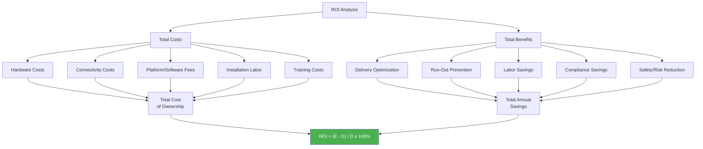
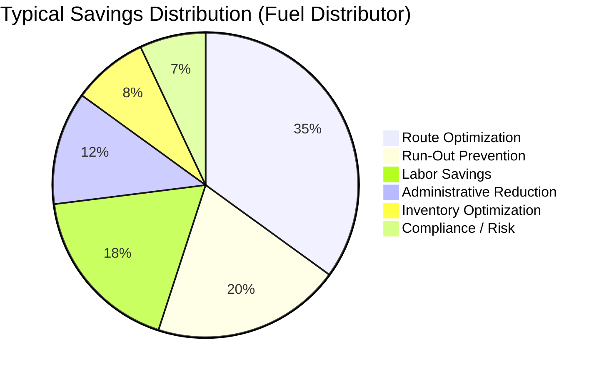
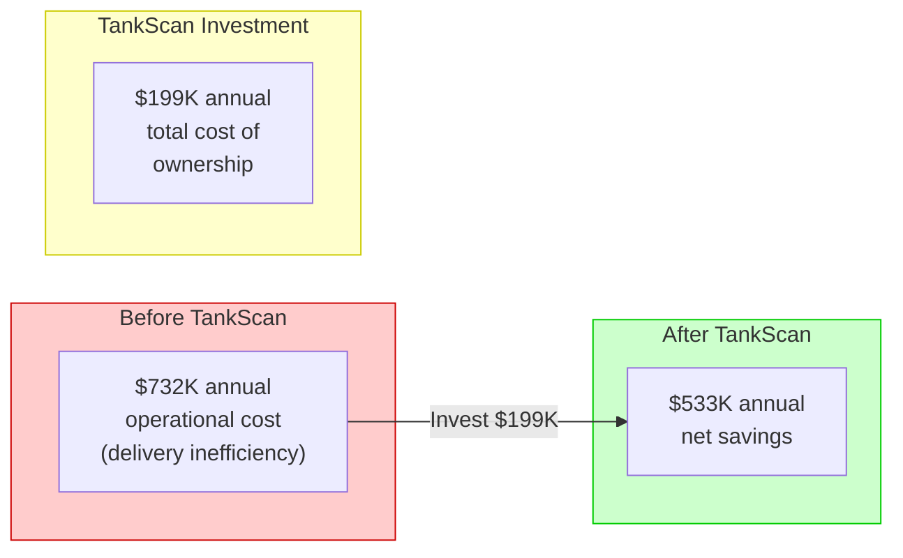
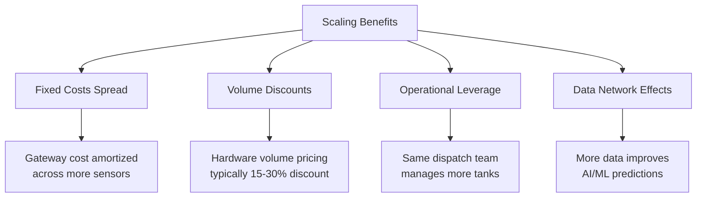
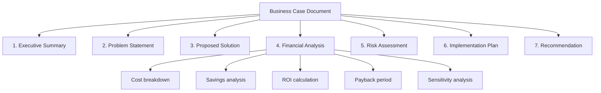

# Chapter 14: Case Studies and ROI

## Learning Objectives

By the end of this chapter, you will be able to:

- Calculate return on investment (ROI) for tank monitoring deployments
- Identify and quantify all cost components of a monitoring system
- Categorize and estimate savings across multiple benefit areas
- Analyze real-world case studies across different industries
- Build a compelling business case for tank monitoring investments
- Apply payback period and net present value analysis to monitoring projects
- Evaluate scaling economics as fleets grow
- Create a business case template for stakeholder presentations

---

## 14.1 How to Calculate ROI for Tank Monitoring

Return on Investment is the fundamental metric that justifies tank monitoring expenditures. Understanding how to calculate it rigorously -- and how to present it convincingly -- is essential for anyone involved in selling, deploying, or managing TankScan systems.

### The ROI Formula

The basic ROI formula is:

$$\text{ROI} = \frac{\text{Net Benefits} - \text{Total Costs}}{\text{Total Costs}} \times 100\%$$

For a more detailed analysis over time, use Net Present Value (NPV):

$$\text{NPV} = \sum_{t=0}^{n} \frac{B_t - C_t}{(1 + r)^t}$$

Where:
- $B_t$ = Benefits in year $t$
- $C_t$ = Costs in year $t$
- $r$ = Discount rate (typically 8-12% for industrial investments)
- $n$ = Number of years in the analysis period

And the payback period:

$$\text{Payback Period} = \frac{\text{Initial Investment}}{\text{Annual Net Savings}}$$

!!! tip "Rule of Thumb"
    Most TankScan deployments achieve a payback period of **6-18 months**. Deployments with high delivery frequency, long driving distances, or hazardous materials tend to achieve faster payback due to higher per-trip savings.

### ROI Calculation Framework

---

## 14.2 Cost Components

A thorough ROI analysis must account for all costs, not just hardware.

### Hardware Costs

| Component | Typical Cost Range | Lifetime | Notes |
|---|---|---|---|
| **Wireless sensor** | $400 - $1,200 | 5-10 years | Varies by type (radar, ultrasonic, pressure) |
| **C1D1-rated sensor (TSR)** | $800 - $2,500 | 5-10 years | Higher cost for hazardous area certification |
| **Gateway** | $500 - $1,500 | 7-10 years | One per site; handles up to 100+ sensors |
| **Mounting hardware** | $25 - $150 | Lifetime of tank | Adapters, brackets, fittings |
| **Replacement batteries** | $30 - $80 | 3-7 years | For battery-powered sensors |
| **Spare sensors (5-10%)** | Varies | N/A | For rapid replacement of failures |

### Connectivity Costs

| Connectivity Type | Monthly Cost per Gateway | Notes |
|---|---|---|
| **Cellular (4G LTE)** | $10 - $30 | Most common; reliable in populated areas |
| **Cellular (CAT-M1/NB-IoT)** | $3 - $10 | Lower bandwidth, lower cost, better coverage |
| **WiFi** | $0 (uses existing) | No additional cost if WiFi available |
| **Satellite** | $30 - $100 | Remote locations only |
| **Ethernet** | $0 (uses existing) | If wired connection available at gateway |

### Platform and Software Fees

| Fee Type | Typical Range | Billing Model |
|---|---|---|
| **Per-sensor monitoring fee** | $5 - $25/month per sensor | Monthly or annual subscription |
| **Platform access fee** | $100 - $500/month | Per account or per site |
| **API access** | $0 - $200/month | Often included; premium tiers available |
| **Premium analytics** | $50 - $300/month | Advanced forecasting, AI features |
| **Integration support** | $0 - $500/month | Dedicated support for ERP/SCADA integration |

### Installation and Setup Costs

| Cost Item | Typical Range | Frequency |
|---|---|---|
| **Professional installation (per sensor)** | $75 - $250 | One-time |
| **Self-installation (labor estimate)** | $30 - $100 (internal labor) | One-time |
| **Site survey** | $200 - $500 per site | One-time |
| **System configuration** | $500 - $2,000 | One-time |
| **Training (on-site)** | $1,000 - $3,000 per session | One-time + annual refresher |
| **Integration development** | $5,000 - $50,000 | One-time (varies greatly) |

### Total Cost of Ownership (TCO) Example

!!! example "TCO for 100-Sensor Deployment"

    | Cost Category | Year 1 | Year 2 | Year 3 | Year 4 | Year 5 |
    |---|---|---|---|---|---|
    | Sensors (100 x $700) | $70,000 | -- | -- | -- | -- |
    | Gateways (10 x $1,000) | $10,000 | -- | -- | -- | -- |
    | Installation (100 x $150) | $15,000 | -- | -- | -- | -- |
    | Configuration & training | $5,000 | -- | -- | -- | -- |
    | Connectivity ($15/mo x 10 GW) | $1,800 | $1,800 | $1,800 | $1,800 | $1,800 |
    | Platform fees ($12/mo x 100) | $14,400 | $14,400 | $14,400 | $14,400 | $14,400 |
    | Replacement sensors (5%/yr) | -- | $3,500 | $3,500 | $3,500 | $3,500 |
    | Replacement batteries | -- | -- | -- | $4,000 | -- |
    | **Annual Total** | **$116,200** | **$19,700** | **$19,700** | **$23,700** | **$19,700** |
    | **Cumulative TCO** | **$116,200** | **$135,900** | **$155,600** | **$179,300** | **$199,000** |

    **5-Year TCO: $199,000** or approximately **$398 per sensor per year**.

---

## 14.3 Savings Categories

The benefits of tank monitoring span multiple categories. Some are easy to quantify; others require estimation. A complete business case should address all categories.

### Tier 1: Directly Quantifiable Savings

These savings can be calculated precisely from operational data:

**1. Reduced Delivery Trips**

$$\text{Savings} = \Delta_{trips} \times C_{per\_trip}$$

Where:
- $\Delta_{trips}$ = Reduction in annual delivery trips
- $C_{per\_trip}$ = Cost per trip (fuel, driver time, truck depreciation, insurance)

| Cost Component | Typical Value |
|---|---|
| Driver labor (2 hrs average) | $60 - $100 |
| Fuel cost | $30 - $80 |
| Truck operating cost | $40 - $80 |
| Insurance/compliance | $10 - $20 |
| **Total cost per delivery trip** | **$140 - $280** |

**2. Prevented Run-Outs**

$$\text{Savings} = N_{prevented} \times C_{run\_out}$$

| Run-Out Cost Component | Typical Value |
|---|---|
| Emergency delivery premium | $200 - $500 |
| Customer downtime | $500 - $10,000+ |
| Customer relationship damage | Difficult to quantify |
| Potential contract penalties | $250 - $5,000 |
| **Average total cost per run-out** | **$1,000 - $5,000** |

**3. Eliminated Manual Gauge Checks**

$$\text{Savings} = N_{tanks} \times F_{checks} \times T_{per\_check} \times C_{labor}$$

Where:
- $N_{tanks}$ = Number of tanks previously checked manually
- $F_{checks}$ = Checks per year per tank
- $T_{per\_check}$ = Time per check (including travel)
- $C_{labor}$ = Fully-loaded labor rate

### Tier 2: Estimatable Savings

These require assumptions but are real and significant:

| Savings Category | Estimation Method | Typical Annual Value (100 tanks) |
|---|---|---|
| **Route optimization** | 15-35% reduction in miles driven | $20,000 - $80,000 |
| **Overtime reduction** | Fewer emergency/after-hours deliveries | $5,000 - $20,000 |
| **Inventory optimization** | Reduced safety stock at depots | $10,000 - $50,000 |
| **Billing accuracy** | Fewer disputes from metered deliveries | $5,000 - $15,000 |
| **Administrative reduction** | Less phone call coordination | $10,000 - $30,000 |

### Tier 3: Strategic/Risk-Avoidance Savings

These are harder to quantify but often represent the largest potential value:

| Savings Category | Risk Avoided | Potential Cost Avoided |
|---|---|---|
| **Spill prevention** | EPA fines, cleanup costs | $25,000 - $10,000,000 per incident |
| **Regulatory compliance** | Fines for UST/SPCC violations | $25,000 - $75,000 per day |
| **Customer retention** | Preventing loss of accounts due to service failures | $10,000 - $100,000+ per customer |
| **Insurance premium reduction** | Demonstrated risk mitigation | 5-15% reduction on relevant policies |
| **Carbon footprint reduction** | Fewer truck miles = lower emissions | Growing regulatory/reputational value |

---

## 14.4 Case Study 1: Regional Fuel Distributor

### Company Profile

| Attribute | Details |
|---|---|
| **Company** | Midwest Fuels Inc. (name changed) |
| **Industry** | Petroleum distribution |
| **Products** | Diesel, gasoline, heating oil, DEF |
| **Customer base** | 350 commercial customers |
| **Monitored tanks** | 500 tanks across 280 sites |
| **Geography** | 6-state region, mix of urban and rural |
| **Fleet** | 22 delivery trucks |

### Challenge

Before TankScan, Midwest Fuels relied on a combination of:

- **Customer phone calls** when tanks were getting low (reactive)
- **Fixed delivery schedules** (e.g., every Tuesday) regardless of actual need (wasteful)
- **Seasonal estimates** based on historical usage (inaccurate)
- **Driver-reported levels** from sight glasses during deliveries (infrequent)

This resulted in:

- 12-15 run-outs per month during peak season
- 30% of deliveries at less than half-full (inefficient partial loads)
- 4 full-time dispatchers coordinating deliveries by phone
- Average 18 stops per truck per day
- Customer satisfaction score: 72/100

### Solution

Deployed TankScan wireless monitoring on all 500 customer tanks over 6 months:

| Phase | Tanks | Duration | Focus |
|---|---|---|---|
| Pilot | 50 (largest customers) | Month 1-2 | Prove concept, train staff |
| Phase 1 | 200 (high-volume) | Month 3-4 | Integrate with dispatch |
| Phase 2 | 250 (remaining) | Month 5-6 | Complete coverage |

### Results

!!! success "Key Metric: 35% Route Efficiency Gain"

| Metric | Before TankScan | After TankScan | Improvement |
|---|---|---|---|
| **Delivery stops per truck per day** | 18 | 12 | 33% fewer stops |
| **Average gallons per delivery** | 620 | 940 | 52% larger drops |
| **Miles driven per month (fleet)** | 142,000 | 92,000 | 35% reduction |
| **Run-outs per month** | 12-15 | 0-2 | 87% reduction |
| **Dispatch staff** | 4 FTE | 2 FTE | 50% reduction |
| **Customer satisfaction score** | 72/100 | 91/100 | 26% improvement |
| **Emergency deliveries per month** | 20 | 3 | 85% reduction |

### Financial Analysis

| Category | Annual Value |
|---|---|
| **Fuel savings (35% fewer miles)** | $142,000 |
| **Driver labor savings (fewer stops, optimized routes)** | $185,000 |
| **Dispatch labor savings (2 fewer FTEs)** | $120,000 |
| **Run-out prevention (10/mo x $2,000)** | $240,000 |
| **Overtime reduction** | $45,000 |
| **Total Annual Savings** | **$732,000** |
| | |
| **Total Annual Cost (TCO)** | **$199,000** |
| **Net Annual Benefit** | **$533,000** |
| **ROI** | **268%** |
| **Payback Period** | **4.6 months** |

---

## 14.5 Case Study 2: Chemical Manufacturer

### Company Profile

| Attribute | Details |
|---|---|
| **Company** | SpecChem Industries (name changed) |
| **Industry** | Specialty chemical manufacturing |
| **Products monitored** | Sulfuric acid, sodium hydroxide, solvents, intermediates |
| **Monitored tanks** | 85 tanks across 2 manufacturing plants |
| **Environment** | Class 1 Division 1 and Division 2 areas |
| **Regulatory burden** | EPA SPCC, OSHA PSM, state environmental permits |

### Challenge

SpecChem faced multiple interrelated challenges:

1. **Safety risk**: Manual tank gauging required operators to approach hazardous tanks in classified areas, creating exposure risk
2. **Regulatory compliance**: SPCC plans required frequent level documentation that was labor-intensive and error-prone
3. **Production disruptions**: Raw material run-outs caused unplanned production shutdowns averaging 4 hours each
4. **Environmental incidents**: 2-3 minor spills per year from overfills during bulk deliveries

### Solution

Deployed TankScan with C1D1-rated TSR sensors on chemical totes and standard sensors on bulk storage in C1D2 and unclassified areas:

| Area Classification | Sensor Type | Quantity |
|---|---|---|
| C1D1 (chemical totes) | TSR with PVDF housing | 35 |
| C1D2 (bulk storage perimeter) | IS-rated standard sensor | 30 |
| Unclassified (utilities) | Standard sensor | 20 |

### Results

| Metric | Before | After | Improvement |
|---|---|---|---|
| **Manual gauge readings per week** | 340 | 0 | 100% elimination |
| **Worker-hours in hazardous areas (gauging)** | 85 hrs/week | 8 hrs/week | 91% reduction |
| **Spill incidents per year** | 2-3 | 0 | 100% elimination |
| **Production shutdowns (raw material)** | 8 per year | 1 per year | 88% reduction |
| **SPCC compliance audit time** | 3 weeks | 2 days | 93% reduction |
| **Near-miss safety incidents** | 6 per year | 1 per year | 83% reduction |

### Financial Analysis

| Category | Annual Value |
|---|---|
| **Labor savings (eliminated manual gauging)** | $178,000 |
| **Production shutdown prevention (7 x $45,000)** | $315,000 |
| **Spill cleanup cost avoidance** | $65,000 |
| **Regulatory fine avoidance (estimated risk reduction)** | $50,000 |
| **Insurance premium reduction** | $28,000 |
| **Compliance labor savings** | $42,000 |
| **Total Annual Savings** | **$678,000** |
| | |
| **Total Annual Cost (higher due to C1D1 sensors)** | **$95,000** |
| **Net Annual Benefit** | **$583,000** |
| **ROI** | **614%** |
| **Payback Period** | **3.1 months** |

!!! warning "Safety Benefits Are Paramount"
    While the financial ROI is impressive, SpecChem's management emphasized that the **safety improvements** -- 91% reduction in worker exposure to hazardous areas and 83% reduction in near-miss incidents -- were the primary justification. The financial returns, while excellent, were secondary to the duty to protect workers.

---

## 14.6 Case Study 3: Lubricant Distributor

### Company Profile

| Attribute | Details |
|---|---|
| **Company** | PremiumLube Distribution (name changed) |
| **Industry** | Lubricant distribution |
| **Products** | Motor oils, hydraulic fluids, gear oils, greases, cutting fluids |
| **Monitored assets** | 200 customer sites, primarily 275-gallon totes and 55-gallon drums |
| **Business model** | Vendor-managed inventory (VMI) |
| **Geography** | Southeastern United States |

### Challenge

PremiumLube operated a vendor-managed inventory (VMI) program where they owned the inventory at customer sites and managed replenishment. Without monitoring:

- Sales reps visited each customer weekly to check levels -- expensive and time-consuming
- Tote-level products (275 gallons) could drain quickly in high-consumption shops
- Run-outs caused customer frustration and emergency deliveries costing 3x normal
- No visibility into actual consumption patterns made forecasting impossible
- Competitors were winning accounts by offering better service levels

### Solution

Deployed TankScan sensors on totes at all 200 customer sites:

| Deployment Detail | Value |
|---|---|
| Total sensors deployed | 480 (average 2.4 totes per site) |
| Sensor type | Standard wireless (non-hazardous lubricants) |
| Gateway per site | 1 (covers all totes at each location) |
| Integration | API to custom dispatch/CRM application |

### Results

| Metric | Before | After | Improvement |
|---|---|---|---|
| **Sales rep site visits per week** | 200 | 40 (only when needed) | 80% reduction |
| **Customer run-outs per month** | 15-20 | 1-2 | 90% reduction |
| **Average delivery size** | 165 gallons | 220 gallons | 33% larger |
| **Emergency deliveries per month** | 18 | 2 | 89% reduction |
| **Sales rep capacity** | 40 accounts per rep | 80 accounts per rep | 2x capacity |
| **New accounts won (Year 1)** | -- | 45 new accounts | VMI differentiation |
| **Account retention rate** | 88% | 96% | 9% improvement |

### Financial Analysis

| Category | Annual Value |
|---|---|
| **Sales rep efficiency (covers 2x accounts)** | $280,000 |
| **Reduced delivery costs (larger, planned drops)** | $95,000 |
| **Run-out prevention** | $72,000 |
| **Revenue from 45 new accounts** | $540,000 (revenue, not savings) |
| **Retained revenue from improved retention** | $320,000 (revenue protected) |
| **Total Annual Benefit** | **$1,307,000** |
| | |
| **Total Annual Cost** | **$178,000** |
| **ROI (savings only)** | **151%** |
| **ROI (including revenue impact)** | **634%** |
| **Payback Period** | **3.8 months** |

!!! tip "Revenue Growth as ROI"
    For VMI distributors, the competitive advantage of monitored service often generates more value through **new revenue** than through cost savings. PremiumLube's 45 new accounts generated $540K in new annual revenue -- a return that dwarfed the monitoring investment.

---

## 14.7 Case Study 4: Convenience Store Chain

### Company Profile

| Attribute | Details |
|---|---|
| **Company** | QuikFuel Stores (name changed) |
| **Industry** | Convenience store / fuel retail |
| **Locations** | 250 stores across 3 states |
| **Tank types** | Underground storage tanks (USTs), 10,000-15,000 gallon capacity |
| **Products** | Regular, mid-grade, premium gasoline, diesel |
| **Regulatory environment** | EPA UST regulations, state environmental agencies |

### Challenge

QuikFuel's underground fuel tanks presented unique challenges:

- **Regulatory compliance**: EPA requires monthly leak detection testing -- a labor-intensive process
- **Fuel outages**: Running out of any grade required emergency delivery at premium pricing and lost sales
- **Inventory management**: Manual stick readings taken twice daily by store staff were inaccurate (+/- 2-3%)
- **Reconciliation errors**: Discrepancies between book inventory and physical inventory caused accounting headaches
- **Environmental risk**: Undetected slow leaks could result in massive groundwater contamination liability

### Solution

Deployed TankScan on all underground tanks:

| Detail | Value |
|---|---|
| Total sensors | 875 (average 3.5 tanks per store) |
| Gateways | 250 (one per store) |
| Integration | API to POS system and fuel accounting software |
| Special feature | Statistical leak detection analytics |

### Results

| Metric | Before | After | Improvement |
|---|---|---|---|
| **Fuel outage events per month (chain-wide)** | 25-35 | 2-4 | 89% reduction |
| **Inventory accuracy** | +/- 2.5% | +/- 0.5% | 5x improvement |
| **Time spent on stick readings** | 1,000 hrs/week (chain) | 0 | 100% elimination |
| **Leak detection compliance** | Manual monthly tests | Continuous automated | Exceeds requirement |
| **Book-to-physical variances** | $180K/year unexplained | $22K/year | 88% reduction |
| **Delivery timing optimization** | Fixed schedule | Demand-based | 22% fewer deliveries |

### Financial Analysis

| Category | Annual Value |
|---|---|
| **Labor savings (eliminated stick readings)** | $780,000 |
| **Lost sales prevention (fuel outages)** | $420,000 |
| **Delivery optimization (22% fewer deliveries)** | $310,000 |
| **Inventory variance reduction** | $158,000 |
| **Compliance labor savings** | $120,000 |
| **Environmental risk reduction (estimated)** | $200,000 |
| **Total Annual Savings** | **$1,988,000** |
| | |
| **Total Annual Cost** | **$580,000** |
| **Net Annual Benefit** | **$1,408,000** |
| **ROI** | **243%** |
| **Payback Period** | **7.2 months** |

---

## 14.8 Case Study 5: Waste Oil Collector

### Company Profile

| Attribute | Details |
|---|---|
| **Company** | GreenCycle Recovery (name changed) |
| **Industry** | Waste oil collection and recycling |
| **Business model** | Collects used oil from auto shops, restaurants, industrial sites |
| **Collection points** | 600 tanks across 450 customer sites |
| **Geography** | Pacific Northwest, 3-state region |
| **Fleet** | 15 vacuum trucks |

### The Reverse Logistics Challenge

!!! note "Reverse Logistics"
    Unlike traditional distribution where you deliver product to fill tanks, waste collection is **reverse logistics** -- you collect product from tanks that are filling up. The optimization challenge is the mirror image: you want to collect when tanks are nearly full, not when they are nearly empty.

Waste oil collection presents unique challenges:

- Tanks **fill** over time (opposite of consumption monitoring)
- Collection must happen **before overflow** to prevent environmental violation
- Collection costs are dominated by **truck roll costs**, not product costs
- Customer sites generate waste at highly **variable rates**
- Many sites are small (55-gallon drums, 275-gallon totes) with limited capacity

### Solution

Deployed TankScan with fill-level monitoring configured for ascending level tracking:

- Alert when tanks reach 75% (schedule collection)
- Critical alert at 90% (urgent collection required)
- Integration with route optimization software

### Results

| Metric | Before | After | Improvement |
|---|---|---|---|
| **Collection efficiency (gallons per truck per day)** | 2,400 | 3,800 | 58% improvement |
| **Overflow incidents per year** | 18 | 1 | 94% reduction |
| **Collection stops per truck per day** | 22 | 14 | 36% fewer stops |
| **Average gallons per collection** | 110 | 270 | 145% larger |
| **Driver overtime hours per month** | 180 | 45 | 75% reduction |
| **Customer complaints per month** | 30 | 4 | 87% reduction |

### Financial Analysis

| Category | Annual Value |
|---|---|
| **Route optimization (36% fewer stops)** | $245,000 |
| **Overtime reduction** | $98,000 |
| **Overflow cleanup avoidance (17 x $8,000)** | $136,000 |
| **Increased collection volume (58% more efficient)** | $180,000 |
| **Regulatory fine avoidance** | $75,000 |
| **Total Annual Savings** | **$734,000** |
| | |
| **Total Annual Cost** | **$252,000** |
| **Net Annual Benefit** | **$482,000** |
| **ROI** | **191%** |
| **Payback Period** | **8.4 months** |

---

## 14.9 Payback Period Analysis

Payback period is often the most compelling metric for decision-makers because it answers the simple question: "How long until this investment pays for itself?"

### Payback Period by Industry Segment

```mermaid
gantt
    title Typical Payback Periods by Industry
    dateFormat  X
    axisFormat %s months

    section Fuel Distribution
    Payback    : 0, 6
    section Chemical Mfg
    Payback    : 0, 4
    section Lubricant VMI
    Payback    : 0, 5
    section Convenience Stores
    Payback    : 0, 8
    section Waste Collection
    Payback    : 0, 9
    section Propane Delivery
    Payback    : 0, 7
    section Water/Wastewater
    Payback    : 0, 12
```

| Industry Segment | Typical Payback | Key Savings Driver |
|---|---|---|
| Chemical manufacturing | 3-5 months | Safety + compliance + shutdown prevention |
| Fuel distribution | 4-8 months | Route optimization + run-out prevention |
| Lubricant/VMI | 4-6 months | Sales rep efficiency + revenue growth |
| Propane delivery | 5-9 months | Seasonal demand + route optimization |
| Convenience stores | 6-10 months | Scale economics + compliance |
| Waste collection | 7-10 months | Reverse logistics optimization |
| Water/wastewater | 8-14 months | Compliance + environmental protection |

### Factors That Accelerate Payback

| Factor | Impact on Payback | Explanation |
|---|---|---|
| **Long driving distances** | Shortens significantly | Higher per-trip cost makes each avoided trip more valuable |
| **Hazardous materials** | Shortens significantly | Higher compliance costs and incident penalties |
| **High delivery frequency** | Shortens | More opportunities for optimization |
| **Customer-facing VMI** | Shortens | Revenue protection and growth opportunity |
| **Regulatory exposure** | Shortens | Risk avoidance value is high |
| **Low delivery frequency** | Lengthens | Fewer trips to optimize |
| **Short driving distances** | Lengthens | Lower per-trip cost |
| **Simple products** | Lengthens | Lower compliance burden |

---

## 14.10 Scaling Economics

One of the most powerful aspects of tank monitoring ROI is that it improves with scale. The economics of monitoring 1,000 tanks are significantly better than monitoring 100 tanks.

### Why Scale Matters

### Cost Per Sensor by Fleet Size

| Fleet Size | Cost per Sensor (Year 1) | Cost per Sensor (Ongoing) | Notes |
|---|---|---|---|
| 10 sensors | $1,800 | $450/year | Minimum viable deployment |
| 50 sensors | $1,400 | $350/year | Small distributor |
| 100 sensors | $1,162 | $280/year | Mid-size operation |
| 500 sensors | $850 | $220/year | Large distributor |
| 1,000 sensors | $720 | $190/year | Enterprise deployment |
| 5,000+ sensors | $580 | $160/year | National scale |

### Savings Per Sensor by Fleet Size

| Fleet Size | Savings per Sensor (Annual) | Net Benefit per Sensor | ROI |
|---|---|---|---|
| 10 sensors | $800 | $350 | 78% |
| 50 sensors | $1,100 | $750 | 214% |
| 100 sensors | $1,300 | $1,020 | 364% |
| 500 sensors | $1,464 | $1,244 | 565% |
| 1,000 sensors | $1,600 | $1,410 | 742% |

!!! tip "The Scaling Pitch"
    When presenting to large fleet operators, emphasize that the ROI accelerates with scale. The pilot deployment of 50 tanks will show strong ROI, but scaling to 500 tanks will generate disproportionately greater returns due to route optimization across a larger network and fixed-cost amortization.

---

## 14.11 Building a Business Case Template

A well-structured business case is essential for securing approval for tank monitoring investments.

### Business Case Structure

### Business Case Template

!!! example "Business Case Template"

    **1. Executive Summary**

    - One paragraph describing the opportunity
    - Key financial metrics: Investment required, annual savings, ROI, payback period
    - Recommendation: Proceed / Do not proceed

    **2. Problem Statement**

    - Current pain points (quantified where possible)
    - Cost of the status quo
    - Risks of not acting

    **3. Proposed Solution**

    - TankScan deployment scope (number of tanks, sites, phases)
    - Integration requirements
    - Timeline

    **4. Financial Analysis**

    | Metric | Year 1 | Year 2 | Year 3 | 5-Year Total |
    |---|---|---|---|---|
    | Total Investment | $X | $Y | $Y | $Z |
    | Total Savings | $A | $B | $B | $C |
    | Net Benefit | $A-X | $B-Y | $B-Y | $C-Z |
    | Cumulative ROI | X% | Y% | Z% | W% |

    **5. Risk Assessment**

    | Risk | Probability | Impact | Mitigation |
    |---|---|---|---|
    | Technology adoption resistance | Medium | Medium | Training program, pilot first |
    | Integration complexity | Low-Medium | Medium | Use pre-built connectors |
    | Savings below estimate | Low | Medium | Conservative estimates used |

    **6. Implementation Plan**

    - Phase 1 (Month 1-2): Pilot with 50 highest-value tanks
    - Phase 2 (Month 3-4): Expand to 200 tanks
    - Phase 3 (Month 5-6): Full deployment

    **7. Recommendation**

    Proceed with Phase 1 pilot. Evaluate results after 60 days before committing to full deployment.

### Sensitivity Analysis

A credible business case includes sensitivity analysis showing ROI under different assumptions:

| Scenario | Savings Assumption | ROI | Payback |
|---|---|---|---|
| **Conservative** | 50% of estimated savings | 85% | 14 months |
| **Expected** | 100% of estimated savings | 268% | 5 months |
| **Optimistic** | 130% of estimated savings | 378% | 3.5 months |

!!! tip "Always Lead with Conservative"
    Present the conservative scenario as your primary case. This builds credibility with financial decision-makers who are naturally skeptical of optimistic projections. When actual results exceed the conservative estimate (which they typically do), it builds trust for future investments.

$$\text{ROI}_{conservative} = \frac{0.5 \times S_{expected} - C_{total}}{C_{total}} \times 100\%$$

---

## 14.12 Cross-Industry ROI Comparison

### Summary Comparison

| Case Study | Industry | Tanks | Annual Savings | Annual Cost | ROI | Payback |
|---|---|---|---|---|---|---|
| **Midwest Fuels** | Fuel distribution | 500 | $732K | $199K | 268% | 4.6 mo |
| **SpecChem** | Chemical manufacturing | 85 | $678K | $95K | 614% | 3.1 mo |
| **PremiumLube** | Lubricant VMI | 480 | $447K* | $178K | 151%* | 3.8 mo |
| **QuikFuel** | Convenience stores | 875 | $1,988K | $580K | 243% | 7.2 mo |
| **GreenCycle** | Waste collection | 600 | $734K | $252K | 191% | 8.4 mo |

*PremiumLube savings exclude revenue growth; including revenue, ROI is 634%*

### Key Takeaways Across All Cases

1. **Every case achieved ROI above 150%** -- Tank monitoring is a high-return investment across all industries
2. **Every case achieved payback under 12 months** -- Even the longest payback (8.4 months) is well within typical capital approval thresholds
3. **Safety and compliance benefits are often the primary justification** even when financial returns are excellent
4. **Revenue growth** (especially in VMI models) can dwarf cost savings
5. **Scale amplifies returns** -- Larger deployments generate disproportionately better ROI

---

## Chapter 14 Summary

This chapter provided a comprehensive framework for understanding and calculating the return on investment for tank monitoring systems:

- **ROI calculation** requires thorough accounting of all costs (hardware, connectivity, platform, installation, training) and all benefits (delivery optimization, run-out prevention, labor savings, compliance, risk reduction)
- **Five detailed case studies** demonstrated real-world results across fuel distribution, chemical manufacturing, lubricant VMI, convenience stores, and waste collection
- **Payback periods** typically range from 3-10 months depending on industry, scale, and operational characteristics
- **Scaling economics** improve ROI significantly as fleet size grows due to fixed-cost amortization, volume pricing, and operational leverage
- **Business case construction** requires a structured template with executive summary, financial analysis, risk assessment, and sensitivity analysis
- **Conservative estimates** build credibility; actual results typically exceed conservative projections

---

## Review Questions

!!! question "Question 1 -- Knowledge (Remember)"
    List the five main categories of savings that tank monitoring systems provide. Give one specific example for each category.

    ??? success "Answer"
        1. **Delivery optimization**: Reducing the number of delivery trips by only delivering when tanks actually need filling (e.g., 35% route efficiency gain at Midwest Fuels)
        2. **Run-out prevention**: Avoiding emergency deliveries and customer downtime when tanks unexpectedly empty (e.g., reducing run-outs from 15/month to 2/month)
        3. **Labor savings**: Eliminating manual gauge checks and reducing dispatch coordination (e.g., eliminating 340 manual readings per week at SpecChem)
        4. **Compliance and regulatory**: Automating documentation for SPCC, UST, and other regulations (e.g., reducing audit preparation from 3 weeks to 2 days)
        5. **Safety and risk reduction**: Preventing spills, reducing worker exposure to hazardous areas, and avoiding environmental incidents (e.g., eliminating 2-3 annual spill incidents at SpecChem)

!!! question "Question 2 -- Comprehension (Understand)"
    Explain why waste oil collection (reverse logistics) benefits from tank monitoring in a fundamentally different way than fuel distribution. How does the optimization objective differ?

    ??? success "Answer"
        In **fuel distribution**, tanks start full and deplete over time. The optimization objective is to deliver just before the tank reaches a critical low level, maximizing the volume per delivery and minimizing the number of trips. The risk of failure is a **run-out** (customer has no product).

        In **waste oil collection** (reverse logistics), tanks start empty and fill over time. The optimization objective is to collect just before the tank reaches its capacity, maximizing the volume per collection stop. The risk of failure is an **overflow** (environmental violation, cleanup cost, regulatory fine).

        The monitoring intelligence is inverted: instead of alerting when levels drop below a threshold, the system alerts when levels rise above a threshold. Route optimization considers which tanks are closest to full, not closest to empty. The economic value comes from the same source -- optimizing truck routes and avoiding critical events -- but the direction of the logic is reversed.

!!! question "Question 3 -- Application (Apply)"
    A propane distributor is considering monitoring 300 tanks. Use the following assumptions to calculate the expected ROI and payback period:

    - Hardware cost: $800/sensor, $1,200/gateway (1 gateway per 10 tanks)
    - Installation: $120/sensor
    - Annual platform fee: $15/sensor/month
    - Annual connectivity: $12/gateway/month
    - Estimated annual savings: $1,200 per monitored tank

    ??? success "Answer"
        **Year 1 Costs:**
        - Sensors: 300 x $800 = $240,000
        - Gateways: 30 x $1,200 = $36,000
        - Installation: 300 x $120 = $36,000
        - Platform fees: 300 x $15 x 12 = $54,000
        - Connectivity: 30 x $12 x 12 = $4,320
        - **Total Year 1: $370,320**

        **Annual Ongoing Costs (Year 2+):**
        - Platform fees: $54,000
        - Connectivity: $4,320
        - Replacement sensors (5%): 15 x $800 = $12,000
        - **Total Annual Ongoing: $70,320**

        **Annual Savings:**
        - 300 tanks x $1,200 = **$360,000/year**

        **ROI (Year 1):**
        - ROI = ($360,000 - $370,320) / $370,320 = **-2.8%** (negative in Year 1 due to capital outlay)

        **ROI (Year 2+):**
        - ROI = ($360,000 - $70,320) / $70,320 = **412%**

        **Payback Period:**
        - Month in which cumulative savings exceed cumulative costs
        - Monthly savings: $30,000/month
        - Initial investment: $316,000 (hardware + installation)
        - Monthly ongoing: $4,860
        - Net monthly benefit: $30,000 - $4,860 = $25,140
        - Payback: $316,000 / $25,140 = **12.6 months**

!!! question "Question 4 -- Analysis (Analyze)"
    Comparing the SpecChem (chemical manufacturer, 85 tanks, 614% ROI) and QuikFuel (convenience stores, 875 tanks, 243% ROI) case studies, analyze why the smaller deployment achieved a higher ROI percentage. What factors drive this counterintuitive result?

    ??? success "Answer"
        Several factors explain why SpecChem's 85-tank deployment achieved higher ROI than QuikFuel's 875-tank deployment:

        1. **Higher per-incident cost avoidance**: Chemical manufacturing incidents (production shutdowns at $45,000 each, spill cleanups, regulatory fines) have extremely high individual costs. Each prevented incident generates massive savings relative to the monitoring cost.

        2. **Safety premium**: C1D1-rated sensors cost more, but the safety value they deliver (91% reduction in worker exposure to hazardous areas) translates to very high estimated risk avoidance value.

        3. **Labor intensity of the alternative**: Manual gauging of 85 chemical tanks required highly trained operators in full PPE, making the per-reading labor cost much higher than stick-reading gasoline USTs at convenience stores.

        4. **Regulatory burden**: Chemical manufacturers face more stringent and costly regulatory requirements (OSHA PSM, EPA SPCC, state permits), so compliance automation delivers more value per tank.

        5. **Production dependency**: A single raw material run-out stops an entire production line, creating losses that far exceed the cost of a fuel outage at one convenience store.

        The key insight is that **ROI is not driven by scale alone** -- it is driven by the **value per monitored tank**, which is highest in high-consequence, high-regulation environments like chemical manufacturing.

!!! question "Question 5 -- Evaluation (Evaluate)"
    A CFO is reviewing a business case for a 500-tank TankScan deployment and says: "Your conservative estimate shows 85% ROI with a 14-month payback. Our hurdle rate for capital projects is 15% ROI with 24-month payback. This clearly passes. But I am concerned that you are cherry-picking the best case studies. What are the realistic risks that this deployment could fail to deliver the projected ROI?" Formulate a thorough and honest response.

    ??? success "Answer"
        A credible response to the CFO should acknowledge real risks while contextualizing them:

        **Legitimate risks to ROI:**

        1. **User adoption**: If dispatchers and drivers do not trust or use the data, the monitoring system becomes expensive shelfware. Mitigation: phased rollout with training, early wins to build trust, management mandate for system use.

        2. **Integration delays**: If the ERP or dispatch system integration takes longer or costs more than estimated, benefits are delayed. Mitigation: budget 20% contingency on integration costs; use pre-built connectors where available.

        3. **Connectivity issues**: Remote sites may have poor cellular coverage, leading to data gaps that undermine trust. Mitigation: site survey during pilot phase; budget for external antennas or satellite gateways at problem sites.

        4. **Overestimated savings**: The projected delivery reduction may not fully materialize if customers have delivery windows, minimum drop sizes, or contractual commitments that constrain optimization. Mitigation: the conservative estimate already assumes 50% of projected savings; actual optimization is typically 60-80% of theoretical maximum.

        5. **Sensor reliability**: In harsh environments, sensors may fail more frequently than the 5% annual replacement rate assumed. Mitigation: warranty coverage, spare inventory, and the monitoring system itself detects sensor failures quickly.

        **Contextualizing the risk:**

        Even if savings are 40% below the conservative estimate (i.e., 30% of the expected case), the ROI would still be approximately 35% with a 22-month payback -- still above the hurdle rate. The deployment would need to deliver less than 25% of projected savings to fall below the hurdle rate, which would require multiple simultaneous failures in adoption, integration, and connectivity. This combination is extremely unlikely given the phased approach and pilot validation built into the implementation plan.

        Furthermore, the financial analysis excludes several real but hard-to-quantify benefits (environmental risk avoidance, customer satisfaction improvement, competitive differentiation) that provide additional margin of safety.
