# Chapter 15: Future of Tank Monitoring

## Learning Objectives

By the end of this chapter, you will be able to:

- Identify key technology trends shaping the future of tank monitoring
- Evaluate the impact of 5G, satellite IoT, and next-generation connectivity
- Describe how edge AI and on-device intelligence will transform field operations
- Assess emerging sensor technologies including photonic and MEMS devices
- Explore the integration of autonomous vehicles and drones into tank monitoring workflows
- Analyze blockchain applications for supply chain verification
- Discuss sustainability and environmental monitoring as a growing driver
- Predict how the convergence of monitoring and automation will reshape operations
- Complete a capstone project that synthesizes knowledge from the entire course

---

## 15.1 Technology Trends Shaping Tank Monitoring

The tank monitoring industry sits at the intersection of several powerful technology trends. Understanding these trends is essential for professionals who need to plan long-term infrastructure investments and stay competitive in a rapidly evolving market.

### The Convergence of Trends

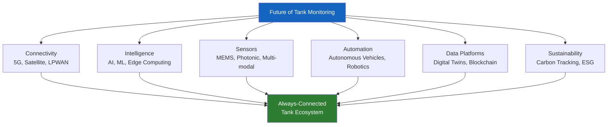

### Technology Maturity Timeline

| Technology | Current State (2025) | Near-Term (2026-2028) | Medium-Term (2029-2032) | Long-Term (2033+) |
|---|---|---|---|---|
| **5G/LPWAN** | Early deployment | Widespread availability | Ubiquitous coverage | Legacy technology |
| **Satellite IoT** | Pilot programs | Commercial service | Cost-competitive | Standard option |
| **Edge AI** | Basic analytics | Sophisticated models | Autonomous operation | Self-evolving |
| **MEMS sensors** | Lab/early commercial | Specialized deployment | Mainstream adoption | Commodity |
| **Autonomous delivery** | Highway testing | Controlled routes | Mixed fleet | Dominant mode |
| **Drone inspection** | Niche applications | Regulatory approval | Routine operations | Fully automated |
| **Blockchain supply chain** | Proof of concept | Industry pilots | Selective adoption | Standard infrastructure |
| **Digital twins** | Basic models | Rich simulations | Predictive ecosystems | Autonomous optimization |

---

## 15.2 5G and Next-Generation Connectivity

The rollout of 5G networks and their industrial variants will fundamentally change what is possible in wireless tank monitoring.

### 5G Capabilities Relevant to Tank Monitoring

| Capability | 4G LTE (Current) | 5G (Emerging) | Impact on Tank Monitoring |
|---|---|---|---|
| **Latency** | 30-50 ms | 1-10 ms | Real-time control possible, not just monitoring |
| **Device density** | ~2,000 devices/km2 | ~1,000,000 devices/km2 | Massive sensor networks per site |
| **Data rate** | 100 Mbps | 10 Gbps | Enables video, imagery, rich data streams |
| **Reliability** | 99.9% | 99.999% | Critical safety applications viable |
| **Battery impact** | Moderate drain | Optimized (RedCap/NR-Light) | Longer sensor battery life |

### 5G Network Slicing for Industrial IoT

5G introduces **network slicing** -- the ability to create virtual, dedicated network segments optimized for specific use cases:

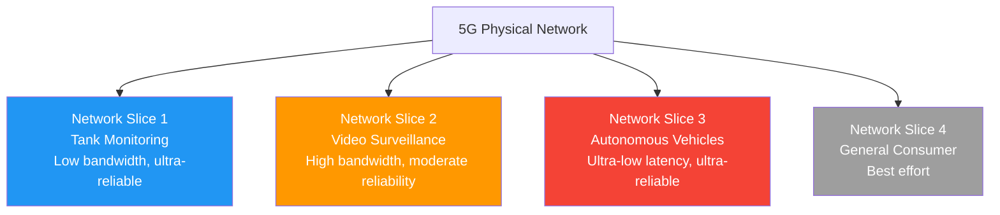

!!! tip "What This Means for TankScan"
    With 5G network slicing, TankScan could operate on a dedicated industrial IoT slice with guaranteed reliability (99.999% uptime) and prioritized traffic, even during network congestion. This makes wireless monitoring viable for safety-critical applications that previously required wired connections.

### LPWAN Evolution

While 5G gets headlines, **Low-Power Wide-Area Networks** (LPWAN) are evolving in parallel and are often more relevant for tank monitoring:

| Technology | Range | Battery Life | Data Rate | Best For |
|---|---|---|---|---|
| **LoRaWAN** | 5-15 km | 5-10 years | 0.3-50 kbps | Rural, low-density deployments |
| **NB-IoT** | 10-15 km | 10+ years | 250 kbps | Urban/suburban, carrier-managed |
| **LTE-M (Cat-M1)** | 10-15 km | 5-10 years | 1 Mbps | Mobile assets, voice capable |
| **5G RedCap (NR-Light)** | 5-10 km | 5-8 years | 100 Mbps | Next-gen industrial IoT |
| **Amazon Sidewalk** | 0.5-1 km | 5+ years | Low | Suburban, consumer-adjacent |

!!! note "The LPWAN Sweet Spot"
    For most tank monitoring applications, LPWAN technologies (LoRaWAN, NB-IoT, LTE-M) provide the optimal combination of range, battery life, and cost. Full 5G is overkill for transmitting a tank level reading every 15 minutes but becomes relevant when video, imagery, or real-time control are required.

---

## 15.3 Satellite IoT (LEO Constellations)

The emergence of Low Earth Orbit (LEO) satellite constellations is solving the last major coverage gap in wireless tank monitoring: truly remote locations.

### The Coverage Challenge

Approximately 15-20% of potential tank monitoring sites lack reliable terrestrial cellular coverage. These include:

- Remote oil and gas well sites
- Agricultural storage in rural areas
- Mining operations
- Remote generator fuel tanks (telecom towers, pipelines)
- Offshore platforms and coastal installations

### LEO Satellite Constellations

| Constellation | Operator | Orbit Altitude | IoT Focus | Status (2025) |
|---|---|---|---|---|
| **Starlink** | SpaceX | 550 km | Direct-to-cell emerging | Operational (broadband) |
| **Kuiper** | Amazon | 590-630 km | IoT planned | Initial deployment |
| **Swarm** | SpaceX (acquired) | 450-550 km | Dedicated IoT | Operational |
| **Astrocast** | Astrocast | 550 km | Dedicated IoT | Operational |
| **Kineis** | CLS (France) | 650 km | Dedicated IoT | Deploying |
| **Orbcomm** | Orbcomm | 750 km | Industrial IoT | Operational |

### How Satellite IoT Works for Tank Monitoring

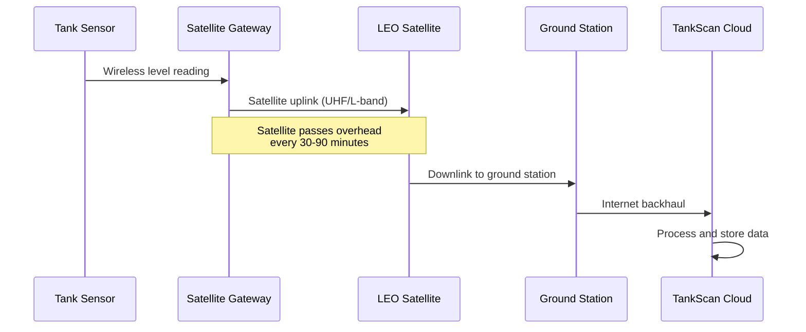

### Cost Comparison: Cellular vs. Satellite

| Factor | Cellular | Satellite IoT |
|---|---|---|
| **Hardware (gateway)** | $500 - $1,500 | $200 - $800 |
| **Monthly service** | $10 - $30 | $1 - $15 |
| **Data volume** | 1-100 MB/month | 1-100 KB/month |
| **Latency** | Seconds | Minutes to hours |
| **Coverage** | 85% of land area | 100% of Earth surface |
| **Power consumption** | Moderate | Very low |
| **Reliability** | Depends on tower | Depends on constellation |

!!! info "The Convergence of Cellular and Satellite"
    The emerging trend of **Direct-to-Cell (D2C)** satellite service, where standard cellular modems can connect to LEO satellites without specialized hardware, will eventually blur the line between terrestrial and satellite connectivity. When this becomes commercial (expected 2027-2029), any TankScan gateway with a cellular modem could seamlessly fail over to satellite when out of cellular range.

---

## 15.4 Edge AI and On-Device Intelligence

As discussed in Chapter 13, edge AI is moving intelligence from the cloud to the device. The future takes this much further.

### The Evolution of Edge Intelligence

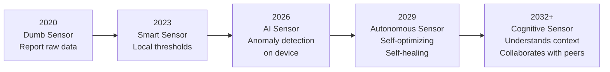

### Future Edge AI Capabilities

| Capability | Description | Benefit |
|---|---|---|
| **Self-calibration** | Sensor learns its own calibration drift and compensates automatically | Eliminates manual recalibration visits |
| **Adaptive sampling** | AI adjusts reading frequency based on detected activity | Better resolution during events, lower power during quiet periods |
| **Peer collaboration** | Sensors share context with nearby sensors via mesh network | A temperature sensor helps a level sensor compensate for thermal expansion |
| **Predictive transmission** | Only transmit when actual differs from predicted; "exception reporting" | Reduces data transmission by 90%+ while maintaining full fidelity |
| **On-device forecasting** | Calculate days-to-empty or days-to-full locally | Alerts continue even during complete connectivity loss |
| **Self-diagnosis** | Sensor detects its own degradation and requests replacement | Zero-downtime sensor management |

### Hardware Enabling Edge AI

| Component | Current (2025) | Near-Future | Impact |
|---|---|---|---|
| **Processor** | ARM Cortex-M4 (80 MHz) | RISC-V AI cores (500+ MHz) | 10x compute at same power |
| **Memory** | 256 KB - 1 MB | 4-16 MB | Larger, more complex models |
| **AI Accelerator** | None | Neural Processing Unit (NPU) | 100x inference speed improvement |
| **Power budget** | 10-50 mW active | 1-5 mW active with NPU | Longer battery life with more intelligence |
| **Model size** | < 100 KB | < 10 MB | Sophisticated deep learning models |

---

## 15.5 Next-Generation Sensors

Sensor technology itself is advancing rapidly, with new physical principles enabling measurements that were previously impossible or impractical in wireless form factors.

### Photonic Sensors

Photonic (light-based) sensors use optical principles for measurement:

| Photonic Technology | Measurement Principle | Advantage for Tank Monitoring |
|---|---|---|
| **Fiber Bragg Grating (FBG)** | Wavelength shift in optical fiber | Distributed sensing -- one fiber measures level at multiple points along the tank |
| **LiDAR** | Laser time-of-flight | Extremely precise distance measurement (sub-millimeter) |
| **Optical spectroscopy** | Absorption/emission of light by liquids | Identifies what liquid is in the tank, not just level |
| **Fiber optic hydrophone** | Pressure via optical fiber | Intrinsically safe (no electrical energy in hazardous area) |

!!! note "Photonic Intrinsic Safety"
    Fiber optic sensors are inherently intrinsically safe because they use light rather than electrical current. No amount of optical energy in a standard sensor can ignite a flammable atmosphere. This makes photonic sensors ideal for C1D1 environments, potentially simplifying installation requirements.

### MEMS Sensors

Micro-Electro-Mechanical Systems (MEMS) are miniaturized sensors fabricated using semiconductor manufacturing techniques:

| MEMS Sensor Type | Application | Advantage |
|---|---|---|
| **MEMS pressure** | Level measurement via hydrostatic pressure | Tiny, low-cost, low-power |
| **MEMS accelerometer** | Tilt/vibration monitoring of tanks | Detect structural issues, settling |
| **MEMS gyroscope** | Orientation sensing for mobile tanks | Track tank movement during transport |
| **MEMS microphone** | Acoustic leak detection | Hear leaks that are invisible to level sensors |
| **MEMS chemical** | Gas/vapor detection | Detect leaks via vapor presence |

### Multi-Modal Sensing

The future sensor is not a single measurement device but a **multi-modal platform** that simultaneously measures multiple parameters:

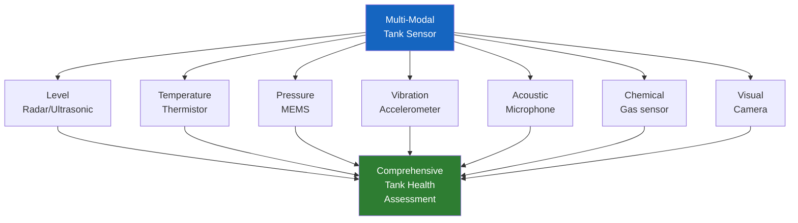

!!! tip "From Level Monitoring to Tank Health Monitoring"
    The progression from single-parameter level monitoring to multi-modal tank health monitoring represents a fundamental shift in value proposition. Instead of answering "how full is the tank?", future systems will answer "what is the complete operational status of this tank and its contents?"

---

## 15.6 Autonomous Delivery Integration

Self-driving vehicles are advancing from highway testing to commercial deployment. Their integration with tank monitoring will create fully autonomous supply chains.

### The Autonomous Delivery Pipeline

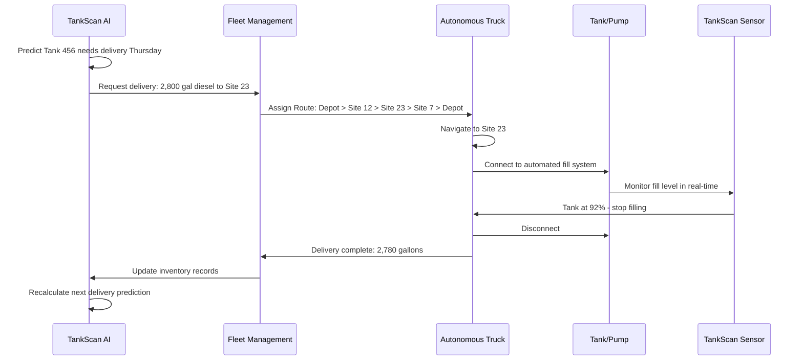

### Levels of Autonomous Delivery

| Level | Description | Tank Monitoring Role | Timeline |
|---|---|---|---|
| **Level 0** | Manual everything | Monitoring informs human dispatcher | Current |
| **Level 1** | Assisted scheduling | AI recommends delivery schedule to human | 2025-2026 |
| **Level 2** | Automated dispatch | System schedules and assigns, human approves | 2026-2028 |
| **Level 3** | Conditional autonomy | Truck drives autonomously on highway, human at site | 2028-2031 |
| **Level 4** | High autonomy | End-to-end autonomous delivery on fixed routes | 2031-2035 |
| **Level 5** | Full autonomy | Any route, any conditions, no human involvement | 2035+ |

### Requirements for Autonomous Delivery Integration

For autonomous delivery to work, the tank monitoring system must provide:

| Requirement | Current Capability | Gap to Close |
|---|---|---|
| **Precise fill-level monitoring** | Good (1-2% accuracy) | Need sub-1% accuracy for automated fill stop |
| **Real-time communication** | 15-minute intervals | Need sub-second updates during fill operation |
| **Automated valve control** | Not available | Need smart valves integrated with sensors |
| **Site access information** | Manual notes | Need machine-readable site access protocols |
| **Product verification** | Manual checking | Need automated product identification |
| **Spill detection** | Analytics-based | Need real-time spill detection during operations |

---

## 15.7 Drone-Based Tank Inspection

Unmanned aerial vehicles (UAVs/drones) are transforming tank inspection by making it faster, safer, and more thorough.

### Current Drone Inspection Applications

| Application | Technology | Current Maturity |
|---|---|---|
| **External visual inspection** | RGB camera | Commercial today |
| **Thermal inspection** | FLIR/thermal camera | Commercial today |
| **Corrosion mapping** | High-resolution imagery + AI | Early commercial |
| **Emissions detection** | Gas sensors, OGI cameras | Early commercial |
| **Internal tank inspection** | Confined-space drones | Emerging (specialized) |
| **Automated inventory** | LiDAR + photogrammetry | Pilot programs |

### Drone Inspection Workflow

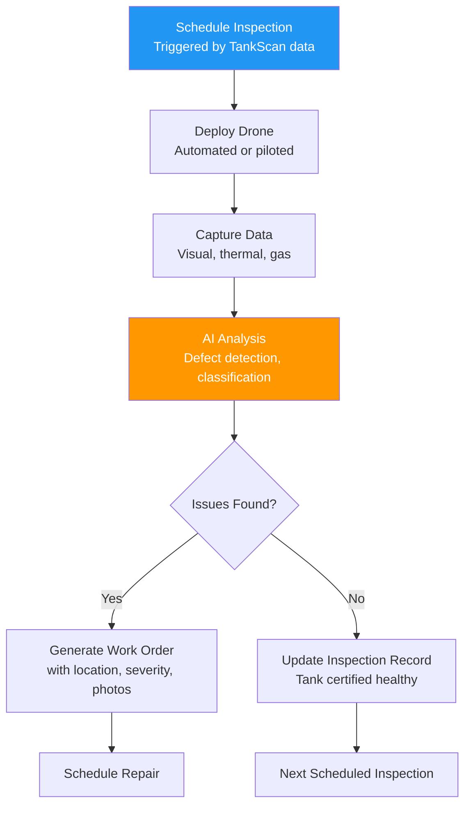

### Complementing Wireless Monitoring with Drone Inspection

| Monitoring Type | What It Detects | Frequency | Cost per Inspection |
|---|---|---|---|
| **TankScan wireless** | Level, consumption, leaks (inferred) | Continuous | Included in subscription |
| **Drone external** | Corrosion, damage, coating failure, leaks (visual) | Monthly-quarterly | $50-200 per tank |
| **Drone internal** | Internal corrosion, coating, sludge | Annually | $500-2,000 per tank |
| **Manual inspection** | Detailed hands-on assessment | As needed | $1,000-5,000 per tank |

!!! info "Safety Advantage"
    Drone inspection of tall tanks eliminates the need for scaffolding, rope access, or man-baskets. According to OSHA, falls are the leading cause of death in the construction and industrial sectors. Drone inspection removes this risk entirely for external inspections.

### Future: Autonomous Inspection Networks

The ultimate vision is an autonomous drone network that continuously patrols tank farms:

1. **Drones stationed at tank farms** in weather-protected docking stations
2. **Automated flight schedules** triggered by TankScan anomaly detection (e.g., "suspected leak at Tank 789 -- dispatch drone for visual confirmation")
3. **AI-powered analysis** processes imagery in real-time, comparing to baseline photos
4. **Automated reporting** generates inspection reports without human involvement
5. **Self-charging** drones return to dock for battery swap or inductive charging

---

## 15.8 Blockchain for Supply Chain Verification

Blockchain technology offers a tamper-proof, distributed ledger for recording supply chain transactions. For tank monitoring, this addresses trust, compliance, and quality assurance challenges.

### Why Blockchain for Tank Supply Chains?

| Challenge | Current Solution | Blockchain Solution |
|---|---|---|
| **Product authenticity** | Trust between buyer and seller | Immutable record of product origin and handling |
| **Delivery verification** | Paper BOLs, driver testimony | Cryptographic proof of delivery volume and time |
| **Custody chain** | Manual documentation | Automated chain-of-custody recording |
| **Compliance proof** | Auditor reviews paper records | Tamper-proof regulatory compliance evidence |
| **Dispute resolution** | Subjective, time-consuming | Objective, timestamped, immutable records |

### Blockchain-Enabled Tank Monitoring Architecture

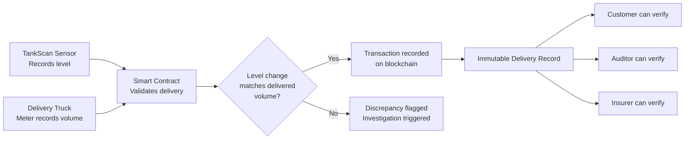

### Smart Contracts for Automated Settlement

A **smart contract** could automate the entire delivery-to-payment process:

```
Smart Contract: Automated Fuel Delivery Settlement

TRIGGER: TankScan detects level increase > 100 gallons at Tank 456

VERIFY:
  - Scheduled delivery exists for Tank 456 today? YES
  - Delivery truck GPS confirms presence at site? YES
  - Volume metered by truck: 2,800 gallons
  - Volume detected by TankScan: 2,785 gallons (within 1% tolerance)

EXECUTE:
  - Record delivery: 2,800 gallons at $3.42/gal = $9,576.00
  - Calculate fees: delivery fee $150.00
  - Total invoice: $9,726.00
  - Initiate payment via integrated banking

RECORD:
  - Transaction hash: 0x7a3b9c...
  - Timestamp: 2025-03-15T14:32:00Z
  - All parties notified
```

!!! warning "Blockchain Adoption Barriers"
    While the technology is promising, widespread blockchain adoption in tank monitoring faces several barriers:

    - **Industry conservatism**: The bulk liquid industry is slow to adopt new technologies
    - **Interoperability**: Different blockchain platforms do not communicate easily
    - **Regulatory acceptance**: Regulators have not yet endorsed blockchain-based compliance records
    - **Cost**: Blockchain infrastructure adds cost with unclear short-term payback
    - **Complexity**: Understanding and maintaining blockchain systems requires specialized skills

    Realistic timeline for significant adoption: 2030-2035.

---

## 15.9 Sustainability and Environmental Monitoring

Environmental sustainability is rapidly moving from a voluntary initiative to a regulatory and business imperative. Tank monitoring plays a central role.

### The ESG Connection

Environmental, Social, and Governance (ESG) reporting increasingly requires companies to track and report their environmental impact. Tank monitoring data directly supports ESG compliance:

| ESG Category | Tank Monitoring Contribution |
|---|---|
| **Carbon emissions** | Optimized delivery routes reduce fleet CO2 emissions |
| **Spill prevention** | Monitoring prevents environmental contamination |
| **Resource efficiency** | Demand optimization reduces waste and excess inventory |
| **Regulatory compliance** | Automated compliance reduces violation risk |
| **Supply chain transparency** | Data-driven supply chain with audit trail |

### Carbon Footprint Tracking

Future TankScan systems will automatically calculate the carbon footprint impact of monitoring-enabled optimization:

$$CO_2\text{ saved} = \Delta_{miles} \times EF_{truck}$$

Where:
- $\Delta_{miles}$ = Miles eliminated through route optimization
- $EF_{truck}$ = Emission factor (kg CO2 per mile for delivery truck)

!!! example "Carbon Impact Example"
    A fleet that reduces annual driving by 50,000 miles through TankScan monitoring:

    - Average diesel truck emission factor: **2.68 kg CO2 per mile** (including upstream fuel production)
    - Annual CO2 reduction: 50,000 x 2.68 = **134,000 kg = 134 metric tons CO2**
    - Equivalent to: **30 passenger cars removed from the road for a year**
    - Carbon credit value (at $50/ton): **$6,700/year**

### Environmental Monitoring Expansion

Tank monitoring infrastructure is expanding beyond level monitoring to include broader environmental sensing:

| Measurement | Sensor Type | Purpose |
|---|---|---|
| **Soil moisture** | Capacitive probe | Detect subsurface contamination |
| **Groundwater level** | Pressure transducer | Monitor water table near USTs |
| **VOC concentration** | PID/electrochemical | Detect vapor emissions |
| **Stormwater quality** | Turbidity/pH sensor | Monitor runoff from tank farms |
| **Methane emissions** | Infrared sensor | Track greenhouse gas leaks |

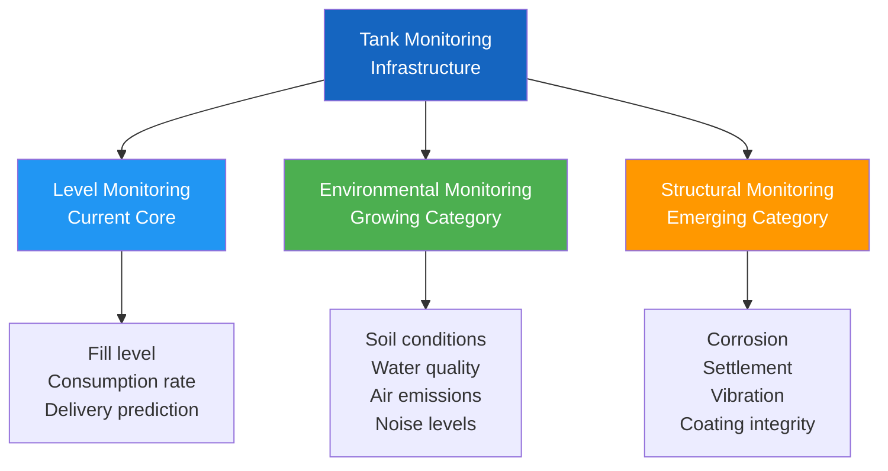

---

## 15.10 Digital Transformation in Industrial Operations

Tank monitoring is one component of a broader digital transformation reshaping all of industrial operations.

### The Industrial Digital Transformation Stack

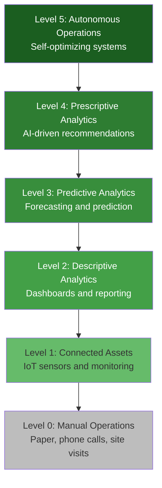

### Where Most Organizations Stand (2025)

| Maturity Level | % of Organizations | Description |
|---|---|---|
| Level 0 -- Manual | 25% | No monitoring; paper-based processes |
| Level 1 -- Connected | 35% | Sensors deployed; basic dashboards |
| Level 2 -- Descriptive | 25% | Historical analysis; standard reports |
| Level 3 -- Predictive | 12% | Forecasting; some automation |
| Level 4 -- Prescriptive | 3% | AI-driven recommendations |
| Level 5 -- Autonomous | <1% | Self-optimizing operations |

!!! tip "The Opportunity"
    The fact that 60% of organizations are still at Level 0 or Level 1 represents an enormous market opportunity for TankScan and its partners. The technology to reach Level 3 (predictive) is available today. The business case (as shown in Chapter 14) is compelling. The primary barrier is awareness and adoption, not technology.

### Integration with Industry 4.0

Tank monitoring connects to the broader Industry 4.0 vision:

| Industry 4.0 Concept | Tank Monitoring Application |
|---|---|
| **Cyber-physical systems** | Sensors bridging physical tanks to digital systems |
| **Internet of Things** | Wireless sensors connected via gateways to cloud |
| **Cloud computing** | TankScan cloud platform for data processing and analytics |
| **AI and machine learning** | Predictive maintenance, demand forecasting, anomaly detection |
| **Digital twins** | Virtual replicas of physical tanks for simulation |
| **Horizontal integration** | API connections to ERP, SCADA, fleet management |
| **Vertical integration** | Sensor to cloud to enterprise to customer |

---

## 15.11 The Convergence of Monitoring and Automation

The historical distinction between "monitoring" (observing what is happening) and "automation" (controlling what happens) is collapsing. Future systems will seamlessly integrate both.

### The Monitoring-to-Automation Continuum

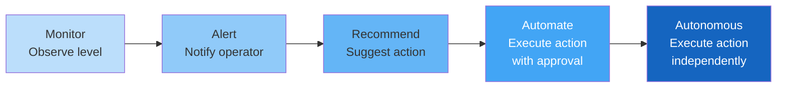

### Concrete Examples of Convergence

| Current (Monitor) | Near Future (Automate) | Long-Term (Autonomous) |
|---|---|---|
| Alert: "Tank 456 at 18%" | Auto-create delivery order in ERP | AI schedules, dispatches, and reconciles autonomously |
| Alert: "Unusual consumption detected" | Auto-close automated valve pending investigation | AI investigates, classifies, and resolves or escalates |
| Alert: "Sensor battery low" | Auto-schedule replacement on next technician visit | Self-healing sensor network auto-deploys replacement |
| Alert: "High temperature" | Auto-activate cooling system | Digital twin predicts thermal events and prevents them |

### Smart Tank Infrastructure

The tank of the future is not a passive container with a sensor bolted on -- it is an intelligent system:

| Component | Current Tank | Smart Tank (2030+) |
|---|---|---|
| **Level sensing** | Single-point wireless sensor | Multi-point continuous measurement |
| **Fill control** | Manual valve operated by driver | Automated valve with remote control |
| **Leak detection** | Analytics on level data | Acoustic + chemical + level multi-modal |
| **Environmental** | None | Integrated soil, water, air monitoring |
| **Structural** | Periodic manual inspection | Continuous vibration and strain monitoring |
| **Communication** | One-way (sensor to cloud) | Bidirectional (cloud can command tank systems) |
| **Intelligence** | Cloud-based analytics | Edge AI with cloud backup |
| **Identity** | Asset tag / manual record | Digital twin with blockchain-verified history |

---

## 15.12 TankScan's Position in the Evolving Landscape

TankScan is well-positioned to lead the transition from current-generation monitoring to the future intelligent tank ecosystem.

### Strategic Strengths

| Strength | Future Relevance |
|---|---|
| **Installed base** | Thousands of deployed sensors provide data for AI training |
| **Cloud platform** | Scalable foundation for adding AI, digital twins, integrations |
| **Open API** | Enables ecosystem of partners and applications |
| **Industry expertise** | Deep understanding of customer workflows and pain points |
| **Partner network** | Relationships with ERP vendors, fleet systems, SCADA platforms |
| **Multi-industry presence** | Cross-industry insights inform product development |

### Technology Roadmap Alignment

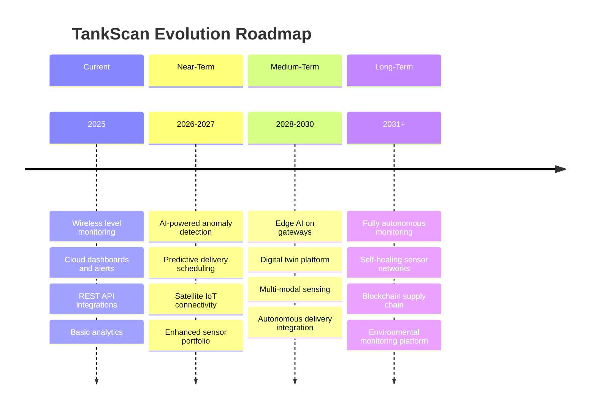

### Competitive Landscape

| Competitor Type | Examples | Strengths | TankScan Differentiation |
|---|---|---|---|
| **Traditional ATG** | Veeder-Root, OPW | Installed base in fuel retail | Wireless flexibility, multi-industry |
| **Industrial IoT platforms** | AWS IoT, Azure IoT | Scale, cloud infrastructure | Domain expertise, vertical solution |
| **Niche monitors** | Otodata, Mopeka | Specific segments | Breadth of products and integrations |
| **SCADA vendors** | Emerson, Honeywell | Process control integration | Cost, wireless simplicity, SaaS model |
| **DIY/Open source** | Custom LoRa solutions | Low cost | Reliability, support, compliance |

---

## 15.13 Predictions for 2030 and Beyond

Based on current trends and technology trajectories, here are informed predictions for the future of tank monitoring:

### By 2028

- **75% of new tank monitoring deployments** will include AI-powered analytics as standard, not premium
- **Satellite IoT** will be cost-competitive with cellular for low-data applications
- **Edge AI** will be standard in gateway devices, enabling offline anomaly detection
- **Drone inspection** will be routinely integrated with monitoring data for targeted inspections

### By 2030

- **Autonomous delivery** on controlled routes (depot to depot, fuel terminal to station) will be commercial
- **Digital twins** will be standard for high-value tank installations (> $100K tank value)
- **Multi-modal sensors** combining level, temperature, vibration, and acoustic in one device will be mainstream
- **Carbon tracking** will be mandatory in the EU and voluntary/incentivized in the US
- **50% of tank monitoring** will use LPWAN (LoRa/NB-IoT) rather than traditional cellular

### By 2035

- **Fully autonomous supply chains** (from demand prediction to delivery to invoicing) will operate for routine, low-risk deliveries
- **Self-healing sensor networks** will maintain 99.9%+ uptime without human intervention
- **Real-time environmental monitoring** will be co-located with every tank installation
- **Blockchain-based compliance** records will be accepted by major regulatory agencies
- **Natural language** will be the primary interface for non-technical users of monitoring systems

### Long-Term Vision: The Invisible Infrastructure

!!! quote "The Best Technology Is Invisible"
    The ultimate success of tank monitoring technology will be measured by how invisible it becomes. When tanks are automatically monitored, automatically replenished, automatically inspected, and automatically compliant -- with humans focused only on exceptions and strategic decisions -- the technology will have achieved its full potential.

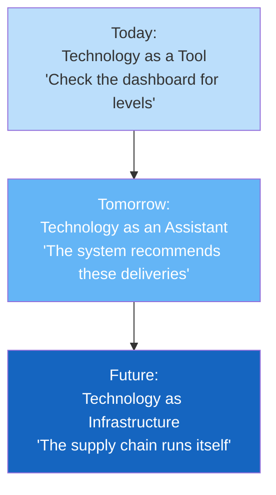

---

## 15.14 Capstone Project

This capstone project synthesizes the knowledge from the entire course into a comprehensive design exercise.

### Project Description

!!! example "Capstone Project: Design a Complete Tank Monitoring Solution"

    **Scenario:**

    You are a solution architect for a TankScan partner. A prospective customer, **MidWest Ag Cooperative**, has approached you for a comprehensive tank monitoring solution. Here are the details:

    **Customer Profile:**
    - Agricultural cooperative serving 200 farming operations across Iowa, Nebraska, and South Dakota
    - Products stored: diesel fuel, gasoline, anhydrous ammonia, liquid fertilizer, propane
    - Tank types: Above-ground steel tanks (500-10,000 gal), underground fiberglass tanks (5,000-15,000 gal), pressurized propane tanks (500-1,000 gal), chemical totes (275 gal)
    - Total tanks to monitor: approximately 650 across 200 sites
    - Environment: Rural (many sites with no cellular coverage), extreme weather (-30 to 110 degrees F), hazardous materials (anhydrous ammonia is C1D1 Group D)
    - Existing systems: SAP Business One ERP, custom dispatch application, no existing monitoring

    **Your Deliverables:**

    **Part 1: System Architecture (Chapters 1-5)**
    Design the complete monitoring system architecture, including:
    - Sensor selection for each tank type and product
    - Gateway selection and placement
    - Connectivity strategy (how to handle sites without cellular coverage)
    - Network architecture diagram

    **Part 2: Platform and Data (Chapters 6-8)**
    Design the data management approach:
    - What data to collect and at what frequency
    - Alert configuration (thresholds, recipients, escalation)
    - Dashboard design for different user personas (farmer, dispatcher, manager)
    - Data retention and compliance strategy

    **Part 3: Integration (Chapters 9-12)**
    Design the integration architecture:
    - SAP Business One integration (inventory, purchasing, billing)
    - Dispatch system integration (delivery optimization)
    - Customer self-service portal design
    - API usage plan and security approach

    **Part 4: Safety and Compliance (Chapter 11)**
    Address safety requirements:
    - Hazardous area classification for anhydrous ammonia tanks
    - Sensor certification requirements for each area
    - SPCC plan implications
    - Environmental monitoring considerations

    **Part 5: AI and Analytics (Chapter 13)**
    Propose an analytics strategy:
    - What predictive models would provide the most value?
    - How would you address seasonal demand patterns (spring planting, fall harvest)?
    - Anomaly detection priorities
    - Edge AI use cases for sites with intermittent connectivity

    **Part 6: Business Case (Chapter 14)**
    Build a financial justification:
    - Total cost of ownership for the 650-tank deployment
    - Expected savings by category
    - ROI and payback period calculation
    - Phased implementation plan with milestones

    **Part 7: Future-Proofing (Chapter 15)**
    Recommend a future technology strategy:
    - How would satellite IoT address coverage gaps?
    - What emerging technologies should the cooperative evaluate?
    - A 5-year technology roadmap for the monitoring system

### Evaluation Criteria

| Criterion | Weight | Description |
|---|---|---|
| **Technical accuracy** | 25% | Correct application of monitoring concepts |
| **Completeness** | 20% | All deliverables addressed thoroughly |
| **Practical feasibility** | 20% | Solution is realistic and implementable |
| **Financial rigor** | 15% | Cost and savings analysis is credible |
| **Innovation** | 10% | Creative application of emerging technologies |
| **Presentation quality** | 10% | Clear, professional communication |

---

## Chapter 15 Summary

This final chapter explored the technologies and trends that will shape the future of tank monitoring:

- **5G and LPWAN evolution** will provide faster, more reliable, and more power-efficient connectivity
- **Satellite IoT** will eliminate coverage gaps, enabling monitoring of truly remote locations
- **Edge AI** will move intelligence to the device, enabling autonomous operation even without connectivity
- **Next-generation sensors** (photonic, MEMS, multi-modal) will expand what can be measured
- **Autonomous delivery** will close the loop from prediction to action without human intervention
- **Drone inspection** will complement level monitoring with visual and thermal assessment
- **Blockchain** will provide tamper-proof supply chain records and enable automated settlement
- **Sustainability** is becoming a core driver, with carbon tracking and environmental monitoring increasingly integrated
- **Digital transformation** is progressing from connected assets to autonomous operations
- **Monitoring and automation are converging** -- future systems will not just observe but act
- **TankScan is well-positioned** with its installed base, open platform, and industry expertise
- The **capstone project** challenges you to apply all course knowledge to a realistic, comprehensive scenario

!!! quote "Looking Forward"
    The tank monitoring industry is at an inflection point. The basic technology for wireless level monitoring is mature and proven. The next decade will see a rapid evolution toward intelligent, autonomous, integrated systems that fundamentally transform how bulk liquids are managed across the global economy. Professionals who understand both the current technology and the future trajectory will be best positioned to lead this transformation.

---

## Review Questions

!!! question "Question 1 -- Knowledge (Remember)"
    List four LEO satellite IoT constellations discussed in this chapter and explain why satellite connectivity is important for tank monitoring.

    ??? success "Answer"
        Four LEO satellite IoT constellations:
        1. **Swarm** (SpaceX) -- Dedicated IoT, operational
        2. **Astrocast** -- Dedicated IoT, operational
        3. **Kineis** (CLS, France) -- Dedicated IoT, deploying
        4. **Orbcomm** -- Industrial IoT, operational

        (Others mentioned: Starlink, Kuiper)

        Satellite connectivity is important because approximately **15-20% of potential tank monitoring sites lack reliable terrestrial cellular coverage**. These include remote oil and gas sites, agricultural storage in rural areas, mining operations, remote generator tanks, and offshore installations. Satellite IoT provides **100% Earth surface coverage**, enabling monitoring of these previously unreachable locations. The cost is declining rapidly with LEO constellations, and data requirements for tank monitoring (a few bytes per reading) are well within satellite IoT capabilities.

!!! question "Question 2 -- Comprehension (Understand)"
    Explain the concept of "network slicing" in 5G and describe how it could benefit industrial tank monitoring differently from consumer mobile services.

    ??? success "Answer"
        **Network slicing** is a 5G capability that allows a single physical 5G network to be divided into multiple **virtual, independent network segments**, each optimized for a specific use case with its own performance characteristics.

        For industrial tank monitoring, a dedicated network slice could be configured with:
        - **Ultra-high reliability** (99.999% uptime) -- critical for safety monitoring applications
        - **Guaranteed bandwidth** -- even during network congestion (e.g., during a major event in the area)
        - **Low, consistent latency** -- important for real-time control applications (automated valve control)
        - **Prioritized traffic** -- tank monitoring data is prioritized over consumer video streaming

        This differs from consumer mobile service, which typically operates on a "best effort" slice with no guarantees. A consumer experiencing slow video buffering is an inconvenience; a tank monitoring system losing connectivity during a critical overfill event is a safety hazard. Network slicing ensures that industrial applications receive the network quality they require regardless of what consumer users are doing on the same physical network.

!!! question "Question 3 -- Application (Apply)"
    Design a multi-modal sensor package for a hazardous chemical storage tank. Specify at least five measurement parameters, the sensor technology for each, and explain how the combined data provides more value than any single measurement alone.

    ??? success "Answer"
        **Multi-Modal Sensor Package for Hazardous Chemical Tank:**

        | Parameter | Sensor Technology | Purpose |
        |---|---|---|
        | **Liquid level** | Radar (non-contact) | Primary fill-level measurement |
        | **Temperature** | RTD (Resistance Temperature Detector) | Thermal expansion compensation; detect exothermic reactions |
        | **Pressure** | MEMS pressure transducer | Detect overpressure from gas evolution or reaction |
        | **Acoustic emissions** | MEMS microphone | Detect leaks by sound (hissing, dripping) |
        | **VOC concentration** | PID (Photoionization Detector) | Detect vapor leaks in the immediate vicinity |
        | **Vibration** | MEMS accelerometer | Detect structural issues, agitator malfunction, or external impact |

        **Combined value exceeds individual measurements because:**

        - **Level + Temperature** together provide temperature-compensated volume, which is far more accurate than level alone
        - **Level + Acoustic** together enable both detection (unexplained level drop) and location (acoustic emissions pinpoint the leak source)
        - **Pressure + Temperature** together can detect dangerous chemical reactions before they become critical
        - **VOC + Level** together distinguish between a liquid leak (level drops + VOC present) and evaporation (level drops slowly + VOC at tank top only)
        - **Vibration + all others** provides context -- a vibration event followed by a level change suggests external impact causing damage

        The data fusion of all six parameters enables **automated root cause analysis** that no single sensor could provide.

!!! question "Question 4 -- Analysis (Analyze)"
    Compare the barriers to adoption for three emerging technologies discussed in this chapter: autonomous delivery, blockchain supply chain, and drone inspection. Which technology is likely to see the fastest adoption in tank monitoring, and why?

    ??? success "Answer"
        **Autonomous Delivery Barriers:**
        - Regulatory approval for autonomous vehicles on public roads (very high barrier)
        - Liability frameworks for autonomous vehicle accidents (unresolved)
        - Infrastructure requirements (automated fill connections at each site)
        - Public acceptance and trust
        - Massive capital investment in autonomous fleet
        - Technology maturity for all-weather, all-terrain operation

        **Blockchain Supply Chain Barriers:**
        - Industry conservatism and unfamiliarity with blockchain
        - Interoperability between different blockchain platforms
        - Regulatory acceptance of blockchain-based compliance records (not yet established)
        - Unclear short-term ROI
        - Need for all supply chain participants to adopt (network effect required)
        - Specialized skills for implementation and maintenance

        **Drone Inspection Barriers:**
        - FAA Part 107 regulations (manageable but require licensed pilots)
        - BVLOS (Beyond Visual Line of Sight) regulations (currently restrictive but loosening)
        - Weather limitations (wind, rain, extreme cold)
        - Battery life limitations for long inspection sessions
        - AI accuracy for defect detection (improving rapidly)
        - Integration with existing inspection workflows

        **Fastest adoption: Drone Inspection.** Reasons:
        1. The **regulatory path is clearest** -- Part 107 certification is straightforward, and BVLOS waivers are becoming more common
        2. **Technology is already mature** for external visual and thermal inspection
        3. **ROI is immediate and provable** -- a single drone flight replaces scaffolding and rope access work costing thousands of dollars
        4. **No industry-wide coordination required** -- individual companies can adopt independently
        5. **Safety benefit is undeniable** -- eliminating falls from height is a clear OSHA-aligned value proposition

!!! question "Question 5 -- Synthesis (Create)"
    You are presenting to the board of directors of a large fuel distribution company in 2025. Create a 5-year technology roadmap for their tank monitoring program, starting from a current state of basic wireless monitoring (TankScan Level 1). Include specific milestones, technologies to adopt, estimated investment ranges, and expected business outcomes at each stage.

    ??? success "Answer"
        **5-Year Tank Monitoring Technology Roadmap (2025-2030)**

        **Year 1 (2025): Foundation -- Descriptive Analytics**
        - *Milestone*: Complete sensor deployment across all 1,200 tanks
        - *Technology*: TankScan wireless sensors, cellular gateways, cloud platform
        - *Integration*: API connection to ERP (inventory), basic dispatch integration
        - *Investment*: $800,000 - $1,200,000 (hardware, installation, integration)
        - *Outcome*: Real-time visibility; 25% reduction in emergency deliveries; elimination of manual gauge readings

        **Year 2 (2026): Intelligence -- Predictive Analytics**
        - *Milestone*: AI-powered delivery prediction operational for all tanks
        - *Technology*: TankScan predictive analytics, weather data integration, Prophet/ML models
        - *Integration*: Full dispatch optimization; automated delivery scheduling with human approval
        - *Investment*: $150,000 - $300,000 (analytics platform, integration enhancement)
        - *Outcome*: 30-40% route optimization; 90% reduction in run-outs; MAPE < 15% on 7-day forecasts

        **Year 3 (2027): Expansion -- Multi-Modal and Satellite**
        - *Milestone*: Add satellite connectivity to remote sites; pilot drone inspection
        - *Technology*: Satellite IoT gateways for 50 remote sites; quarterly drone inspection program; environmental sensors at 20 high-risk sites
        - *Integration*: Environmental data feeds regulatory reporting; drone imagery integrated with asset management
        - *Investment*: $200,000 - $400,000 (satellite gateways, drone program, environmental sensors)
        - *Outcome*: 100% tank visibility (no more blind spots); proactive compliance; early structural issue detection

        **Year 4 (2028): Automation -- Prescriptive Operations**
        - *Milestone*: Autonomous delivery scheduling (no human approval for routine deliveries)
        - *Technology*: Edge AI on gateways; digital twin for top 100 tanks; automated dispatch integration
        - *Integration*: Fully automated order-to-delivery-to-invoice pipeline; customer self-service portal
        - *Investment*: $250,000 - $500,000 (edge AI upgrades, digital twin platform, portal development)
        - *Outcome*: 80% of deliveries scheduled without human intervention; dispatch team reduced by 50%; customer satisfaction > 95%

        **Year 5 (2029-2030): Transformation -- Autonomous Operations**
        - *Milestone*: Pilot autonomous delivery on 2-3 fixed routes; full environmental monitoring
        - *Technology*: Autonomous truck partnership (pilot); blockchain delivery verification (pilot); carbon tracking integrated into ESG reporting
        - *Integration*: End-to-end automated supply chain for pilot routes; ESG reporting dashboard
        - *Investment*: $500,000 - $1,000,000 (autonomous pilot, blockchain pilot, ESG platform)
        - *Outcome*: Proof of concept for fully autonomous supply chain; ESG compliance leadership; competitive moat established

        **Cumulative 5-Year Investment**: $1.9M - $3.4M
        **Estimated Annual Savings by Year 5**: $3.5M - $5.0M per year
        **5-Year ROI**: 400-600%
