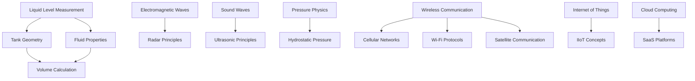
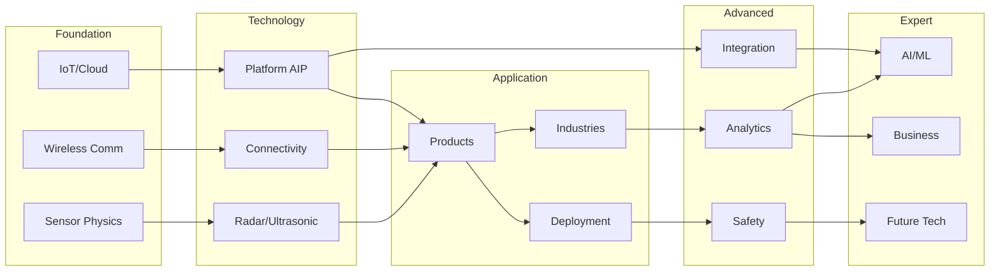

# Learning Graph

## Concept Dependency Map for Wireless Tank Monitoring

This learning graph maps the key concepts in wireless tank monitoring and their dependencies. Concepts are organized by category and Bloom's Taxonomy level.

---

## Concept Categories

### Foundation Concepts (Remember/Understand)

### Technology Concepts (Understand/Apply)

| ID | Concept | Category | Bloom's Level | Prerequisites |
|----|---------|----------|---------------|---------------|
| 1 | Liquid Level Measurement | Fundamentals | Remember | None |
| 2 | Tank Geometry | Fundamentals | Remember | None |
| 3 | Fluid Properties | Fundamentals | Remember | None |
| 4 | Volume Calculation | Fundamentals | Understand | 2, 3 |
| 5 | Electromagnetic Waves | Physics | Remember | None |
| 6 | Radar Principles | Sensing | Understand | 5 |
| 7 | Time-of-Flight Measurement | Sensing | Understand | 5, 6 |
| 8 | Non-Contact Radar | Sensing | Apply | 6, 7 |
| 9 | Guided Wave Radar | Sensing | Apply | 6, 7 |
| 10 | Sound Waves | Physics | Remember | None |
| 11 | Ultrasonic Principles | Sensing | Understand | 10 |
| 12 | Ultrasonic Transducers | Sensing | Understand | 11 |
| 13 | Pressure Physics | Physics | Remember | None |
| 14 | Hydrostatic Pressure | Sensing | Understand | 3, 13 |
| 15 | Submersible Pressure Sensors | Sensing | Apply | 14 |
| 16 | Dial Gauge Reading | Sensing | Understand | 1 |
| 17 | Wireless Communication | Networking | Remember | None |
| 18 | Radio Frequency Basics | Networking | Understand | 5, 17 |
| 19 | Cellular Networks (4G LTE) | Networking | Understand | 17 |
| 20 | Wi-Fi Protocols | Networking | Understand | 17 |
| 21 | Satellite Communication | Networking | Understand | 17 |
| 22 | Signal Propagation | Networking | Understand | 18 |
| 23 | Antenna Design | Hardware | Apply | 18, 22 |
| 24 | Gateway Devices | Hardware | Understand | 17, 20 |
| 25 | Internet of Things (IoT) | Architecture | Remember | None |
| 26 | Industrial IoT (IIoT) | Architecture | Understand | 25 |
| 27 | Edge Computing | Architecture | Understand | 25, 26 |
| 28 | Cloud Computing | Architecture | Remember | None |
| 29 | SaaS Platforms | Architecture | Understand | 28 |
| 30 | REST APIs | Integration | Understand | 28, 29 |

### Application Concepts (Apply/Analyze)

| ID | Concept | Category | Bloom's Level | Prerequisites |
|----|---------|----------|---------------|---------------|
| 31 | TSR Cellular Monitor | Products | Apply | 8, 19 |
| 32 | TSU Ultrasonic Monitor | Products | Apply | 12, 19 |
| 33 | TSP Pressure Monitor | Products | Apply | 15, 19 |
| 34 | TSC C-Store System | Products | Apply | 16, 19 |
| 35 | TSD Dial Gauge Reader | Products | Apply | 16, 19 |
| 36 | TSG BYOS Monitor | Products | Apply | 19, 21 |
| 37 | Asset Intelligence Platform | Platform | Apply | 29, 30 |
| 38 | Dashboard Configuration | Platform | Apply | 37 |
| 39 | Alert Management | Platform | Apply | 37, 38 |
| 40 | Location Mapping | Platform | Apply | 37 |
| 41 | Historical Data Analysis | Analytics | Analyze | 37, 38 |
| 42 | Aboveground Tank Monitoring | Applications | Apply | 1, 31 |
| 43 | Underground Tank Monitoring | Applications | Apply | 1, 34 |
| 44 | Field Tank Monitoring | Applications | Apply | 1, 31, 36 |
| 45 | Tote and IBC Monitoring | Applications | Apply | 1, 32 |
| 46 | Tank Farm Management | Applications | Apply | 42, 40 |
| 47 | Fuel Distribution | Industries | Apply | 42, 43, 46 |
| 48 | C-Store Operations | Industries | Apply | 43, 34 |
| 49 | Lubricant Management | Industries | Apply | 45, 32 |
| 50 | Chemical Management | Industries | Apply | 31, 45 |

### Advanced Concepts (Analyze/Evaluate)

| ID | Concept | Category | Bloom's Level | Prerequisites |
|----|---------|----------|---------------|---------------|
| 51 | Site Survey Planning | Deployment | Analyze | 22, 42 |
| 52 | Monitor Selection Criteria | Deployment | Analyze | 31-36 |
| 53 | Multi-Site Deployment | Deployment | Analyze | 51, 52, 46 |
| 54 | Battery Life Optimization | Operations | Analyze | 31, 32 |
| 55 | Reporting Frequency Trade-offs | Operations | Evaluate | 54, 41 |
| 56 | Data Accuracy Validation | Operations | Evaluate | 7, 41 |
| 57 | Sensor Comparison Analysis | Evaluation | Evaluate | 8, 12, 15 |
| 58 | Connectivity Selection | Evaluation | Evaluate | 19, 20, 21 |
| 59 | Consumption Pattern Analysis | Analytics | Analyze | 41 |
| 60 | Inventory Forecasting | Analytics | Analyze | 59 |
| 61 | Route Optimization | Logistics | Analyze | 40, 60 |
| 62 | Fleet Efficiency Metrics | Logistics | Evaluate | 61 |
| 63 | Delivery Scheduling | Logistics | Apply | 60, 61 |
| 64 | Hazardous Environment Ratings | Safety | Understand | None |
| 65 | C1D1 Classification | Safety | Apply | 64 |
| 66 | C1D2 Classification | Safety | Apply | 64 |
| 67 | ATEX Compliance | Safety | Apply | 64 |
| 68 | Environmental Regulations | Safety | Understand | None |
| 69 | Spill Prevention | Safety | Apply | 39, 68 |
| 70 | Safety Protocol Design | Safety | Evaluate | 65, 66, 69 |

### Expert Concepts (Evaluate/Create)

| ID | Concept | Category | Bloom's Level | Prerequisites |
|----|---------|----------|---------------|---------------|
| 71 | Cloud-to-Cloud Integration | Integration | Apply | 30, 37 |
| 72 | ERP System Integration | Integration | Analyze | 71 |
| 73 | Data Export and Warehousing | Integration | Apply | 30, 41 |
| 74 | Open API Architecture | Integration | Analyze | 30, 71 |
| 75 | Machine Learning Basics | AI/ML | Understand | None |
| 76 | Anomaly Detection | AI/ML | Analyze | 41, 75 |
| 77 | Predictive Maintenance | AI/ML | Analyze | 76 |
| 78 | Demand Forecasting Models | AI/ML | Create | 60, 75 |
| 79 | Digital Twin Concepts | AI/ML | Understand | 26, 75 |
| 80 | Digital Twin Implementation | AI/ML | Create | 79, 37 |
| 81 | ROI Calculation | Business | Analyze | 62 |
| 82 | Cost-Benefit Analysis | Business | Evaluate | 81 |
| 83 | Business Case Development | Business | Create | 82 |
| 84 | Customer Success Metrics | Business | Evaluate | 81 |
| 85 | 5G and Next-Gen Connectivity | Future | Understand | 19 |
| 86 | Edge AI Processing | Future | Analyze | 27, 75 |
| 87 | Autonomous Delivery Integration | Future | Create | 61, 86 |
| 88 | Sustainability Monitoring | Future | Create | 59, 68 |
| 89 | Next-Generation Sensors | Future | Evaluate | 57 |
| 90 | Complete System Design | Capstone | Create | 52, 53, 58, 70, 74 |

---

## Dependency Visualization

---

## Bloom's Taxonomy Distribution

| Level | Count | Percentage |
|-------|-------|------------|
| Remember | 12 | 13% |
| Understand | 22 | 24% |
| Apply | 26 | 29% |
| Analyze | 16 | 18% |
| Evaluate | 9 | 10% |
| Create | 5 | 6% |
| **Total** | **90** | **100%** |
